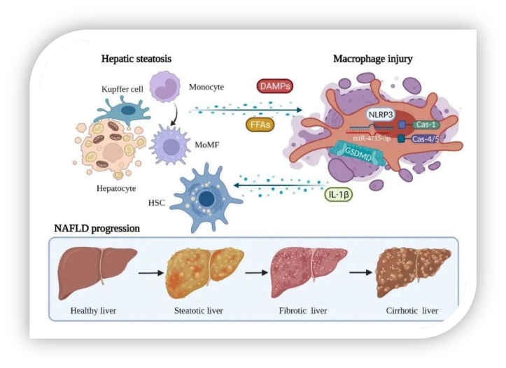
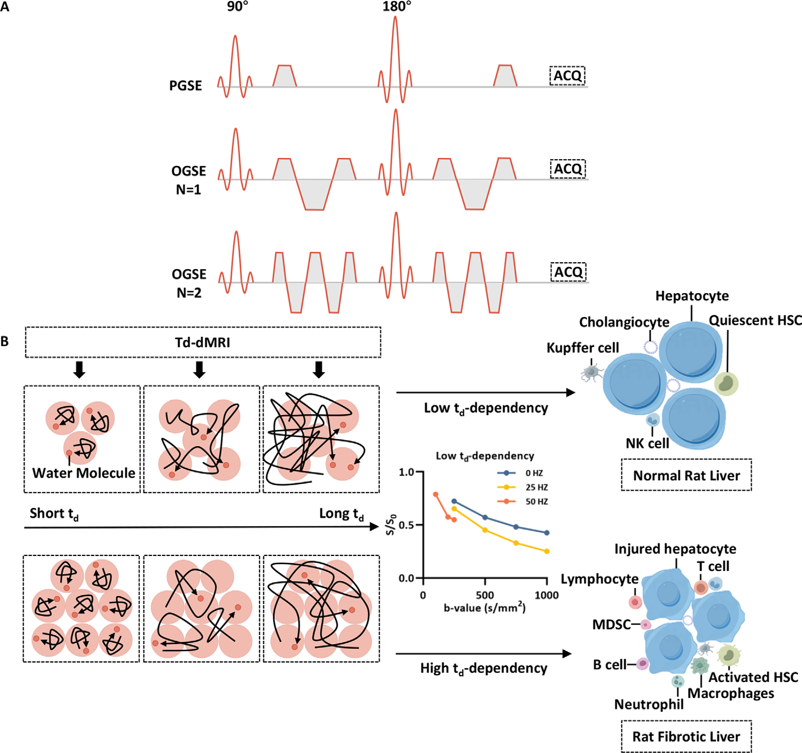

# 磁共振新突破：时间依赖扩散 MRI 助力肝纤维化精准评估

    
    
<b>图 1：</b>肝脏纤维化示意图1

在全球范围内，肝纤维化是一个严峻的健康问题，肝硬化更是位列全球死因的第 11 位。当前，临床对肝纤维化的成像评估主要依赖肝脏形态变化，难以精准反映疾病进展。而时间依赖扩散 MRI 作为一项新兴技术，能否在肝纤维化评估中发挥重要作用呢？今天，我们就一起来深入探讨这篇关于时间依赖扩散 MRI 用于检测肝纤维化细胞微观结构变化的研究2。

## 研究背景

肝纤维化是肝脏对各种慢性损伤的修复反应，但过度纤维化会导致肝硬化，严重影响肝脏功能。传统的临床成像评估方法存在局限性，无法准确反映肝脏细胞微观结构的变化。时间依赖扩散 MRI 是一种新型的磁共振成像技术，它能够提供组织微观结构的定量信息，如细胞大小和密度等。然而，该技术在肝纤维化评估方面的应用潜力尚未得到充分研究。

## 研究目的

本研究旨在评估时间依赖扩散 MRI 在描绘肝纤维化进展为肝硬化过程中肝脏微观结构、表征细胞属性的有效性，并探究其在肝纤维化分级中的潜力。

c

## 研究方法

**动物模型建立**：研究选取 65 只成年雄性 Sprague-Dawley 大鼠，经口给予二乙基亚硝胺（DEN）诱导肝纤维化，5 只作为对照。实验过程严格遵循动物伦理，在不同时间点对大鼠进行处理，用于病理评估、测试重测性能评估以及研究时间依赖扩散 MRI 在肝纤维化中的应用。

**图像采集**：使用 3.0-T 扫描仪，结合振荡梯度自旋回波序列和脉冲梯度自旋回波序列，在等效扩散时间为 5.4、10.7 和 69.3 毫秒时采集扩散 MRI 信号。扫描前，大鼠经腹腔注射 1% 戊巴比妥钠溶液麻醉。

**图像分析**：两位放射科培训医师在专家监督下，使用 ITK-SNAP 软件在扩散加权图像（b=0）上勾勒感兴趣区域，选取三个随机相邻区域进行分析。利用基于有限谱编辑扩散的成像微观结构参数（IMPULSED）模型，在 Matlab 软件中拟合细胞直径、细胞内体积分数（ICVF）、细胞密度和细胞外扩散率等微观结构参数。

**组织学检查与分析**：采用天狼星红染色、α 平滑肌肌动蛋白免疫荧光染色、Masson-Goldner 染色检测胶原纤维，苏木精 - 伊红染色评估肝细胞坏死，β - 连环蛋白免疫组化观察肝细胞边界。病理学家使用计算机化尼康光 / 荧光显微镜对染色组织切片进行检查、扫描和拍照，利用 QuPath 程序和 Fiji 软件进行图像分析。

**统计分析**：运用 SPSS 统计软件进行数据分析，数据以均值 ± 标准差或中位数及范围表示。采用单因素方差分析评估差异显著性，Spearman 分析探究相关性，Wilcoxon 配对样本检验分析测试重测验证差异，Bland-Altman 分析可视化一致性和测量误差。P < 0.05 表示差异具有统计学意义。

    
    
<b>图 2：</b>研究设计

## 研究结果

**肝纤维化模型进展**：DEN 诱导的大鼠肝纤维化模型中，肝脏外观逐渐粗糙，8 周时表面出现明显结节。组织学染色显示肝细胞损伤、炎症细胞浸润、纤维组织增生和假小叶形成，肝酶和胆红素水平升高。

**微观结构参数变化**：随着肝纤维化程度加重，细胞直径减小，ICVF 和细胞密度增加，细胞外扩散率在不同纤维化等级间无明显变化。在不同梯度频率下，扩散率也呈现出特定的变化趋势。例如，0 Hz 和 25 Hz 时，不同纤维化等级间扩散率存在差异，且从 0 Hz 到 50 Hz，表观扩散系数逐渐增加，体现了扩散率的时间依赖性。

**与病理结果的相关性**：时间依赖扩散 MRI 测量的细胞直径（12.4 - 33.4 μm）与病理测量值（11.4 - 35.4 μm）高度相关（r = 0.84，P < 0.001）；ICVF（0.23 - 0.85）与病理测量值（0.28 - 0.89）相关性良好（r = 0.62，P < 0.001）；细胞密度（0.77 - 3.70）与病理测量值（0.74 - 5.85）呈中度相关（r = 0.44，P < 0.001）。

**测试重测性能**：时间依赖扩散 MRI 在正常大鼠和实验大鼠中的重复性良好，不同时间点测量的各参数结果无显著差异。

    
    
<b>图 2：</b>研究结果

## 研究结论

本研究表明，时间依赖扩散 MRI 能够有效评估肝纤维化分级，其衍生的微观结构参数，如细胞直径、ICVF 和细胞密度，可作为肝纤维化的可靠标志物，为无创评估肝纤维化提供了新的方法和依据。然而，研究也存在一定局限性，如肝脏运动对成像的影响、未详细分析细胞类型差异等，未来还需进一步研究完善。

时间依赖扩散 MRI 为肝纤维化的评估带来了新的希望，有望在临床实践中得到更广泛的应用，为肝病患者的诊断和治疗提供更精准的支持。

## 参考文献

1. Nat Rev Gastroenterol Hepatol 2021 Vol. 18 Issue 3 Pages 151-166 (DOI: 10.1038/s41575-020-00372-7)
2. Radiology 2024 Vol. 313 Issue 1 Pages e240343（DOI: 10.1148/radiol.240343）

## 技术指导

### 序列开发

如果你有关于序列的疑问，请留言或者加作者微信，可提供技术指导。

### 后处理代码及指导

如果你有相关数据，需要后处理代码或者技术指导，请加作者微信。

### 关注点赞

请关注公众号“NMR凯米小屋”，如果有合作意向，请加作者微信(Chushanzhishi2022)。