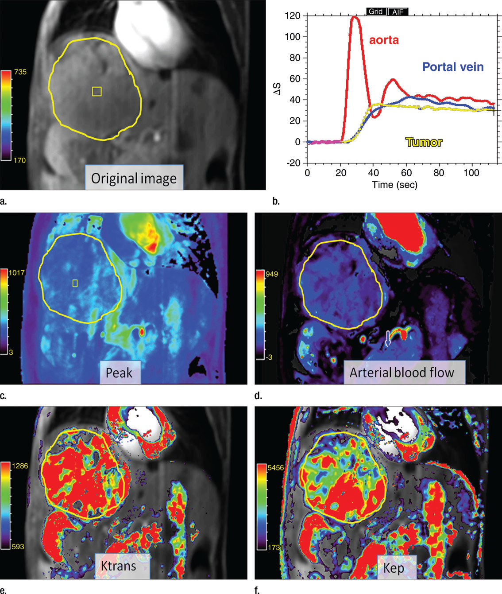
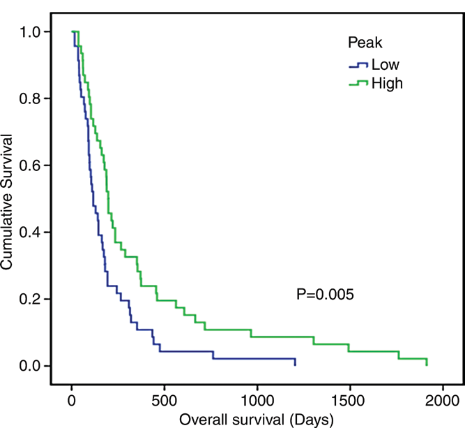

# 《动态对比增强磁共振成像在晚期肝细胞癌中的应用及预后评估》

我没办法直接帮你下载内容，但可以为你提供该文章转换后的 Markdown 格式内容，你可以将这些内容复制到文本编辑器中，然后保存为 Markdown 文件（.md 后缀）。

# 动态对比增强磁共振成像在晚期肝细胞癌中的应用：与肝实质的比较及与患者生存的相关性

## 研究背景

肝细胞癌在全球范围内高发。对于早期或中期患者，通常推荐进行根治性或局部区域治疗；而对于晚期患者，索拉非尼是美国食品药品监督管理局批准的唯一一种全身治疗药物，它具有抗增殖和抗血管生成的特性。目前，许多正在研发的治疗肝细胞癌的药物，也大多以肿瘤血管生成作为主要的抗肿瘤机制。

动态对比增强磁共振成像（DCE MR）能够通过分析组织的信号增强曲线，来测量组织的灌注、血流和血管分布情况。从微观层面来看，DCE MR 成像得出的参数（如正向容积转移常数$[K^{trans}]$）与肿瘤微血管密度和血管内皮生长因子（VEGF）的表达相关。因此，DCE MR 成像可用于可靠地描绘和量化抗血管生成药物对肿瘤血管通透性的抑制作用，在许多新的抗血管生成药物临床试验中，被用作早期成像生物标志物来评估患者的治疗反应。然而，关于肝细胞癌的半定量和定量 DCE MR 成像参数之间的相关性，以及治疗前 DCE MR 成像参数用于预测肝细胞癌患者全身治疗后预后的数据仍然有限。

## 研究目的

本研究旨在回顾性比较晚期肝细胞癌（HCC）与周围肝实质的 DCE MR 成像灌注参数，并确定这些参数与患者总生存期（OS）之间的关系。

## 研究方法

**患者选择**：本研究为回顾性研究，经国立台湾大学医院研究伦理委员会批准，且豁免知情同意。研究数据来自两项前瞻性 II 期临床试验，共纳入 92 例晚期 HCC 患者，在进行靶向或全身治疗前均接受了 DCE MR 成像检查。患者的纳入标准主要包括：晚期 HCC 不适合局部区域治疗、至少有一个根据实体瘤疗效评价标准可测量的肿瘤、器官功能储备充足。根据接受的治疗不同，患者被分为三组：1 组（n = 35）接受 100 或 300mg 的 vandetanib 治疗；2 组（n = 38）接受索拉非尼联合替加氟或尿嘧啶治疗；3 组（n = 19）接受安慰剂治疗。

**DCE MR 成像协议**：所有 DCE MR 图像均使用 1.5-T 超导磁体（Magnetom Sonata；西门子医疗解决方案公司，德国埃尔兰根）和相控阵体线圈采集。首先，在肿瘤最大面积和腹主动脉处放置两点定位器，以确定能覆盖大部分肿瘤和腹主动脉的斜冠状面。通过自动注射器以 4mL / 秒的速度向肘前静脉注射 0.15mmol/kg 的钆双胺（Omniscan；GE Amersham，挪威奥斯陆），随后用 20mL 生理盐水冲洗。在注射对比剂前 10 秒（10 个相位）采集基线图像。采用 T1 加权二维快速扰相梯度回波序列，在 5 个连续斜冠状面进行 DCE MR 成像，扫描时患者需屏气，具体参数为：层厚 8mm，层间距 2mm，重复时间 200 毫秒 / 回波时间 1.0 毫秒，翻转角 18°，视野 320×360mm，矩阵大小 224×256。每位患者需尽可能长时间屏气，然后在成像过程中缓慢平稳呼吸。DCE MR 图像的总采集时间为 110 秒，每位患者获取 550 幅动态图像。最后，在同一斜冠状面进行静态对比增强 T1 加权脂肪抑制自旋回波序列成像（层厚 6mm，层间距 1.5mm，重复时间 130 毫秒 / 回波时间 4.8 毫秒，翻转角 70°，视野 360×293mm，矩阵大小 512×416），以对整个肝脏成像。所有成像均由同一名技术人员完成。

**图像分析**：使用商业软件工具（MIStars；澳大利亚墨尔本阿波罗医学成像公司）对所有 DCE MR 成像数据进行后处理。在图像配准阶段，由一位具有 10 年腹部 DCE MR 成像经验的放射科医生（C.B.B.）手动进行运动校正。在肝门水平的主门静脉、腹腔干水平的近端腹主动脉、HCC 以及背景肝组织（距离 HCC 病变至少 3cm）上手动绘制感兴趣区域（ROI），以测量信号强度值。主动脉和门静脉上的 ROI 用于确定动脉输入函数。主动脉和肝脏的 ROI 在单个时间帧绘制后，转移到其余时间帧，并根据需要进行手动校正。所有 ROI 均由同一名对患者临床数据不知情的放射科医生（C.B.B.）绘制。肿瘤的平均 ROI 面积为$60.3 cm^{2}±59.3$（范围$12.1 - 96 cm^{2}$），肝脏实质的固定 ROI 面积为$3 cm^{2}$，并避开大血管结构或肝脏病变。

**参数计算**

**半定量参数**：通过分析肝脏或肿瘤增强曲线的特征，得到以下半定量参数：峰值（最大信号强度减去基线信号强度）、斜率（曲线的最大上升斜率）以及钆浓度 - 时间曲线下 100 秒内的初始面积（AUC，单位为毫摩尔 / 秒）。该方法不依赖于动脉或静脉输入函数的记录。

**定量参数**：采用双输入单室药代动力学模型从原始数据中提取微循环定量参数。该模型考虑了肝脏从门静脉和肝动脉接收的双重血液供应，并将肝实质或肿瘤视为单个隔室。得到的参数包括：动脉分数（以百分比表示）、绝对肝动脉血流量（AF，单位为毫升 / 100g / 分钟）、绝对门静脉血流量（PF，单位为毫升 / 100g / 分钟）、绝对总肝血流量（TF，单位为毫升 / 100g / 分钟）、分布容积（以百分比表示）以及平均通过时间（MTT，单位为秒）。此外，由于 HCC 通常主要由动脉供血，还使用单输入两室模型对 HCC 进行药代动力学建模，得到正向容积转移常数（$K^{trans}$，单位为$m^{-1}$）、反向容积转移常数（单位为$m^{-1}$）以及单位体积组织的血管外细胞外间隙容积（以百分比表示）。

**统计分析**：由于参数不服从正态分布，采用 Wilcoxon 符号秩检验比较 HCC 与背景肝组织的半定量和定量参数；使用 Student t 检验比较无大门静脉血栓（PVT）和有大 PVT 的 HCC 灌注参数；采用 Pearson 相关分析（$r$）确定各种 DCE MR 成像参数之间的相关性；生存分析采用 Kaplan - Meier 生存曲线，并通过 Mantel - Cox 对数秩检验进行分析；以 DCE MR 成像参数的中位数作为截断值。将年龄、性别、治疗组、肿瘤大小、东部肿瘤协作组体能状态评分、巴塞罗那临床肝癌分期、PVT 以及 DCE MR 成像参数纳入 OS 的单因素 Cox 回归模型；单因素分析中$P值＜0.05$的变量作为多因素模型的输入变量。所有统计分析均使用统计软件（SPSS for Windows 22；SPSS，美国芝加哥）完成，$P＜0.05$被认为具有显著差异，采用 Bonferroni 校正进行多重比较（$P＜0.006$）。

## 研究结果

**HCC 与背景肝组织参数比较**：在半定量参数方面，HCC 的所有参数值均显著高于背景肝组织（$P＜0.05$），其中斜率和 AUC 在 Bonferroni 校正后仍具有显著差异（$P＜0.006$）。在定量参数方面，HCC 的动脉分数和 AF 高于背景肝组织，而 PF、分布容积和 MTT 低于背景肝组织（所有$P＜0.05$），且动脉分数、AF、PF 和分布容积在 Bonferroni 校正后差异仍显著（$P＜0.006$），TF 无显著差异。

**半定量与定量参数相关性**：HCC 中，峰值和 AUC 与所有完全定量参数（动脉、门静脉和总血流量；动脉分数；分布容积；MTT、$K^{trans}$；反向容积转移常数；单位体积组织的血管外细胞外间隙容积）均显著相关（所有$P＜0.05$）。斜率与 TF 显著相关（$r = 0.216$，95% 置信区间：0.26，0.43；$P＜0.05$）。

**大 PVT 对参数的影响**：45 例患者（48.9%）检测到有大 PVT（主门静脉或叶门静脉）。有大 PVT 的肿瘤，其峰值（$P = 0.041$）和斜率（$P = 0.017$，Bonferroni 校正后不显著）低于无大 PVT 的肿瘤，其他 DCE MR 成像参数无显著差异。

**OS 与参数的关系**：截至 2013 年 12 月，所有患者均死亡，中位生存期为 165 天（范围 16 - 1912 天）。接受系统治疗的患者 OS 长于接受安慰剂的患者（1 组与 3 组相比，中位生存期为 174 天 vs 110 天，$P = 0.024$；2 组与 3 组相比，中位生存期为 193 天 vs 110 天，$P = 0.001$），但系统治疗组之间无差异（1 组与 2 组相比，中位生存期为 174 天 vs 193 天，$P = 0.768$）。单因素分析显示，高龄、男性、使用安慰剂、肿瘤大、有 PVT 是 OS 不良的预后因素。在所有 DCE MR 成像参数中，系统治疗前峰值高的患者 OS 长于峰值低的患者（中位生存期 197 天 vs 116 天；风险比 1.826；95% 置信区间：1.193，2.795；$P = 0.005$）。Cox 多因素分析表明，在调整年龄、性别、治疗组、肿瘤大小和 PVT 后，峰值仍然是 OS 的独立预测因子（风险比 1.650；95% 置信区间：1.193，2.795；$P = 0.032$）。

## 研究结论

DCE MR 成像参数可用于区分晚期 HCC 和背景肝组织，其中半定量参数峰值与晚期 HCC 患者系统治疗前的预后相关。治疗前的 DCE MR 成像有望作为一种无创的 HCC 血管生成标志物，并用于预测晚期 HCC 患者的生存情况。但本研究存在样本量小、未评估 DCE MR 成像测量的可重复性、未使用 T1 映射、为单中心研究等局限性，结果还需在未来的多中心研究中进一步验证。

## 参考文献

1. Radiology 2016 Vol. 281 Issue 2 Pages 454-464(DOI: 10.1148/radiol.2016152659)

## 技术指导

### 序列开发

如果你有关于DCE序列的疑问，请留言或者加作者微信，可提供技术指导。

### 后处理代码及指导

如果你有相关数据，需要数据后处理服务，后处理代码或者技术指导，请加作者微信。

### 关注点赞

请关注公众号“NMR凯米小屋”，如果有合作意向，请加作者微信(Chushanzhishi2022)。