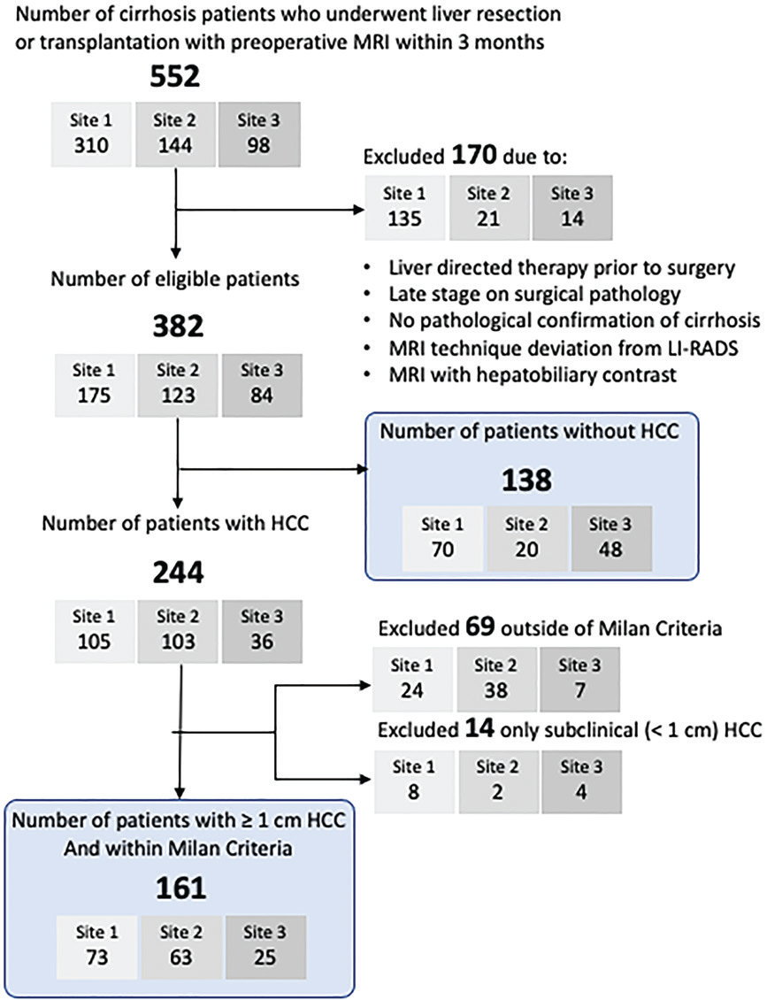
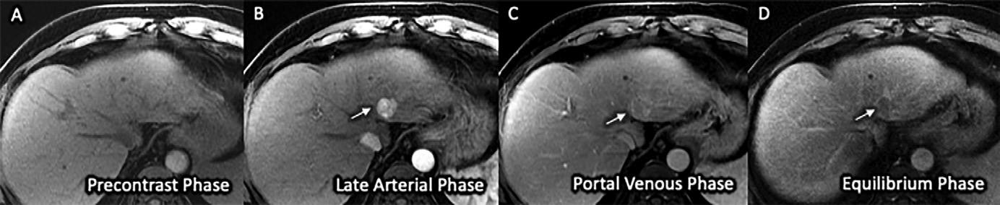
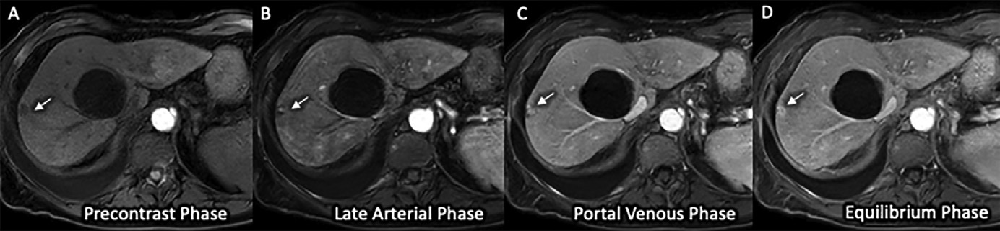

# 精简版 MRI 用于早期肝细胞癌检测的多中心验证

肝细胞癌（HCC）是全球癌症相关死亡的主要原因，预计到 2035 年将成为美国癌症死亡的第三大原因。早期 HCC 患者接受根治性手术治疗后 5 年生存率超 70%，而晚期患者中位生存期仅 1 - 2 年。因此，对肝硬化患者进行 HCC 监测意义重大。目前指南推荐肝脏超声用于 HCC 监测，但超声存在依赖操作者、对早期 HCC 检测敏感性欠佳等问题。MRI 虽敏感性高于超声，但因扫描时间长、成本高、可及性差等原因未被指南推荐用于常规监测。精简版 MRI 或可解决这些问题，本研究旨在以手术病理结果为参考标准，评估动态增强精简版 MRI 检测早期 HCC 的敏感性和特异性。

## 一、材料和方法

**患者选择**：在美国三个学术肝移植中心进行回顾性横断面研究。纳入 2009 年 1 月至 2019 年 12 月期间接受肝切除或移植、术前 3 个月内进行腹部 MRI 检查且经组织病理学证实为肝硬化的患者。排除术前接受过肝脏定向治疗、无肝硬化病理证实、MRI 技术不符合 LI - RADS 推荐或使用肝胆对比增强剂的患者，以及仅存在亚临床 HCC（肿瘤大小＜1 cm）的患者。早期 HCC 定义符合米兰标准：单个肿瘤最大直径小于 5 cm，或最多三个肿瘤且最大直径均小于 3 cm 且无大血管侵犯。

    
    
<b>图 1：患者纳入标准的流程图</b>

**精简版 MRI 及影像学报告**：选取患者术前最近一次肝脏 MRI 检查作为索引 MRI 检查。根据 LI - RADS 技术推荐，各中心 MRI 检查包括平扫 T1、T2、扩散加权序列以及动态增强 T1 加权序列。动态增强成像采用轴向脂肪抑制三维 T1 加权梯度回波序列，在注射细胞外钆对比剂后的平扫、动脉晚期、门静脉期和延迟期进行扫描。从原始完整 MRI 检查的所有序列中提取大视野冠状 T2 加权和动态 T1 加权序列，模拟动态增强精简版 MRI 检查。每个中心由两名经过认证且有腹部 MRI 经验的放射科医生，在不知晓病理结果和完整 MRI 检查的情况下，依据 LI - RADS 2018 版 CT/MRI 算法，独立解读本地的精简版 MRI 检查，检测高风险肝脏病变（LR - 4、LR - 5、LR - M 和 LR - TIV 类别），并提供病变大小、肝脏分段以及检查质量主观评估（adequate、borderline 或 nondiagnostic）。

**数据收集**：从电子病历中收集患者人口统计学（年龄、性别、种族和民族）、临床、手术和实验室数据。肝硬化病因分为丙型肝炎、乙型肝炎、酒精性肝病、非酒精性脂肪性肝病或其他。根据世界卫生组织分类对体重指数（BMI）进行分类。计算 Child - Pugh 分级描述肝硬化严重程度，Child - Pugh A 级为代偿期，B 或 C 级为失代偿期。参与中心的胃肠道病理科对手术病理标本进行常规临床解读，从模板化病理报告中提取组织病理学结果，用于确认早期 HCC 状态。

**统计分析**：连续变量以中位数和四分位数间距（IQR）总结，分类变量以比例表示。使用 Mann - Whitney U 检验或卡方检验比较患者组间差异。主要结局为以手术病理结果为参考标准，动态增强精简版 MRI 检测早期 HCC 的患者水平敏感性和特异性；次要结局为病变水平敏感性。根据 LI - RADS 中 LR - 3 阈值（其对 HCC 的阳性预测值较低，在监测环境中后续进行精简版 MRI 检查较为合适）将每个精简版 MRI 检查分为阴性（所有观察结果为 LR - 3 或更低类别）或阳性（任何观察结果高于 LR - 3 类别）。使用 Cohen κ 统计量计算放射科医生之间对精简版 MRI 阳性结果及检查质量的阅片一致性。计算患者水平和病变水平敏感性、特异性的 95% 置信区间（CI），通过亚组分析和单变量逻辑回归评估检查特征和患者特征与精简版 MRI 敏感性和特异性的关联。

## 二、研究结果

**患者特征**：最终纳入 299 例患者，其中 161 例为早期 HCC 患者，138 例为非 HCC 患者。HCC 患者中位年龄 62 岁，男性占 76%，多数为白人，多接受肝切除术，Child - Pugh A 级肝硬化比例高，腹水和肝性脑病发生率低。非 HCC 患者中位年龄 55 岁，男性占 62%，多数为白人，多接受肝移植。

**MRI 检查特征**：MRI 检查至手术的中位时间为 39 天（IQR：16 - 66 天），多数 MRI 检查在 1.5T 设备上进行（234/299，78%）。Child - Pugh A 级肝硬化患者的精简版 MRI 检查质量评分优于 Child - Pugh B 或 C 级患者。

    

    
    
<b>图 2：慢性丙型肝炎感染引发的 Child-Pugh A 级肝硬化以及酒精使用导致的 Child-Pugh C 级肝硬化的代表性3D-对比增强T1加权图像</b>

**阅片者一致性**：患者水平精简版 MRI 检查阳性结果的阅片者一致性为中度至高度（Cohen κ 值在各中心分别为 0.87、0.84 和 0.69），检查质量类别的阅片者一致性仅为一般（κ 值在各中心分别为 0.36、0.28 和 0.43）。

**精简版 MRI 检测 HCC 的敏感性**：患者水平敏感性范围为 60.0% - 95.2%，汇总敏感性为 88.2%（142/161），95% CI：83.5 - 92.5。年轻患者、Child - Pugh B 或 C 级肝硬化患者以及精简版 MRI 质量评分较差的患者，敏感性较低。病变水平敏感性范围为 57.9% - 87.5%，汇总敏感性为 79.8%（211.5/265），95% CI：75.1 - 85.0。不同肿瘤大小的病变水平敏感性不同，肿瘤越大，敏感性越高。

**精简版 MRI 的特异性**：患者水平特异性范围为 82.9% - 100%，汇总特异性为 89.1%（123/138），95% CI：84.4 - 93.8。病毒相关性肝病患者和精简版 MRI 质量评分较好的患者，特异性较低。

## 三、研究结论

以手术病理结果为参考标准，动态增强精简版 MRI 检测早期肝细胞癌在代偿期肝硬化（Child - Pugh A 级）患者中具有较高的敏感性和特异性，但在失代偿期肝硬化（Child - Pugh B 或 C 级）患者中敏感性较低。若在前瞻性队列研究中得到验证，精简版 MRI 或可作为代偿期肝硬化患者 HCC 监测的替代策略。对于失代偿期肝硬化患者，需进一步研究其检测效能欠佳的原因及潜在的改善策略。

## 参考文献
1. Radiology 2023 Pages 220917. （DOI: 10.1148/radiol.220917）

## 研究总结
随着MRI技术的发展，越来越多的序列被加入到临床扫描中，这在一定程度增加了疾病诊断的准确性，但是同时也导致设备资源的潜在浪费，因此确定不同部位的有效精简扫描方案是放射专家非常重要的研究方向。