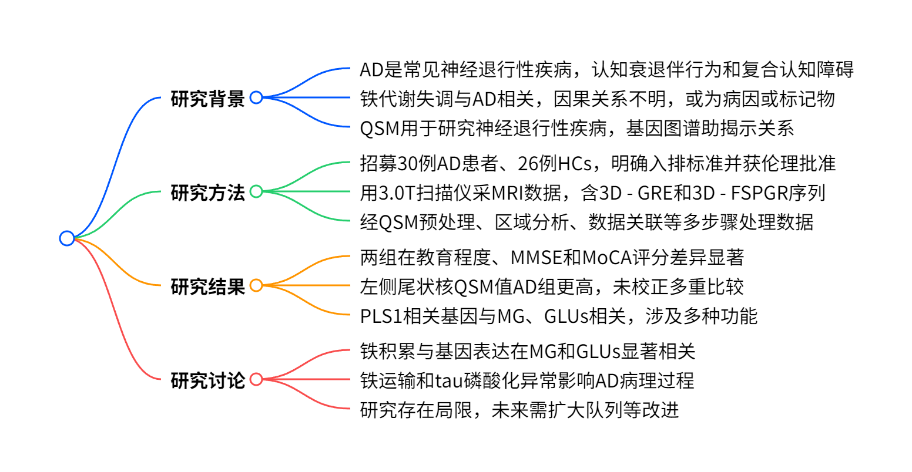
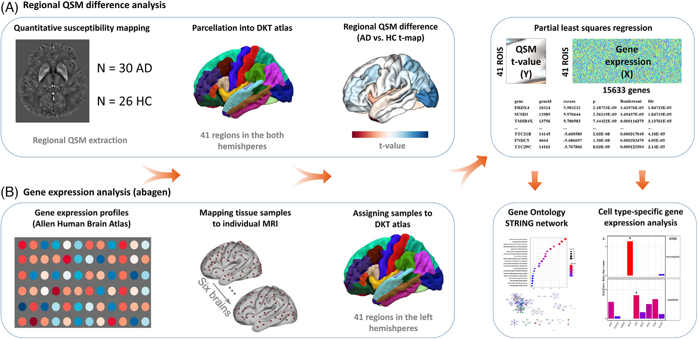
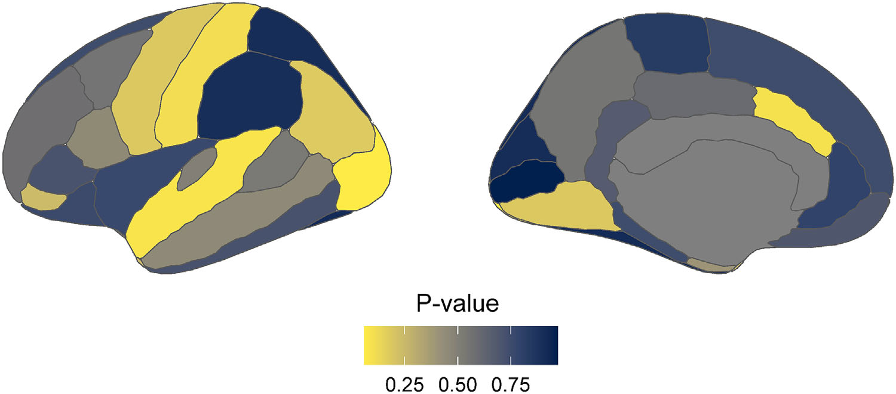
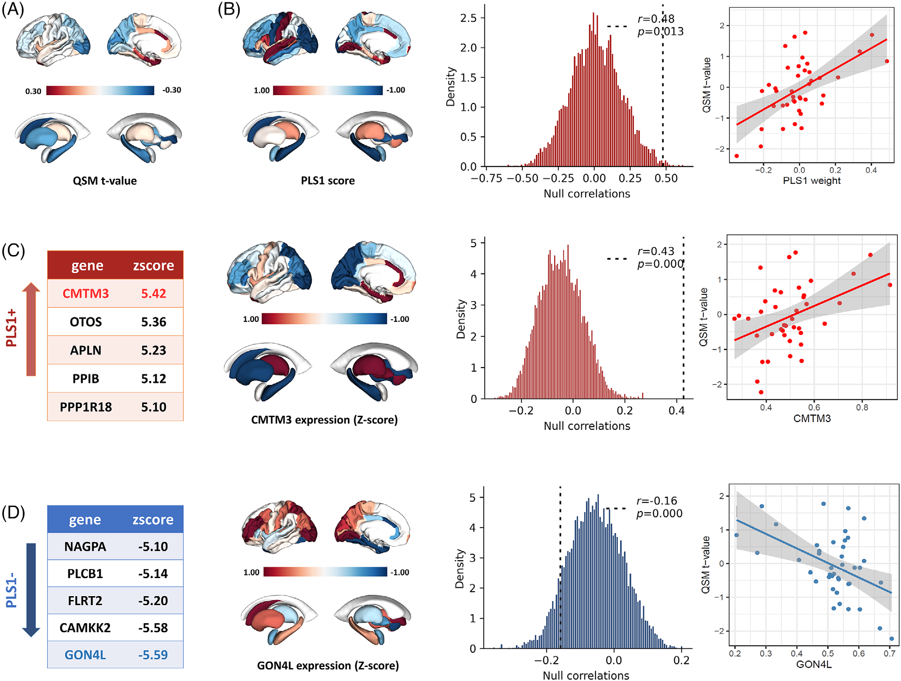

# 阿尔茨海默病研究新发现：大脑区域铁沉积与转录、细胞特征的关联

在神经科学领域，阿尔茨海默病（AD）一直是研究的重点。近日，一项发表于*Alzheimer's & Dementia*的研究，深入探讨了 AD 患者大脑区域铁沉积与转录、细胞特征之间的关系，为我们理解 AD 的发病机制带来了新的视角。

    
    
<b>图 1：研究总结</b>

## 研究背景

AD 是常见的神经退行性疾病，其病理特征为淀粉样 β（Aβ）斑块和 tau 神经原纤维缠结聚集。铁代谢失调被认为与 AD 病理相关，大脑铁积累与 Aβ 和 tau 共定位，过量铁会促进 Aβ 产生和 tau 蛋白磷酸化，还会引发氧化应激导致神经元死亡。然而，铁过载与 AD 病理之间的因果关系尚不明确。

传统的结构磁共振成像（MRI）在测量 AD 患者脑萎缩方面应用广泛，但对于揭示 AD 早期神经退行性机制的研究有限。定量磁敏感成像（QSM）可在体内估计组织的平均磁敏感性，其主要磁敏感源为灰质中的顺磁性铁，因此被用于研究神经退行性疾病。同时，全脑基因表达图谱的出现，为研究神经影像学信息与转录组之间的关系提供了可能。

## 研究方法

### 研究对象

招募符合美国国立神经疾病和中风研究所与 AD 及相关疾病协会（NINCDS - ADRDA）诊断标准的 AD 患者和年龄、性别匹配的健康对照（HCs）。参与者需满足年龄在 50 - 85 岁、Fazekas 量表评分≤2、右利手等条件，排除有其他神经或精神疾病史、酒精或药物滥用、MRI 禁忌证及 MRI 检查结果异常者。所有参与者均签署知情同意书，研究经中日友好医院伦理委员会批准。

### MRI 数据采集

使用 3.0T Discovery MR750 扫描仪及八通道头线圈进行扫描，包括轴向三维梯度回波（3D - GRE）序列和矢状面三维 T1 加权快速扰相梯度回波（3D - FSPGR）序列，详细设置了各序列的参数。

### 数据处理流程

**QSM 预处理和空间标准化**：利用 3D - GRE 序列获取的相位和幅度图像进行 QSM 重建，按照 STI Suite 软件默认流程处理，包括相位解缠、生成脑掩码、去除背景频率、估计磁敏感图等步骤。使用 Advanced Normalization Tools（ANTs）构建研究模板，将 QSM 图像空间标准化。

**区域 QSM 分析**：依据 DKT 图谱生成感兴趣区域（ROI），仅使用左半球 ROI。将研究空间与 OASIS - 30 空间进行非线性配准，把 DKT 图谱映射到研究空间，提取各 ROI 的平均和符号化 QSM 值，并以年龄和性别为协变量进行调整，通过 Student's t 检验评估 AD 与 HC 组间差异。

**微阵列表达数据处理**：从 Allen Human Brain Atlas（AHBA）获取 6 例死后大脑的区域微阵列表达数据，使用 Abagen Toolbox 处理并映射到 DKT 图谱的 41 个脑区。重新注释遗传探针，过滤掉强度低于背景噪声水平的探针，将组织样本分配到脑区，对基因表达值进行归一化和标准化处理。

**识别 AD 中 QSM 变化的转录组相关因素**：应用偏最小二乘（PLS）回归分析健康大脑转录组与 AD 中区域 QSM 变化的关联，重点分析第一个 PLS 成分（PLS1）。通过 Bootstrap 评估基因 PLS1 权重的变异性，根据 Z 分数筛选基因进行后续富集分析。

**基因集富集分析和蛋白质 - 蛋白质网络构建**：利用 clusterProfiler 包进行基因本体（GO）分析和京都基因与基因组百科全书（KEGG）通路富集分析，使用 REVIGO 对 GO 术语进行语义简化。利用 Metascape 对 PLSR 成分中的显著基因进行富集分析，使用 STRING 和 Cytoscape 构建蛋白质 - 蛋白质功能相互作用（PPI）网络，通过 CytoHubba 确定枢纽基因。

**脑细胞类型富集分析**：进行表达加权细胞类型富集（EWCE）分析，确定 PLS1 + 和 PLS1 - 基因子集在特定细胞类型中的表达情况，使用来自两个独立来源的人类细胞类型特异性基因集进行验证。

**基于自旋的空间置换检验**：基于自旋检验测试区域 QSM 变化与脑转录组之间空间相关性的 p 值，通过生成 5000 次随机空间旋转构建空分布，计算 pspin 值。

    
    
<b>图 2：研究策略</b>

## 研究结果

### 人口统计学和临床数据

最终招募 30 例 AD 患者（平均年龄 68.5 ± 6.8 岁，21 名女性）和 26 例 HCs（平均年龄 65.5 ± 8.1 岁，19 名女性）。AD 组和 HC 组在性别、年龄上无显著差异，但在教育程度、MMSE 评分和 MoCA 评分上存在显著差异。

### QSM 值差异

AD 患者左侧尾状核的区域皮质和皮质下符号化 QSM 值相对于对照组增加，但未经过多重比较校正（FDR 校正后 p > 0.05）。

    
    
<b>图 3：QSM不同脑区组间差异</b>

### 转录组与 QSM 变化的关联

PLS1 解释了 QSM 变化的最高比例（31.50%），且具有统计学意义（pboot = 0.001）。PLS1 加权基因表达图与病例 - 对照 QSM t 图呈空间正相关（r = 0.48，pspin = 0.013）。确定了 896 个 PLS1 +（Z > 2.8）和 694 个 PLS1 -（Z < - 2.8）基因，这些基因的表达与区域 QSM 变化相关。

    
    
<b>图 4：基因表达与区域QSM变化相关</b>

### 基因集富集分析

PLS1 - 基因在离子通道活性、金属离子跨膜转运活性等 GO 术语和 “蛋白质磷酸化”“金属离子运输” 等生物学过程中显著富集，还涉及一些 KEGG 通路。PLS1 + 基因在免疫相关的生物学过程中富集，但未在 KEGG 通路中富集。

### 蛋白质 - 蛋白质网络

PLS1 - 基因集编码的蛋白质相互作用网络包含 284 个节点和 365 条边，枢纽基因子网包含 22 个节点和 64 条边。

### 细胞类型关联

PLS1 + 基因与小胶质细胞（MG）显著相关，PLS1 - 基因与谷氨酸能神经元（GLUs）显著相关。使用不同数据集验证了这一结果，且发现 PLS1 - 基因还与海马 CA 区的锥体神经元、齿状回区的颗粒神经元相关。

## 研究讨论

研究表明，AD 患者大脑区域磁敏感性增加（反映铁积累增加）与参与金属离子运输和蛋白质磷酸化的基因表达相关，这些基因主要在 MG 和 GLUs 中表达。左侧尾状核磁敏感性增加可能指示 AD 早期组织变化，进而导致神经退行性变。

铁离子跨膜运输异常可能是 AD 中铁过载积累的原因之一，同时铁沉积与 tau 蛋白异常磷酸化相关。MG 激活和 GLUs 功能异常在 AD 铁代谢失调中起重要作用。

研究存在一定局限性，如仅使用左侧半球数据、基因表达谱来自健康个体、QSM 信号来源不唯一、研究为横断面研究等。未来需要在更大且更多样化的队列中进行验证，研究半球间差异，并使用 AD 患者的转录组数据。

这项研究通过 QSM 和转录组分析，揭示了 AD 患者大脑铁积累与基因表达的关系，为理解 AD 发病机制提供了新线索。期待未来更多研究能进一步深入探索，为 AD 的诊断和治疗带来新突破。

## 参考文献
1. Alzheimers Dement 2025 Vol. 21 Issue 1 Pages e14459（DOI: 10.1002/alz.14459）

## 技术指导

### 序列开发

本文涉及到关键技术QSM重建，以及区域分析，并且采用了皮层分区定量，如果你有关于QSM序列及区域皮层定量分析的疑问，请留言或者加作者微信，可提供技术指导。

### 后处理代码及指导

如果你有相关数据，需要数据后处理服务，后处理代码或者技术指导，请加作者微信。

### 关注点赞

请关注公众号“NMR凯米小屋”，作者B站：“楚山之石”。如果有合作意向，请加作者微信(Chushanzhishi2022)。