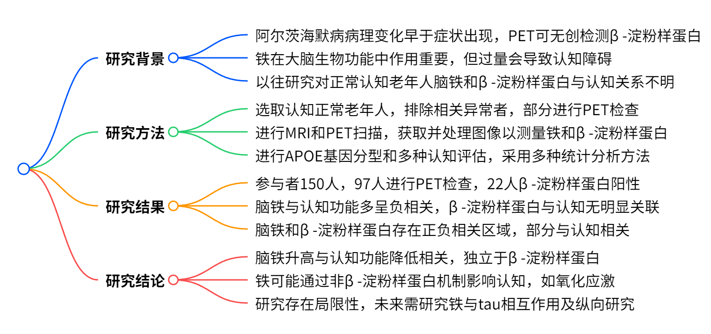

# 脑铁与 β- 淀粉样蛋白对认知正常老年人认知功能的影响：MRI 与 PET 定量研究

在老龄化社会不断发展的今天，认知健康逐渐成为人们关注的焦点。你是否想过，大脑中的铁含量和 β - 淀粉样蛋白会如何影响认知正常老年人的认知功能呢？近期，一项发表于《Radiology》的研究为我们揭示了其中的奥秘。

    
    
<b>图 1：研究概况 </b>

## 一、研究背景

阿尔茨海默病（AD）的病理变化，如 β - 淀粉样蛋白斑块的细胞外积累，往往在临床症状出现多年前就已发生，PET 成像可无创检测这些变化。然而，有淀粉样病理的个体认知下降速率差异大，且抗淀粉样蛋白疗法对减缓认知下降效果不佳，这表明除淀粉样蛋白外，可能还有其他因素影响认知，比如脑铁。铁在大脑生物功能中扮演着重要角色，参与神经递质合成、髓鞘形成和新陈代谢等过程。但动物实验显示，脑铁含量过高会引发氧化应激，促进 β - 淀粉样蛋白毒性和 tau 蛋白功能障碍，导致神经元细胞死亡、神经退行性变和认知功能障碍。虽然正常衰老过程中脑铁会有所增加，但老年人脑铁异常积累与 AD 中的神经退行性变和淀粉样斑块有关。此前研究多聚焦于轻度认知障碍（MCI）或痴呆患者，对于认知正常老年人脑铁和 β - 淀粉样蛋白与认知功能的关系尚不明确。

## 二、研究方法

### （一）研究对象

本研究是对一项前瞻性研究的二次分析，参与者来自 “Biomarkers for Older Controls at Risk for Dementia”（BIOCARD）项目。选取 2015 年 1 月至 2018 年 9 月期间接受定量磁敏感成像（QSM） - MRI 检查的认知正常老年人，排除图像重建受损、有严重伪影或被诊断为 MCI 的个体。多数参与者在 MRI 检查后 30 天内（平均 1±3 天）接受了使用$^{11}C$标记的匹兹堡化合物 B（$^{11}C$-PiB）示踪剂的 PET 检查，这部分参与者构成 PET 组。

### （二）评估方法

**APOE 基因分型与临床认知评估**：APOE ε4 携带者（至少携带一个 APOE ε4 等位基因）编码为 1，非携带者编码为 0。参与者由约翰霍普金斯大学 BIOCARD 临床核心工作人员进行一致性诊断，分为认知正常或非 MCI 的认知受损两类。所有参与者在 MRI 检查时接受全面的神经心理测试，基于 12 项神经心理测试分数计算出反映言语情景记忆、执行功能、视觉空间处理和语言能力的四个领域特异性综合得分，同时使用全球认知综合得分衡量整体认知表现，得分越高表示认知功能越好。

**MRI 数据采集与处理**：使用 3.0T 扫描仪（Achieva；Philips Healthcare）进行 MRI 扫描。采用三维多回波梯度回波序列（分辨率$1×1×1mm^{3}$）获取 QSM 图像，用于评估脑铁含量；使用三维 T1 加权磁化准备快速梯度回波序列（分辨率$1×1×1.2mm^{3}$）进行解剖参考和自动图像分割。利用约翰霍普金斯大学 / 肯尼迪克里格研究所 QSM Toolbox（版本 3.0）重建 QSM 图像，对相位进行预处理并进行 QSM 偶极反演。将 T1 加权磁化准备快速梯度回波图像与 QSM 空间进行配准，基于人脑图谱自动分割 12 个感兴趣区域（ROIs），包括额叶、颞叶、海马等，用于量化各区域组织磁化率（铁测量指标）和结构体积。

**PET 数据采集与处理**：在 Advance PET 扫描仪（GE Healthcare）上进行动态$^{11}C$-PiB 示踪剂 PET 扫描，计算每个 PET 图像原生空间的分布体积比（DVR）图像。量化每个选定 ROI 的平均 DVR，当皮质 DVR 全局指数大于 1.06 时，判定为$^{11}C$-PiB 阳性（即 β - 淀粉样蛋白阳性）。

**统计分析**：运用多元线性回归模型评估局部脑铁负荷与全球认知综合得分的关联。模型 1 纳入所有参与者，将年龄、性别、APOE ε4 状态、受教育年限、结构体积和组织磁化率作为自变量；模型 2 在 PET 组中加入局部 DVR 值作为额外预测变量，以检验该关联是否独立于 β - 淀粉样蛋白沉积。对淀粉样蛋白阴性的参与者重新运行回归模型，进一步探究脑铁与认知的关系。使用 Benjamini - Hochberg 校正进行多重比较（12 个 ROIs 进行 12 次测试，错误发现率为 0.25）。使用生物参数映射工具箱（Biologic Parametric Mapping toolbox）估计 PET 组灰质区域脑铁与 β - 淀粉样蛋白的体素相关性，并在铁和 β - 淀粉样蛋白显著相关的簇中进一步检验它们与认知的关联，采用岭回归分析，同样进行 Benjamini - Hochberg 校正（测试次数由生物参数映射确定的簇数量决定，错误发现率为 0.25）。所有回归分析均使用 SPSS 25.0 软件完成。

    
    
<b>图 2：研究策略 </b>

## 三、研究结果

### （一）参与者特征

最初确定了 174 名 BIOCARD 研究参与者，排除 2 名有严重成像伪影和 22 名 MCI 患者后，最终评估了 150 名认知正常的老年人（平均年龄 69±8 岁，93 名女性）。其中，97 人在 MRI 检查后 30 天内接受了 PET 检查，22 人 β - 淀粉样蛋白阳性（平均年龄 71±6 岁，13 名女性），75 人 β - 淀粉样蛋白阴性。β - 淀粉样蛋白阳性组中 APOE ε4 携带者比例显著高于阴性组（$P＜0.001$）。

### （二）脑铁、β - 淀粉样蛋白与认知功能的关系

**全球认知功能**：在所有参与者中，海马体脑铁含量与全球认知综合得分呈负相关（标准化$\beta=-0.24$；95%CI：$-0.40$，$-0.07$；$P = 0.005$）。在 PET 组中，额叶上中部皮层（$\beta=-0.22$；95%CI：$-0.43$，$-0.11$；$P = 0.04$）和苍白球（$\beta=-0.26$；95%CI：$-0.48$，$-0.05$；$P = 0.02$）的脑铁与全球认知综合得分也呈负相关，但海马体的相关性在 PET 组中未达到显著水平（$\beta=-0.22$；95%CI：$-0.45$，$0.02$；$P = 0.07$）。而 β - 淀粉样蛋白在所有选定的 ROIs 中与全球认知功能均无显著关联（如海马体中$\beta=0.05$；95%CI：$-0.17$，$0.27$；$P = 0.67$）。在 β - 淀粉样蛋白阴性的参与者中，更多 ROIs 的脑铁与全球认知功能呈负相关，包括额叶上中部皮层、颞叶、内嗅皮层等。

**领域特异性认知功能**

**情景记忆**：海马体脑铁水平在所有参与者和 PET 组中均与情景记忆得分呈负相关（所有参与者：$\beta=-0.22$；95%CI：$-0.38$，$-0.05$；$P = 0.01$；PET 组：$\beta=-0.24$；95%CI：$-0.40$，$-0.08$；$P = 0.004$），且独立于 β - 淀粉样蛋白水平（$\beta=-0.03$；95%CI：$-0.26$，$0.19$；$P = 0.78$）。在 β - 淀粉样蛋白阴性的参与者中，海马体及其他多个 ROIs 的脑铁与情景记忆得分呈负相关。

**执行功能**：海马体和苍白球的脑铁水平在所有参与者和 PET 组中均与执行功能得分呈负相关。在 β - 淀粉样蛋白阴性的参与者中，海马体和苍白球的脑铁与执行功能得分的负相关性依然显著。

**视觉空间功能**：所有参与者和 PET 组中，海马体脑铁负荷与视觉空间得分呈负相关，且与 β - 淀粉样蛋白水平无关。在 β - 淀粉样蛋白阴性的参与者中，海马体和苍白球的脑铁与视觉空间得分呈负相关。

**语言功能**：在 PET 组中，苍白球脑铁与语言得分呈负相关。在 β - 淀粉样蛋白阴性的参与者中，内嗅皮层和苍白球的脑铁与语言得分呈负相关。

**体素水平关联**：脑铁与 β - 淀粉样蛋白水平存在 9 个负相关簇和 3 个正相关簇。在额叶皮层和扣带回皮层的负相关簇中，脑铁水平与全球认知综合得分、情景记忆得分和语言得分呈负相关，而 β - 淀粉样蛋白与全球认知综合得分在这些簇中均无关联。

### （三）结构体积与 QSM 或 DVR 的关系

进一步分析表明，所有选定 ROIs 中，结构体积与铁（QSM）或 β - 淀粉样蛋白（DVR）均无显著相关性。

    
    
<b>图 3：研究结果 </b>

## 四、研究结论

本研究通过对认知正常老年人进行 MRI 和 PET 检查，发现脑铁含量升高，尤其是在海马体中，与全球认知、情景记忆和视觉空间功能测试中的较低表现相关，且这种关联独立于 β - 淀粉样蛋白负荷。这表明在认知正常的老年人中，铁对认知功能的影响比 β - 淀粉样蛋白更为显著。研究结果还提示，脑铁可能通过 β - 淀粉样蛋白无关的机制影响认知功能，如铁相关的氧化应激和铁依赖性细胞死亡（铁死亡），以及与 tau 蛋白缠结的相互作用。不过，本研究存在一定局限性，如横断面研究设计、PET 和 MRI 图像分别采集，且统计分析中设定的错误发现率为 0.25，若采用更严格的多重比较校正，部分相关性可能不再显著。未来需要进一步研究铁与 tau 蛋白的相互作用，并开展纵向研究，以确定脑铁水平是否能预测 AD 连续体不同阶段个体的认知轨迹变化。这对于理解 AD 的发病机制、开发新的治疗靶点具有重要意义。

## 五、研究意义与展望

随着全球老龄化的加剧，认知障碍相关疾病的防治成为重大公共卫生问题。本研究为认知正常老年人认知功能的影响因素提供了新的见解，有助于我们更深入地理解 AD 的病理生理过程。如果未来研究能够证实脑铁是影响认知功能的关键因素，那么针对脑铁代谢的干预措施可能成为预防和治疗 AD 的新方向，这无疑为攻克 AD 带来了新的希望。

在未来，我们期待更多高质量的研究能够进一步明确脑铁与认知功能之间的复杂关系，为开发有效的 AD 防治策略奠定坚实基础，让更多人能够保持认知健康，享受美好的晚年生活。

## 参考文献

1. Radiology 2021 Vol. 298 Issue 2 Pages 353-362（10.1148/radiol.2020201603）

## 技术指导

### 序列开发

本文涉及到关键技术QSM重建，以及区域分析，如果你有关于QSM序列及区域皮层定量分析的疑问，请留言或者加作者微信，可提供技术指导。

### 后处理代码及指导

如果你有相关数据，需要数据后处理服务，后处理代码或者技术指导，请加作者微信。

### 关注点赞

请关注公众号“NMR凯米小屋”，作者B站：“楚山之石”。如果有合作意向，请加作者微信(Chushanzhishi2022)。