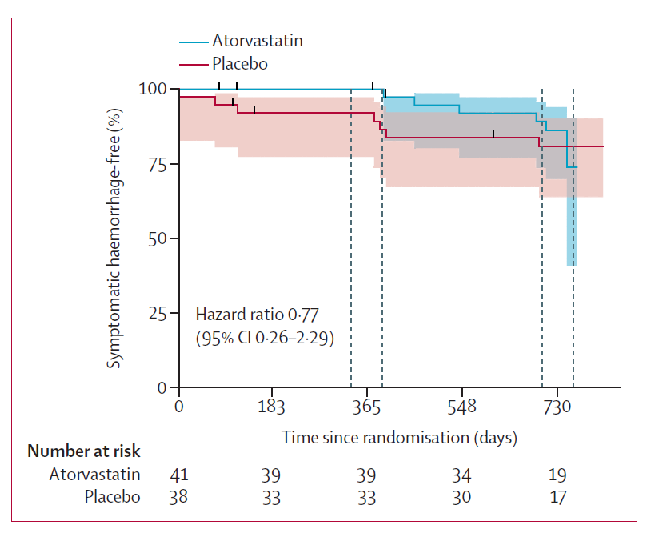

# 《阿托伐他汀预防脑海绵状血管畸形再出血：临床试验与机制探讨》

\*

***

# 阿托伐他汀预防脑海绵状血管畸形再出血研究：QSM作为研究主要终点

## 一、研究背景：未被填补的临床空白与科学假设的诞生

### （一）疾病特征与治疗困境

**流行病学**：脑海绵状血管畸形（CCMs）人群患病率约**1%**，其中**症状性出血患者**占比不足 20 万（美国），但这类患者的**年再出血风险高达 25%-40%**，且每次出血可能导致严重神经功能缺损（如偏瘫、失语、脑干功能障碍）。

**现有局限**：唯一根治手段为**手术切除**，但适用于表浅病灶；对于深部（如脑干）或多发灶患者，缺乏有效药物预防再出血，临床亟需非手术干预手段。

### （二）基础研究的理论支撑

**核心机制**：CCM 的病理核心是**Rho-associated 蛋白激酶（ROCK）过度激活**，导致血管内皮屏障破坏、通透性增加和出血。动物模型（如 Ccm3 基因敲除小鼠）显示，**ROCK 抑制剂可减少病灶生长和出血**。

**阿托伐他汀的双重特性**：作为临床常用降脂药，其**高剂量（80mg/d）可通过非降脂作用抑制 ROCK**，且在动脉粥样硬化患者中已证实能降低血管炎症反应。

    
    
<b>图 1：研究概述 </b>

## 二、研究设计：严谨的科学框架与技术创新

### （一）试验整体架构

**试验类型**：单中心、双盲、随机对照（1:1）、Phase 1/2a 期试验（NCT02603328）。

**时间范围**：2018 年 7 月 - 2022 年 7 月，随访至 2024 年 7 月。

**样本量**：筛选 326 例患者，最终入组**80 例**（阿托伐他汀组 41 例，安慰剂组 39 例），平均年龄 41 岁，64% 为女性，55% 为脑干病灶。

### （二）关键技术细节

#### 1. **入组标准的严格性**

**必须条件**：

18-80 岁，未接受过 CCM 手术 / 放疗。

**1 年内有症状性出血证据**（MRI 显示新出血 + 对应的神经症状）。

**排除标准**：近 1 年使用他汀类药物、严重肝肾功能不全、mRS 评分＞3 分（严重残疾）。

#### 2. **干预措施与随访方案**

**药物方案**：

阿托伐他汀组：80mg/d 口服，持续 2 年。

安慰剂组：匹配外观的安慰剂，服药方式相同。

**随访频率**：

**基线 / 12 个月 / 24 个月**：3T MRI（QSM+DCEQP 序列）、神经功能评估（mRS/NIHSS/MMSE）、血液检测（胆固醇、维生素 D、ROCK 活性）。

**每 3 个月**：电话随访不良反应、药物依从性（通过手机 APP 监测）。

#### 3. **生物标志物的选择与验证**

\*\* primary biomarker（QSM）\*\*：

**原理**：铁沉积是出血的直接证据，QSM 通过量化磁敏感值反映病灶内铁含量（单位：ppm），**年变化率＞6% 提示新出血**。

**扫描参数**：3T MRI，三维梯度回波序列，层厚 1mm，后处理通过专用软件（如 MIPAV）生成定量图。

\*\* secondary biomarker（DCEQP）\*\*：

**原理**：血管通透性增加是出血前兆，DCEQP 通过动态对比剂曲线计算**容积转移常数（Ktrans）**，**年变化率＞40% 提示渗漏风险**。

## 三、核心结果：数据背后的临床意义

### （一）影像学终点：阿托伐他汀未改变出血相关生物标志物

| 指标                | 阿托伐他汀组（n=33） | 安慰剂组（n=31）  | 组间差异（95% CI）          | p 值  |
| ----------------- | ------------ | ----------- | --------------------- | ---- |
| **QSM 年变化率（%）**   | 10.88±7.29   | 12.09±7.54  | -1.22（-22.25\~19.81）  | 0.91 |
| **DCEQP 年变化率（%）** | 108.87±40.64 | 59.09±42.19 | 49.77（-71.41\~170.96） | 0.41 |
| **QSM＞6% 比例**     | 37%（15/41）   | 28%（11/39）  | +9%                   | 0.38 |
| **DCEQP＞40% 比例**  | 37%（15/41）   | 33%（13/39）  | +4%                   | 0.72 |

**关键发现**：

两组 QSM/DCEQP 变化无统计学差异，提示阿托伐他汀**未减少铁沉积或改善血管通透性**。

亚组分析显示，无论性别、病灶位置（脑干 vs 非脑干）、家族性 / 散发性 CCM，结果均一致。

    
    
<b>图 2：QSM变化作为研究主要终点的组间差异 </b>

### （二）临床终点：再出血率与安全性数据

**症状性出血**：

阿托伐他汀组：6 例（14.6%），安慰剂组：7 例（17.9%），**相对风险 0.81（0.31\~2.13）**，无显著差异。

**出血时间分布**：两组均在治疗第 1 年和第 2 年均匀发生，无时间聚集性。

**安全性**：

**严重不良事件**：阿托伐他汀组 2 例（1 例肌酸激酶升高，1 例跌倒相关住院），均未直接归因于药物，无停药或死亡。

**常见不良反应**：阿托伐他汀组更多报告肌肉痛（12% vs 8%）、头痛（9% vs 6%），但均为轻度，无临床意义。

    
    
<b>图 3：组间症状性出血的发生分析 </b>

## 四、机制探讨：为何动物实验成功而临床试验失败？

### （一）药物作用强度不足

**ROCK 抑制效率**：在动脉粥样硬化患者中，阿托伐他汀可抑制外周血白细胞 ROCK 活性约 30%，但在 CCM 患者中**未检测到 ROCK 活性降低**，提示病灶局部药物浓度或作用靶点不足。

**药物多效性干扰**：他汀类药物降低胆固醇可能通过影响血管平滑肌细胞功能，**抵消 ROCK 抑制的保护作用**。

### （二）生物标志物的局限性

**QSM 的敏感性**：尽管 QSM 是出血的直接标志物，但**单次出血可能需要数月才表现为铁沉积**，而试验随访间隔为 1 年，可能漏检短期出血事件。

**个体异质性**：CCM 出血风险受遗传（如 CCM1/2/3 基因突变）、环境（如血压波动）等多因素影响，单一药物难以覆盖所有机制。

## 五、研究价值：从阴性结果到领域突破

### （一）临床实践的指导意义

**安全性结论**：阿托伐他汀在 CCM 患者中**不增加出血风险**，对于合并高血脂的 CCM 患者，可谨慎使用（需监测肝功能和肌酶）。

**治疗建议**：目前**不推荐将阿托伐他汀用于预防 CCM 再出血**，临床仍以定期影像随访（每年 MRI）和血压管理为核心。

### （二）方法学创新与未来方向

**生物标志物平台的建立**：QSM 和 DCEQP 已通过 FDA 认证为 CCM 药物试验的替代终点，未来可用于**加速新型药物审批**（如 ROCK2 特异性抑制剂）。

**联合治疗策略**：基于炎症 - 出血轴的机制，探索他汀 + 抗血小板药物（如阿司匹林）或抗 VEGF 药物的协同效应。

**精准医疗方向**：通过基因检测（如 CCM 基因突变状态）和血液生物标志物（如 sICAM-1、VEGF）筛选可能受益的患者亚群。

## 六、专家视角：阴性结果的积极意义

**Dr. Issam Awad（研究 PI）**：“尽管结果未达预期，但这是 CCM 领域首次通过随机对照试验验证生物标志物的价值。我们建立了可重复的研究框架，为后续药物（如 ABT-199、法舒地尔）的试验奠定了基础。对于患者而言，至少明确了阿托伐他汀并非有效预防手段，避免了不必要的用药风险。”

## 参考文献

1.Lancet Neurol 2025 Vol. 24 Issue 4 Pages 295-304（DOI: 10.1016/s1474-4422(25)00036-5）

## 技术指导

### 序列开发

本文涉及到关键技术QSM重建，如果你有关于QSM序列及定量分析的疑问，请留言或者加作者微信，可提供技术指导。

### 后处理代码及指导

如果你有相关数据，需要数据后处理服务，后处理代码或者技术指导，请加作者微信。

### 关注点赞

请关注公众号“NMR凯米小屋”，作者B站：“楚山之石”。如果有合作意向，请加作者微信(Chushanzhishi2022)。