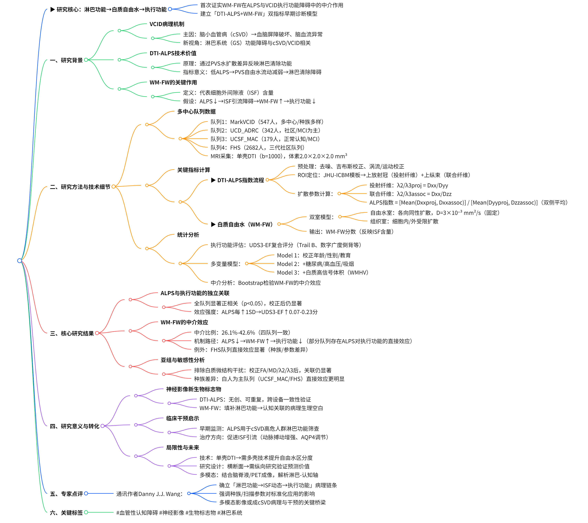
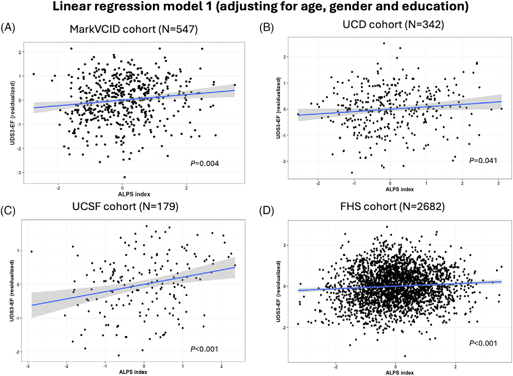
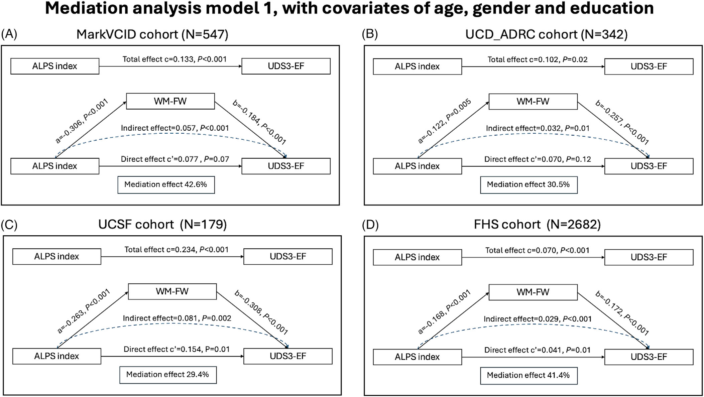

# 《DTI-ALPS 与 WM-FW：血管性认知障碍早期诊断的新指标》

\*

***

# 【深度解读】DTI-ALPS 与执行功能：白质自由水的中介作用在血管性认知障碍中的关键发现

## 导语

血管性认知障碍（VCID）作为仅次于阿尔茨海默病的第二大痴呆类型，其早期诊断与机制研究一直是神经科学领域的热点。近日，《Alzheimer's & Dementia》发表的一项多中心研究揭示了**扩散张量成像血管周围空间分析（DTI-ALPS）指数与执行功能障碍的关联**，并首次证实**白质自由水（WM-FW）在其中的中介作用**，为 VCID 的早期生物标志物开发提供了重要依据。

    
    
<b>图 1：研究概述 </b>

## 一、研究背景与核心问题

### 1. 血管性认知障碍的病理机制

脑小血管病（cSVD）是 VCID 的主要病因，涉及血脑屏障破坏、脑血流减少等机制。

**淋巴系统（GS）功能障碍**被认为与 cSVD 和 VCID 相关，但其如何影响认知功能尚不明确。

### 2. DTI-ALPS 的独特价值

**DTI-ALPS 指数**通过测量血管周围空间（PVS）的水扩散差异，反映淋巴清除功能。

低 ALPS 指数提示 PVS 内自由水流动减弱，与淋巴清除功能障碍相关。

### 3. 白质自由水的关键作用

WM-FW 代表细胞外间隙液（ISF）含量，其升高与血管危险因素、认知衰退相关。

研究假设：ALPS 指数降低→ISF 引流障碍→WM-FW 升高→执行功能下降。

## 二、研究方法与技术细节

### 1. 多中心队列与数据采集

**四个独立队列**：

MarkVCID（547 人，多中心，种族多样）

UCD\_ADRC（342 人，社区招募，侧重 MCI）

UCSF\_MAC（179 人，正常认知 / MCI）

FHS（2682 人，三代社区队列）

**MRI 采集**：单壳 DTI（b=1000 s/mm²），体素大小 2.0×2.0×2.0 mm³（部分队列例外）。

### 2. 关键指标计算

#### ▶ DTI-ALPS 指数流程

**预处理**：去噪、吉布斯环校正、涡流与运动校正。

**感兴趣区（ROI）定位**：基于 JHU-ICBM 模板，选取侧脑室体部的投射纤维（上放射冠）和联合纤维（上纵束）。

**扩散参数计算**：

投射纤维径向不对称性（λ2/λ3proj）= Dxx/Dyy

联合纤维径向不对称性（λ2/λ3assoc）= Dxx/Dzz

**ALPS 指数**= \[Mean (Dxxproj, Dxxassoc)] / \[Mean (Dyyproj, Dzzassoc)]，取双侧平均值。

#### ▶ 白质自由水（WM-FW）

基于双室模型：

自由水室：各向同性扩散，扩散系数固定为 3×10⁻³ mm²/s（模拟体温下水的扩散）。

组织室：包含细胞内 / 外受限扩散成分。

输出指标：WM-FW 分数（反映 ISF 含量）。

### 3. 统计分析

**执行功能评估**：UDS3-EF 复合评分（包含 Trail Making Test B、数字广度倒背等）。

**多变量模型**：

**Model 1**：校正人口学变量（年龄、性别、教育）。

**Model 2**：+ 血管危险因素（糖尿病、高血压、吸烟）。

**Model 3**：+ 白质高信号体积（WMHV）。

**中介分析**：通过 Bootstrap 检验 WM-FW 对 ALPS 与 UDS3-EF 关联的中介效应。

## 三、核心研究结果

### 1. ALPS 指数与执行功能的独立关联

**所有队列均显示**：ALPS 指数与 UDS3-EF 评分呈显著正相关（p<0.05），校正多重混杂因素后依然显著（图 1-3）。

**效应强度**：ALPS 每增加 1 个标准差，UDS3-EF 评分提高 0.07-0.23 分（不同队列略有差异）。

    
    
<b>图 2：ALPS 指数与执行功能的独立关联 </b>

### 2. WM-FW 的中介作用

**中介效应显著**：在四个队列中，WM-FW 解释了 ALPS 与执行功能关联的 26.1%-42.6%（图 4-6）。

    
    
<b>图 3：WM-FW 是ALPS 指数与执行功能中介因子 </b>

**机制路径**：

低 ALPS→ISF 引流障碍→WM-FW 升高→执行功能下降。

部分队列（如 FHS）存在直接效应，可能与种族、扫描参数差异相关。

### 3. 亚组与敏感性分析

**排除白质微结构干扰**：在 MarkVCID 队列中，校正 FA、MD、λ2/λ3 后，ALPS 与 UDS3-EF 关联依然显著，提示 WM-FW 的独立中介作用。

**种族差异**：白人比例较高的队列（UCSF\_MAC、FHS）直接效应更明显，可能与淋巴系统功能的种族异质性有关。

## 四、研究意义与临床转化

### 1. 神经影像学的新生物标志物

**DTI-ALPS 的优势**：无创、可重复，适用于多中心研究（跨设备一致性已验证）。

**WM-FW 的机制价值**：作为 ISF 引流的 “下游指标”，填补了淋巴功能与认知关联的病理生理空白。

### 2. 对 VCID 干预的启示

**早期监测**：ALPS 指数可用于识别 cSVD 高危人群的淋巴功能障碍。

**治疗靶点**：促进 ISF 引流（如增强动脉搏动、调节 AQP4 水通道）可能成为干预方向。

### 3. 局限性与未来方向

**技术局限**：单壳 DTI 可能低估自由水与扩散参数的区分度，未来需结合多壳技术。

**纵向研究**：当前为横断面数据，需验证 ALPS/WM-FW 对认知衰退的预测价值。

**多模态整合**：结合脑脊液生物标志物、PET 成像，全面解析淋巴 - 认知轴。

## 五、专家点评

“这项研究通过大样本多中心数据，首次明确了淋巴系统功能→ISF 动态→执行功能的病理链条，为 VCID 的早期诊断提供了双指标（ALPS+WM-FW）模型。值得关注的是，研究揭示了种族和扫描参数对结果的潜在影响，提示临床应用中需标准化操作流程。未来，随着多模态影像技术的发展，淋巴系统成像有望成为连接 cSVD 病理与认知干预的关键桥梁。”—— 本文通讯作者 Danny J.J. Wang 教授

## 参考文献

1.Liu, X., et al. (2025). MRI free water mediates the association between diffusion tensor image analysis along the perivascular space and executive function in four independent middle to aged cohorts. *Alzheimer’s & Dementia*, 21, e14453. DOI: 10.1002/alz.14453

## 技术指导

### 序列开发

本文涉及ALPS以及基于DTI的自由水分析（WM-FW），如果你有关于这两类技术扫描和分析的疑问，请留言或者加作者微信，可提供技术指导。

### 后处理代码及指导

如果你有相关数据，需要数据后处理服务，后处理代码或者技术指导，请加作者微信或者参考（https://www.bilibili.com/video/BV1tqoNYGEFL/）

### 关注点赞

请关注公众号“NMR凯米小屋”，作者B站：“楚山之石”。如果有合作意向，请加作者微信(Chushanzhishi2022)。