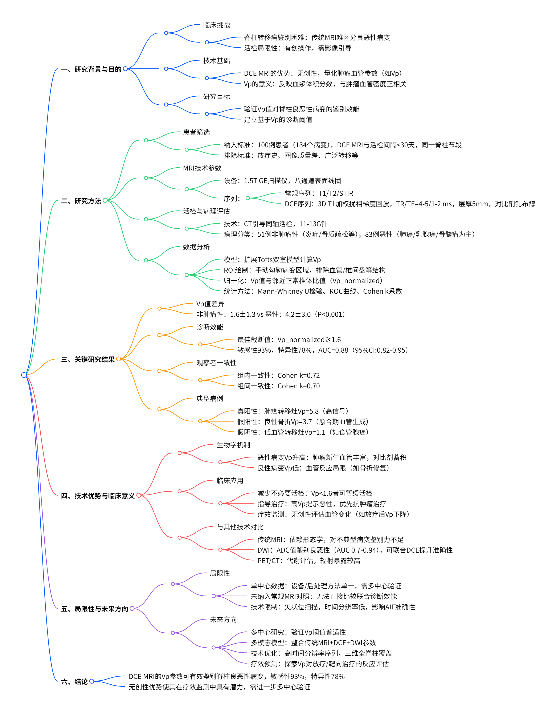

# T1 加权动态对比增强 MRI 鉴别脊柱良恶性椎体病变

    
    
<b>图 1：研究概述 </b>

## 一、研究背景与临床挑战

### （一）脊柱病变的鉴别诊断困境

癌症已成为全球重大公共卫生负担，据预测，全球新发癌症病例将从 2008 年的 1270 万例增至 2030 年的 2220 万例\[1]。骨骼是癌症第三大常见转移部位，而脊柱又是骨转移的最常见部位\[2-4]。脊柱转移灶可导致椎体病理性骨折、疼痛及神经压迫症状，严重影响患者生活质量\[5-6]。

传统 MRI 虽为脊柱肿瘤检测的首选影像手段，但在癌症患者中常难以区分脊柱转移灶与良性椎体病变（如骨质疏松性骨折、炎症性病变）\[7-8]。尤其当非肿瘤性骨病（如癌症治疗或老龄化导致的骨质疏松）表现复杂时，传统 MRI 的诊断局限性更为突出，常需依赖活检明确诊断\[8]。

### （二）动态对比增强灌注 MRI 的价值

动态对比增强灌注 MRI（DCE MRI）通过量化肿瘤血管参数（如血浆体积分数 $V_p$），为肿瘤诊断及疗效评估提供了新视角。$V_p$ 反映血管内对比剂分布容积，与肿瘤血管密度及通透性密切相关\[9-11]。既往研究表明，DCE MRI 在评估脊柱转移灶放疗反应、鉴别良恶性骨折等方面具有潜力\[9,14-16]，但其在大范围原发癌患者中鉴别脊柱良恶性病变的价值尚未明确。

## 二、研究设计与方法

### （一）研究人群与数据筛选

本研究为回顾性分析，经机构审查委员会批准并豁免患者知情同意，符合 HIPAA 合规要求。通过 institutional radiology database 检索 2015 年 5 月至 2018 年 5 月期间接受 DCE MRI 及脊柱病变活检的患者，纳入标准如下：

**时间窗**：DCE MRI 与活检间隔 < 30 天，确保灌注参数反映活检时病变状态

**检查顺序**：DCE MRI 在活检前完成，避免活检相关改变影响参数

**解剖匹配**：DCE MRI 与活检针对同一脊柱节段

**病理质量**：活检结果经病理学家确认为诊断性标本

排除标准包括：目标椎体既往放疗史、DCE MRI 图像质量差（如心脏 / 主动脉血流伪影）、非诊断性活检、广泛脊柱转移或椎体成形术史。

### （二）患者及病变特征

**患者队列**：最终纳入 100 例患者（平均年龄 65±11 岁，52 男），共分析 134 个脊柱病变（颈椎至骶椎）。其中，51 个（38.1%）为非肿瘤性病变，83 个（61.9%）为恶性病变。

**非肿瘤性病变类型**：包括急性炎症、骨质疏松、骨折重塑、治疗相关坏死等，部分非特异性病变需至少 6 个月影像随访稳定\[病理标准]。

**恶性病变原发癌**：肺癌（24.0%）、乳腺癌（11.9%）、多发性骨髓瘤（11.9%）为前三位，涵盖实体瘤与血液系统恶性肿瘤。

### （三）MRI 技术参数

#### 1. 设备与线圈

扫描仪：1.5T GE Healthcare MRI 设备

线圈：八通道颈胸腰表面线圈

#### 2. 常规 MRI 序列

| 序列       | 视野（cm） | 层厚（mm） | 重复时间（ms）  | 翻转角（°） |
| -------- | ------ | ------ | --------- | ------ |
| 矢状位 T1   | 32-36  | 3      | 400-650   | 90     |
| 矢状位 T2   | 32-36  | 3      | 3500-4000 | 90     |
| 矢状位 STIR | 32-36  | 3      | 3500-6000 | 90     |

#### 3. DCE MRI 序列

**序列类型**：三维 T1 加权快速扰相梯度回波（3D FSPGR）

**参数**：TR/TE=4-5/1-2 ms，层厚 5 mm，翻转角 25°，视野 32 cm，时间分辨率 5.26 秒，采集 10-12 幅矢状位图像，序列持续时间 300 秒。

**对比剂**：钆布醇（Gadobutrol），剂量 0.1 mmol/kg，注射速率 2-3 mL/s。

**后处理序列**：DCE 后行矢状位及轴位 T1 增强扫描。

### （四）活检与病理评估

**技术**：CT 引导下同轴活检技术，使用 11-13G 骨活检针（Madison Perforating Bone Biopsy System），由细胞学家现场评估标本充足性。

**非肿瘤性病变纳入标准**：

活检明确诊断（如急性炎症、骨折重塑）；

非特异性病变需至少 6 个月 CT/MRI 随访稳定。

### （五）数据分析与量化

#### 1. 图像后处理

**软件**：NordicIce 2.3（FDA 批准），由研究者（Y.G.）与资深神经放射学家（A.H.）独立分析。

**预处理**：背景噪声去除、时空平滑、自动检测主动脉动脉输入函数（AIF），手动验证 AIF 曲线（要求信号快速上升、尖峰、低时间噪声）。

#### 2. 药代动力学模型

**模型**：扩展 Tofts 双室模型，假设对比剂分布于血管内（血浆）与血管外细胞外间隙（EES）。

**参数计算**：$V_p$ 定义为血管内对比剂分布容积分数，通过病变 ROI 与邻近正常椎体 ROI 的$V_p$比值进行归一化（$V_p^{\text{normalized}} = V_p^{\text{lesion}} / V_p^{\text{normal}}$）。

    
    
<b>图 2：定量DCE参数图 </b>

#### 3. ROI 绘制原则

**范围**：手动勾勒病变 ROI，涵盖椎体、椎板、棘突及椎旁软组织，排除静脉结构、血管瘤、椎间盘、皮质骨及退行性改变。

**多层面处理**：跨越多层面的病变，取各层面 ROI 参数平均值作为最终值。

**观察者一致性**：

**组内一致性**：研究者（Y.G.）间隔一定时间重复测量；

**组间一致性**：研究者（Y.G.）与资深放射学家（A.H.）独立测量。

### （六）统计方法

**组间比较**：Mann-Whitney U 检验（$P<0.05$ 为显著）。

**诊断效能**：ROC 曲线分析，计算 Youden 指数确定最佳截断值，评估敏感性、特异性、曲线下面积（AUC）。

**一致性评估**：Cohen k 系数（Cohen k > 0.7 为高度一致）。

## 三、关键研究结果

### （一）$V_p$ 值的组间差异

**非肿瘤性病变**：$V_p^{\text{normalized}}$ 均值 1.6±1.3；

**恶性病变**：$V_p^{\text{normalized}}$ 均值 4.2±3.0；

**统计学意义**：两组差异显著（$P<0.001$），恶性病变$V_p$ 约为非肿瘤性病变的 2.6 倍。

    
    
<b>图 3：定量DCE参数组间差异 </b>

### （二）ROC 曲线与诊断效能

**最佳截断值**：$V_p^{\text{normalized}} = 1.6$（Youden 指数 0.71）；

**敏感性**：93%（77/83，95%CI:85%-97%）；

**特异性**：78%（40/51，95%CI:65%-89%）；

**AUC**：0.88（95%CI:0.82-0.95）。

### （三）观察者一致性

**组内一致性**：Cohen k=0.72（高度一致）；

**组间一致性**：Cohen k=0.70（高度一致）。

### （四）典型病例与特殊表现

#### 1. 真阳性与真阴性病例

**恶性病变**：肺癌转移灶在$V_p$ 图上表现为显著高信号（$V_p=5.8$），与 T1 低信号病变区域吻合；

**非肿瘤性病变**：骨质疏松性骨折$V_p$ 接近正常椎体（$V_p=0.9$），无明显对比剂摄取。

#### 2. 假阳性与假阴性病例

**假阳性（11 例）**：部分良性骨折因愈合期炎症及血管生成导致$V_p$ 升高（如$V_p=3.7$），需结合临床及随访排除恶性；

**假阴性（6 例）**：低血管转移性病变（如部分食管腺癌转移灶）$V_p$ 低于截断值（$V_p=1.1$），可能与肿瘤血管稀少有关。

## 四、技术优势与临床意义

### （一）$V_p$ 的生物学基础

恶性病变$V_p$ 升高的机制与肿瘤新生血管密切相关。肿瘤通过多种途径诱导血管生成（如 VEGF 通路），形成异常血管网络，导致对比剂在血管内蓄积，从而在 DCE MRI 上表现为$V_p$ 升高\[17]。相比之下，非肿瘤性病变（如骨折、炎症）的血管反应局限，$V_p$ 接近正常组织。

### （二）DCE MRI 的临床价值

**减少不必要活检**：对$V_p$ 低于截断值的病变，可谨慎评估后暂缓活检，避免有创操作；

**指导治疗决策**：高$V_p$ 提示恶性可能，需优先考虑抗肿瘤治疗（如放疗、化疗）；

**疗效监测潜力**：DCE MRI 的无创性使其可重复评估肿瘤血管变化，监测治疗反应（如放疗后$V_p$ 下降）\[9-11]。

### （三）与其他影像技术的对比

**传统 MRI**：依赖形态学特征，对不典型病变鉴别力有限；

**扩散加权成像（DWI）**：通过表观扩散系数（ADC）鉴别良恶性，AUC 约 0.7-0.94\[19-20]，但本研究未纳入 DWI 数据，未来可探索多模态 MRI 联合应用；

**PET/CT**：基于代谢活性鉴别肿瘤，但辐射暴露较高，且对小病灶敏感性有限。

## 五、研究局限性与未来方向

### （一）局限性

**单中心偏差**：数据来自单一机构、单一设备，需多中心研究验证$V_p$ 截断值的普适性；

**未纳入常规 MRI 对照**：无法直接比较 DCE MRI 与传统 MRI 的诊断效能，需后续研究探索联合应用价值；

**特殊病例样本量小**：3 例同时存在良恶性病变的患者未行亚组分析，需扩大样本量探讨集群效应；

**技术限制**：DCE MRI 仅行矢状位扫描，可能遗漏轴位更清晰的病变；时间分辨率较低，影响动脉输入函数精确性。

### （二）未来研究方向

**多中心验证**：评估不同设备、后处理方法对$V_p$ 量化的影响；

**联合诊断模型**：整合传统 MRI（如 T1/T2 信号、增强模式）与 DCE 参数，构建多维度鉴别模型；

**疗效预测研究**：探索$V_p$ 在预测脊柱转移灶放疗 / 靶向治疗反应中的价值；

**技术优化**：开发高时间分辨率序列，实现三维全脊柱覆盖，提升小病灶检测能力。

## 六、专家点评与总结

### （一）临床实践启示

本研究证实，DCE MRI 的$V_p$ 参数在鉴别脊柱良恶性病变中具有高敏感性与特异性，尤其对肺癌、乳腺癌等常见转移癌效果显著。尽管存在假阳性（如近期骨折）与假阴性（如低血管肿瘤）情况，结合临床病史、影像随访及多模态成像可进一步提升诊断准确性。

### （二）影像技术革新意义

DCE MRI 通过量化肿瘤血管特征，为脊柱病变的精准诊断提供了新工具。其无创性、可重复性优势，使其在肿瘤疗效监测中具有广阔应用前景。未来需通过技术创新与多学科协作，推动 DCE MRI 从科研向临床常规应用转化。

## 参考文献

**引用本文**：Guan Y, Peck KK, Lyo J, et al. T1-weighted dynamic contrast-enhanced MRI to differentiate nonneoplastic and malignant vertebral body lesions in the spine. Radiology. 2020;297(2):382-389. DOI:10.1148/radiol.2020190553.

\[1] Bray F, Ferlay J, Soerjomataram I, Siegel RL, Torre LA, Jemal A. Global cancer statistics 2018: GLOBOCAN estimates of incidence and mortality worldwide for 36 cancers in 185 countries. CA Cancer J Clin. 2018;68(6):394 - 424. DOI:10.3322/caac.21492.

\[2] Coleman RE. Metastatic bone disease: clinical features, pathophysiology and treatment strategies. Cancer Treat Rev. 2001;27(3):165 - 176. DOI:10.1053/ctrv.2001.0237.

\[3] Gupta R, Singh S, Nair S, et al. Metastatic spine disease: a review. Arch Orthop Trauma Surg. 2018;138(10):1389 - 1405. DOI:10.1007/s00402 - 018 - 3007 - 5.

\[4] Sundaram M, McGuire MH. Imaging of metastatic disease to bone. Semin Roentgenol. 1990;25(3):220 - 232. DOI:10.1053/sult.1990.10304.

\[5] Li J, Li X, Zhang J, et al. A comprehensive overview of spinal metastases: epidemiology, pathogenesis, diagnosis, and multidisciplinary treatment. J Oncol. 2018;2018:3167349. DOI:10.1155/2018/3167349.

\[6] Mendel E, Quinones - Hinojosa A, Gokaslan ZL. Spinal metastases. Neurosurg Clin N Am. 2004;15(1):1 - 15, vii. DOI:10.1016/j.nec.2003.09.005.

\[7] Jee WH, Choe BY, Kang HS, et al. Vertebral osteomyelitis: characteristic findings on contrast - enhanced fat - suppressed MR images. AJR Am J Roentgenol. 2000;174(3):739 - 743. DOI:10.2214/ajr.174.3.1740739.

\[8] Lin J, Kim D, El - Khoueiry AB, et al. Differentiating metastatic from non - metastatic vertebral body lesions in cancer patients: a comparison of apparent diffusion coefficient, quantitative T1 - weighted dynamic contrast - enhanced magnetic resonance imaging, and 18F - fluorodeoxyglucose positron emission tomography/magnetic resonance imaging. Invest Radiol. 2016;51(9):535 - 543. DOI:10.1097/RLI.0000000000000264.

\[9] Mawlawi O, Barrios CH, Mohamed F, et al. Dynamic contrast - enhanced MRI for evaluating the response of spinal metastases to radiation therapy. AJR Am J Roentgenol. 2005;184(4):1258 - 1263. DOI:10.2214/ajr.184.4.01841258.

\[10] Padhani AR, Liu G, Koh DM, et al. Dynamic contrast - enhanced magnetic resonance imaging as a biomarker in oncology - consensus and recommendations. Neoplasia. 2009;11(2):102 - 125. DOI:10.1593/neo.08854.

\[11] Padhani AR, Chenevert TL, Collins DJ, et al. Dynamic contrast - enhanced magnetic resonance imaging and diffusion - weighted magnetic resonance imaging as biomarkers for response prediction and evaluation of cancer treatment. Eur Urol. 2010;57(2):191 - 205. DOI:10.1016/j.eururo.2009.09.016.

\[14] Kim HJ, Hong SH, Park JH, et al. Differentiation of acute osteoporotic from metastatic vertebral compression fractures using dynamic contrast - enhanced MR imaging. AJR Am J Roentgenol. 2007;189(3):654 - 660. DOI:10.2214/ajr.06.0599.

\[15] Kato H, Yoshikawa T, Okumura A, et al. Dynamic contrast - enhanced MRI for the differentiation of malignant from benign vertebral compression fractures. AJR Am J Roentgenol. 2002;179(3):707 - 712. DOI:10.2214/ajr.179.3.1790707.

\[16] Wang ZJ, Yu JS, Li J, et al. Differentiating benign from pathologic vertebral compression fractures with contrast - enhanced MRI: value of relative enhancement ratio. AJR Am J Roentgenol. 2000;174(3):733 - 738. DOI:10.2214/ajr.174.3.1740733.

\[17] Folkman J. Tumor angiogenesis: therapeutic implications. N Engl J Med. 1971;285(21):1182 - 1186. DOI:10.1056/NEJM197111182852108.

\[19] Kim MJ, Kim HJ, Park JH, et al. Differentiation of acute osteoporotic from metastatic vertebral compression fractures using diffusion - weighted imaging: initial experience. Radiology. 2006;239(1):194 - 200. DOI:10.1148/radiol.2391050584.

\[20] Kim HJ, Kim MJ, Choi JY, et al. Differentiation of acute osteoporotic from metastatic vertebral compression fractures using apparent diffusion coefficient: diagnostic performance and optimal ADC cut - off value. AJR Am J Roentgenol. 2008;190(1):128 - 135. DOI:10.2214/ajr.07.2373.