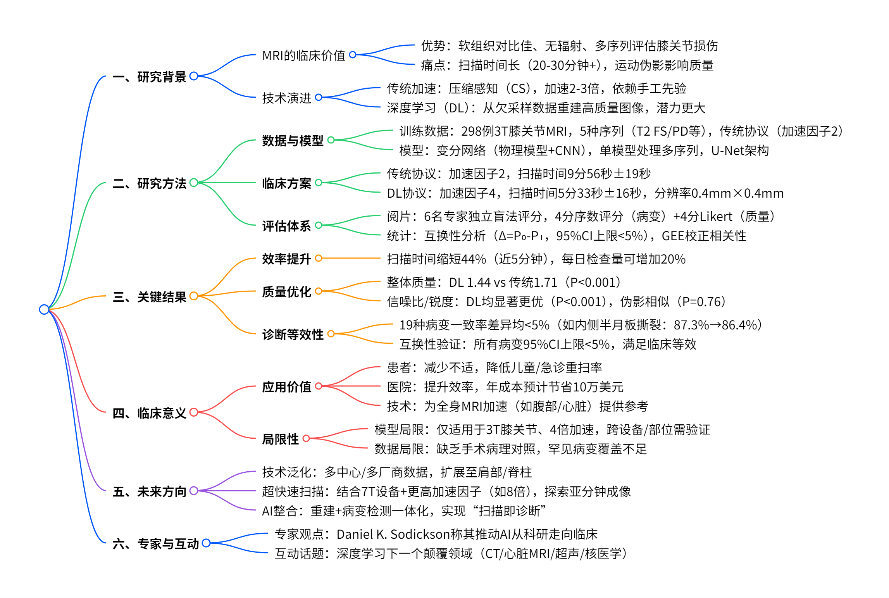
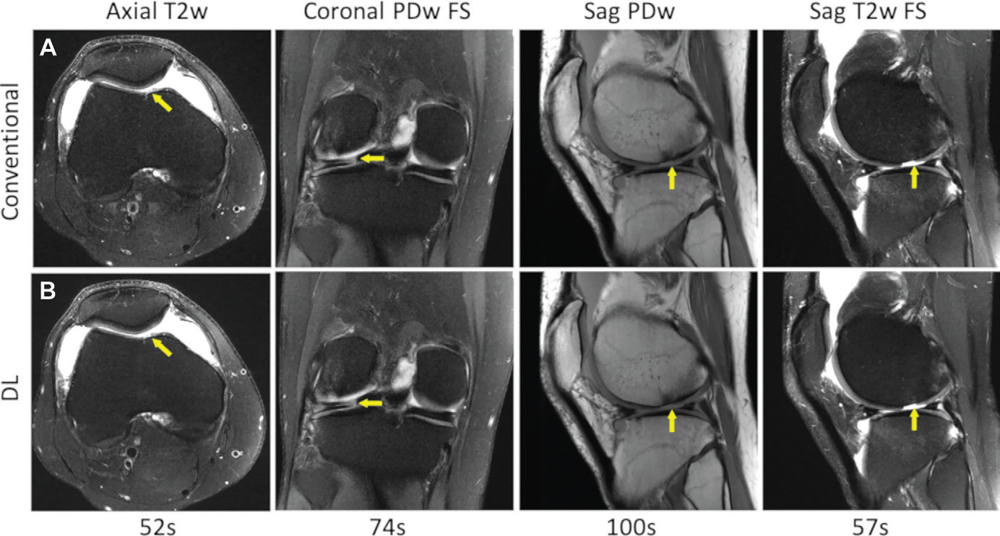
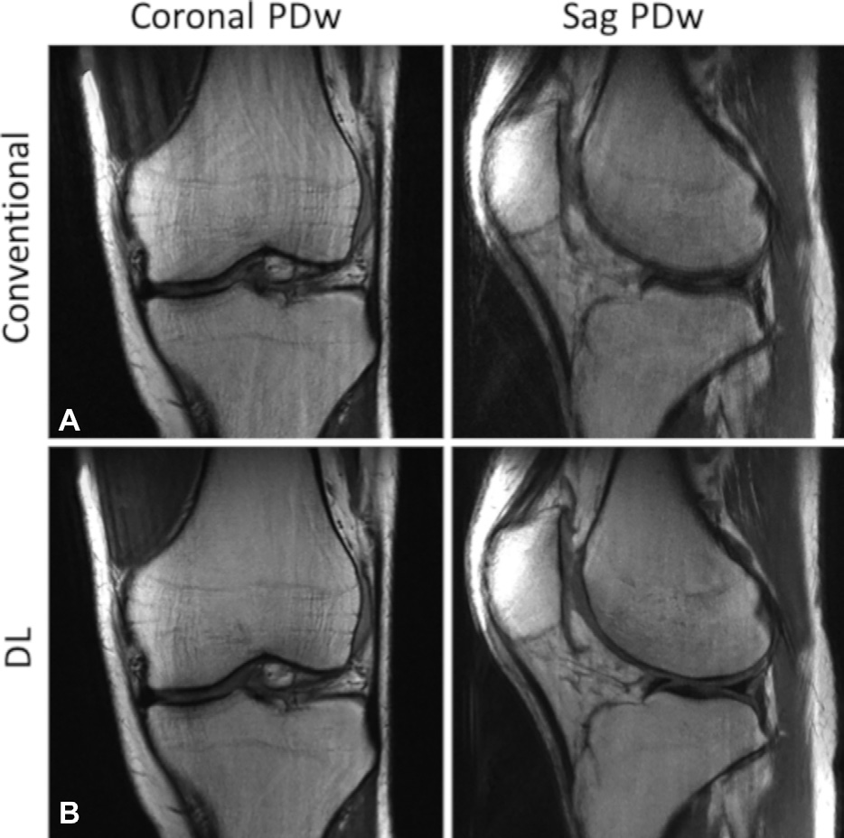

# 《深度学习助力膝关节 MRI：速度、质量与诊断的三重突破》

## 一、临床痛点：MRI 扫描时间长，效率与体验双挑战

    
    
<b>图 1：研究概述 </b>

MRI 凭借出色的软组织对比度和无电离辐射特性，成为膝关节疾病诊断的 "金标准"。从半月板撕裂到韧带损伤，从软骨磨损到骨髓病变，MRI 能清晰显示膝关节内部结构的细微异常。然而，传统 MRI 扫描往往需要 20-30 分钟甚至更长时间。

漫长的扫描时间带来双重挑战：对患者而言，保持静止姿势可能引发不适，尤其对急诊患者、儿童或关节急性疼痛者，配合度下降易导致运动伪影，影响图像质量；对医院而言，检查效率低下不仅增加患者等待时间，还限制了设备的临床 throughput。因此，缩短扫描时间、提升成像效率，成为影像学领域亟待突破的关键问题。

## 二、技术突破：深度学习如何加速 MRI？

### （一）核心原理：从压缩感知到深度学习

#### 1. 压缩感知（CS）的局限性

2000 年代末兴起的压缩感知技术，通过欠采样 k 空间数据并利用稀疏性约束重建图像，将扫描时间缩短 2-3 倍。但其依赖手工设计的稀疏先验（如小波变换），在复杂解剖结构（如膝关节软骨纹理）中重建质量有限，图像易出现噪声或模糊。

#### 2. 深度学习（DL）的革新

深度学习通过神经网络从数万例临床数据中自动学习图像特征，突破了手工先验的局限。本研究采用**变分网络（Variational Network）**，将物理模型与深度学习结合：

**正向过程**：模拟 MRI 信号采集，对 k 空间数据进行 4 倍欠采样

**反向重建**：通过卷积神经网络（CNN）学习图像先验，迭代优化求解逆问题

**端到端训练**：直接从欠采样数据生成高质量图像，无需中间参数调整

这种 "数据驱动 + 物理约束" 的模式，既保留了传统压缩感知的数学严谨性，又通过深度学习提升了复杂结构的重建能力。

### （二）关键技术细节

#### 1. 训练数据与模型构建

**数据来源**：纳入 2019 年 2-3 月间 298 例临床 3T 膝关节 MRI 数据（西门子 MAGNETOM Skyra/Biograph mMR 设备），包含 5 种标准序列：

轴位 T2 脂肪抑制（Ax T2 FS）

冠状位质子密度加权（Cor PD）及脂肪抑制（Cor PD FS）

矢状位质子密度加权（Sag PD）及 T2 脂肪抑制（Sag T2 FS）

**数据处理**：传统协议采用 2 倍加速（GRAPPA 并行成像），作为 "伪全采样" 数据训练模型

**网络架构**：单模型处理所有序列，包含 U-Net 风格的编解码结构，结合复数域卷积处理多线圈数据（见图 S1，原文补充材料）

#### 2. 前瞻性临床方案设计

| 参数        | 传统协议           | DL 协议          |
| --------- | -------------- | -------------- |
| 加速因子      | 2 倍            | 4 倍            |
| 扫描时间（平均）  | 9 分 56 秒 ±19 秒 | 5 分 33 秒 ±16 秒 |
| 空间分辨率     | 0.4mm×0.4mm    | 0.4mm×0.4mm    |
| 层厚        | 3mm            | 3mm            |
| k 空间中心采样数 | 30-34 条校准线     | 18-22 条校准线     |

#### 3. 临床评估体系

**阅片团队**：6 名资深肌肉骨骼放射科医生（2-20 年亚专科经验），独立盲法阅片

**评分标准**：

**病变检测**：4 分序数评分（1 = 肯定无，2 = 可能无，3 = 可能有，4 = 肯定有），重点评估 19 种病变（如半月板撕裂、前交叉韧带损伤等）

**图像质量**：4 分 Likert 量表，评估整体质量、伪影、锐度、信噪比

**统计方法**：

**互换性分析**：比较传统与 DL 协议的读者一致率差异，要求 95% CI 上限＜5%（等效性标准）

**广义估计方程（GEE）**：校正同一患者多读者数据的相关性，检验组间差异

## 三、临床结果：速度、质量、诊断三赢

### （一）扫描效率提升近 50%

DL 协议将单例扫描时间从传统的 9 分 56 秒缩短至 5 分 33 秒，节省 4 分 23 秒（44% 时间 reduction）。按每日 10 例检查计算，可新增 4-5 例检查，显著提升科室效率。

### （二）图像质量全面优化

| 指标     | 传统协议      | DL 协议     | P 值    |
| ------ | --------- | --------- | ------ |
| 整体质量评分 | 1.71±0.43 | 1.44±0.38 | ＜0.001 |
| 信噪比评分  | 1.70±0.51 | 1.29±0.42 | ＜0.001 |
| 锐度评分   | 1.60±0.45 | 1.48±0.41 | ＜0.001 |
| 伪影评分   | 2.10±0.68 | 2.11±0.69 | 0.76   |

**典型案例**：

**图 2**：26 岁男性，外侧半月板撕裂 + 软骨损伤，DL 与传统协议均清晰显示病变（黄色箭头）

    
    
<b>图 2：病变显示 </b>

**图 3**：30 岁男性，传统协议因扫描时间长出现运动伪影（ ghosting），DL 协议伪影更少（评分 3.3 vs 2.8）

    
    
<b>图 3：伪影评估 </b>

### （三）诊断等效性验证

对 170 例患者的 19 种病变分析显示：

**一致性结果**：所有病变的传统与 DL 协议读者一致率差异均＜5%，达到临床互换性标准。例如：

内侧半月板撕裂：传统组 87.3% vs DL 组 86.4%（Δ=0.9%）

前交叉韧带撕裂：传统组 95.8% vs DL 组 94.9%（Δ=0.9%）

**阴性结果**：未发现任何病变类型在 DL 协议中出现显著漏诊或误诊

### （四）经济效益与患者体验

**成本降低**：扫描时间缩短可减少技师操作时间、降低设备能耗，按单台设备年运行成本计算，预计每年节省约 10 万美元

**患者体验**：5 分钟扫描更易耐受，尤其对焦虑患者或需多次复查者，可减少因配合不佳导致的重扫率

## 四、临床意义与未来展望

### （一）当前应用价值

**急诊与特殊人群**：为膝关节急性损伤患者（如运动创伤）提供快速诊断，缩短术前等待时间

**儿科成像**：减少儿童镇静需求，降低麻醉风险

**体检筛查**：加速膝关节退行性病变（如骨关节炎）的大规模筛查流程

### （二）技术局限性

**模型特异性**：仅适用于 3T 膝关节 MRI、4 倍加速场景，对其他场强（如 1.5T）或部位（如肩部、脊柱）需重新训练

**数据偏差**：训练集以常见病变（如半月板撕裂）为主，对罕见病变（如膝关节肿瘤）重建效果未知

**设备依赖性**：基于西门子设备数据训练，跨厂商（如 GE、飞利浦）兼容性需进一步验证

### （三）未来研究方向

**多中心泛化**：联合全球多家医院构建跨设备数据集，开发 "通用型"DL 重建模型

**超快速扫描**：结合并行成像（如 7T MRI）与更高加速因子（如 8 倍），探索亚分钟级扫描可行性

**AI 全链条整合**：将重建算法与病变检测 AI（如 DeepMind 膝关节分析模型）结合，实现 "扫描 - 重建 - 诊断" 一体化 workflow

## 五、专家解读：从实验室到临床的跨越

"过去五年，深度学习在 MRI 重建领域的研究多基于回顾性数据模拟加速，而本研究首次通过前瞻性临床实验证明：AI 不仅能缩短扫描时间，还能通过减少运动伪影提升图像质量。这标志着 AI 从 ' 概念验证 ' 迈向 ' 临床实用 ' 的关键一步。"—— Daniel K. Sodickson, MD, PhD（纽约大学放射科教授）

**潜在风险提示**：尽管本研究未发现 DL 协议的显著劣势，但临床应用中仍需结合医生经验，避免过度依赖 AI 导致的漏诊。

## 参考文献
1. Johnson PM, et al. Radiology 2023; DOI:10.1148/radiol.220425

## 技术指导

### 统计分析

本文涉及关键统计技术分析——可交换性测试（广义估计方程GEE），如果你有该技术的疑问，请留言或者加作者微信，可提供技术指导。

### 关注点赞

请关注公众号“NMR凯米小屋”，作者B站：“楚山之石”。如果有合作意向，请加作者微信(Chushanzhishi2022)。