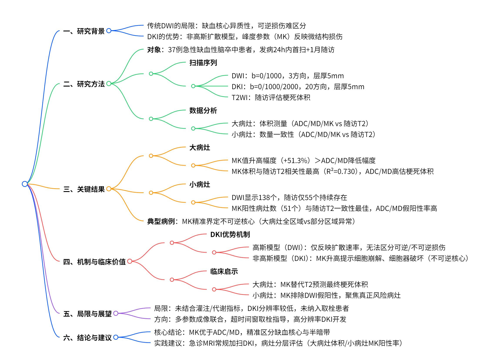
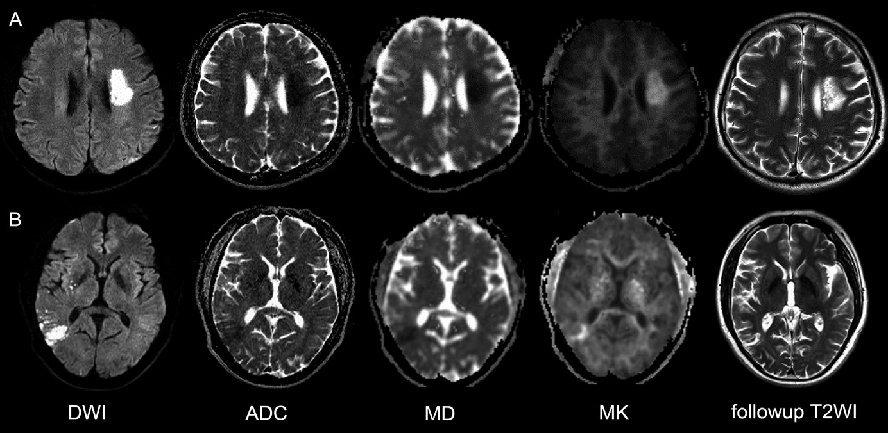
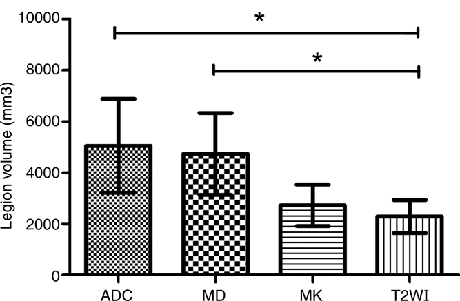

# DKI 在急性脑梗死中的应用：优于传统 DWI，助力精准预后预测

## 一、研究背景与临床挑战

    
    
<b>图 1：研究概述 </b>

### （一）急性缺血性脑卒中的影像学评估现状

急性缺血性脑卒中的精准影像学评估对治疗决策至关重要。目前，扩散加权成像（DWI）是评估急性缺血核心的常用方法，其通过测量水分子的扩散系数（ADC 值）来识别缺血损伤。然而，越来越多的研究表明，DWI 所示的 “缺血核心” 存在异质性，部分区域可能存在可逆性损伤，尤其是在早期血管再通后，部分 DWI 高信号区域可恢复正常，提示 DWI 对不可逆损伤的特异性不足。

### （二）DKI 的技术优势与理论基础

常规 DWI 假设水分子呈高斯扩散，但在真实生物组织中，水分子扩散受细胞膜、细胞器等阻碍，呈现非高斯特性。扩散峰度成像（DKI）通过引入峰度（kurtosis）参数，量化扩散偏离高斯分布的程度，能够更敏感地反映组织微结构的复杂性和损伤程度。理论上，DKI 可区分 DWI 病变中不可逆损伤的核心区域（峰度异常区域）和潜在可挽救的半暗带区域（仅扩散系数异常而峰度正常区域）。

## 二、研究设计与方法

### （一）研究对象与入组标准

**患者特征**：前瞻性纳入 2015 年 7 月至 2017 年 1 月期间 37 例急性缺血性脑卒中患者（平均年龄 58 岁，男 28 例 / 女 9 例）。

**入组标准**：

年龄≥20 岁，症状发作时间明确；

发病 24 小时内完成首次 MRI 检查，1 个月后完成随访 MRI；

排除溶栓治疗、MRI 禁忌证、慢性卒中或合并其他脑部疾病者。

### （二）MRI 扫描协议

**设备**：3.0T 西门子 Trio MRI，8 通道头线圈。

**序列参数**：

**DWI**：单激发回波平面成像（SE-EPI），b 值 = 0、1000 s/mm²，3 个扩散方向，层厚 5mm，矩阵 180×180，扫描时间 1 分 06 秒。

**DKI**：多带宽扩散回波平面成像（MB-EPI），b 值 = 0、1000、2000 s/mm²，20 个扩散方向，层厚 5mm，矩阵 146×146，扫描时间 2 分 10 秒。

**T2 加权成像**：用于随访评估，层厚 5mm，矩阵 320×320，扫描时间 1 分 02 秒。

### （三）数据分析与参数计算

**图像预处理**：

DKI 数据转换为 NIfTI 格式，使用 FSL 软件进行运动校正、涡流校正和高斯平滑。

计算 ADC 图（基于 DWI）、平均扩散系数（MD）图和平均峰度（MK）图（基于 DKI）。

**病灶分类与测量**：

**大病灶（直径≥1cm）**：手动勾勒每个层面的病灶轮廓，计算体积（面积 × 层厚 + 间隔），比较急性 ADC/MD/MK 图与随访 T2 加权图的体积相关性。

**小病灶（直径 < 1cm）**：计数急性 ADC/MD/MK 图与随访 T2 加权图的病灶数量，评估一致性。

**统计方法**：

正态性检验：Shapiro-Wilk 检验。

组间比较：配对 t 检验（大病灶参数值）、McNemar 检验（小病灶数量一致性）。

相关性分析：Spearman 相关系数（大病灶体积相关性）。

## 三、关键研究结果

### （一）大病灶：体积相关性与转归预测

**参数值对比**：

急性缺血病灶的 ADC 和 MD 值显著低于对侧正常脑组织（ADC：-42.9%，MD：-37.8%，均 P<0.001），而 MK 值显著升高（+51.3%，P<0.001）。

    
    
<b>图 2：代表性图片 </b>

MK 的相对变化幅度显著大于 ADC 和 MD（Z=-3.653/-3.378，P<0.05），提示 MK 对组织损伤更敏感。

**体积相关性分析**：

**随访 T2 加权图作为金标准**：急性 MK 图的病灶体积（1946.8±3327.0 mm³）与随访 T2 体积（1804.2±3069.8 mm³）无显著差异（P=0.532），而 ADC 图（3376.7±4536.8 mm³）和 MD 图（3606.2±4180.7 mm³）体积均显著大于随访 T2（P=0.007）。

**相关系数对比**：MK 图与随访 T2 的相关性最高（R²=0.730），显著优于 ADC（R²=0.479）和 MD（R²=0.429）。

    
    
<b>图 2：病灶体积对比分析 </b>

### （二）小病灶：数量一致性与可逆性评估

**急性病灶数量**：DWI 显示 138 个小病灶，其中 ADC 图 115 个，MD 图 106 个，MK 图 51 个。

**随访结果**：1 个月后 T2 加权图仅 55 个小病灶持续存在。

**一致性分析**：

MK 图与随访 T2 的病灶数量一致性良好（P=0.125，无显著差异）。

ADC 图和 MD 图的病灶数量显著多于随访 T2（P<0.001），提示大量小病灶在随访中逆转，而 MK 阳性病灶更可能为不可逆损伤。

### （三）典型病例分析

**病例 A（大病灶）**：43 岁男性，右侧肢体无力 12 小时，DWI 与 MK 图显示左侧放射冠区病灶体积一致，随访 T2 显示病灶体积与急性期 MK 图吻合，提示不可逆损伤。

**病例 B（大病灶）**：53 岁男性，头晕呕吐 12 小时，DWI 显示右侧颞叶病灶，但 MK 图仅部分区域高信号，随访 T2 显示病灶体积与 MK 图一致，提示 DWI 所示病灶中仅 MK 阳性区域为最终梗死核心。

## 四、讨论：DKI 的临床价值与机制解析

### （一）DKI 为何优于传统 DWI？

**非高斯扩散的生物学意义**：

高斯扩散模型（DWI/ADC）仅反映平均扩散速率，无法区分细胞毒性水肿（可逆）与组织结构破坏（不可逆）。

峰度（MK）反映扩散异质性，其升高提示细胞崩解、细胞器破坏等严重微结构损伤，与不可逆梗死核心高度吻合。

**实验与临床证据支持**：

动物研究表明，DKI 可区分缺血核心（MK 异常）与半暗带（仅 MD 异常），后者在再通后可恢复。

本研究中，MK 图与随访 T2 的高相关性（R²=0.730）证实其对最终梗死体积的预测能力优于 DWI。

### （二）小病灶的临床启示

**DWI 的过度诊断问题**：小病灶在 DWI 中常见，但多数（138→55）在随访中消失，提示 DWI 对小缺血灶的特异性不足。

**MK 的筛选价值**：MK 阳性的小病灶更可能进展为永久性梗死，可作为早期干预的靶点。

### （三）局限性与未来方向

**本研究局限**：

未纳入灌注成像或代谢指标（如 pH、氧代谢），无法全面评估组织存活状态。

DKI 空间分辨率略低于 DWI（1.6×1.6 vs. 1.2×1.2 mm²），可能影响小病灶检测。

未涉及血管内治疗患者，结论对再通人群的适用性需验证。

**未来研究方向**：

联合多参数成像（如灌注 - DKI-PET），构建更精准的缺血核心评估模型。

探索 DKI 在指导超时间窗取栓中的价值，优化患者筛选。

开发更高分辨率的 DKI 序列，提升小病灶和深部核团的评估能力。

## 五、结论与临床展望

### （一）核心结论

对于大病灶，DKI 的峰度参数（MK）与 1 个月后梗死体积的相关性显著优于传统 DWI/ADC，能更准确界定不可逆缺血核心。

对于小病灶，DKI 可减少 DWI 的假阳性结果，仅 MK 阳性病灶提示真正的梗死风险。

**临床意义**：DKI 可作为 DWI 的补充工具，提高急性脑卒中预后预测的准确性，尤其适用于需精准评估缺血核心的患者（如血管内治疗候选者）。

### （二）实践建议

**常规 DWI+DKI 联合扫描**：在急性脑卒中急诊 MRI 中增加 DKI 序列（扫描时间仅增加约 2 分钟），获取 MK 参数。

**病灶分层评估**：对大病灶关注体积相关性，对小病灶关注 MK 阳性率，结合临床制定个体化治疗方案。

## 六、参考文献（滑动查看）

\[1] Yin J, Sun H, Wang Z, et al. Diffusion kurtosis imaging of acute infarction: comparison with routine diffusion and follow-up MR imaging. Radiology. 2018;287(2):651-657.
\[2] Jensen JH, Helpern JA. MRI quantification of non-Gaussian water diffusion by kurtosis analysis. NMR Biomed. 2010;23(7):698-710.
\[3] Cheung JS, Wang E, Lo EH, Sun PZ. Stratification of heterogeneous diffusion MRI ischemic lesion with kurtosis imaging. Stroke. 2012;43(8):2252-2254.

## 技术指导

### 序列开发

本文涉及中枢神经系统多方向DKI处理，采用了DKE软件，如果你有关于该技术扫描和分析的疑问，请留言或者加作者微信，可提供技术指导。

### 后处理代码及指导

如果你有相关数据，需要数据后处理服务，后处理代码或者技术指导，请加作者微信或者参考。

### 关注点赞

请关注公众号“NMR凯米小屋”，作者B站：“楚山之石”。如果有合作意向，请加作者微信(Chushanzhishi2022)。