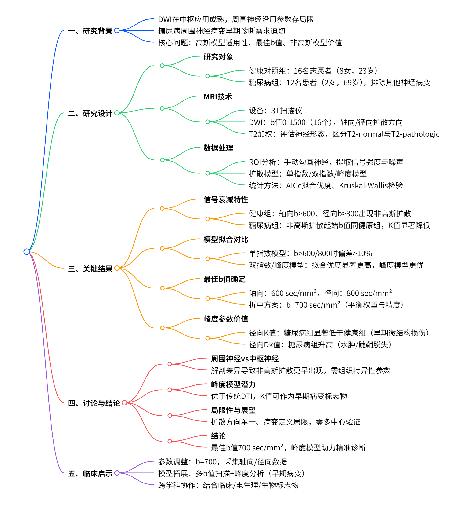
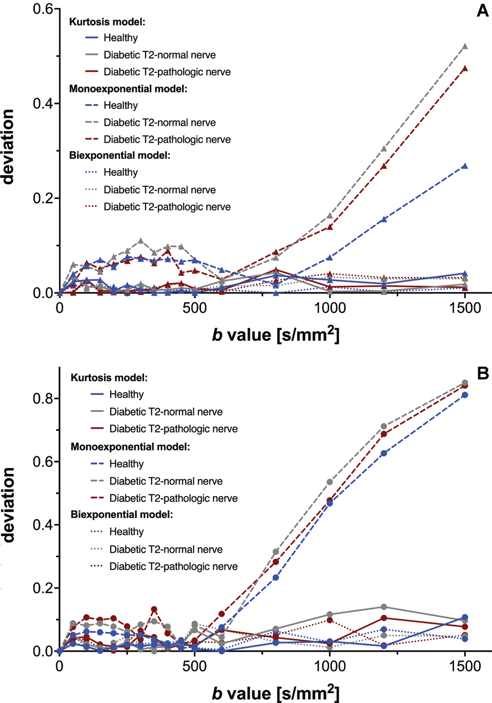
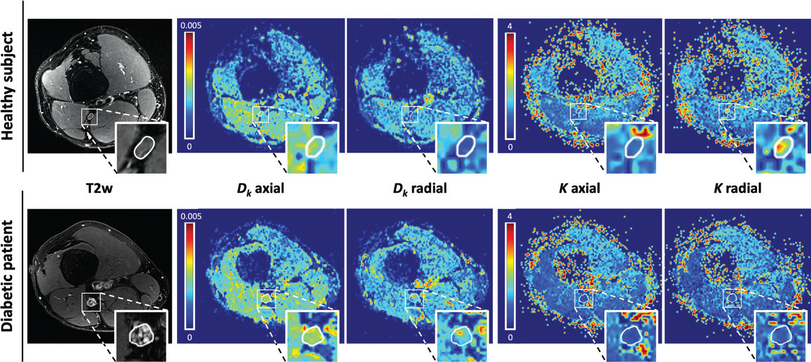

# 周围神经扩散 MRI 新进展：优化 b 值与非高斯扩散的关键作用

## 一、研究背景：突破中枢局限，探索周围神经成像新边界

扩散加权成像（DWI）作为揭示组织微观结构的重要工具，在中枢神经系统（CNS）的应用已十分成熟，例如通过扩散张量成像（DTI）评估神经纤维完整性。然而，当这一技术应用于周围神经系统（PNS）时，却面临着 “水土不服” 的问题 —— 现有序列参数大多直接沿用中枢神经系统的优化方案，忽视了周围神经独特的扩散特性。

在周围神经疾病中，糖尿病周围神经病变（DPN）是常见且严重的并发症，早期诊断对干预治疗至关重要。传统 T2 加权成像虽能显示神经形态改变，但对微观结构变化的敏感性不足。DWI/DTI 的引入为功能成像提供了新视角，但其在周围神经中的最佳技术参数（如 b 值选择）一直缺乏共识，制约了临床应用。

    
    
<b>图 1：研究概述 </b>

### 核心问题：

周围神经扩散信号是否遵循中枢神经系统的高斯扩散模型？

生理与病理状态下，周围神经的最佳 b 值范围如何？

非高斯扩散模型（如峰度模型）能否提供更敏感的病变标志物？

## 二、研究设计：多维度解析周围神经扩散特性

### （一）研究对象

**健康对照组**：16 名无神经系统疾病的志愿者（8 女，中位年龄 23 岁）。

**糖尿病组**：12 名 2 型糖尿病患者（2 女，中位年龄 69 岁），均合并不同程度的周围神经病变，排除其他神经病变病因（如神经根压迫）。

### （二）MRI 技术方案（3T 扫描仪）

#### 1. 扩散加权成像（DWI）

**b 值覆盖范围**：0-1500 sec/mm²，共 16 个 b 值（0,50,100,150,200,250,300,350,400,450,500,600,800,1000,1200,1500）。

**扩散方向**：轴向（沿神经长轴）和径向（垂直于神经长轴），模拟神经纤维束的方向性扩散。

**序列参数**：单自旋回波多 b 值序列，保持脉冲宽度（21ms）和扩散时间（62.9ms）恒定，仅调整梯度幅度。

#### 2. 对照成像

**T2 加权序列**：用于神经形态学评估，识别正常（T2-normal）和病变（T2-pathologic）神经区域，由两名阅片者独立评估（Cohen k=0.92，一致性极高）。

### （三）数据处理与模型拟合

**感兴趣区（ROI）分析**：

在 B0 图像上手动勾画坐骨神经胫神经部分，提取各 b 值下的信号强度（SI），同时测量背景噪声（400mm² ROI）。

糖尿病组分别分析 T2-normal 和 T2-pathologic 区域，排除形态学干扰。

**扩散模型**：

**单指数模型**（高斯扩散）：
  
$$
S = S_{0} \cdot e^{-b \cdot D}
$$  
假设水分子自由扩散，参数为表观扩散系数（ADC, \(D\)）。

**双指数模型**（非高斯扩散）：  
$$
S = S_{0} \cdot \left(f \cdot e^{-b \cdot D_{f}} + (1-f) \cdot e^{-b \cdot D_{s}}\right)
$$
区分快扩散（如细胞外间隙）和慢扩散（如细胞内限制），参数为快 / 慢扩散系数（\(D_{f}, D_{s}\)）和快扩散分数（\(f\)）。

**峰度模型**（非高斯扩散）：  
$$
S = S_{0} \cdot e^{-b \cdot D_{k} + \frac{1}{6} \cdot b^{2} \cdot D_{k}^{2} \cdot K}
$$ 
量化扩散非高斯性，参数为峰度扩散系数（\(D_{k}\)）和峰度值（\(K\)，反映扩散异质性）。

**模型评估**：

**拟合优度**：使用校正 Akaike 信息准则（AICc）比较模型，值越低表示拟合越好。

**统计分析**：Kruskal-Wallis 检验比较组间峰度参数差异，Wilcoxon 符号秩检验分析糖尿病组内 T2-normal 与 T2-pathologic 区域差异（P<0.05 为显著）。

## 三、关键结果：非高斯扩散改写周围神经成像规则

### （一）信号衰减特性：非高斯扩散早于预期出现

**健康志愿者**：

轴向扩散方向：b>600 sec/mm² 时，信号衰减偏离单指数模型，呈现平台化趋势，提示非高斯扩散（如纤维束限制效应）。

径向扩散方向：b>800 sec/mm² 时出现显著非高斯扩散，可能与神经束膜的屏障作用有关。

**糖尿病患者**：

无论 T2-normal 还是 T2-pathologic 区域，非高斯扩散起始 b 值与健康组一致，但峰度参数（K）显著降低，提示神经微结构破坏（如髓鞘脱失、轴突丢失）。

### （二）模型拟合对比：峰度模型成为最优选择

**单指数模型的局限**：在轴向 b>600 sec/mm²、径向 b>800 sec/mm² 时，拟合偏差超过 10%，无法准确描述信号衰减。

**双指数与峰度模型的优势**：

两者拟合优度均显著高于单指数模型（AICc 显示 > 99.9% 概率优于单指数）。

峰度模型在 5/6 种条件下（轴向 / 径向、健康 / 病变）更优，因其以更少参数（2 个 vs. 双指数的 3 个）实现更高拟合精度，符合奥卡姆剃刀原则。

    
    
<b>图 2：不同模型拟合偏差与b值的关系 </b>

### （三）最佳 b 值确定：700 sec/mm² 平衡效能与精度

**临床标准 DWI/DTI 的挑战**：传统两点法（如 b=0 和 b=1000）在周围神经中会因非高斯扩散导致参数偏差。

**优化范围**：

轴向扩散：最佳 b 值上限约 600 sec/mm²。

径向扩散：最佳 b 值上限约 800 sec/mm²。

**折中方案**：综合方向差异，建议临床采用 b=700 sec/mm²，既保证足够扩散权重（SNR>7），又将单指数模型偏差控制在 10% 以内。

### （四）峰度参数：微观病变的 “早期预警器”

| 参数        | 健康组       | 糖尿病 T2-normal   | 糖尿病 T2-pathologic | 组间差异（P 值） |
| --------- | --------- | --------------- | ----------------- | --------- |
| **径向 K**  | 1.95      | 1.72（↓12%）      | 1.38（↓29%）        | <0.001    |
| **径向 Dk** | 1.08×10⁻³ | 1.21×10⁻³（↑12%） | 1.35×10⁻³（↑25%）   | 0.002     |
| **轴向 K**  | 0.75      | 0.89（↑19%）      | 0.92（↑23%）        | 0.021     |
| **轴向 Dk** | 2.92×10⁻³ | 2.95×10⁻³（→）    | 3.01×10⁻³（→）      | 0.18      |

**径向扩散的特异性**：K 值反映扩散异质性，健康神经因髓鞘完整、轴突排列紧密，径向 K 值较高；糖尿病神经即使在 T2-normal 区域，K 值已显著下降，提示早期微结构损伤。

**Dk 值的意义**：径向 Dk 升高可能与细胞外间隙扩大（如水肿）或髓鞘脱失导致的扩散限制减少有关，而轴向 Dk 无显著差异，可能与轴突丢失与代偿性重塑平衡有关。

    
    
<b>图 3：扩散峰度指标对比 </b>

## 四、讨论：从 “一刀切” 到 “量体裁衣” 的范式转变

### （一）周围神经 vs 中枢神经：扩散特性为何不同？

**解剖基础**：

中枢神经：白质纤维束被少突胶质细胞紧密包裹，扩散限制主要来自髓鞘和轴突排列，高斯扩散模型在 b<1000 时有效。

周围神经：由神经束膜分隔的 fascicles 组成，束膜的结缔组织和血管结构更早引入扩散异质性，导致非高斯效应在更低 b 值出现。

**临床启示**：直接沿用中枢神经的 b=1000 参数会高估周围神经的 ADC 值，掩盖早期病变。

### （二）峰度模型的临床潜力

**超越传统 DTI**：传统 ADC/DTI 仅反映平均扩散程度，而峰度 K 值能捕捉微观结构的复杂性（如纤维密度、髓鞘完整性），在糖尿病神经病变中，K 值下降早于形态学改变，可作为早期诊断标志物。

**方向依赖性的价值**：径向 K 值对神经束膜和髓鞘损伤更敏感，轴向 K 值可能与轴突连续性相关，多方向分析可提供更全面的病理信息。

### （三）局限性与未来方向

**扩散方向的简化**：本研究仅采用两个正交方向，未进行全方向 DTI 采集，可能低估纤维交叉等复杂结构的影响。

**病变定义的局限性**：以 T2 高信号作为病变标准，可能遗漏无水肿的代谢性损伤（如轴突运输障碍），需结合电生理或组织活检验证。

**多中心验证**：单中心样本量较小，需进一步验证 b=700 在不同设备和人群中的普适性。

## 五、结论：开启周围神经精准成像新时代

**技术革新**：周围神经 DWI/DTI 的最佳 b 值为**700 sec/mm²**，较中枢神经显著降低，需摆脱 “拿来主义”，建立组织特异性 protocols。

**模型升级**：在高 b 值范围（>800 sec/mm²），峰度模型可提供传统序列无法获取的微结构信息，K 和 Dk 参数有望成为周围神经病变（如糖尿病、肿瘤、炎症）的新型影像标志物。

**临床展望**：未来需整合多参数成像（如 T2、DWI、峰度）和人工智能分析，实现周围神经病变的早期检测、精准分期和疗效监测。

## 六、专家点评：影像学如何更懂周围神经？

作为影像学专家，我们见证了神经成像从 “看结构” 到 “读功能” 的跨越。这一研究揭示了周围神经扩散的独特规律，颠覆了 “b 值越高越好” 的固有认知。对于临床医生，需注意：

**参数调整**：在糖尿病神经病变、腕管综合征等疾病的 DWI 检查中，建议将 b 值上限设为 700，并同时采集轴向 / 径向数据。

**模型拓展**：当怀疑早期或细微病变时，可启用多 b 值扫描（如 0-1500）并进行峰度分析，为临床决策提供更多维度的证据。

**跨学科协作**：影像发现需结合临床症状、电生理结果和生物标志物，才能真正实现精准诊断。

## 七、参考文献（滑动查看）

\[1] Foesleitner O, et al. Radiology 2022; 302:153-161.

## 技术指导

### 序列开发

本文涉及DKI处理，如果你有关于该技术扫描和分析的疑问，请留言或者加作者微信，可提供技术指导。

### 后处理代码及指导

如果你有相关数据，需要数据后处理服务，后处理代码或者技术指导，请加作者微信或者参考(https://www.bilibili.com/video/BV1L7LJzqEXM/) (https://www.bilibili.com/video/BV1ka411C76J/)。

### 关注点赞

请关注公众号“NMR凯米小屋”，作者B站：“楚山之石”。如果有合作意向，请加作者微信(Chushanzhishi2022)。