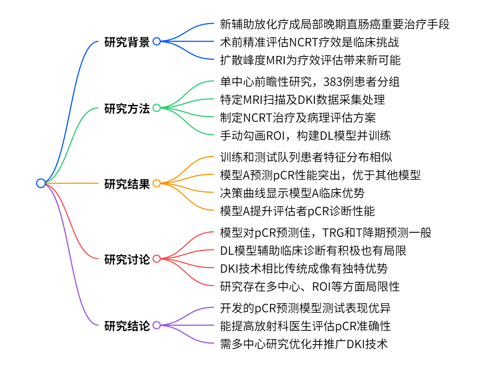
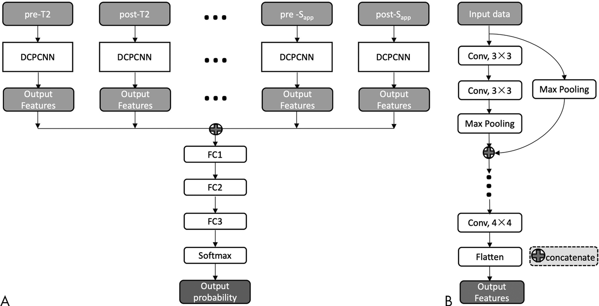
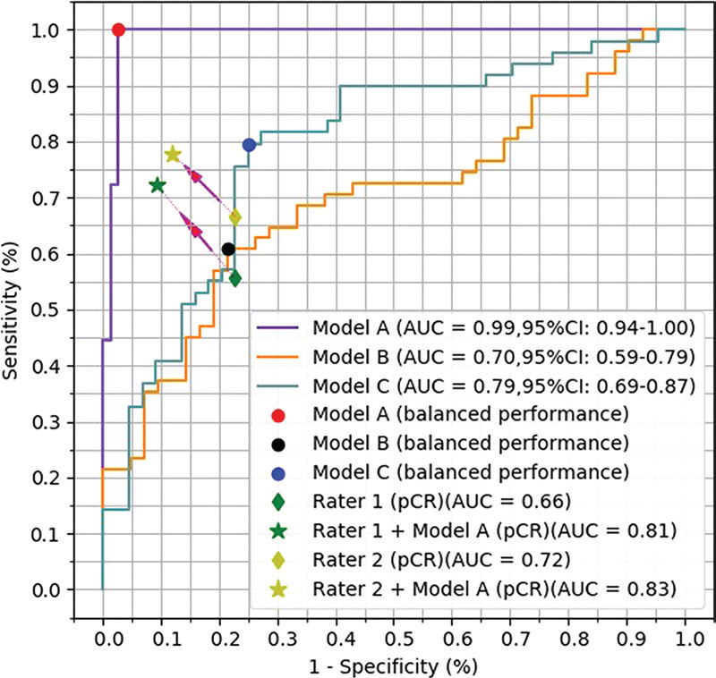

# 深度学习助力直肠癌放化疗疗效预测：扩散峰度 MRI 的创新应用

在直肠癌的治疗领域，新辅助放化疗（NCRT）已成为局部晚期直肠癌治疗的重要手段，能使部分患者肿瘤降期，甚至达到病理完全缓解（pCR），为后续治疗决策提供关键依据。然而，如何在术前精准评估 NCRT 疗效一直是临床面临的挑战。传统的评估方法主要依赖术后病理检查，但这在术前无法为治疗方案的选择提供及时指导。随着医学影像技术和人工智能的发展，利用影像学手段进行术前疗效预测成为研究热点。今天，我们就来深入探讨一项基于扩散峰度 MRI（DKI）和深度学习（DL）的研究，看看它在直肠癌 NCRT 疗效预测方面有哪些重要突破。

    
    
<b>图 1：研究概述 </b>

## 研究背景与目的

NCRT 对局部晚期直肠癌患者的治疗效果显著，可使约 20% 的患者达到 pCR 。患者对 NCRT 的反应对预后和治疗决策至关重要，若术前能准确评估疗效，对于可能从局部切除、观察等待或非手术策略中获益的患者意义重大。目前，术后病理评估是判断治疗反应的主要方法，但术前缺乏准确的评估体系。虽然扩散加权成像和 T2 加权成像在疗效评估中有一定优势，但简单扩散模型难以描述肿瘤环境中水分子的非高斯运动。DKI 能更好地反映组织微观结构，为疗效评估带来新的可能。本研究旨在结合 DKI 和 DL 技术，开发并验证一种预测直肠癌对 NCRT 反应的方法，为临床提供准确、半自动化的评估工具。

## 研究方法

### 1. 研究对象

本研究为单中心前瞻性研究，于 2015 年 10 月至 2017 年 12 月连续纳入患者。纳入标准为经病理和基线 MRI 证实的局部晚期直肠腺癌（≥cT3 或 N+）且计划在本院接受 NCRT 的患者。排除标准包括合并其他部位恶性肿瘤、入组前接受过治疗、NCRT 不完整、未接受手术、MRI 质量不佳或病理结果不可用及黏液腺癌患者。最终 383 例患者纳入研究，按时间顺序分为 290 例训练样本和 93 例测试样本。

### 2. MRI 数据采集与扩散模型

所有患者在 NCRT 开始前 1 周内和手术前 1 周内分别进行 MRI 检查，即术前和术后 MRI。使用 3.0-T MRI 扫描仪，采用八通道相控阵体线圈，扫描前 30 分钟肌肉注射 20mg 丁溴东莨菪碱减少结肠蠕动。扫描协议包括轴向、冠状和矢状 T2 加权像、横向 T1 加权像及 DKI。DKI 图像通过单次激发回波平面成像获取，有 12 个 b 值（0, 20, 50, 100, 200, 400, 600, 800, 1000, 1200, 1400, 1600 sec/mm² ），通过特定公式计算得到 $D_{app}$ 、$K_{app}$ 图像，同时输入 $S_{app}=log [S(1000 sec/mm^{2})]$ 图像。

### 3. NCRT 治疗方案

患者接受 22 次调强放疗，同时口服卡培他滨（825mg/m² ，每日 2 次）。放疗结束后 8 - 10 周进行全直肠系膜切除术。

### 4. 病理评估

术后标本经福尔马林固定、切片后，由两位病理学家共同进行组织病理学检查，依据国际抗癌联盟 TNM 分期系统进行分期。无残留癌细胞为 pCR（T0N0），根据美国国家综合癌症网络和美国癌症联合委员会的 TRG 系统评估肿瘤退缩分级（TRG），TRG0 和 TRG1 为良好反应，TRG2 和 TRG3 为不良反应。病理 T 期小于 T3 为 T 降期，否则为非 T 降期。病理学家评估时对影像学结果不知情。

### 5. ROI 勾画

两位有经验的放射科医生在 MRI 检查后 1 周内，独立在术前和术后 T2 加权像及扩散加权像（b 值 1000 sec/mm² ）上手动勾画感兴趣区域（ROI），包括整个肿瘤并排除肠腔。ROI 沿肿瘤轮廓在 T2 加权像（稍高信号区）和扩散加权像（高信号区）上绘制，包含周围肿瘤条索和毛刺。

### 6. DL 模型构建

**数据准备**：构建模型的训练数据集用于模型构建和内部验证，测试数据集用于外部验证。建立三个模型，模型 A 以非 pCR 和 pCR 为标签，模型 B 以不良反应（TRG2 和 TRG3）和良好反应（TRG0 和 TRG1）为标签，模型 C 以非 T 降期和 T 降期为标签。数据预处理包括切块、调整大小、归一化和增强。

**网络架构**：设计具有八个输入的多路径卷积神经网络，输入数据包括术前和术后 T2 加权成像、术前 $D_{app}$ 、术后 $D_{app}$ 、术前 $K_{app}$ 、术后 $K_{app}$ 、术前 $S_{app}$ 和术后 $S_{app}$ 数据。每个数据流独立处理，通过不同的密集连接多最大池化卷积神经网络提取特征。多最大池化层密集连接，加速网络收敛。

    
    
<b>图 2：模型架构示意图 </b>

**训练与预测**：基于 Python 3.6、Keras 2.1.5 和 TensorFlow 1.4.0 在工作站上训练网络，使用随机梯度下降算法结合自适应矩估计（ADAM）优化器，设置学习率、衰减率、小批量大小、损失函数等参数，进行 500 次训练。训练好的网络根据输入的 MRI 参数图预测目标标签的两类概率，进而进行分类准确性和受试者工作特征曲线（ROC）分析。

### 7. 主观评估

两位评估者在不知病理结果的情况下，独立评估测试队列患者的 MRI 扫描，评估内容包括肿瘤分期、淋巴结状态、pCR 状态、TRG 和 T 降期。之后结合 DL 模型结果再次评估。

### 8. 统计分析

计算样本量以构建 pCR 预测模型（模型 A），假设诊断试验的 ROC 曲线下面积（AUC）大于 0.85 才有临床价值。使用 DeLong 方法比较模型 A 与模型 B、C 的 AUC，以及与 DKI 参数均值的 AUC，Bonferroni 校正用于多次比较。使用 R 软件进行统计分析，包括 $\chi^{2}$ 检验、独立 t 检验或 Mann - Whitney U 检验等，计算敏感性、特异性等指标，通过决策曲线分析评估模型临床实用性。

## 研究结果

### 1. 患者特征

383 例患者中，男性 229 例（59.8%），平均年龄 57 岁 ±10 岁。训练队列和测试队列在年龄、性别、组织学分级、治疗前后肿瘤及淋巴结分期、TRG 和 pCR 状态等方面分布相似。

### 2. 模型性能

在训练队列中，模型 A 预测 pCR 的 AUC 为 0.997（95% 置信区间 \[CI]：0.995, 1.000），模型 B 和 C 的 AUC 均为 0.99（95% CI：0.98, 1.00）。在测试队列中，模型 A、B、C 的 AUC 分别为 0.99（95% CI：0.94, 1.00）、0.70（95% CI：0.59, 0.79）和 0.79（95% CI：0.69, 0.87）。模型 A 性能优于模型 B 和 C，也优于术前 $D_{app}$ 均值预测 pCR 的性能。

    
    
<b>图 3：模型性能对比 </b>

### 3. 决策曲线分析

模型 A 的决策曲线显示，在广泛的阈值概率范围内，DL 模型比全治疗或不治疗方案更具优势。

### 4. 主观评估与模型预测比较

评估者 1 和 2 在评估 pCR 时的诊断性能均不如模型 A，敏感性、特异性等指标较低。在模型 A 辅助下，评估者的诊断性能提高，错误率降低，AUC 显著升高。

## 研究讨论

### 1. 模型预测能力

本研究中基于 DKI 和 T2 加权图像的 DL 模型在预测 pCR 方面表现出色，AUC 达 0.99，优于 DKI 参数均值的预测能力。但在预测 TRG 和 T 降期时，模型准确性相对较差，与 DKI 参数均值相似。这可能是因为 TRG 和 T 降期的病理评估主观性较强，缺乏精确客观的标签。

### 2. 对临床诊断的辅助作用

DL 模型能显著降低放射科医生主观评估 pCR 的错误率，提高诊断信心，有助于基于术前 MRI 结果做出更准确的治疗决策。然而，在评估 TRG 和 T 降期时，由于医生对 DL 模型结果的信心差异，可能导致准确性下降。

### 3. DKI 技术优势

与传统扩散加权成像相比，DKI 考虑了水分子的非高斯扩散效应，能提供更多组织微观结构信息。 $D_{app}$ 比传统表观扩散系数更准确， $K_{app}$ 可描述传统成像无法测量的扩散不均匀性，显示出在直肠癌疗效评估中的潜力。

### 4. 研究局限性

**缺乏多中心验证**：本研究为单中心研究，缺乏使用不同 MRI 扫描仪和场强的外部验证队列，不同中心的设备差异可能影响模型的通用性，需要多中心研究进一步验证。

**ROI 勾画主观性**：手动勾画 ROI 存在主观性和可变性，虽然两位经验丰富的医生间一致性良好，但未分析 inexperienced radiologists 的一致性，也未评估 ROI 放置不一致对模型性能的影响。自动分割技术在直肠癌尤其是 NCRT 后的准确性仍有待提高。

**DKI 临床应用限制**：DKI 在临床实践中不如扩散加权成像广泛应用，因其需要更高更多的 b 值，扫描时间长。目前体部 DKI 成像的标准 b 值设置尚未统一，限制了其推广。

**难以量化贡献**：由于网络最终层的非线性计算，难以精确量化 T2 加权成像和 DKI 对模型准确性的相对贡献，但从单通道预测结果看，DKI 的贡献可能更大，不过 T2 加权成像在临床评估直肠癌中不可或缺。

## 研究结论

本研究基于新辅助放化疗前后的扩散峰度 MRI，利用深度学习开发了 pCR 预测模型，在测试队列中表现优异。该模型还能提高放射科医生主观评估 pCR 的准确性，为临床常规评估 pCR 提供了有效的诊断参考。但研究存在一定局限性，未来需进一步开展多中心研究，优化模型并推动 DKI 技术的临床应用。希望通过不断的研究和改进，为直肠癌患者的精准治疗带来更多希望。

## 技术指导

### 序列开发

本文涉及DKI处理，如果你有关于该技术扫描和分析的疑问，请留言或者加作者微信，可提供技术指导。

### 后处理代码及指导

如果你有相关数据，需要数据后处理服务，后处理代码或者技术指导，请加作者微信或者参考(https://www.bilibili.com/video/BV1L7LJzqEXM/) (https://www.bilibili.com/video/BV1ka411C76J/)。

### 关注点赞

请关注公众号“NMR凯米小屋”，作者B站：“楚山之石”。如果有合作意向，请加作者微信(Chushanzhishi2022)。