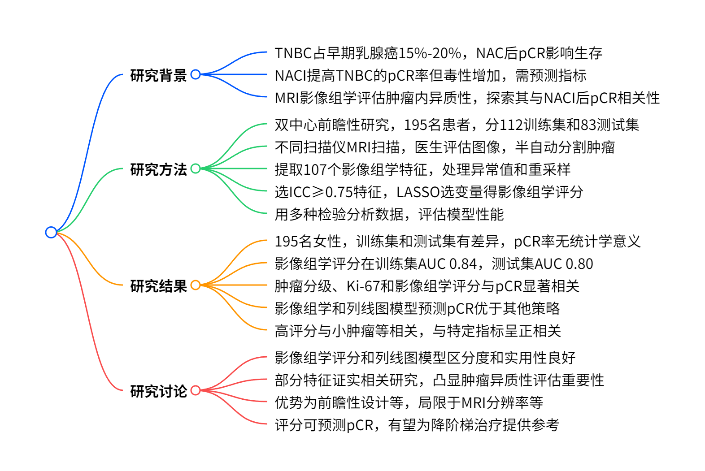
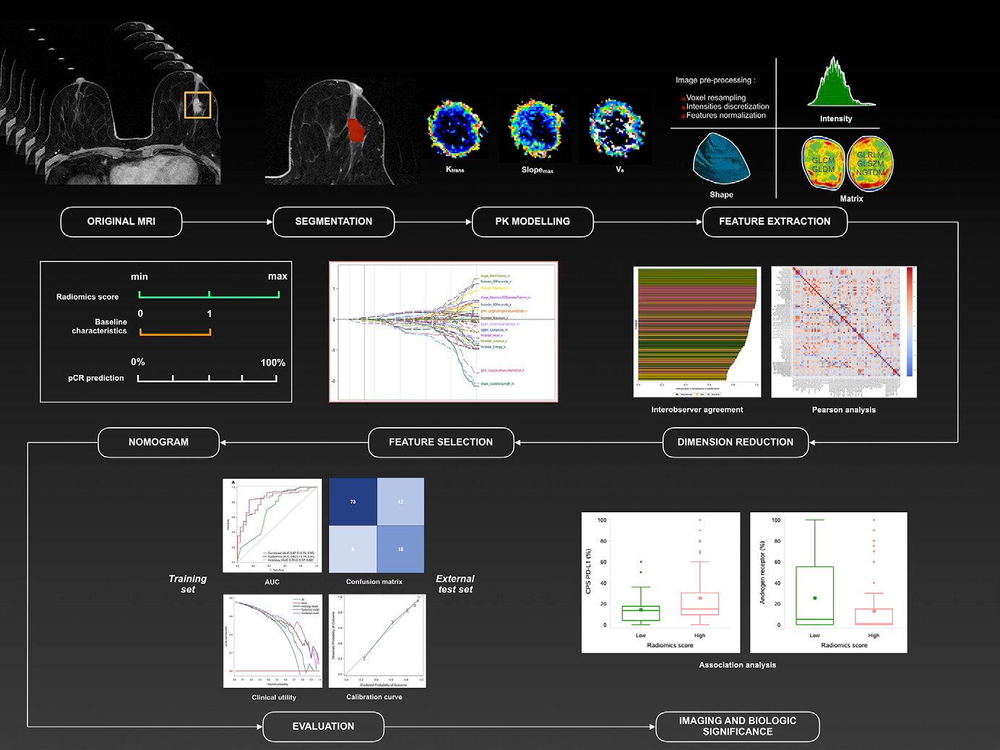
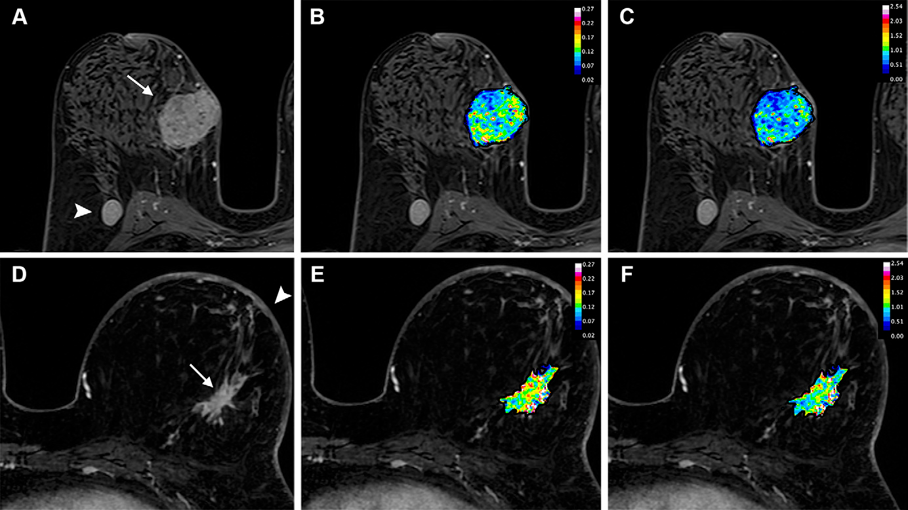
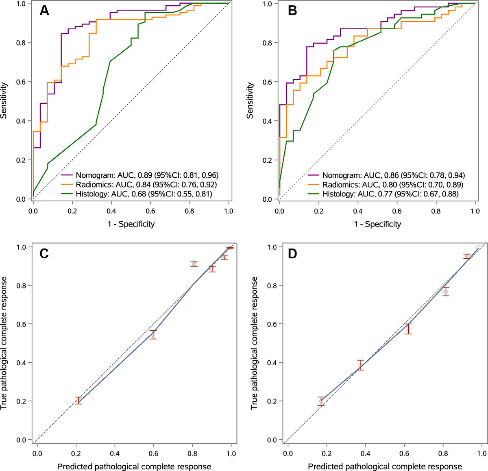

# 灌注 MRI 影像组学：预测三阴性乳腺癌病理缓解的新希望

在乳腺癌的众多亚型中，三阴性乳腺癌（TNBC）因其独特的生物学特性，治疗一直颇具挑战。近年来，新辅助化疗免疫疗法（NACI）虽显著提高了 TNBC 患者的病理完全缓解（pCR）率，但如何精准预测患者对该疗法的反应，仍是临床亟待解决的问题。今天，我们就来深入探讨一项关于利用治疗前灌注 MRI 影像组学预测 TNBC 患者对 NACI 病理反应的研究 。

    
    
<b>图 1：研究概述 </b>

## 研究背景

TNBC 约占早期乳腺癌新诊断病例的 15%-20%。过去，对于符合特定条件的早期 TNBC 患者，含蒽环类和紫杉类的新辅助化疗（NAC）是标准治疗方案。NAC 治疗后的 pCR 与患者长期无病生存率和总生存率密切相关。

随着免疫治疗的发展，KEYNOTE-522 III 期试验表明，在标准 NAC 方案中加入抗程序性死亡 1 单克隆抗体帕博利珠单抗，可显著提高手术时的 pCR 率（NACI 组 64.8% ，NAC 组 51.2% ）和 36 个月无事件生存率（NACI 组 84.5% ，NAC 组 76.8% ），但同时也增加了毒性。因此，寻找可靠的免疫治疗反应预测指标至关重要。

TNBC 肿瘤内异质性在组织学和基因水平普遍存在，对癌症进展和治疗耐药性影响重大。动态对比增强 MRI 技术能提供反映肿瘤增殖、细胞构成和微血管情况的信息。此前研究发现，基于 MRI 影像组学评估的肿瘤内异质性，可预测接受 NAC 治疗的乳腺癌患者的治疗反应和无复发生存率，但在评估 TNBC 对免疫治疗方案反应方面的作用尚未明确。本研究旨在探索治疗前动态对比增强 MRI 影像组学评估的灌注 MRI 肿瘤内异质性，与 TNBC 患者 NACI 治疗后 pCR 的相关性。

## 研究方法

### 1. 研究样本

这是一项双中心前瞻性研究，经 Institut Curie 伦理审查委员会批准，所有参与者均签署了书面知情同意书。研究纳入 2021 年 8 月至 2023 年 7 月期间，两个三级医疗中心经活检证实的早期 TNBC 患者（年龄≥18 岁，临床分期 T2 及以上或淋巴结阳性），这些患者均接受 NACI 治疗。排除标准包括：无治疗前动态对比增强 MRI、MRI 扫描采集不充分或未进行乳腺手术。最终，112 名来自中心 1 的患者作为训练集，83 名来自中心 2 的患者作为外部测试集。

### 2. MRI 检查与图像评估

两个中心使用不同型号和场强的扫描仪进行治疗前乳腺 MRI 扫描，脉冲序列、对比剂注射程序和数据采集时间与 I-SPY 2 试验一致。

由两名分别有 6 年和 1 年乳腺 MRI 经验的放射科医生（T.R. 和 V.L.），依据乳腺影像报告和数据系统（BI-RADS）术语对 MRI 扫描图像进行评估。一名有资质的放射科医生（T.R.）基于首次动态对比增强 T1 加权图像，利用 3D Slicer 软件的 Grow From Seeds 算法半自动分割肿瘤体积，手动排除线圈伪影，对于多灶性病变，仅选取最大肿块进行分析和分割。

使用单室双参数标准 Tofts 模型拟合肿瘤掩模的动态对比增强 MRI 时间过程数据，通过 3D Slicer PkModeling 模块，选取胸内动脉作为动脉输入函数，生成对比剂血浆向间质转移速率常数（$K^{trans}$）、血管外细胞外间隙容积分数（$V_{e}$）和最大对比剂摄取率（$Slope_{max}$）的体素参数图。另一名有 4 年乳腺 MRI 经验的放射科医生（M.J.）对训练集中 45 个随机选择的病变独立进行肿瘤分割，评估观察者间的可重复性。

### 3. 影像组学特征提取

运用 Python 的 PyRadiomics（3.0.1 版本），从每个参数图中提取 107 个符合影像生物标志物标准化倡议的特征。在特征提取前，去除均值 3 倍标准差以外的异常值，通过三线性插值将体素大小重采样至$0.7×0.7×0.7mm$ ，并使用 PyRadiomics 进行固定 bin 宽度的灰度离散化处理，未采用特征协调方法校正机器型号引入的批次效应。

### 4. 特征选择与预测模型构建

仅纳入组内相关系数 ICC (2,1) 值≥0.75 的影像组学特征进行后续分析。对于 Pearson 相关系数＞0.90 的特征簇，合并为一个代表性特征以减少多重共线性。采用 10 折交叉验证的最小绝对收缩和选择算子（LASSO）方法进行变量选择，将选定特征与其各自系数线性组合得到影像组学评分。所有影像组学建模和数据分析代码均存于公开仓库（[https://www.github.com/Toulsie/mri\_radiomics\_TNBC](https://www.github.com/Toulsie/mri_radiomics_TNBC)）。

基于训练集中的影像组学评分和基线特征（肿瘤分级、Ki-67 等），构建列线图模型预测 pCR，并在训练集和外部测试集中评估模型性能，同时进行探索性分析以明确影像组学评分的可解释性。

    
    
<b>图 2：技术路线 </b>

### 5. 统计分析

根据数据分布的正态性，分别使用 Wilcoxon-Mann-Whitney 检验和 Student t 检验分析连续变量，使用$\chi^{2}$检验或 Fisher 精确检验分析分类变量。计算影像组学评分的受试者工作特征曲线下面积（AUC），通过 Youden 指数确定识别 pCR 的最佳截断值，并报告自抽样置信区间。

利用校准曲线（1000 次重采样）和 Hosmer-Lemeshow 拟合优度检验评估不同模型的校准度，采用决策曲线分析计算影像组学模型在不同阈值概率下的净效益。所有统计分析由有 8 年统计分析经验的作者（T.R.）使用 Python（3.7.4 版本）和 SAS（9.4 版本）软件完成，双侧检验，$P＜0.05$为具有统计学意义。

## 研究结果

### 1. 研究参与者特征

共纳入 195 名女性参与者，训练集 112 人（平均年龄 52±11 岁），测试集 83 人（平均年龄 47±11 岁）。测试集行乳房切除术和腋窝淋巴结清扫的比例高于训练集，且测试集洗脱增强曲线的比例低于训练集。总体上，83% 的参与者完成 NACI 治疗且未中断治疗或减少剂量，训练集和测试集的 pCR 率分别为 75% 和 65%，差异无统计学意义。

### 2. 预测模型开发与测试

在训练集$K^{trans}$、$V_{e}$和$Slope_{max}$图的可重复性分析中，分别有 85、52 和 54 个影像组学特征的组内相关系数≥0.75。经 LASSO 逻辑回归模型选择特征后得到的影像组学评分，在训练集中预测 pCR 的 AUC 为 0.84（95% CI：0.76，0.92），最佳截断值 0.25 时，灵敏度 0.91，特异性 0.68，阳性预测值 0.89，阴性预测值 0.70，F1 评分 0.90；在测试集中，影像组学评分预测 pCR 的 AUC 为 0.80（95% CI：0.70，0.89） ，相同截断值下，灵敏度 0.87，特异性 0.55，阳性预测值 0.78，阴性预测值 0.70，F1 评分 0.83。

    
    
<b>图 3：代表性图片 </b>

### 3. 影像组学与临床数据整合

训练集单因素分析显示，肿瘤 III 级、Ki-67、洗脱增强曲线和影像组学评分与 pCR 相关，纳入多因素分析后，肿瘤分级、Ki-67 和影像组学评分仍与 pCR 显著相关。

基于影像组学评分、肿瘤分级和 Ki-67 构建的列线图模型，在训练集和测试集中的 AUC 分别为 0.89（95% CI：0.81，0.96）和 0.86（95% CI：0.78，0.94），均优于仅基于组织学预测指标（肿瘤分级和 Ki-67）的模型，且校准曲线显示列线图模型预测值与实际 pCR 的一致性良好。

    
    
<b>图 4：模型性能 </b>

### 4. 临床应用

决策曲线分析表明，影像组学模型和列线图模型在预测 pCR 方面优于 “全治疗” 和 “不治疗” 策略，也优于仅基于组织学数据的模型，在阈值概率＞50% 时，能提供更大的预测效益。

### 5. 探索影像组学评分的成像和生物学意义

高影像组学评分（＞0.25）的肿瘤与较小肿瘤大小、更高的洗脱增强曲线比例相关。在部分可获取相关数据的参与者中，高影像组学评分的肿瘤更可能具有较低的雄激素受体表达和较高的程序性死亡配体 1 联合阳性评分，且 pCR 与较高的程序性死亡配体 1 联合阳性评分和较低的雄激素受体表达呈正相关。

## 研究讨论

本研究探索了 TNBC 患者 NACI 治疗反应的影像学预测指标。研究提出的影像组学评分，基于多种临床实际使用的 MRI 扫描仪获取的图像，在训练集和测试集中对 pCR 均有良好的区分度和临床实用性。列线图模型结合影像组学评分与治疗前组织学变量（肿瘤分级和 Ki-67），性能进一步提升，优于仅基于组织学预测指标的模型。

影像组学评分中的球形度等特征，证实了先前关于肿瘤边缘更平滑的癌症患者更易达到 pCR 的研究。同时，从游程长度和大小区域矩阵导出的判别特征，凸显了评估肿瘤内空间异质性的重要性。肿瘤微血管灌注和通透性的不均匀性，与较低的 pCR 概率相关；而更精细的纹理则与较高的 pCR 率相关，这与近期关于 TNBC 中肿瘤异质性可预测抗程序性死亡 1 疗法疗效的研究结果一致。

与以往研究相比，本研究的优势在于前瞻性设计、相对较大的 TNBC 样本量以及较高的 pCR 率，更贴合当前临床实际。然而，研究也存在一些局限性。MRI 扫描时间分辨率较低，仅为 1 分钟，需使用简单的药代动力学模型和测量动脉输入函数；由于随访数据不足，无法评估影像组学评分与无事件生存率的关系；影像组学评分可能仅对 KEYNOTE-522 方案有预测价值，新免疫疗法出现时需进一步验证；若纳入 PET/CT 等多模态功能成像，可能会进一步提升影像组学评分的性能。

总的来说，治疗前灌注 MRI 的影像组学评分，可有效预测接受免疫治疗方案的 TNBC 患者的 pCR，有望作为药物敏感性异质性的生物标志物，为未来降阶梯治疗研究提供参考 。未来，期待更多研究进一步验证其有效性，探索其在不同免疫治疗方案中的应用，推动 TNBC 精准治疗的发展。

## 参考文献

\[1] Shi Z, Huang X, Cheng Z, et al. MRI-based quantification of intratumoral heterogeneity for predicting treatment response to neoadjuvant chemotherapy in breast cancer. Radiology 2023;308 (1):e222830.

## 技术指导

### 序列开发

本文涉及定量DCE扫描及处理，如果你有关于该技术扫描和分析的疑问，请留言或者加作者微信，可提供技术指导。

### 后处理代码及指导

如果你有相关数据，需要数据后处理服务，后处理代码或者技术指导，请加作者微信或者参考。(https://www.bilibili.com/video/BV1se411V7c2/?vd_source=e3e6c0426836c633460eb0d03208ffd0)

### 关注点赞

请关注公众号“NMR凯米小屋”，作者B站：“楚山之石”。如果有合作意向，请加作者微信(Chushanzhishi2022)。