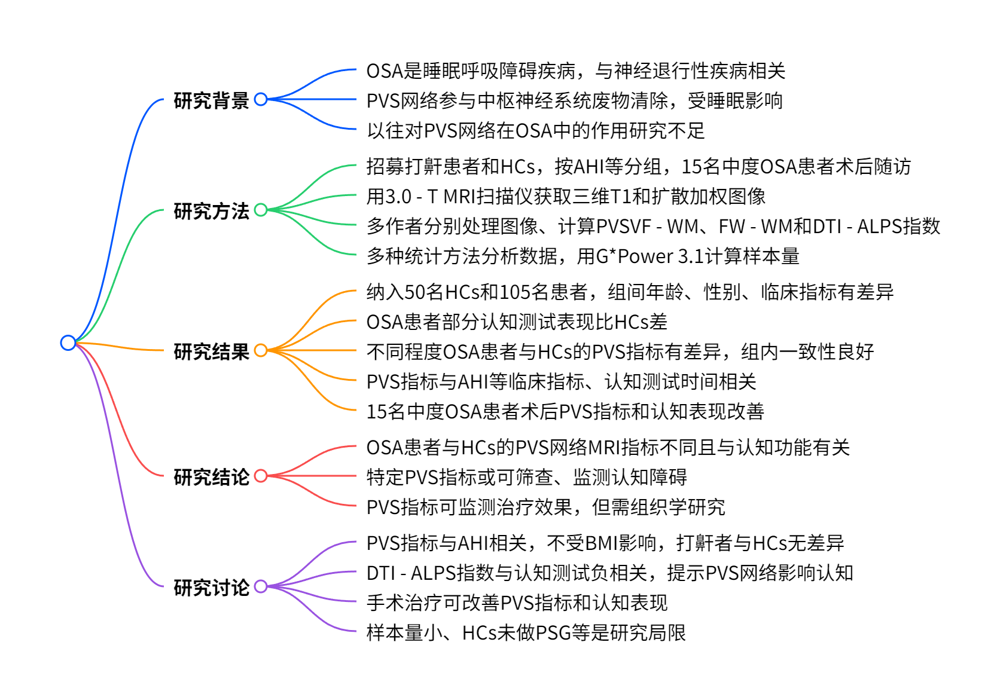
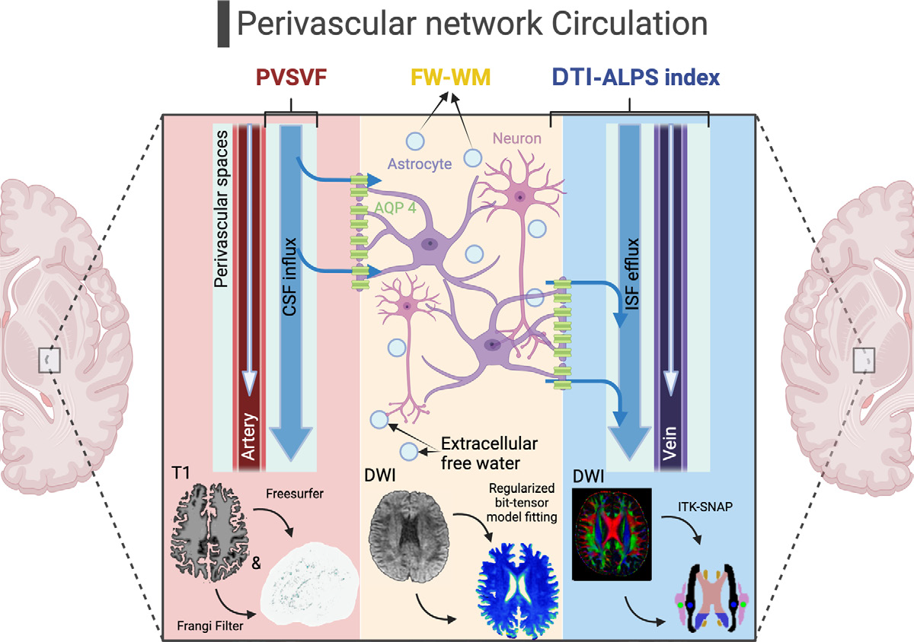
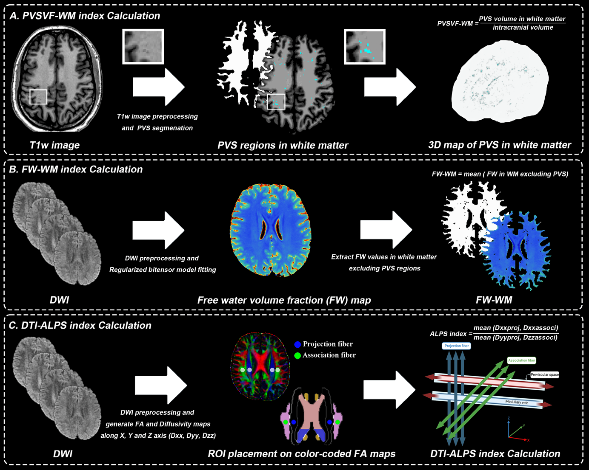
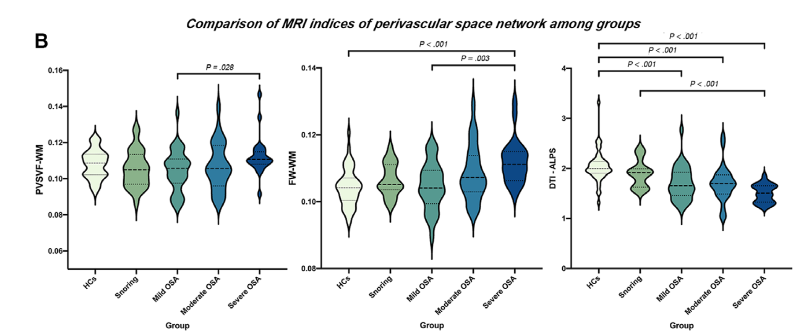
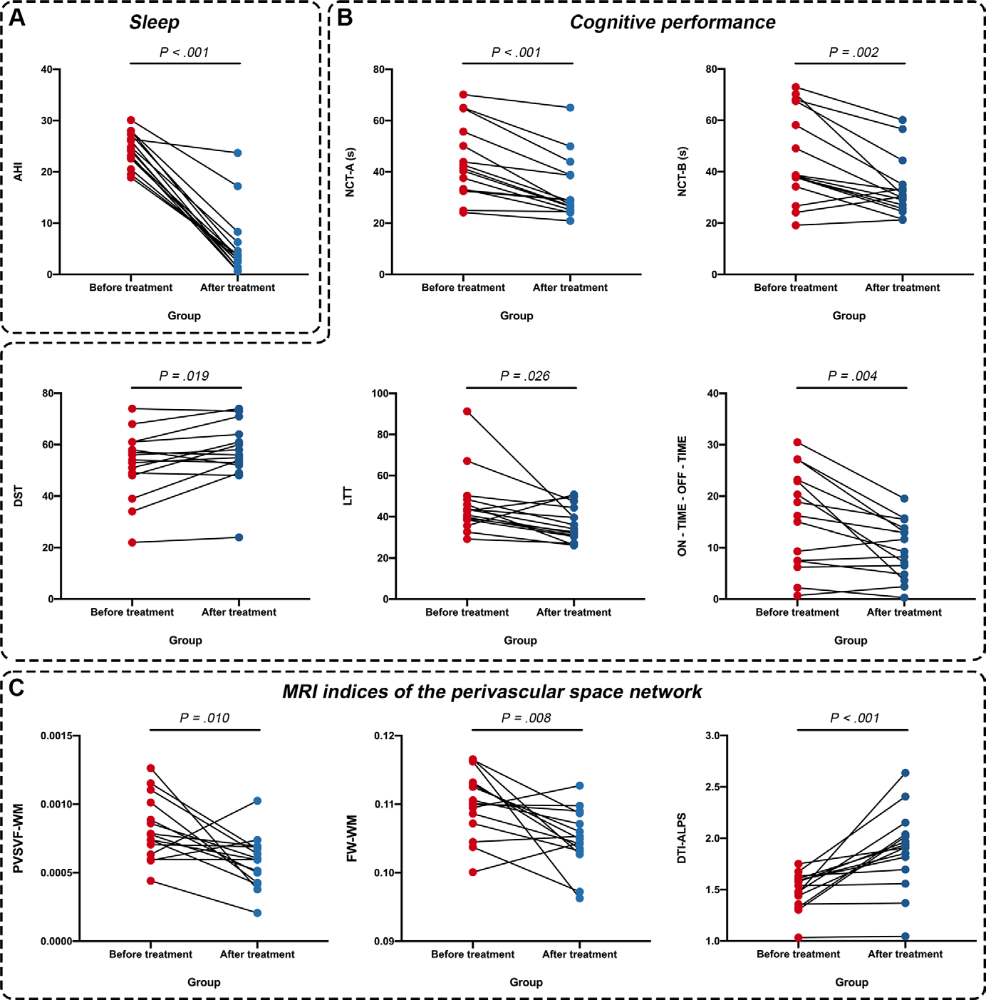

# 阻塞性睡眠呼吸暂停患者血管周围间隙网络 MRI 指标与认知障碍的关联

    
    
<b>图 1：研究概述 </b>

阻塞性睡眠呼吸暂停（OSA）是一种常见但常被漏诊的睡眠呼吸障碍疾病，其特征为睡眠中反复觉醒和间歇性缺氧。已有研究表明，OSA 是多种神经退行性疾病的危险因素，然而其潜在的神经病理机制仍不明确。血管周围间隙（PVS）网络作为中枢神经系统中类淋巴系统的重要组成部分，参与脑脊液流入、脑脊液 - 间质液交换和代谢废物清除等生理活动，且在睡眠时更为活跃。OSA 作为一种睡眠相关的低通气障碍疾病，可能会损害类淋巴系统，影响 PVS 网络功能，进而导致大脑实质中代谢废物和间质溶质清除减少。本文旨在通过对比不同严重程度 OSA 患者的 PVS 网络 MRI 指标，评估这些指标与疾病特征的关系，并探究治疗后指标是否会发生变化。

    
    
<b>图 2：研究概念设计 </b>

## 一、研究方法

### （一）研究对象招募与分组

本研究为单中心前瞻性研究，经当地研究伦理委员会批准，所有患者在进行 MRI 和认知评估前均签署书面知情同意书。2021 年 6 月至 2022 年 12 月，从深圳大学医学院南山医院耳鼻喉科连续招募有打鼾主诉的患者，纳入标准为年龄 18 - 60 岁、右利手、有打鼾主诉，并完成 MRI 检查和至少 7 小时的多导睡眠监测。排除标准包括既往有颅脑损伤或血管事件、酒精或药物滥用史、高血压、糖尿病、重大躯体疾病、HIV 感染、MRI 检查禁忌证或问卷不完整。健康对照（HCs）通过广告招募，额外排除标准为自述睡眠时打鼾和 Epworth 嗜睡量表（ESS）评分≥6 分。

根据打鼾情况和呼吸暂停低通气指数（AHI）将参与者分为四组：打鼾组（AHI≤5）、轻度 OSA 组（5\<AHI≤15）、中度 OSA 组（15\<AHI≤30）和重度 OSA 组（AHI>30）。同时收集所有参与者的氧饱和度下降指数、最低氧饱和度、体重指数（BMI）和 ESS 评分等数据。15 名中度 OSA 患者在悬雍垂腭咽成形术（uvulopalatopharyngoplasty）后 3 - 6 个月进行 MRI、便携式睡眠监测和认知评估。

### （二）MRI 数据采集

使用 3.0 - T MRI 扫描仪（SIGNA Architect；GE HealthCare）和 48 通道头线圈获取三维 T1 加权和扩散加权图像，对中度 OSA 患者的随访成像使用相同的仪器和协议。

### （三）图像分析

放射科医生在分析图像时对参与者的年龄、性别、分组、认知测试表现和临床数据均不知情。图像处理、PVS 分割和 DTI - ALPS 指数计算由一名有 4 年神经影像经验的作者（S. Lin）完成，DTI - ALPS 指数计算由另一名有 1 年神经影像经验的作者（Y.L.）独立重复。自由水（FW）指数计算由一名有 13 年 MRI 扫描处理经验的作者（L.Q.）进行。

具体分析步骤如下：

**图像处理**：利用 FreeSurfer 5.3.0 软件处理三维 T1 加权成像数据，获取强度不均匀校正的 T1 加权图像和白质（WM）掩码，对随访成像的参与者使用纵向流程，手动检查和校正分割结果。使用 FMRIB Software Library version 6.0 软件处理扩散加权成像数据。

**PVS 体积分数计算（PVSVF - WM）**：在处理后的 T1 加权图像上，使用 Frangi 滤波器算法对 WM 内的 PVS 区域进行初始分割，这些区域表现为与脑脊液信号相似的细线性结构。最终，将个体 WM 内的 PVS 体积分数（PVSVF - WM）估计为 WM 内 PVS 体积与颅内体积的比值，以消除个体脑大小差异的潜在影响。

**FW 在 WM 中的计算（FW - WM）**：从处理后的扩散加权图像中，使用正则化双张量模型和开源软件包 Dipy 生成体积分数图，然后计算每个参与者排除 PVS 区域后的 WM 内平均 FW（FW - WM）。

**DTI - ALPS 指数计算**：使用 FMRIB Software Library 的 DTIFIT 工具和 ITK - SNAP 软件，根据先前研究方法从扩散加权成像数据计算 DTI - ALPS 指数。通过组内相关系数评估观察者间一致性。

    
    
<b>图 3：数据处理方法 </b>

### （四）统计分析

使用单因素方差分析（ANOVA）和$\chi^{2}$检验分别比较组间的连续变量和分类变量，使用 Kolmogorov - Smirnov 检验评估数据分布。单因素 ANOVA 用于评估临床数据、PVS 指标和认知表现的组间差异，使用 Tukey 事后分析确定导致差异的组。在 PVS 指标比较中，将年龄和性别设为协变量。使用 Pearson 相关分析评估睡眠、PVS 指标和认知表现之间的关系。使用配对样本 t 检验评估中度 OSA 患者在悬雍垂腭咽成形术前后变量的变化，使用最小显著差异法进行多重比较校正。分别使用部分$\eta^{2}(\eta_{p}^{2})$和 Cohen d 报告 ANOVA 和配对样本 t 检验的效应量，统计学显著性阈值设为$P<.05$。使用 G\*Power 3.1 进行样本量计算（五组；效应量，0.4；显著性水平，0.05；检验效能，0.95）。

## 二、研究结果

### （一）研究对象基本情况

最初招募了 58 名 HCs，其中 3 名因睡眠中可能出现呼吸暂停、5 名因 ESS 评分≥6 分被排除；最初招募 115 名有打鼾主诉的患者，2 名因 MRI 检查不完整、8 名因未完成至少 7 小时的多导睡眠监测被排除。最终纳入研究的有 50 名 HCs（平均年龄 37.0 岁 ±8.6 岁；33 名男性）和 105 名有打鼾主诉的患者，其中打鼾组 21 人（平均年龄 29.4 岁 ±7.2 岁；12 名男性）、轻度 OSA 组 36 人（平均年龄 33.5 岁 ±10.9 岁；25 名男性）、中度 OSA 组 25 人（平均年龄 36.3 岁 ±9.0 岁；21 名男性）、重度 OSA 组 23 人（平均年龄 33.3 岁 ±5.6 岁；22 名男性）。组间年龄和性别存在差异，患者组的平均氧饱和度下降指数、平均最低氧饱和度、平均 BMI 和平均 ESS 评分也存在差异，且随着 OSA 严重程度增加，氧饱和度下降指数和 BMI、ESS 评分升高，最低氧饱和度降低。

### （二）认知表现

在一些认知测试比较中，OSA 患者的认知表现明显比 HCs 差。例如，在数字连接测试 A 中，中度和重度 OSA 组的完成时间比 HCs 和轻度 OSA 组长，重度 OSA 组比打鼾组长。

### （三）PVS 指标

调整年龄和性别后，HCs 和患者组之间的 PVS 指标存在差异。重度 OSA 组的平均 PVSVF - WM 和平均 FW - WM 高于轻度 OSA 组，且重度 OSA 组的平均 FW - WM 高于 HCs；所有患者组的平均 DTI - ALPS 均低于 HCs，重度 OSA 组的平均 DTI - ALPS 低于打鼾组。两名放射科医生对 DTI - ALPS 指数的评估具有良好的一致性（组内相关系数为 0.78 \[95% CI：0.71, 0.84]）。

    
    
<b>图 4：PVS参数组间差异 </b>

### （四）相关性分析

PVSVF - WM 和 FW - WM 与 AHI、氧饱和度下降指数和 ESS 评分呈正相关；DTI - ALPS 指数与 Stroop 色词测试的完成时间、AHI、氧饱和度下降指数和 ESS 评分呈负相关。

### （五）治疗后的变化

15 名接受悬雍垂腭咽成形术的中度 OSA 患者在治疗后，PVSVF - WM 和 FW - WM 值降低，DTI - ALPS 指数值升高；在认知测试方面，处理冲突信息的时间（Stroop 色词测试中 on time minus off time）、数字连接测试 A 和 B 的时间、线条追踪测试的时间减少，数字符号测试完成的任务数量增加。治疗后，HCs 和中度 OSA 患者在平均 FW - WM 或 DTI - ALPS 上无明显差异。

    
    
<b>图 5：PVS参数治疗响应 </b>

## 三、研究结论

本研究发现不同严重程度的 OSA 患者和 HCs 之间的 PVS 网络 MRI 指标存在差异，这些指标与认知功能相关。在接受悬雍垂腭咽成形术的中度 OSA 患者中，治疗后 PVS 指标发生变化且认知表现改善。较高的白质 PVS 体积分数和 FW，以及较低的 DTI - ALPS 指数，可能反映 OSA 患者认知功能障碍的风险较高，经进一步验证后，有望作为筛查和监测这些患者认知障碍的标志物。此外，PVS 指标可作为监测纵向治疗效果的标志物，但需要进一步的组织学研究来阐明 OSA 患者 PVS 指标变化的神经生物学特征。

## 四、研究讨论

### （一）PVS 指标与 OSA 严重程度的关系

本研究中，PVSVF - WM 和 FW - WM 与 AHI 呈正相关，DTI - ALPS 指数与 AHI 呈负相关，这与以往研究结果一致，表明睡眠中反复觉醒和间歇性缺氧可能是导致血管周围间隙清除功能受损的原因。同时，研究观察到轻度和重度 OSA 患者在某些 PVS 指标上存在差异，且调整 BMI 后差异仍然存在，说明这些差异不能由 BMI 差异解释。而打鼾者与 HCs 在 PVS 指标上无明显差异，可能是因为打鼾者能够维持正常的睡眠结构。

### （二）PVS 网络功能障碍与认知障碍的关系

DTI - ALPS 指数与 Stroop 色词测试的认知表现呈负相关，提示 PVS 网络功能障碍可能是 OSA 患者认知障碍的潜在病理机制。OSA 患者的 PVS 网络功能障碍可能导致代谢废物和间质溶质清除不足，引起大脑神经毒性，进而导致认知能力下降，这在动物研究中也得到了支持。

### （三）治疗对 PVS 指标和认知表现的影响

接受悬雍垂腭咽成形术的中度 OSA 患者在治疗后 PVS 指标和认知表现均有所改善，这为 PVS 指标作为监测治疗效果的影像学标志物提供了依据。以往研究虽有报道 OSA 患者治疗后认知功能改善，但对认知表现的纵向变化未充分研究，本研究补充了这方面的内容。

### （四）研究局限性

本研究存在一些局限性。首先，打鼾组和 OSA 组的样本量较小，治疗后随访的样本量也较小，可能导致部分分析效能不足，研究结果需要更大样本量进行验证。其次，HCs 未进行多导睡眠监测，仅依据自我报告的打鼾情况和 ESS 评分定义 HC 组可能无法排除部分 OSA 患者，未来研究应在 HC 组中纳入多导睡眠监测检查。第三，仅对中度 OSA 患者进行了随访，重度 OSA 患者治疗后 PVS 指标和认知表现是否改善尚未探究。最后，除年龄、性别和 BMI 外，未来研究还需调整其他可能影响 PVS 网络的潜在因素，如基因变异等。

## 参考文献

\[1] Shi Z, Huang X, Cheng Z, et al. MRI-based quantification of intratumoral heterogeneity for predicting treatment response to neoadjuvant chemotherapy in breast cancer. Radiology 2023;308 (1):e222830.

## 技术指导

### 重点技术

本文涉及DTI-ALPS、基于DTI的自由水成像、以及基于白质的PVS体积计算，如果你有关于该技术扫描和分析的疑问，请留言或者加作者微信，可提供技术指导。

### 后处理代码及指导

如果你有相关数据，需要数据后处理服务，后处理代码或者技术指导，请加作者微信或者参考（https://www.bilibili.com/video/BV1tqoNYGEFL/）。

### 关注点赞

请关注公众号“NMR凯米小屋”，作者B站：“楚山之石”。如果有合作意向，请加作者微信(Chushanzhishi2022)。