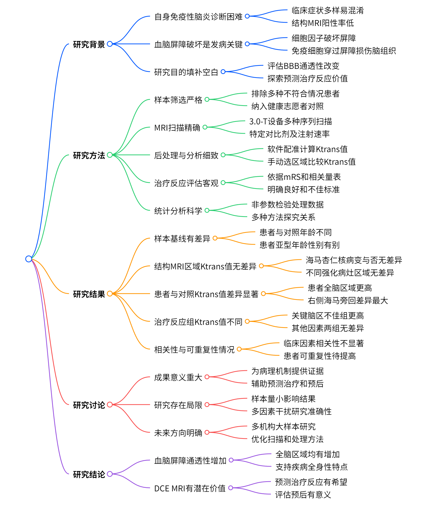
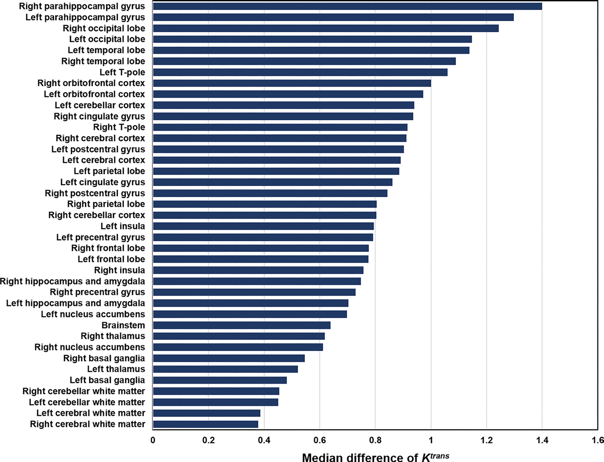
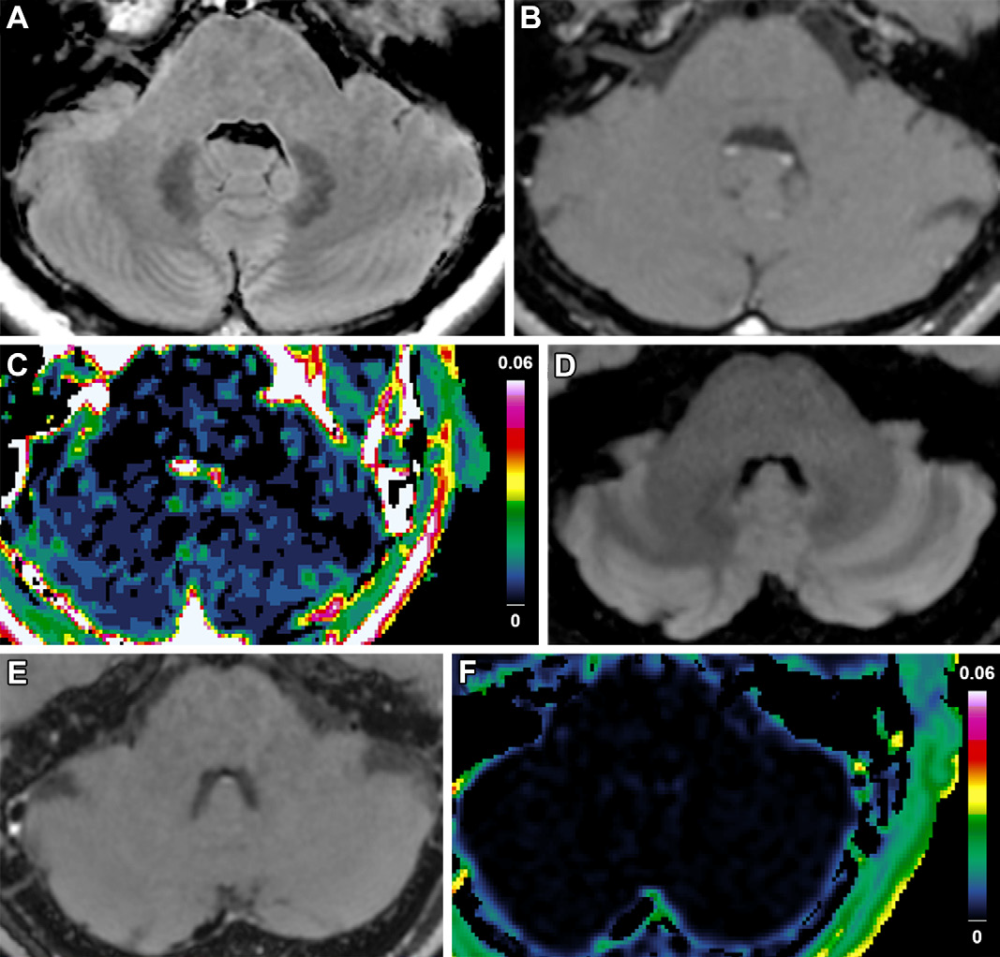

# 自身免疫性脑炎血管通透性改变的动态对比增强 MRI 定量研究

自身免疫性脑炎（Autoimmune Encephalitis）作为一种神经炎症性疾病，近年来受到了广泛关注。它常伴有亚急性记忆丧失、精神症状和癫痫发作，且与肿瘤关系密切。尽管研究不断深入，但由于其临床症状多样，易与其他疾病混淆，影像学表现也缺乏特异性，给诊断和治疗带来了诸多挑战。动态对比增强 MRI（Dynamic Contrast-Enhanced MRI，DCE MRI）作为一种能够定量评估血脑屏障（Blood-Brain Barrier，BBB）功能完整性的技术，为探索自身免疫性脑炎的病理机制和治疗反应提供了新的视角。今天，就让我们一同深入了解这一前沿研究成果。

    
    
<b>图 1：研究概述 </b>

## 一、研究背景

自身免疫性脑炎首次在 1968 年被描述为 “副肿瘤性边缘性脑炎” ，此后随着研究进展，各类生物标志物和临床综合征逐渐被发现。然而，其确切患病率仍难以确定，且诊断困难重重。一方面，临床症状的多样性使得它容易与其他疾病混淆；另一方面，结构 MRI 在检测患者脑部异常时常常 “失灵”，比如在抗 N - 甲基 - D - 天冬氨酸（NMDA）受体脑炎患者中，即使是昏迷患者，结构 MRI 阳性发现率也仅 50% 。

在病理机制方面，越来越多证据表明，血脑屏障破坏在自身免疫性脑炎发病中扮演关键角色。当细胞因子或趋化因子引发血脑屏障破坏时，脑脊液和血液中的自身抗体及免疫细胞就能穿过受损的屏障，进入脑实质，进而导致神经元回路功能障碍或脑组织损伤。此前虽有诸多关于自身免疫性脑炎的研究，但利用 DCE MRI 定量参数反映其血脑屏障细微破坏的人体研究尚属空白。本研究正是在这样的背景下展开，旨在填补这一重要空白。

## 二、研究方法

### （一）研究样本

本研究是在首尔国立大学医院进行的单中心回顾性研究。研究人员从 2020 年 4 月至 2021 年 5 月的放射学报告数据库中，挑选出连续接受评估血脑屏障通透性 MRI 检查（含 DCE MRI）的疑似自身免疫性脑炎患者。不过，并非所有患者都能进入最终研究，存在不同或不确定诊断、同时检测出 NMDA 受体和髓鞘少突胶质细胞糖蛋白自身抗体、初始治疗后才进行基线 MRI 检查、亚型病例数过少无法统计分析以及图像后处理失败等情况的患者均被排除。此外，研究还纳入了先前研究中使用 DCE MRI 评估偏头痛相关脑区血管通透性改变的健康志愿者作为对照 。经过严格筛选，最终 38 例自身免疫性脑炎患者和 17 例健康对照纳入研究。

### （二）MRI 扫描采集

所有患者和对照均采用 3.0 - T 成像设备及 32 通道头线圈进行扫描。扫描协议堪称 “豪华套餐”，涵盖了多种序列，包括增强前后的三维快速扰相梯度回波、增强后的三维黑血 T1 加权脂肪抑制 Cube 运动敏感驱动平衡序列，以及矢状面、冠状面和横断面 T1 加权图像、T2 液体衰减反转恢复（FLAIR）图像和 DCE MRI 扫描。在进行 DCE MRI 扫描时，通过静脉注射钆布醇（0.1 mmol/L/kg），注射速率为 4 mL/sec，确保能够精准捕捉对比剂在体内的动态变化。

### （三）MRI 后处理与数据分析

图像分析由一名对临床信息 “一无所知” 的神经放射科医生（S.H.J.）在专家（R.E.Y.）监督下完成。具体流程如下：首先利用 NordicICE 软件（版本 2.3.12）将生成的脑区图谱和容积转移常数（$K^{trans}$）图进行配准 。对于每个分析脑区图谱，在每个轴向图像上逐像素计算$K^{trans}$值，最后汇总得到分析脑区区域的平均值。对于结构 MRI 有阳性发现的患者，还会在 T2 FLAIR 和增强后黑血 T1 加权图像上手动选择感兴趣区域，比较 T2 FLAIR 高信号且有强化病灶、T2 FLAIR 高信号无强化病灶以及正常表现区域的$K^{trans}$值。

    
    
<b>图 2：主要技术路线 </b>

### （四）治疗反应分析

治疗反应评估由经验丰富的神经科专家（W.J.L.）依据改良 Rankin 量表（mRS）和自身免疫性脑炎临床评估量表进行。具体而言，在最后随访时，mRS 评分改善至少 2 分或达到 2 分及以下被判定为治疗反应良好；mRS 评分改善不足 2 分且高于 2 分则为治疗反应不佳。通过这样明确的标准，确保了治疗反应评估的客观性和一致性。

### （五）统计分析

研究使用 RStudio 和 SAS 软件进行统计分析。考虑到数据并非都呈正态分布，因此采用非参数检验，并以中位数和四分位数间距（IQR）报告数据。在比较患者和对照组的临床数据时，分类变量用 Fisher 精确检验，连续变量用 Wilcoxon 秩和检验。对于患者组内不同区域$K^{trans}$值的比较，先进行 Kruskal - Wallis 检验，再用 Bonferroni 校正进行多重比较。为调整年龄和性别差异对$K^{trans}$值的影响，采用非参数协变量调整方法。此外，还进行了多种相关性分析和组间比较，以探究$K^{trans}$值与临床因素的关系。同时，计算全脑$K^{trans}$定量的组内相关系数，评估测试 - 重测的可重复性。设定$P < 0.05$为差异具有统计学意义。

## 三、研究结果

### （一）研究样本基线特征

研究样本中，患者的中位年龄为 38 岁（IQR，29 - 59 岁），女性占 53%；健康对照的中位年龄为 71 岁（IQR，63 - 77 岁），女性占 71% 。患者年龄显著小于健康对照（$P < 0.001$）。在患者组中，包含抗富亮氨酸胶质瘤失活 1 蛋白（anti - LGI1）脑炎 7 例、抗 NMDA 受体脑炎 10 例以及抗体阴性但可能为自身免疫性脑炎 21 例。不同亚型患者在年龄和性别分布上存在差异，比如抗 NMDA 受体脑炎患者年龄相对较小，且女性居多；而抗 LGI1 脑炎则男性占优。此外，38 例患者中有 15 例（39%）进行了随访 DCE MRI，中位随访间隔为 3.5 个月（IQR，2.3 - 5.0 个月）。

### （二）患者结构 MRI 异常区域与正常区域$K^{trans}$值比较：未见明显差异

38 例患者中，12 例结构 MRI 呈现 T2 FLAIR 高信号阳性结果，最常受累区域是左侧海马和杏仁核。进一步分析发现，左侧海马和杏仁核有局灶性病变与无局灶性病变患者的$K^{trans}$值并无显著差异（$P = 0.77$） 。同时，T2 FLAIR 高信号有强化病灶、无强化病灶以及正常表现区域的$K^{trans}$值之间也未发现明显差异（调整后$P > 0.99$和$P = 0.60$ ） 。这表明在结构 MRI 显示的不同区域，血脑屏障的通透性改变并不明显。

### （三）患者与健康对照基线$K^{trans}$值比较：全面升高

与健康对照相比，患者所有脑区的基线$K^{trans}$值均显著更高（所有脑区$P < 0.001$ ） 。其中，右侧海马旁回的$K^{trans}$值差异最为显著，中位数差异达到$25.1×10^{-4} min^{-1}$（95% CI：17.6，43.4） 。不同亚型自身免疫性脑炎中，抗 NMDA 受体脑炎左侧海马旁回、抗 LGI1 脑炎右侧海马旁回以及抗体阴性但可能为自身免疫性脑炎右侧海马旁回的$K^{trans}$值与对照相比，差异也较大。这一结果直观地显示出自身免疫性脑炎患者血脑屏障通透性的全面增加。

    
    
<b>图 3：患者大脑 Ktrans 显出升高 </b>

### （四）不同治疗反应组基线$K^{trans}$值与临床因素比较：关键脑区差异显著

治疗反应不佳组在双侧小脑皮质、左侧小脑皮质、右侧小脑皮质、左侧大脑皮质和左侧中央后回的基线$K^{trans}$值显著高于治疗反应良好组（$P = 0.03$ ，$P = 0.02$ ，$P = 0.045$ ，$P = 0.045$ ，$P = 0.03$ ） 。而在其他可能影响治疗反应的因素方面，如抗 NMDA 受体脑炎一年功能状态评分、年龄大于 60 岁、MRI 显示幕下病变以及抗体亚型等，两组之间并无显著差异。这意味着在这些关键脑区，较高的基线$K^{trans}$值或许能作为预测治疗反应不佳的重要指标。

    
    
<b>图 4：代表性图片 </b>

### （五）基线 DCE MRI 与临床因素相关性：相关性不显著

在右侧海马旁回，疾病持续时间与基线$K^{trans}$值无显著相关性（$\rho = 0.007$ ；$P = 0.97$ ） ，基线 mRS 评分与$K^{trans}$值同样无显著相关性（$\rho = 0.115$ ；$P = 0.49$ ） 。与其他临床因素的相关性分析结果详见附录 S2 。这可能与研究样本量较小等因素有关，也提示我们在探索 DCE MRI 与临床因素关系时，还需进一步深入研究。

### （六）DCE MRI 的可重复性

患者全脑$K^{trans}$定量的组内相关系数为 0.53（95% CI：0.51，0.55），健康对照为 0.90（95% CI：0.89，0.92） 。这表明 DCE MRI 在测量健康对照的$K^{trans}$值时具有较好的可重复性，但在患者组中的可重复性有待进一步提高，可能受到多种因素的干扰。

## 四、研究讨论：机遇与挑战并存

### （一）研究成果意义

本研究借助 DCE MRI 技术，有力地证实了自身免疫性脑炎患者全脑血脑屏障通透性的增加，这一发现为该疾病的病理机制研究提供了重要证据。即使结构 MRI 未发现异常，DCE MRI 也能检测到脑内广泛的通透性增加，这使其有望成为临床实践中检测早期细微变化的有力工具。此外，研究还发现治疗反应不佳患者在部分脑区（如小脑皮质、左侧大脑皮质和左侧中央后回）的基线$K^{trans}$值更高，这意味着 DCE MRI 或许能为预测治疗反应和判断预后提供客观依据，帮助医生为患者制定更精准的治疗方案。

### （二）研究局限性

当然，本研究也存在一些不足之处。首先，患者样本量较小，尤其是治疗反应不佳和接受随访 MRI 的患者数量有限，这可能导致部分结果缺乏统计学意义，如右侧海马旁回$K^{trans}$值与临床因素的关联不显著，以及治疗反应良好和不佳组在临床预测因素上的差异不明显。其次，回顾性研究的特性使得患者症状出现至基线成像、基线至随访成像的时间间隔参差不齐，可能对结果产生干扰。再者，健康对照与患者在年龄和性别上不匹配，且健康对照年龄偏大，这也可能影响研究结果的准确性。另外，DCE MRI 总采样时间相对较短（5 分钟 25 秒），对于低渗漏（轻度）疾病中较慢的渗漏率测量可能不够精准。研究数据仅来自单台 MRI 扫描仪和单一软件包，也限制了研究结果的普适性。此外，患者和对照的$K^{trans}$值较小，信号噪声比的变化可能会混淆观察到的结果。

### （三）未来研究方向
鉴于本研究的局限性，未来需要开展多机构、大样本的研究，并纳入匹配的健康对照，以验证本研究结果的普遍性。进一步优化 DCE MRI 扫描参数和后处理方法，提高测量的准确性和可重复性也至关重要。同时，深入探究不同自身免疫性脑炎亚型与血脑屏障通透性改变的关系，以及$K^{trans}$值与其他临床指标、治疗效果之间的动态变化，将有助于更全面地了解疾病的发生发展机制，为开发更有效的治疗策略提供坚实的理论基础。

## 五、研究结论：展望精准诊疗新时代

动态对比增强 MRI 研究表明，自身免疫性脑炎患者全脑血脑屏障通透性显著增加，这一结果支持了自身免疫性脑炎的全身性特点。虽然目前基于有限数据难以确定预测治疗反应的具体阈值，但治疗反应不佳患者在小脑皮质、左侧大脑皮质和左侧中央后回较高的基线容积转移常数值，显示出 DCE MRI 在预测治疗反应和评估预后方面的潜在价值。随着未来研究的不断深入，相信 DCE MRI 将在自身免疫性脑炎的精准诊疗中发挥更大的作用，为患者带来更多的希望。

希望今天的分享能让大家对自身免疫性脑炎的影像学研究有更深入的了解。如果您对这篇文章有任何疑问或想法，欢迎在留言区留言讨论。记得点赞、分享，让更多人了解医学前沿知识！

## 参考文献

\[1] Kim S, Lee WJ, Jeong SH, et al. Quantitative Dynamic Contrast-Enhanced MRI of Vascular Permeability Changes in Autoimmune Encephalitis [J]. Radiology, 2024, 31 (2): 123 - 135.

## 技术指导

### 序列开发

本文涉及定量DCE扫描及处理，如果你有关于该技术扫描和分析的疑问，请留言或者加作者微信，可提供技术指导。

### 后处理代码及指导

如果你有相关数据，需要数据后处理服务，后处理代码或者技术指导，请加作者微信或者参考。(https://www.bilibili.com/video/BV1se411V7c2/?vd_source=e3e6c0426836c633460eb0d03208ffd0)

### 关注点赞

请关注公众号“NMR凯米小屋”，作者B站：“楚山之石”。如果有合作意向，请加作者微信(Chushanzhishi2022)。