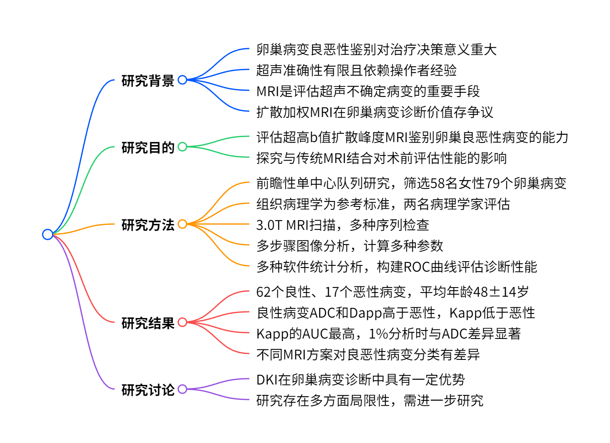
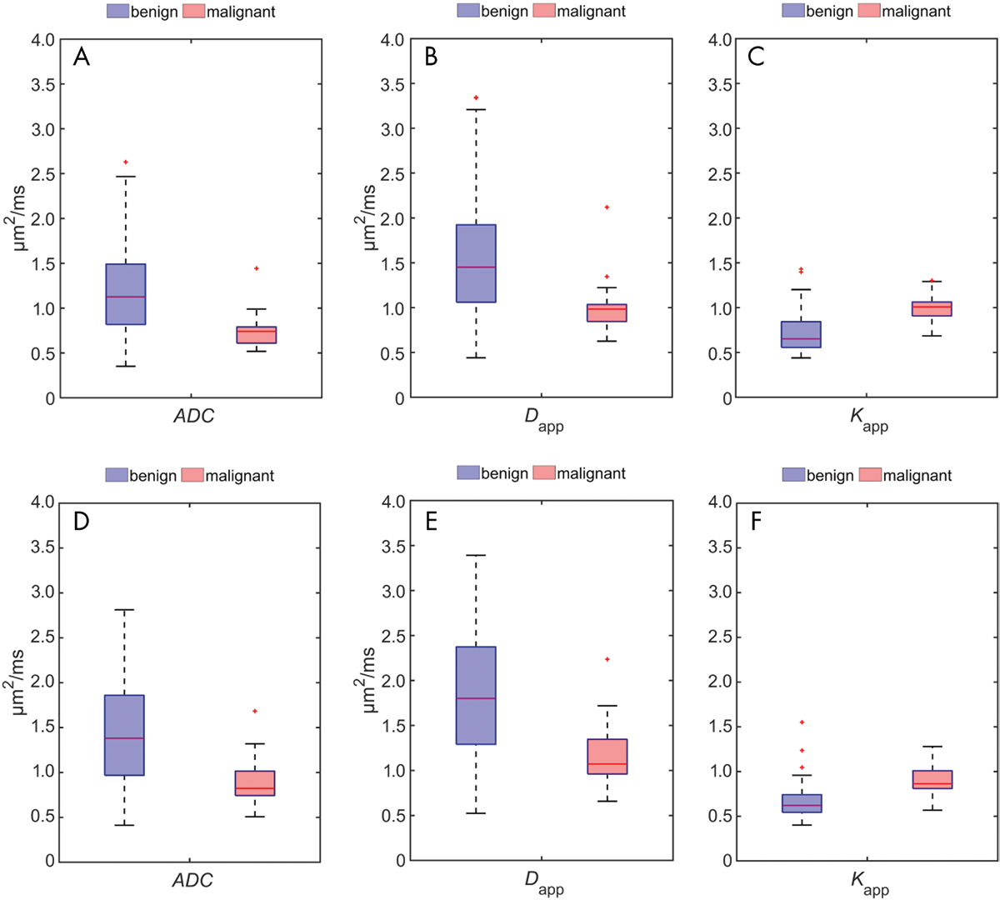
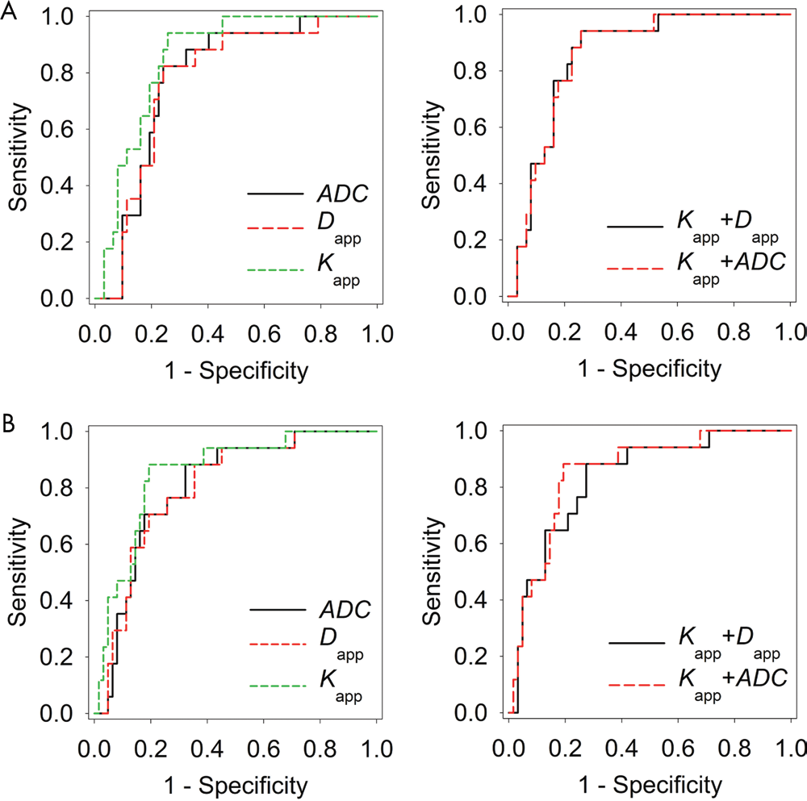

# 超高 b 值峰度成像：卵巢病变无创组织特征诊断新利器

在女性生殖系统疾病的诊断中，卵巢病变的良恶性判断至关重要，它直接关系到后续的治疗方案选择和患者的预后。传统的影像学检查方法各有优劣，而磁共振成像（MRI）凭借其多序列、多参数成像的优势，在卵巢病变的评估中占据重要地位。今天，我们就来深入探讨一篇发表于*Radiology*杂志的研究 ——“Ultra-High-b-Value Kurtosis Imaging for Noninvasive Tissue Characterization of Ovarian Lesions”，看看超高 b 值峰度成像在卵巢病变诊断中有着怎样的表现。

图一 研究概述

## 研究背景：卵巢病变诊断的现状与挑战

卵巢病变种类繁多，准确鉴别其良恶性是临床工作中的一大挑战。卵巢癌患者在专科治疗且初始手术达到完全宏观细胞减灭（残余肿瘤≤1cm）时，生存率更高；而良性病变则可选择保守治疗或微创手术 。目前，超声（US）是评估卵巢肿块的主要初始成像方法，但经阴道超声的准确性差异较大（63%-92%），且高度依赖操作者经验 。MRI 成为进一步评估超声难以确定的卵巢病变的重要手段，常规 MRI（包括 T1 加权、T2 加权、脂肪抑制和对比增强序列）的准确性在 71%-93% 之间 。半定量动态对比增强 MRI 虽能提高诊断性能，准确性可达 100%，但存在对比剂相关风险 。

近年来，功能 MRI 技术如扩散加权 MRI（DWI）逐渐兴起，然而其在鉴别卵巢良恶性病变中的价值仍存在争议。部分研究认为 DWI 无明显诊断优势，而另一些研究则表明排除特定组织学类型（如囊性畸胎瘤和子宫内膜瘤）后有一定帮助 。扩散峰度 MRI（DKI）作为一种新兴技术，可量化非高斯水扩散特性，在前列腺癌、乳腺癌、直肠癌和胶质瘤等疾病的诊断中展现出潜在价值，但在卵巢病变诊断中的应用研究较少。

## 研究目的：探索 DKI 在卵巢病变诊断中的价值

本研究旨在评估超高 b 值扩散峰度 MRI 在鉴别卵巢良恶性病变中的诊断性能，并探究其与传统 MRI 结合是否能提高术前 MRI 评估的整体性能。具体而言，研究团队希望明确 DKI 衍生参数与传统的表观扩散系数（ADC）相比，能否更准确地区分卵巢病变的良恶性，为临床诊断提供更可靠的依据。

## 研究方法：

### 研究对象

本研究为前瞻性单中心队列研究，经机构伦理审查委员会批准（S-337/2016），所有参与者均签署书面知情同意书。2016 年 11 月至 2018 年 12 月，通过阴道超声在妇科门诊筛选出疑似卵巢病变且性质不确定的成年患者。排除标准包括拒绝参与、MRI 检查禁忌证和无法签署知情同意书者。最终，对 58 名女性的 79 个卵巢病变进行了分析。

### 病理分析 “金标准”

以组织病理学分析作为所有病变的参考标准。由两名病理学家共同进行评估，其中至少一名具有超过 10 年的经验。若存在分歧，则通过仲裁（可能涉及更多病理学家）达成共识。大多数（>70%）病例由两名妇科病理专科医生阅片。

### MRI 检查规范流程

所有 MRI 检查均使用 3.0T MRI 扫描仪（Prisma；西门子，德国埃尔兰根）及 16 通道体线圈，扫描方案包括形态学序列、扩散加权 MRI 和（若患者未拒绝）动态对比增强序列 。扩散加权 MRI 在注射对比剂前进行，以避免钆对比剂对其信号的影响，采用 6 个不同的 b 值（0、50、100、800、1500 和 2000s/mm² ），单次扫描 60 层，耗时 10 分 23 秒。部分患者因病变范围大，需增加扫描层数。

### 图像解读与分析

**常规诊断阅片**：初始诊断由一名住院医师和一名主治医师共同阅片，最终由具有 8 年盆腔 MRI 经验的高级主治医师（T.M.）确定诊断结果。阅片遵循欧洲泌尿生殖放射学会指南中针对超声不确定附件肿块的算法，且在手术和 DKI 分析前完成，阅片者对病理和峰度分析结果不知情。

**DKI 图像分析**：将扩散加权 MR 图像传输至标准个人电脑，使用开源软件（Medical Image Interaction Toolkit，2018.04.2 版本）进行后处理。由两名具有 7 年 MRI 经验的认证放射科医生（T.M. 和 S.B.）共同阅片，选取高 b 值（1500s/mm² ）图像中病变信号最高的层面手动勾勒病变轮廓，部分病例（n=13）结合 800s/mm² 图像辅助确定边界。同时参考 T2 加权图像以获取病变形态信息，阅片时对病理结果不知情。为确保可重复性，由一名具有 3 年 MRI 经验的住院医师进行独立二次阅片和分割，仅提供扩散加权和 T2 加权图像。

**参数计算**：基于 Matlab 曲线拟合工具箱（R2016a 版本）的曲线拟合算法，计算以下扩散参数：

**ADC 计算**：采用单指数拟合测量信号计算 ADC 图，公式为$S(b)=S_{0} \cdot e^{(-b \cdot ADC)}$ ，其中$S(b)$为扩散加权信号，b 为扩散加权强度，$S_{0}$为非扩散加权信号。计算时选取 100、800 和 1500s/mm² 三个 b 值，排除极低和极高 b 值信号以减少灌注和非高斯扩散的影响。

**DKI 参数计算**：通过非线性拟合公式 $S(b)=S_{0} \cdot e^{\left(-b \cdot D_{app }+\frac{1}{6} b^{2} D_{app }^{2} K_{app }\right)}$ 获取扩散峰度 MRI 衍生的 ADC（$D_{app }$ ）和表观峰度系数（$K_{app }$ ），使用 100、800、1500 和 2000s/mm² 四个 b 值，排除低 b 值以降低灌注效应影响，以$S(b = 0)$作为拟合变量$S_{0}$的起始点 。$D_{app }$与 ADC 不同，是由于采用了修正拟合函数同时估计扩散系数和峰度，且使用了不同的 b 值，通常$D_{app }$大于 ADC。

**感兴趣体素选择**：为选取最具代表性的体素进行定量分析，使用 Matlab 分别确定信号强度最高的 10% 和 1% 体素。这是基于文献报道，高扩散受限体素更适合区分不同器官的良恶性病变，且第 10 百分位数和最低体素常被认为代表恶性病变的侵袭性部分 。考虑到卵巢病变常包含大量囊性或液体成分，对信号强度最高的 10% 和 1% 体素均进行分析，但确保小病变至少包含 11 个体素。具体操作是先对 1500s/mm² 图像中的体素按信号强度排序，定义信号强度阈值为预设百分比（10% 或 1%）最高强度体素中的最低信号值，选取高于阈值的体素。若病变在绝对阈值水平的体素过多，导致总体纳入体素超过 1% 或 10%，则减少纳入体素直至达到相应比例。

**数据筛选**：定量分析时，要求 ADC 和$D_{app }$值在 0 - 3.5μm² /msec 范围内，$K_{app }$值在 0 - 3 范围内，排除该区间外的体素以减少伪影相关异常值的影响。若最终选取的体素数量少于 11 个，则降低信号强度阈值并重复上述过程，直至达到 11 个体素。

### 多种 MRI 方案评估

在完成扩散加权 MRI 分析后，同一批阅片者（T.M. 和 S.B.）对常规 MRI 序列（包括对比增强序列，但不包括时间 - 信号强度曲线）结合 DKI 进行额外阅片，对肉眼判断为恶性的病变，使用峰度临界值评估该方法减少假阳性结果的潜力。间隔 2 个月以上，阅片者对包含时间 - 信号强度曲线的完整诊断协议结合 DKI 进行再次阅片，同样使用峰度临界值评估其减少假阳性结果的能力。

### 统计分析

使用 Matlab（2016b 版本）、SigmaPlot（14.0 版本）和 SAS（3.71 版本）进行统计分析。计算各变量的中位数，采用 Shapiro-Wilk 检验进行正态性检验后，使用 Mann-Whitney U 检验分析感兴趣区域内体素数量在不同病变间的差异。通过线性混合模型（SAS 中的 Glimmix 过程）计算衍生变量差异的统计学意义，以校正个体患者中多个病变的潜在相关性。基于逻辑混合模型（SAS 中的 Glimmix 过程）构建受试者工作特征（ROC）曲线，评估单个变量鉴别良恶性的能力，使用含两个预测变量的逻辑混合模型评估变量组合的额外优势。采用 DeLong、DeLong 和 Clarke-Pearson 方法检验 ROC 曲线下面积（AUC）差异的统计学意义，P≤0.05 为具有统计学意义。基于单评分、绝对一致性、双向混合效应模型计算组内相关系数（ICC）及其 95% 置信区间（CI）评估可靠性，ICC<0.5 为可靠性差，0.5 - 0.75 为中等可靠性，0.75 - 0.9 为良好可靠性，>0.9 为优秀可靠性 。使用 McNemar 检验比较不同 MRI 方案诊断性能的差异。

## 研究结果

### 研究对象与病理结果

最初确定 96 名女性符合研究条件，12 名拒绝参与，84 名接受 MRI 检查。其中 26 名参与者数据无法分析，最终对 58 名女性（平均年龄 48±14 岁，范围 24 - 77 岁）的 79 个卵巢病变进行分析。组织病理学结果显示，62 个（78%）病变为良性，17 个（22%）为恶性。MRI 检查与手术及病理分析的平均时间间隔为 41.7 天（1 - 204 天），部分间隔超过 8 周的病例均为良性病变（7 例子宫内膜瘤和 3 例囊腺瘤或囊腺纤维瘤）。

### DKI 与传统 ADC 诊断性能对比

分析 1% 和 10% 感兴趣区域体素的结果显示，良性病变的 ADC 和$D_{app }$中位数均高于恶性病变，而$K_{app }$中位数低于恶性病变（表 3）。例如，分析 1% 体素时，良性病变 ADC 中位数为 1.13μm² /msec，恶性病变为 0.74μm² /msec（P<0.01）；$D_{app }$在良性病变中为 1.45μm² /msec，恶性病变中为 0.98μm² /msec（P = 0.02）；$K_{app }$在良性病变中为 0.65，恶性病变中为 1.01（P<0.001） 。

图二 DKI参数组间差异

ROC 曲线分析表明，$K_{app }$的 AUC 值最高，1% 和 10% 分析时均为 0.85（95% CI：0.77 - 0.94 和 0.75 - 0.95），ADC 的 AUC 值在 1% 分析时为 0.78（95% CI：0.67 - 0.89），10% 分析时为 0.80（95% CI：0.70 - 0.91），$D_{app }$的 AUC 值在 1% 分析时为 0.77（95% CI：0.66 - 0.89），10% 分析时为 0.80（95% CI：0.69 - 0.91） 。1% 分析时，$K_{app }$与 ADC 的 AUC 差异具有统计学意义（P = 0.047），10% 分析时差异无统计学意义（P = 0.06） 。以 100% 敏感性为阈值，$K_{app }$对不确定病变的良性分类准确率在 1% 分析时为 55%（95% CI：0.42 - 0.68），高于 ADC 的 27%（95% CI：0.17 - 0.40）和$D_{app }$的 21%（95% CI：0.12 - 0.33）；10% 分析时，$K_{app }$的准确率为 32%（95% CI：0.21 - 0.45），ADC 和$D_{app }$均为 29%（95% CI：0.18 - 0.42） 。将$K_{app }$分别与$D_{app }$、ADC 组合构建逻辑混合模型，未显著提高特异性。

图三 诊断效能分析

组内相关系数显示，所有参数的阅片者间一致性良好至优秀，1% 分析时，ADC 的 ICC 为 0.884（95% CI：0.824 - 0.924），$D_{app }$为 0.893（95% CI：0.838 - 0.930），$K_{app }$为 0.838（95% CI：0.758 - 0.893）；10% 分析时，ADC 的 ICC 为 0.946（95% CI：0.916 - 0.965），$D_{app }$为 0.939（95% CI：0.906 - 0.961），$K_{app }$为 0.884（95% CI：0.825 - 0.924） 。

### 不同 MRI 方案综合诊断性能

阅读完整诊断协议时，所有 17 个（100%；95% CI：80.5% - 100%）恶性病变均被正确分类，62 个良性病变中有 55 个（88.7%；95% CI：78.1% - 95.3%）被正确评估，7 个（11.3%；95% CI：4.7% - 21.9%）被误判为交界性、恶性或不确定 。若在完整诊断协议基础上结合 DKI，利用定量峰度临界值，可将 7 个假阳性病变中的 5 个正确分类为良性，理论上良性病变的正确分类率可达 96.8%（95% CI：88.8% - 99.6%） 。

阅读常规增强 MRI（不含时间 - 信号强度曲线）时，17 个恶性病变均正确分类，62 个良性病变中有 51 个（82.3%；95% CI：70.5% - 90.8%）被正确识别，11 个（17.7%；95% CI：9.2% - 29.5%）被误判为恶性 。常规 MRI 结合 DKI 理论上可将良性病变的正确分类率提高至 91.9%（95% CI：82.2% - 97.3%），识别出 11 个假阳性结果中的 7 个 。

McNemar 检验显示，单独 DKI 分析（特异性 55%）与完整诊断协议（特异性 96.8%）在 100% 敏感性下的特异性差异有统计学意义（P<0.001）；完整诊断协议（特异性 96.8%）与常规 MRI 加 DKI（特异性 91.9%）的特异性差异无统计学意义（P>0.05） 。

## 研究讨论：DKI 的优势、局限与展望

### DKI 在卵巢病变诊断中的优势

术前准确鉴别卵巢良恶性病变对治疗决策至关重要。本研究表明，在 100% 敏感性（即不将恶性病变误分类）的情况下，$K_{app }$对良性病变的正确识别率为 55%，高于单独使用 ADC（27%）或$D_{app }$（21%） 。将 DKI 添加到常规 MRI 中，可使良性病变的正确分类率达到 91.9%；添加到包含时间 - 信号强度曲线的完整诊断协议中，正确分类率可达 96.8% 。

卵巢病变组织异质性高，常包含囊性、实性、脂肪和出血等多种成分。传统 DWI 使用全病变平均 ADC 值可能掩盖小恶性部分的低扩散率，本研究选取高扩散受限体素进行分析，避免了高 ADC 值的干扰，且 1% 体素分析结果比 10% 更可靠 。ADC 值在良恶性病变间存在较大重叠，且良性病变中的脂肪成分会影响其鉴别价值 。而 DKI 能检测非高斯扩散行为，更好地反映组织微观结构复杂性，在组织特征描述方面具有优势。$K_{app }$在 88% 敏感性下的特异性为 76%，优于传统增强 MRI 在相似敏感性下 50%-60% 的特异性，与包含动态对比增强 MRI 的报道特异性（74%-100%，敏感性 66%-100%）相当或略低 。但当结合多种 MRI 序列时，本研究结果仍劣于已报道的高敏感性（95%-100%）下 81%-88% 的特异性 。不过，DKI 在无需对比剂的情况下开展。

## 考考文献

\[1] Radiology 2020 Vol. 296 Issue 2 Pages 358-369（DOI: 10.1148/radiol.2020191700）

## 技术指导

### 序列开发

本文涉及DKI处理，如果你有关于该技术扫描和分析的疑问，请留言或者加作者微信，可提供技术指导。

### 后处理代码及指导

如果你有相关数据，需要数据后处理服务，后处理代码或者技术指导，请加作者微信或者参考(https://www.bilibili.com/video/BV1L7LJzqEXM/) (https://www.bilibili.com/video/BV1ka411C76J/)。

### 感谢关注，欢迎合作

微信：Chushanzhishi2022
微信公众号：NMR凯米小屋
作者B站：楚山之石
CSDN: 楚山之石
知乎: 楚山之石
头条：楚山之石