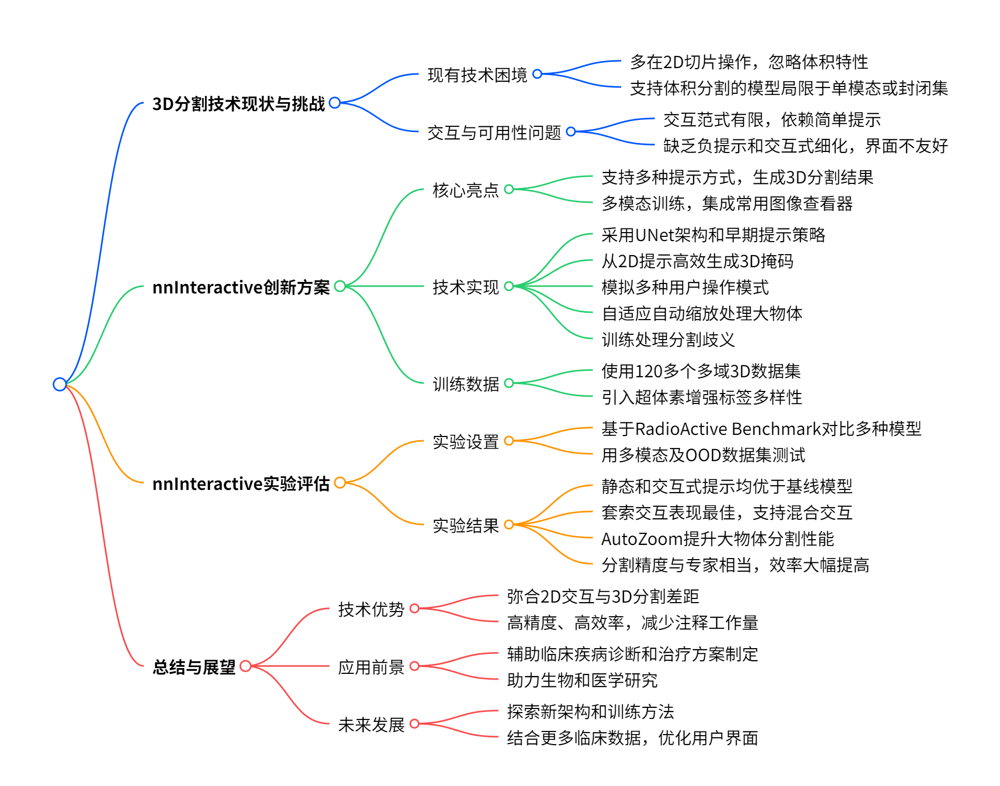
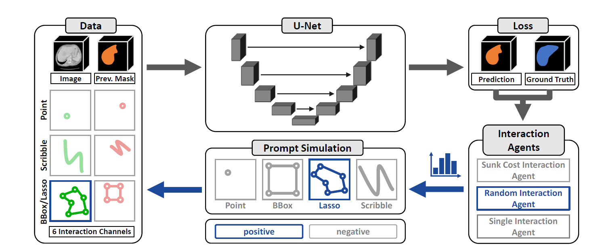
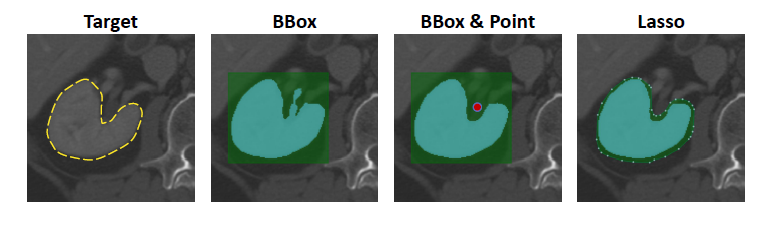
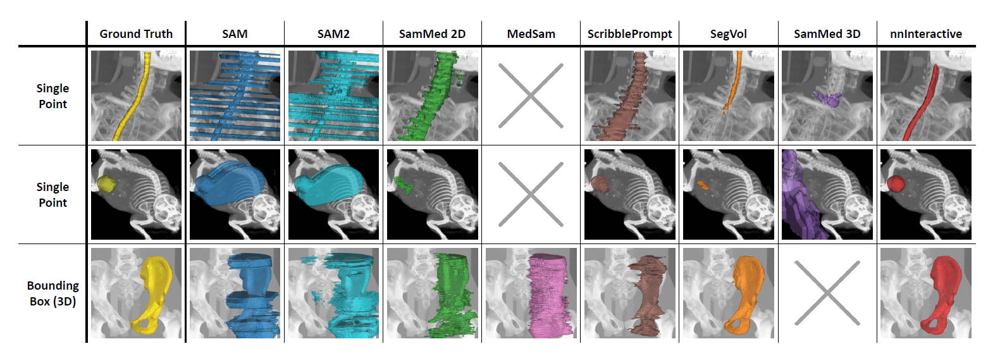

# nnInteractive：重新定义 3D 可提示分割技术

在医学、生物学和工业检测等领域，3D 数据蕴含着关键信息，精准高效的 3D 分割技术至关重要。它能帮助医生更准确地诊断疾病、制定治疗方案，也有助于生物学家研究微观结构、工业专家检测产品内部缺陷等。然而，现有的 3D 分割方法存在诸多问题，严重影响了其在实际中的应用效果。今天，我们就来深入了解一种全新的 3D 交互式分割框架 ——nnInteractive，看看它是如何解决这些难题，为 3D 分割领域带来新突破的。

图一 研究概述

## 一、3D 分割技术的现状与挑战

### （一）现有技术的困境

随着深度学习的发展，交互式分割技术取得了一定进展，像 SAM 这类基础模型通过提示交互实现了通用分割，为医学领域带来了新的思路。但现有方法在应用于 3D 医学图像时，问题层出不穷。

许多模型主要在 2D 切片上操作，忽略了医学扫描的体积特性，导致切片间分割不一致，扩展到 3D 体积时需要大量手动修正。例如，在肝脏的 3D 分割中，基于 2D 切片的模型可能在不同切片上对肝脏边界的划分不同，拼接起来的 3D 模型就会出现不连续、不准确的情况。

支持体积分割的模型也存在局限性，部分只能处理单一成像模态，如仅适用于 CT；还有的局限于封闭集分割，无法识别训练集之外的结构。这在临床应用中极为不利，因为患者的病情复杂多样，新的病变结构不断出现，这些模型难以适应。

### （二）交互与可用性问题

当前交互式分割框架的交互范式有限，大多依赖简单的点和框提示，像 scribbles 等更直观的输入方式支持较少。这使得用户在标注时不够便捷，无法自然地表达分割意图。而且，部分方法不支持负提示和交互式细化，这对于准确分割至关重要。比如，在分割肿瘤时，负提示可以帮助模型排除肿瘤周围的正常组织，交互式细化能让用户根据模型的初步结果进一步调整，提高分割精度。

现有工具的可用性也不佳，缺乏与已有的注释平台集成的友好界面，限制了其在实际场景中的应用。医生和研究人员在使用时，需要在不同软件之间切换，操作繁琐，效率低下。

## 二、nnInteractive：创新解决方案

### （一）核心亮点

nnInteractive 是首个全面的 3D 交互式开放集分割方法，它的出现为解决上述问题带来了希望。该方法支持多种提示方式，包括点、涂鸦、框和新颖的套索提示，用户可以根据具体需求选择最合适的方式，直观地在 2D 界面上操作，就能生成完整的 3D 分割结果。

它经过 120 多个不同的 3D 数据集训练，涵盖了 CT、MRI、PET 等多种成像模态，在准确性、适应性和可用性方面都达到了新的高度。而且，nnInteractive 成功集成到了广泛使用的图像查看器（如 Napari、MITK、Slicer3D）中，方便用户在熟悉的环境中使用，极大地提高了其在临床和研究中的可及性。

### （二）技术实现

**网络架构**：nnInteractive 采用基于 UNet 的设计，以 nnU - Net 框架的 Residual Encoder（ResEnc - L）配置为骨干。与现有交互式分割模型不同，它采用早期提示策略，将用户输入直接作为额外通道融入网络，让模型从最高分辨率学习与任务相关的表示。这样，提示信息能在整个特征提取过程中发挥作用，提高模型对用户意图的理解和分割的准确性。

**从 2D 提示到 3D 掩码**：nnInteractive 的一大创新是能够从低维提示高效预测 3D 掩码。无论是离散点还是结构化的 2D 注释（如涂鸦、框、套索），用户可以将这些提示放置在任意平面上，模型就能生成完整的 3D 分割掩码。这种方式大大减少了注释工作量，提高了分割效率。

**交互模拟**：nnInteractive 支持多种空间提示类型，每种提示类型都编码在两个独立的输入通道（正和负）中。在训练过程中，初始提示模拟来自于真实标注，后续交互则由当前预测误差引导。通过计算预测结果与真实标注之间的差异，确定误报（FP）和漏报（FN）区域，然后从这些区域中采样生成新的提示。

**用户模拟**：为了使模型更好地适应真实用户的操作模式，nnInteractive 引入了模拟用户代理。这些代理在训练过程中指导交互序列，包括随机代理、沉没成本代理和单一交互代理。随机代理代表随意切换提示类型的用户；沉没成本代理模拟倾向于使用一种交互类型多次后再切换的用户；单一交互代理则表示在整个细化过程中强烈偏好一种交互类型的用户。通过这些代理，模型能够学习到不同用户的操作模式，提高泛化能力。

**自动缩放（Auto zoom）**：考虑到 3D 模型受 VRAM 限制需要分块处理，对于大于分块大小的物体，现有方法存在不足。nnInteractive 引入了自适应自动缩放策略，根据预测边界动态扩展感兴趣区域（ROI），以 1.5 倍的因子迭代放大，直到物体完全被捕获（最多放大 4 倍）。然后将预测的低分辨率掩码调整到原始图像分辨率，并通过滑动窗口方法进行细化。在细化过程中，模型按照预测前景像素数量从多到少处理分块，确保先在信息丰富的区域进行处理，逐步扩展到约束较少的区域。这种自适应方案既能保证小物体快速推理，又能对大结构进行逐步缩放和细化，有效避免了物体截断和过度下采样的问题。

**处理歧义**：交互式分割模型需要根据用户意图分割结构，但用户意图往往存在歧义。nnInteractive 通过随机采样标签变化进行训练，让模型接触到现实的解剖组合，从而能够根据用户交互解决歧义，灵活适应不同的分割需求。同时，它保留了不同数据集之间的标注差异，不统一类定义，以更好地处理因标注约定和标签定义不同而产生的歧义。

图二 技术路线

### （三）训练数据

**大规模多域训练数据集**：nnInteractive 的训练数据规模空前，使用了 120 多个公开可用的 3D 分割数据集，共计 64,518 个体积，包含 717,148 个对象（5% 的图像用于内部验证）。这些数据集涵盖了多种成像模态和广泛的解剖结构，为模型提供了丰富的学习素材，使其能够学习到不同模态和结构的特征，从而具备强大的泛化能力。

**标签多样性与超体素（SuperVoxels）**：为了进一步提高模型对未见结构的鲁棒性，nnInteractive 引入了伪标签。利用 SAM 的自动 “分割一切” 功能在轴向采样切片上生成高置信度（≥92%）的超体素，然后通过 SAM2 的视频掩码传播功能生成 3D 分割。与传统的超体素生成算法（如 SLIC、Felzenszwalb）相比，nnInteractive 的方法生成的超体素质量更高，物体边界更清晰，能够有效增强训练标签的多样性，提高模型的分割精度和适应性。

## 三、实验评估

### （一）实验设置

为了全面评估 nnInteractive 的性能，研究人员进行了一系列实验。在与现有方法的比较中，使用了 RadioActive Benchmark，该基准提供了先进的提示技术，确保了与其他方法的公平、全面比较。参与比较的 2D 模型包括 SAM、SAM2 及其医学改编版本，3D 模型有 SAM - Med3D、SegVol 等。

实验数据集不仅包括基准测试中提出的十个测试数据集，涵盖标准的 CT 和 MRI 模态，还扩展了分布外（OOD）数据集，如小鼠肿瘤的 microCT 图像、膝盖 MRI 韧带结构、昆虫解剖的 microCT 扫描和头颈部肿瘤的 PET 图像等。这些 OOD 数据集在分辨率、对比度、目标和解剖尺度上存在显著差异，对模型的鲁棒性提出了更高的挑战。

### （二）实验结果

**与现有方法对比**：在静态提示（单点、框、平面外涂鸦）的情况下，nnInteractive 在所有交互类型上均优于所有基线模型。在点提示方面，它比最接近的竞争对手 ScribblePrompt 高出 10.1 个 Dice 点；框提示上，比排名第二的 SAM2 高出 14.9 个 Dice 点；涂鸦提示更是领先 23.8 个 Dice 点。在交互式提示的评估中，nnInteractive 同样表现出色，使用正负点提示进行交互式细化时，它始终获得最高性能，起始 Dice 分数就很高，最终在所有数据集上 Dice 分数超过 70，比表现最好的 2D 模型 ScribblePrompt 高出 11.2 个 Dice 点，比最强的 3D 竞争对手 SegVol 高出 14.9 个 Dice 点。

图三 多种Prompt支持

**专家涂鸦基准测试**：在专家涂鸦基准测试中，nnInteractive 使用专家提供的每切片轴向涂鸦注释进行评估。当与 ScribblePrompt 使用相同数量的提示（每个切片上的涂鸦）时，nnInteractive 平均比 ScribblePrompt 高出近 7 个 Dice 点。令人惊讶的是，即使 nnInteractive 仅使用三个注释切片，其 Dice 分数仍达到 84.3，比 ScribblePrompt 高出 3 分，且所需的用户交互显著减少。这充分展示了 nnInteractive 在使用稀疏提示时仍能实现高精度分割的能力。

**提示方式评估**：nnInteractive 支持多种先进的交互方式，在对这些交互方式的评估中发现，套索交互表现最佳，在所有迭代中获得最高的 Dice 分数，AUC 达到 83.42。2D 边界框在初始阶段 Dice 分数较高，但随着迭代次数增加，由于其粗粒度的引导对细化效果不佳，逐渐落后。涂鸦最初提供的信息比套索或边界框少，但在五次迭代后超过了边界框，显示出其在精确细化方面的优势。点交互的表现相对较弱，AUC 为 71.76，但即便如此，nnInteractive 在点交互方面仍大幅超越当前最先进的模型。此外，实验还验证了 nnInteractive 可以有效利用任意组合的输入，随机选择交互方式的实验中，Rand（Lasso，Scribble，2D Bbox）的 Dice 分数介于相应的非随机交互模拟之间。

图四 多种模型分割效果对比

**自动缩放（AutoZoom）效果**：AutoZoom 在处理大物体时效果显著，能够在较少的迭代次数内实现更高的 Dice 分数。虽然在包含大量小物体的测试和 OOD 数据集中，AUC 的提升幅度较小（82.72 对 82.36），但在像 HCC Tace liver 和 InsectAnatomy 等包含大物体的数据集上，AUC 提升明显，分别达到 95.40 对 91.92 和 94.81 对 92.54。这表明 AutoZoom 能够有效提高大物体的分割性能，减少用户交互次数。

**临床适用性研究**：在针对 12 个肿瘤病变的放射学用户研究中，nnInteractive 的分割结果与专家手动分割的一致性与专家之间的一致性相当。使用 Dice 相似系数评估，住院医师和专家注释之间的中位 Dice 分数为 0.842±0.058，专家注释和 nnInteractive 之间为 0.794±0.040，住院医师和 nnInteractive 之间为 0.853±0.068。Wilcoxon 检验证实这些比较之间没有显著差异，说明 nnInteractive 达到了专家级别的性能。而且，nnInteractive 在效率上有极大提升，专家使用 nnInteractive 完成每个病例的分割平均耗时 179±114 秒，比手动注释所需的 635±343 秒快了 72%。这表明 nnInteractive 在保证分割精度的同时，能显著提高临床工作效率，减少工作量。

## 四、总结与展望

### （一）技术优势

nnInteractive 作为一种全新的 3D 交互式分割框架，通过支持多种提示类型，成功地弥合了直观 2D 交互与完整 3D 体积分割之间的差距。其在大规模多模态 3D 数据集上的训练，使其在各种成像任务中都展现出卓越的性能和可用性。大量的基准测试表明，nnInteractive 在准确性和效率上远超现有方法，能够显著减少注释工作量，为 3D 分割领域树立了新的标准。

### （二）应用前景

nnInteractive 集成到了常用的成像平台（如 Napari 和 MITK Workbench）中，这使得它能够无缝地应用于临床和研究工作流程。在临床方面，它可以帮助医生更快速、准确地进行疾病诊断和治疗方案的制定，例如在肿瘤放疗计划中，更精准地分割肿瘤和周围组织，提高放疗效果，减少对正常组织的损伤。在研究领域，它有助于生物学家和医学研究人员更深入地分析 3D 数据，推动相关领域的科学研究进展。

### （三）未来发展

尽管 nnInteractive 已经取得了显著的成果，但 3D 分割技术仍有很大的发展空间。未来的研究可以进一步探索更高效的网络架构和训练方法，提高模型的性能和效率。同时，结合更多的临床数据和领域知识，增强模型对复杂病变和罕见疾病的分割能力。此外，优化用户界面和交互方式，使 nnInteractive 更加易用，也是未来的重要发展方向。相信在不断的研究和创新下，3D 分割技术将为医学和其他领域带来更多的惊喜和突破。

## 技术指导

### 环境部署

本文涉及的nnInteractive可非常快捷的部署在windows系统，6G显存的nvidia显卡即可，如果你有关于该技术的疑问，请留言或者加作者微信，可提供技术指导。

### 代码地址

https://github.com/coendevente/SlicerNNInteractive

### 感谢关注，欢迎合作

微信：Chushanzhishi2022
微信公众号：NMR凯米小屋
作者B站：楚山之石
CSDN: 楚山之石
知乎: 楚山之石
头条：楚山之石
