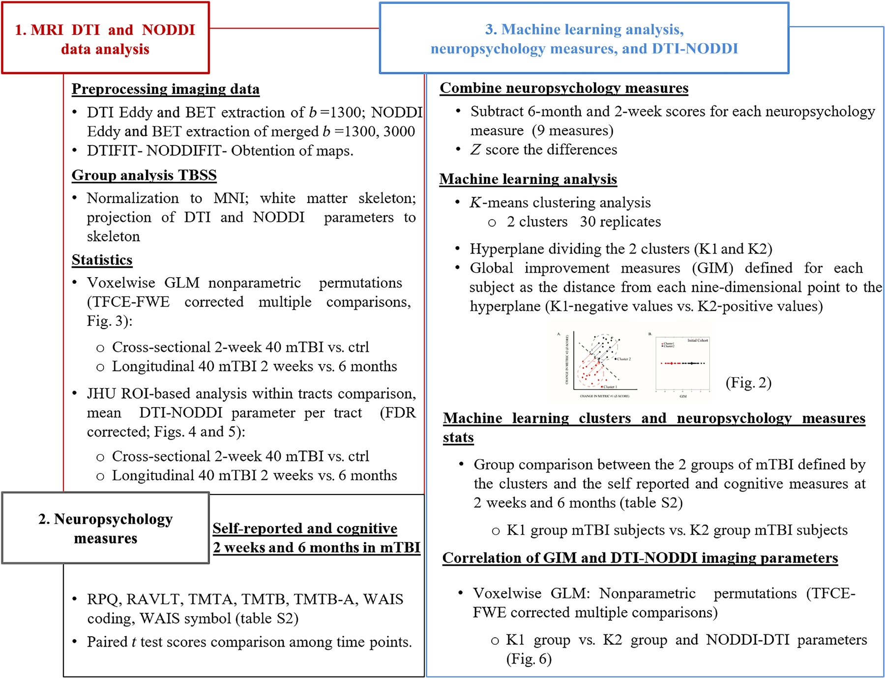
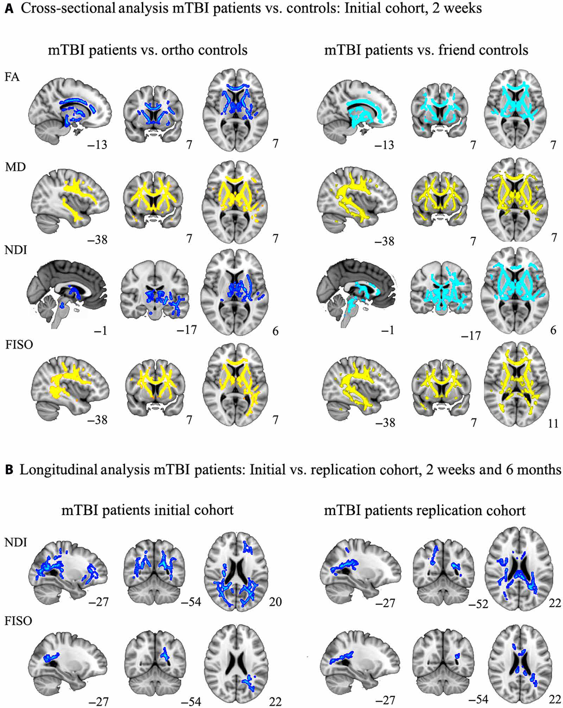
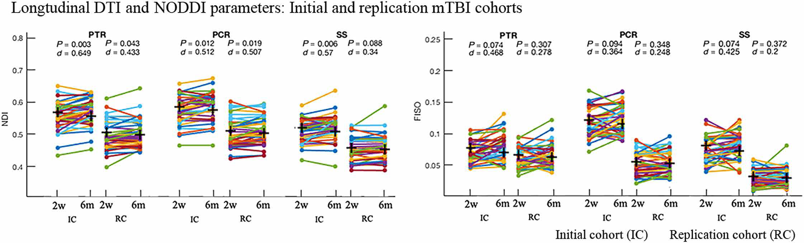
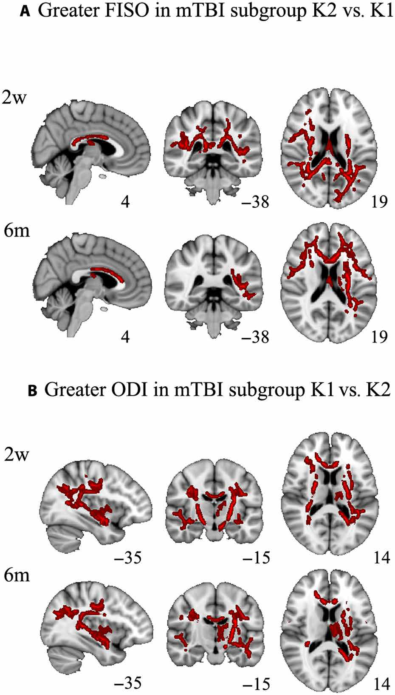

# 轻度创伤性脑损伤后白质微观结构变化的演变：一项纵向 DTI 和 NODDI 研究

## 研究背景与目的

*   **研究背景**

    *   轻度创伤性脑损伤（mTBI）会导致白质轴突剪切损伤，影响长期认知、神经精神和社会功能，但缺乏可靠的客观工具来测量这种病理变化，阻碍了临床转化。

    *   扩散张量成像（DTI）是研究中枢神经系统白质微观结构特性的常用技术，但传统 DTI 指标不能直接对应于潜在组织的生物物理有意义参数，且假设单一微结构隔室内的高斯扩散，对复杂白质微观结构不敏感。

    *   神经突方向分散和密度成像（NODDI）是一种更先进的多隔室扩散模型，可测量细胞内、细胞外和自由水三种微结构环境的特性，如神经突密度指数（NDI）、方向分散指数（ODI）和各向同性扩散隔室的体积分数（FISO），已在动物和人类大脑的组织病理学研究中得到验证。

*   **研究目的**

    *   利用 DTI 和 NODDI 研究 mTBI 后白质微观结构的纵向变化。

    *   探讨这些白质微观结构变化对 mTBI 后症状和认知结果的预后意义。

    *   用不同条件下获取的独立验证数据集复制研究的纵向部分，证明结果的可重复性和普遍性。

## 研究方法

*   **研究对象**

    *   **初始队列**：40 例 mTBI 患者，年龄 30.35±7.50 岁，9 女 31 男，受伤后 24 小时内纳入，符合美国康复医学会 mTBI 标准，排除严重多发伤、MRI 禁忌症等。

    *   **复制队列**：40 例 mTBI 患者，年龄 34.38±11 岁，11 女 28 男，来自同一 TRACK-TBI 项目，招募标准相同。

    *   **对照组**：14 例骨科创伤对照组（年龄 31.71±10.14 岁，6 女 8 男）和 19 例健康对照组（年龄 36.33±13.5 岁，6 女 13 男）。

*   **神经心理学评估**

    *   在受伤后 2 周和 6 个月使用自我报告和基于表现的认知测量工具评估 mTBI 后常见受影响的神经心理领域，包括 Rivermead 脑震荡后症状问卷（RPQ）、Rey 听觉言语学习测试（RAVLT）、连线测试 A 和 B（TMTA、TMTB）、韦氏成人智力量表（WAIS）编码和符号搜索子量表。

*   **图像采集**

    *   **初始队列**：在 3T GE MR750 扫描仪上进行扫描，受伤后 2 周（13.30±2.10 天）和 6 个月（184±8.86 天）获取全脑扩散 MRI，使用多切片单次激发自旋回波平面回波脉冲序列，b 值分别为 1300 和 3000 s/mm²，以及 T1 加权、T2 \* 加权和 FLAIR 图像。

    *   **复制队列**：在 3T 西门子 Magnetom Skyra 扫描仪上进行扫描，使用单次激发自旋回波 EPI 图像，多带宽因子为 3，b 值分别为 1000 和 3000 s/mm²。

*   **MRI 图像处理与分析**

    *   **放射学发现**：由认证神经放射学家对结构 MRI 图像进行解读，使用 NIH 常见数据元素进行 TBI 病理解剖分类。

    *   **扩散张量成像**：使用 FSL 软件对 DTI 数据进行预处理和分析，包括涡流畸变和运动校正、颅骨剥离，计算 FA 和 MD 等参数。

    *   **多隔室生物物理扩散模型**：使用 NODDI 工具包推导 NODDI 指标，包括 NDI、ODI 和 FISO，对扩散加权图像进行归一化处理，以考虑不同 b 值下 TE 的微小差异。

    *   **基于束的空间统计（TBSS）白质体素 - wise 分析**：将 FA 数据对齐到共同模板，生成平均 FA 白质骨架，进行体素 - wise 统计分析，使用置换测试校正多重比较。

    *   **基于 TBSS 白质感兴趣区（ROI）的分析**：使用约翰霍普金斯大学白质束图谱获取 12 个主要束的掩码，计算每个受试者 WM 骨架和每个骨架化 ROI 的平均 FA、MD、ODI、NDI 和 FISO 值。

    *   **机器学习分析**：使用无监督 k - 均值聚类分析推导认知和症状改善指标（GIM），将神经心理学测量的变化分数组合成单一综合指标，进行体素 - wise 比较。

    
    <!-- 
 -->
    

    图一 横向、纵向DTI & NODDI参数对比
    

## 研究结果

*   **神经心理学评估结果**

    *   患者自我报告 RPQ 脑震荡后症状和 GOSE 残疾程度显著降低，但部分患者在 6 个月时仍有持续症状和残疾。

    *   患者在 6 个月期间处理速度（TMT）和视觉感知联想学习（WAIS 编码和符号）表现有所改善。

*   **DTI 和 NODDI 体素 - wise 组间比较**

    *   **横截面分析**：与对照组相比，初始 mTBI 队列在胼胝体膝部和体部、内囊前后肢、放射冠前部、丘脑前辐射、外囊和扣带等区域 FA 降低，MD 升高，FISO 升高，NDI 降低。

    *   **纵向分析**：在初始和复制 mTBI 队列中，NDI 在放射冠前后部、丘脑后辐射、下纵束、下额枕束、丘脑前辐射、外囊和钩束等区域随时间降低，FISO 在放射冠后部随时间降低，NODDI 指标对后束的进行性微结构损伤比 DTI 更敏感。

    
    
    <!-- 
 -->
    

    图二 横向、纵向DTI & NODDI参数对比
    

*   **机器学习分析结果**

    *   基于 GIM 将 mTBI 患者分为两个清晰的集群，K1 组（恢复较少）和 K2 组（恢复较多）。

    *   在初始队列中，K2 组与 K1 组相比，FISO 在受伤后 2 周主要在后部区域升高，6 个月时主要在前部区域升高；K1 组与 K2 组相比，ODI 在中央 WM 束的大部分区域升高，且在 6 个月时右内囊的 ODI 升高消失。

    *   复制队列中，基于 GIM 的分组未发现 DTI 或 NODDI 指标的显著差异。

    
    <!-- 
 -->
    

    图三 基于机器学习聚类的DTI & NODDI参数组间差异对比
    

## 讨论

*   **主要发现总结**

    *   mTBI 后早期 FA 和 NDI 降低，MD 和 FISO 升高，提示早期白质微观结构损伤和水肿。

    *   纵向变化表现为 NDI 和 FISO 随时间降低，表明轴突变性和水肿消退，NODDI 对 mTBI 引起的进行性 WM 变性比 DTI 更敏感。

    *   机器学习分析显示，WM 纤维方向分散度降低与认知功能较差相关，动态升高的 FISO 与症状恢复和认知功能改善相关。

    *   研究结果在复制队列中得到验证，证明了 NODDI 作为 mTBI 生物标志物的稳健性。

*   **与其他研究的比较**

    *   本研究的横截面 DTI 结果与先前 mTBI 的 DTI 研究一致，NODDI 分析揭示了早期轴突损伤和水肿，而先前一项针对年轻运动员的横截面研究结果不同，可能与损伤机制不同有关。

*   **临床意义**

    *   NODDI 参数可作为 mTBI 后白质微观结构病理的敏感成像生物标志物，有助于 mTBI 的诊断、预后和治疗监测。

    *   受影响的后白质区域在结构连接组中具有重要作用，可能与 mTBI 后的感觉和认知障碍有关。

    *   ODI 可能对病前智力功能敏感，可作为认知储备的指标。

*   **局限性**

    *   对照组样本量小，缺乏纵向成分。

    *   无法排除认知评估中学习成分的影响。

    *   FISO 作为血管源性水肿的解释需要进一步验证。

    *   TBSS 分析局限于主要 WM 通路的核心，可能牺牲了半球不对称的信息。

## 结论

本研究表明，NODDI 参数是 mTBI 后白质微观结构病理的敏感成像生物标志物，早期 FA 降低和 MD 升高与 FISO 升高相关，反映炎症性血管源性水肿，长期变化表现为 NDI 降低，提示轴突变性。NODDI 比 DTI 更能敏感地检测 mTBI 引起的 WM 微观结构变化，为 mTBI 的诊断、预后和治疗监测提供了有价值的工具。未来需要更大样本量的研究来验证 NODDI 生物标志物，并结合 WM 和灰质的 NODDI 测量来更好地表征 mTBI 患者。

## 参考文献

Palacios E M, Owen J P, Yuh E L, et al. The evolution of white matter microstructural changes after mild traumatic brain injury: A longitudinal DTI and NODDI study\[J]. Science advances, 2020, 6(32): eaaz6892.

### 序列开发

本文涉及到关键技术NODDI重建以及基于TBSS的白质弥散分析，如果你有关于NODDI序列及定量分析的疑问，请留言或者加作者微信，可提供技术指导。

### 后处理代码及指导

如果你有相关数据，需要数据后处理服务，后处理代码或者技术指导，请加作者微信，提供有偿支持。

### 关注点赞

微信：Chushanzhishi2022
微信公众号：NMR凯米小屋
作者B站：楚山之石
CSDN: 楚山之石
知乎: 楚山之石