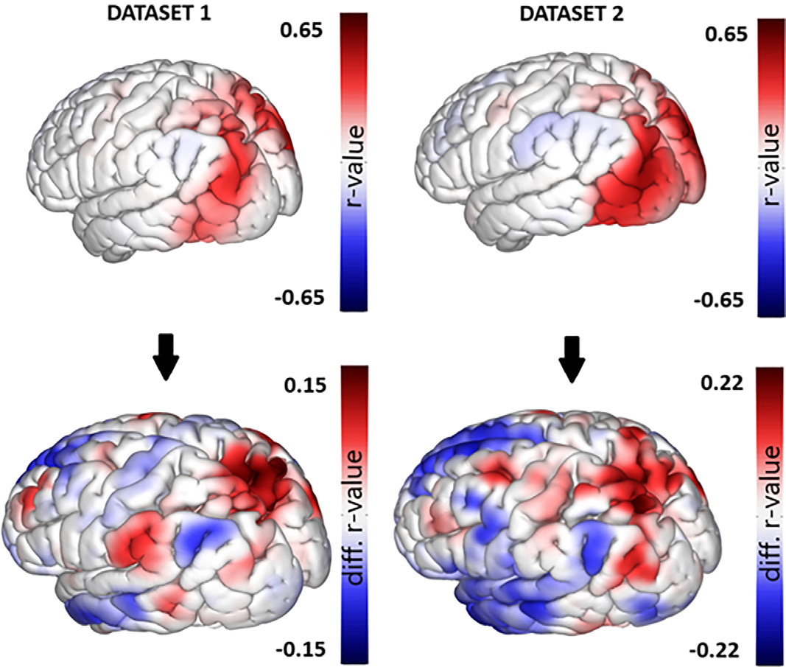
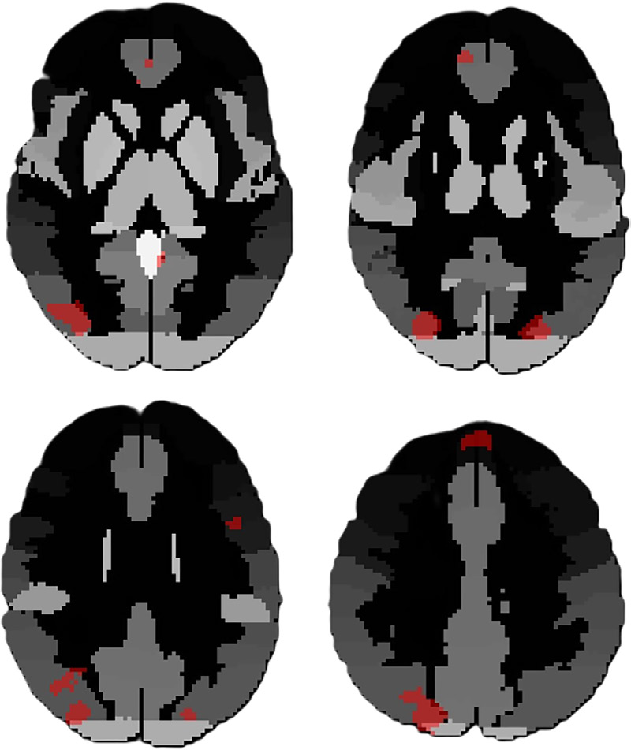
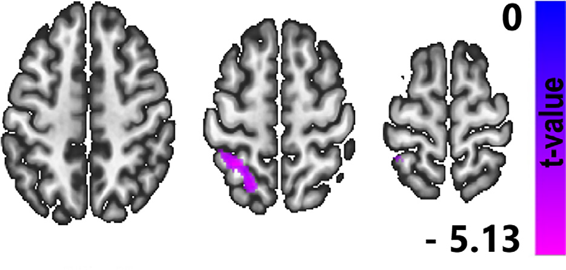

# 重复性爆炸暴露对特种作战部队成员脑功能及皮层体积的影响

## **研究背景与目的**

创伤性脑损伤（TBI）对军事人员的脑结构和功能具有显著影响，尤其是频繁面临爆炸暴露的特种作战部队成员。尽管已有研究关注单次爆炸的影响，但重复性爆炸暴露与神经影像标记物、累积损伤严重程度及长期症状的关系尚未明确。本研究旨在探究爆炸暴露频率、持续性临床症状与脑 MRI 观察到的皮层体积及功能连接（FC）变化的关系，为理解重复性爆炸创伤的神经机制提供依据。

## **研究方法**

### **1. 研究队列与分组**

*   **参与者**：纳入 2021 年 1 月至 2023 年 5 月期间 220 名有重复性爆炸暴露史的特种作战部队成员，最终 212 人符合标准（排除 MRI 运动伪影或协议不全者）。

*   **对照组**：从 SRPBS 多疾病 MRI 数据库中提取 212 名年龄、性别匹配的健康对照。

*   **暴露分组**：基于爆炸暴露计数 5（BEC5）中位数 1800，将参与者分为高暴露组与低暴露组，使用数据集 1（n=161）建模，数据集 2（n=51）验证。

### **2. 临床评估**

*   **症状量表**：神经行为症状量表（NSI）、创伤后应激障碍清单（PCL-5）、患者健康问卷（PHQ-8）等。

*   **爆炸暴露评估**：通过《爆炸暴露阈值调查》量化终身爆炸暴露频率与强度。

### **3. 神经影像采集与分析**

*   **设备**：3T 西门子 MRI 扫描仪，获取结构像与静息态功能 MRI（fMRI）。

*   **影像处理**：

    *   使用 CONN 与 SPM 软件预处理 fMRI 数据（去噪、头动校正等）。

    *   **功能连接分析**：基于体素的多元模式分析（fc-MVPA）与种子点连接分析，探究组间 FC 差异。

    *   **体积分析**：使用哈佛 - 牛津图谱提取外侧枕叶皮层（LOC）灰质体积，通过 Mann-Whitney U 检验比较组间差异。

### **4. 统计模型**

*   **临床与影像关联**：多元线性回归分析 NSI、PCL-5 与 FC 的相关性。

*   **预测模型**：逻辑回归基于 fMRI 数据分类高 / 低暴露组，计算灵敏度、特异性与准确性。

## **研究结果**

### **1. 参与者特征**

*   **人口学**：平均年龄 43.0±8.6 岁，99.5% 为男性，96.7% 为白人，67.45% 现役。

*   **临床症状**：高暴露组 NSI（t=3.16, P<0.001）、PCL-5（t=2.72, P=0.01）评分显著更高，提示更严重的神经行为与心理症状。

### **2. 功能连接（FC）变化**

*   **差异脑区**：高暴露组在双侧上下外侧枕叶皮层（LOC）、额内侧皮层、左额上回、楔前叶 FC 显著改变（P<0.001-0.04）。

*   **临床 - 影像关联**：NSI 与 PCL-5 评分与 LOC、顶上小叶、楔前叶及默认模式网络（DMN）的 FC 呈负相关（r=-0.163\~-0.384, P<0.001-0.04）。

### **3. 皮层体积变化**

*   **LOC 体积增加**：高暴露组双侧上下 LOC 体积显著大于低暴露组（P=0.01-0.04）及健康对照组（P=0.02-0.032）。

*   **一致性验证**：数据集 1 与数据集 2 结果一致，高暴露组 LOC 体积增加具有可重复性。

### **4. 预测模型效能**

*   基于 fMRI 的逻辑回归模型分类高 / 低暴露组的灵敏度 88.00%（95% CI:78.00-98.00），特异性 67%（95% CI:53.00-81.00），准确性 73%（95% CI:60.00-86.00）。

## **关键发现解读**

### **1. 重复性爆炸暴露对脑功能的影响**

*   **视觉与默认模式网络异常**：LOC 参与视觉处理，其 FC 降低可能与爆炸相关视觉功能障碍有关；DMN（楔前叶、内侧前额叶等）FC 降低与创伤后认知、情绪调节异常（如 PTSD）相关。

<!-- 
 -->

图一 功能连接多元模式分析（fc-MVPA）组间差异分析

*   **临床症状的神经基础**：NSI 与 PCL-5 评分越高，LOC 及 DMN 的 FC 越弱，提示爆炸暴露通过破坏脑网络连接加剧症状。
  

<!-- 
 -->

图二 高、低爆炸暴露组间存在显著差异的脑区

### **2. 皮层体积变化的机制**

*   **LOC 体积增加的双重意义**：可能是对爆炸损伤的代偿性重塑（如胶质细胞增生），也可能反映慢性炎症或水肿。

*   **与健康对照的差异**：高暴露组 LOC 体积较健康人增大，而低暴露组无差异，提示体积变化与暴露剂量相关。

### **3. 影像预测模型的临床价值**

*   **无明显解剖异常时的功能标记**：模型在常规 MRI 未见结构异常时仍能通过 FC 区分暴露组，为爆炸相关脑损伤的早期诊断提供新方法。

<!-- 
 -->

图三 神经行为症状量表（NSI）评分对功能连接的影响

## **讨论与临床启示**

### **1. 与既往研究的关联**

*   本研究发现 LOC 与 DMN 的 FC 异常与既往轻度 TBI 研究一致，证实重复性爆炸暴露可累积性损伤脑网络。

*   体积分析显示 LOC 增厚，可能与爆炸导致的髓鞘损伤或星形胶质细胞增生有关，与创伤后皮层重塑理论相符。

### **2. 局限性与未来方向**

*   **局限性**：缺乏无爆炸暴露的内部对照组，依赖自我报告的爆炸暴露数据可能引入偏倚。

*   **未来方向**：结合多模态影像（如弥散张量成像、PET）与纵向随访，深入解析爆炸损伤的动态神经机制。

### **3. 临床应用前景**

*   **早期筛查**：fMRI 功能连接分析可作为爆炸相关脑损伤的无创筛查工具，尤其适用于无明显结构异常的患者。

*   **精准干预**：针对 LOC 与 DMN 的神经调控治疗可能改善爆炸暴露后的认知与情绪症状。

## **结论**

重复性爆炸暴露导致特种作战部队成员脑功能连接（LOC、DMN 等区域）与皮层体积（LOC）发生特异性改变，且与神经行为症状密切相关。基于 fMRI 的预测模型证实，即使在常规 MRI 无结构异常时，功能连接变化仍可作为爆炸创伤的敏感标记。这些发现为理解爆炸相关脑损伤的病理机制及开发精准诊疗策略提供了重要依据。

## **参考文献**

Diociasi A, Iaccarino MA, Sorg S, et al. Distinct functional MRI connectivity patterns and cortical volume variations associated with repetitive blast exposure in special operations forces members. Radiology. 2025;315(1):e233264. DOI:10.1148/radiol.233264

## 感谢关注

### 后处理代码及指导

如果你有相关数据，需要数据后处理服务，后处理代码或者技术指导，请加作者微信。

### 关注点赞

微信：Chushanzhishi2022
微信公众号：NMR凯米小屋
作者B站：楚山之石
CSDN: 楚山之石
知乎: 楚山之石