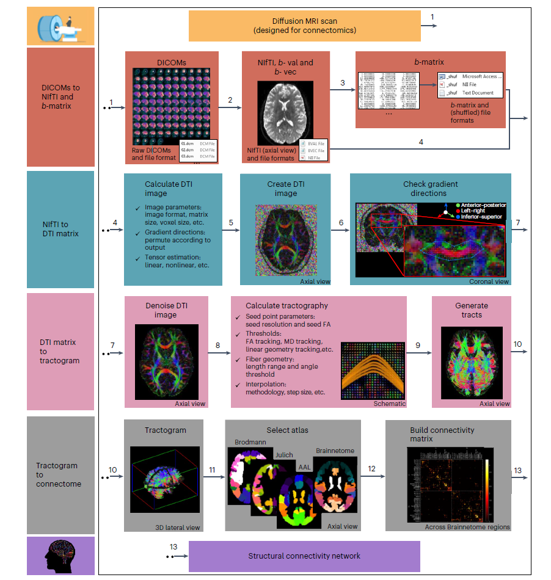
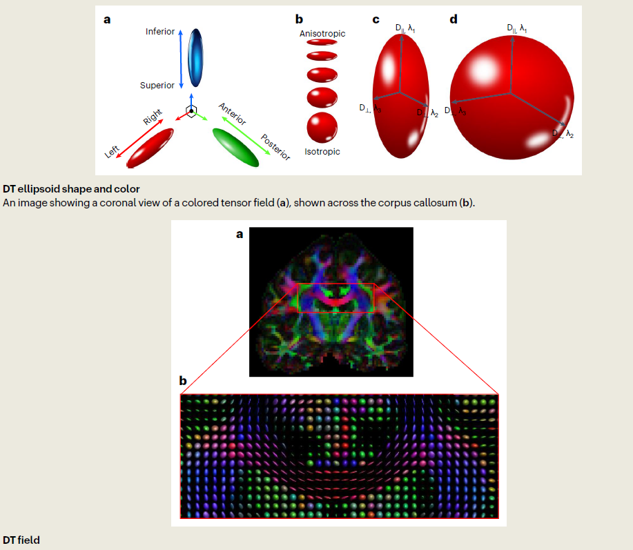
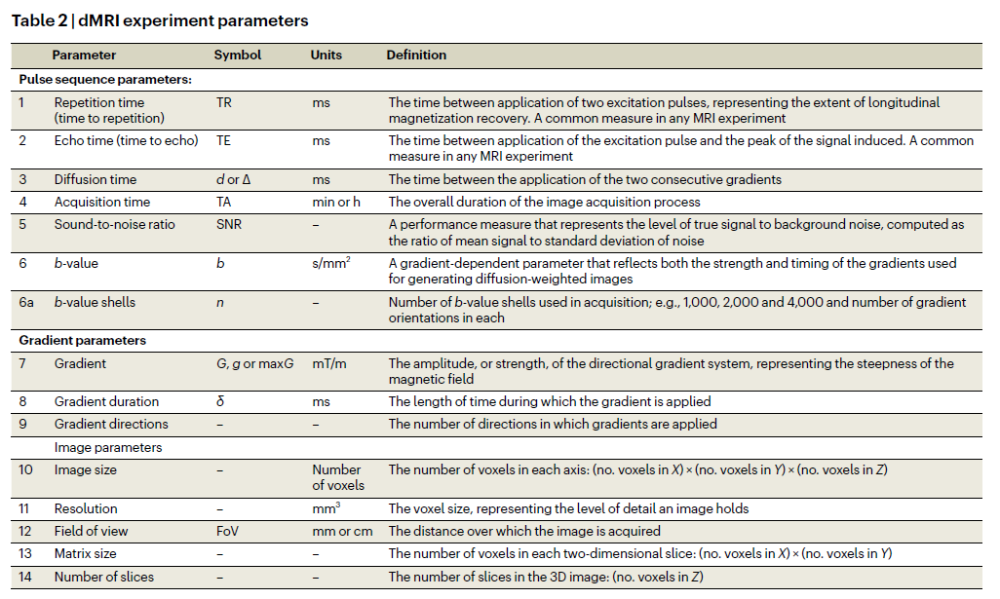
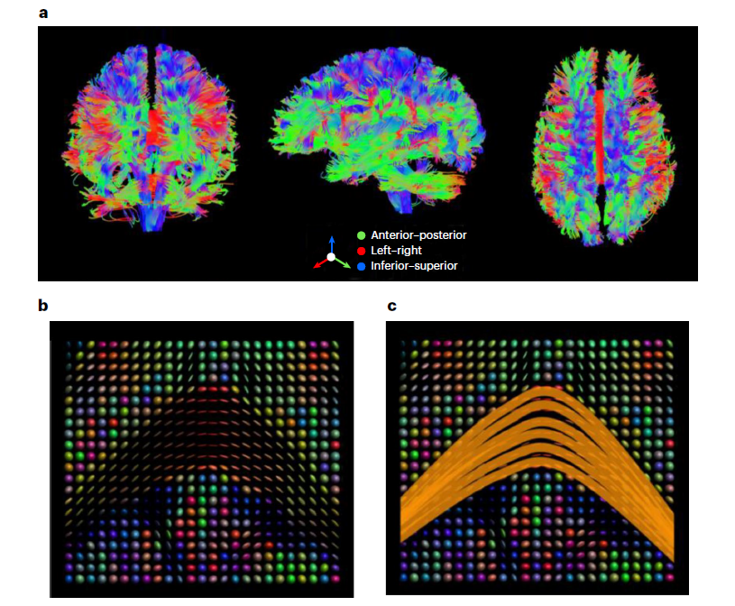
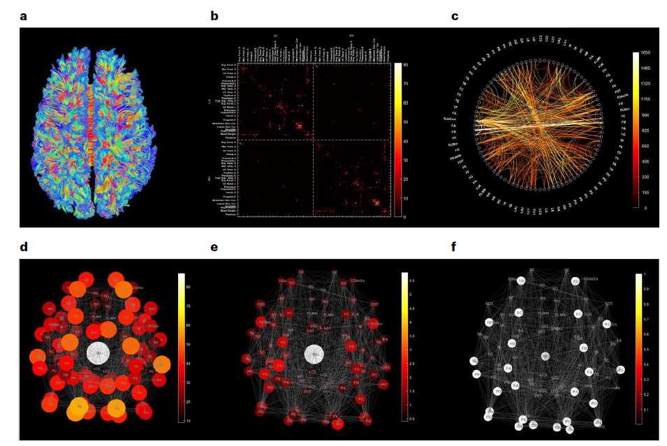

# 扩散 MRI 与结构连接组学：从原理到应用

## 一、研究背景与目的

扩散磁共振成像 (dMRI) 作为一种能在微米尺度测量活组织内水分子位移的成像技术，自 20 世纪 90 年代初发展以来，其应用领域不断拓展，尤其在从神经纤维轨迹推断结构连接组学方面展现出重要价值。然而，dMRI 技术的灵活性导致存在数十种采集和分析流程，这给缺乏图像处理和统计专业知识的新手带来了选择合适研究路径的困难。

本指南旨在为神经科学领域的研究生和研究人员提供入门指导，无论其神经影像学和计算工具背景如何，都能了解如何将 dMRI 这一新方法整合到研究中。指南聚焦于 dMRI 在神经可塑性和连接组学中的应用，不仅提供 dMRI 基本方法的简要概述，还详细阐述从实验设计到结构网络分析的全流程。

<!-- 
 -->

图一 扩散 MRI 与结构连接组学数据处理流程

## 二、dMRI 基础原理与关键参数

### （一）dMRI 技术原理&#xA;

dMRI 的脉冲序列称为脉冲梯度自旋回波 (PGSE)，由正常自旋回波序列加上两个磁梯度脉冲组成。第一个梯度脉冲在 90° 射频脉冲后出现，第二个梯度脉冲的磁方向反转，在 180° 射频脉冲后出现。dMRI 实验由多个参数定义，包括脉冲序列相关参数、梯度相关参数以及图像采集相关参数。

dMRI 的核心在于通过测量水分子的位移来反映组织微观结构。其输出图像为扩散加权图像 (DWI)，反映水分子的位移情况，且水分子的扩散率与 DWI 信号呈反比关系：水分子位移范围短、扩散率低则 DWI 信号强，反之则信号弱。

### （二）关键参数及其临床应用&#xA;

1.  **表观扩散系数 (ADC)**

ADC 代表计算得到的水分子在施加梯度方向上的扩散系数，通常从 DWI 图像中通过三个垂直 DWI 采集的对数平均提取。ADC 值与水分子扩散率呈正相关，在 ADC 图像中，强信号表示长位移范围和高扩散系数，弱信号表示短位移和低扩散系数。

不同组织的 ADC 值差异显著：脑脊液 (CSF) 的 ADC 值最高，为 2.4-4.4×10⁻³ mm²/s；灰质 (GM) 次之，为 1.05-2.4×10⁻³ mm²/s；白质 (WM) 的 ADC 值最低，为 0.6-1.05×10⁻³ mm²/s。这是由于不同组织的微观结构对水分子扩散的限制程度不同，CSF 作为液体，细胞外结构限制最少；GM 中神经元胞体和树突分布，限制程度增加；WM 中髓鞘包裹的轴突纤维高度有序排列，对水分子扩散的限制最强。

ADC 的临床应用最早体现在早期脑卒中的检测上。脑卒中发生后，受影响组织因细胞肿胀等一系列事件，ADC 值会降低，这为脑卒中的早期诊断提供了重要依据。不过，由于 ADC 难以精确量化和解释，且有更适用的参数如 MD 和 FA 可供使用，目前 ADC 的应用已逐渐减少。

2.  **平均扩散率 (MD)**

MD 是水分子在三个垂直运动方向上的平均表观扩散系数，它与 ADC 概念相似，但通过扩散张量 (DT) 计算得出，而非直接从 DWI 图像获取。这一特点使得 MD 具有旋转不变性，能更准确地估计扩散系数，尤其在各向异性高的区域表现更优。

在白质中，MD 的特征值约为 0.7-0.8×10⁻³ mm²/s，在灰质中则大于 0.8×10⁻³ mm²/s。MD 是探索神经组织长期结构重塑（即神经可塑性）的极佳参数。神经可塑性涉及特定任务相关区域神经元之间突触活动的增强和减弱，相关区域重塑后 MD 值会发生变化。例如，空间学习会诱导海马体部分区域的突触活动增强，伴随神经胶质细胞形态重塑和肿胀，导致 MD 值微妙下降 1-5%，这种变化归因于细胞密度增加对水分子运动的限制，且该现象具有高敏感性、特异性和持久性，可在任务后数分钟到数周内持续存在。

此外，多种神经系统疾病如脑卒中、阿尔茨海默病和癫痫等也会表现出 MD 值的变化，进一步凸显了 MD 在神经科学研究和临床诊断中的重要性。

3.  **分数各向异性 (FA)**

FA 表示水分子向单一方向扩散的方向性程度或趋势。当扩散各向异性高时，DT 呈更椭圆的方向性，这是因为轴向扩散率高于径向扩散率。FA 值无单位，范围在 0 到 1 之间，0 表示完全各向同性（方向均匀），1 表示完全各向异性（方向单一）。

脑脊液的 FA 值低，因为其中的水分子可在所有方向自由移动；白质的 FA 值较高，因为其中的水分子在轴突纤维方向移动更自由，垂直方向移动受限。FA 在灰质中的特征值约为 0.1-0.2，在白质中大于 0.3。FA 为探索白质的健康神经解剖结构、其发育以及因衰老和各种退行性临床疾病导致的退化提供了定量测量方法。

然而，FA 在纤维方向和组织排列异质的区域（如纤维交叉处）存在固有伪影，且由于对单个体素内多个纤维方向的平均，其对细胞结构各向异性的敏感性受到方向分散的限制。近年来，其他模型已逐渐取代 FA 成为提取类似信息的首选分析方法。

<!-- 
 -->

图二 扩散张量成像

1.  **微观分数各向异性 (microFA)**

为克服 FA 计算中的固有缺陷，开发了微观 FA (microFA)。它通过先进的建模技术，考虑体素内结构的形状和方向等微观结构特征，引入了一种替代的采集和分析流程，以独立于方向分散来量化扩散各向异性。

microFA 利用粉末平均法，计算球体上均匀分布方向的平均 dMRI 信号，从而克服了限制 FA 对复杂组织（如 WM 纤维分散）敏感性的部分容积效应 (PVE)。在纤维交叉和大纤维束交点等区域，FA 值低而 microFA 值高，二者差异显著。此外，microFA 在临床应用中可用于区分脑肿瘤类型，如脑膜瘤和胶质母细胞瘤，通过二者 FA 和 microFA 的差异，可推断肿瘤中是否存在无序的各向异性结构，表明 microFA 可作为 FA 的补充工具。

## 三、dMRI 实验设计

### （一）实验设计通用考虑&#xA;

不同的 dMRI 实验根据其设计目的使用不同的成像参数组合。所有实验设计的共同之处在于需要通过最小化回波时间来减少伪影和信号损失，并优化重复时间以实现合理的信噪比 (SNR)、实验时间和脑覆盖范围。其他变化的参数包括脉冲序列相关参数、梯度相关参数和图像相关参数。例如，设计测量平均扩散率 (MD) 的实验可能比设计用于纤维追踪的实验需要更少的梯度方向。

### （二）针对不同研究目的的实验设计&#xA;

1.  **MD/FA 临床研究**

过去认为一组 6 个梯度方向对 DT MRI 是最佳的，但研究表明，稳健估计 FA 需要超过 20 个梯度方向，估计 MD 和张量方向需要超过 30 个梯度方向。通常 b 值设为 1000 s/mm²，但 700-1200 s/mm² 范围内的 b 值也是合适的。

2.  **神经可塑性研究**

在检查神经可塑性时，精确配准至关重要。MRI 数据集必须精确空间对齐，以避免结构特征的丢失。为准确探索和解释神经可塑性的变化，所选脑图谱必须转换到个体受试者的脑空间，同时保持 MRI 数据集不变。

3.  **微观结构探索**

研究表明，使用适用于高磁场的先进技术，在 7T 下可产生高质量的 dMRI 图像，所得图像具有高达 800μm 的各向同性分辨率，适合探索纤维结构的微观结构特性。类似研究也可在 3T 下进行，但需要更长的采集时间。

4.  **轴突直径研究**

为实现全脑轴突直径信息的稳健替代测量，需要高梯度强度。包括 AxCaliber、COMMIT 和 ActiveAx 在内的不同技术都需要应用高和超高梯度，Gmax=1200 mT/m 及更高。

5.  **灰质研究**

尽管 MD 和 FA 在皮质层间变化很小，但纤维取向分布函数 (fODF) 表现出描绘皮质层的能力。图像分辨率是根据对齐纤维群的方向进行层描绘的关键。

6.  **功能性扩散研究**

在扩散加权功能性 MRI 中，快速采集是关键，它使用高敏感扩散成像来探索在功能性 MRI 所探索的血流动力学反应函数之前的扩散反应函数。

7.  **纤维追踪研究**

研究建议使用 b=3000 s/mm² 的 HARDI（高角分辨率扩散成像），具体取决于 SNR，以提供最高的角分辨率。然而，1000-3000 s/mm² 范围内更实际的 b 值也是合适的。研究还建议采集超过 45 个梯度方向，以帮助避免梯度均匀性缺陷问题并满足 SNR 要求。

8.  **连接组学研究**

为准确绘制皮质区域之间的连接，纤维追踪中的解剖学停止标准必须允许流线进入皮质灰质。此外，皮质分区的选择决定了所得脑网络的细节水平。

### （三）HCP 扫描协议&#xA;

HCP 风格的扫描协议适用于大多数 dMRI 应用。尽管 HCP 风格的扫描对于如 MD 等应用可能被认为过度，但它们特别适用于结构连接组学。研究型 MRI 扫描仪通常具有比临床扫描仪更强的梯度系统，从而产生更好的扩散加权，因此更适合连接组学目的。3T 和 7T MRI 扫描仪的扫描协议可在[HCP 官网](https://www.humanconnectome.org/hcp-protocols)获取。

<!-- 
 -->

图三 扩散成像重要实验参数定义

## 四、结构连接组学技术流程

### （一）结构连接组学研究流程概述&#xA;

一般来说，用于研究的结构连接组学流程包括以下主要步骤：

1.  根据研究问题选择 dMRI 方法；

2.  进行 dMRI 实验（MRI 扫描协议）；

3.  计算纤维取向（使用扩散张量成像 (DTI) 或非 DTI 方法）；

4.  计算全脑纤维束图（包括整个大脑的纤维束）；

5.  将纤维束图映射到图谱（皮质分区）；

6.  构建结构连接网络（连接组）。

### （二）数据处理具体步骤&#xA;

1.  **dMRI 扫描与数据转换**

进行专为结构连接组学设计的 dMRI 扫描，HCP 风格的扫描协议适用于 dMRI 的结构连接组学应用。扫描后，原始 dMRI 数据以 DICOM 图像形式存在，需使用 dcm2nii 工具将 DICOM 图像转换为 3D NIfTI 图像，并生成代表 b 值和 b 向量的两个文件。

2.  **b 矩阵处理**

将 b 值和 b 向量文件转换为 b 矩阵文本文件，如有需要，使用排序或随机插件重新排列 b 矩阵，将零值移至开头。

3.  **DTI 计算与图像加载**

使用打乱的 NIfTI 和 b 矩阵文件，通过转换为原始数据插件计算 DTI MATLAB 文件，参数根据数据（如图像大小、体素大小等）选择。加载转换后的 DTI 文件，图像视图根据方向性进行颜色编码。

4.  **梯度方向验证**

检查已知元素的梯度方向性是否准确，具体操作是加载轴和绘制工具，在选定的感兴趣区域（如胼胝体）绘制张量。若准确，胼胝体因左右纤维取向应显示为红色。

5.  **图像去噪与优化**

为提高 SNR，通过适当的插件校正受试者运动和其他畸变对图像进行去噪，去噪后图像应明显更清晰，尤其是脑外区域。

6.  **全脑纤维追踪计算**

使用正确的 DTI 文件和适当的插件计算全脑纤维追踪，计算时需要根据图像数据和用户需求选择拟合参数，例如使用 DTI 默认值或约束球面反卷积 (CSD)，此过程可能需要几分钟完成。

<!-- 
 -->

图四 全脑纤维束追踪

7.  **纤维束可视化与评估**

加载包含纤维束的所得 MATLAB 文件以查看生成的纤维束，可通过在 3D 中旋转轴来查看和进一步评估全脑纤维束图。

8.  **atlas 选择与网络构建**

选择合适的图谱（分区）从纤维束图构建网络，使用网络分析工具插件构建所选图谱上的纤维连接矩阵，所得连接矩阵代表结构连接组，可使用 Brain Connectivity 工具包或任何其他用于网络分析和可视化的软件分析各种网络特征。

### （三）常用工具与软件&#xA;

在结构连接组学研究中，有多种工具和软件可用于不同的处理和分析步骤：

*   **ExploreDTI**：用于从原始 dMRI 数据提取结构连接组的 MATLAB 工具箱，是成熟的工具包。

*   **Mrtrix**：用于提取结构连接组的另一款软件。

*   **Tractoflow**：扩散 MRI 处理流程。

*   **QSIPrep**：整合平台，用于预处理和重建扩散 MRI 数据。

*   **Micapipe**：用于多模态神经影像和连接组分析的流程。

## 五、dMRI 的不同研究方法

### （一）非参数方法：扩散峰度成像 (DKI)&#xA;

扩散峰度成像 (DKI) 是领先的非参数方法之一，旨在克服高斯位移假设，更好地描述体内细胞内和细胞外环境的复杂实际情况。随着 b 值升高或梯度更强、回波时间更长，扩散的这种异质非高斯行为变得更加明显。

为处理这些偏差，DKI 使用称为峰度 (K) 的统计量来测量与高斯分布的偏差或分布的 “尾部”。当 K=0 时，无偏差，分布被视为高斯分布；负峰度 (K<0) 表示比高斯分布更 “胖” 且 “峰” 更少的分布；正峰度 (K>0) 表示比高斯分布更 “瘦” 且更 “峰” 的分布。大多数生物组织以 K>0 为特征，因为其中的水分子由于位移能力受限而经历有限运动。

使用 DKI 的研究表明，它作为一种独立且互补的 dMRI 技术做出了贡献，揭示了更好的白质表征以及在评估病理、疾病进展和治疗反应方面更高的敏感性和特异性。

### （二）参数方法：生物物理模型&#xA;

生物物理模型利用扩散率与高斯行为的偏差，使用多个 b 值对各种组织成分进行建模。模型需要对组织几何形状、扫描参数和扫描期间水分子的预期位移做出一系列假设和近似，这些假设和近似允许信号衰减的数学简化。

在这些方法中，假设组织由几个不同的生物物理成分组成，这些成分之间可能存在或不存在相互作用（交换）。例如，灰质组织可建模为一组球体（代表细胞）和无序圆柱体（代表神经突起）；细胞外空间可首先近似为高斯扩散；在白质中，可添加其他因素，因为神经元突起（轴突）被包装，引入其他参数如包装密度和直径分布。

1.  **轴突密度估计相关模型**

*   **复合阻碍和限制扩散模型 (CHARMED)**：将 dMRI 信号建模为阻碍和限制扩散成分的信号衰减的线性组合，乘以它们相应的体积分数。

*   **神经突起取向分散和密度成像 (NODDI)**：使用三个成分（包括细胞内、细胞外和 CSF）对轴突和树突的结构和方向进行建模，并利用方向分散圆柱假设等数学简化。

*   **扩散 compartment 成像中各向异性微观结构环境的分布 (DIAMOND)**：使用三个成分（包括限制、阻碍和各向同性扩散）在组织的混合生物物理和统计模型中对 dMRI 信号进行建模。

2.  **轴突直径估计相关模型**

dMRI 在特定实验条件下已证明对轴突直径敏感。虽然精确和绝对估计轴突直径可能无法实现，但一些模型使用 dMRI 提供直径信息的稳健替代测量。

*   **AxCaliber**：第一个开发用于估计轴突直径分布的生物物理模型，是 CHARMED 的扩展，将组织学中的轴突直径作为模型中的额外因素，使用伽马分布函数拟合轴突直径分布，而非预定义分布，增加了模型复杂性，需要额外的优化方法。最初 AxCaliber 通过强制采集垂直于纤维取向来简化实现，但这导致对小轴突的敏感性降低，且分离阻碍和限制成分的能力有限，后扩展到 3D 形成 AxSI，提高了在连接组学中的适用性，可估计所有纤维系统的轴突直径，支持体内探索全脑信息传递机制。

*   **COMMIT**和**ActiveAx**：结合分散以提高估计轴突直径分布的准确性。

### （三）dMRI 采集技术分类&#xA;

dMRI 采集技术可分为单壳和多壳两类：

*   **单壳采集**：涉及单个非零 b 值，通常用于基本 DTI 分析或 HARDI 实验（如 b=1000 s/mm²）。

*   **多壳采集**：涉及多个非零 b 值，用于 HARDI（如解决纤维交叉）、DKI 和生物物理模型（如 CHARMED 和 AxCaliber）。

## 六、结构连接组学中的纤维追踪技术

### （一）纤维追踪的不同方法&#xA;

所有纤维追踪技术都涉及根据从 dMRI 估计的局部主方向重建纤维轨迹流线。

1.  **确定性纤维追踪**

使用线传播算法描绘白质通路，线传播过程从识别合适的起始种子点开始，然后沿估计的纤维束取向传播，直到满足纤维束终止标准。确定性纤维追踪的主要限制是它从每个种子点提供白质束的单一估计，没有任何路径估计可能性或置信度的指示。

2.  **概率性纤维追踪**

设计用于处理确定性纤维追踪的限制，通过使用概率分布为路径分配可能性。这些算法考虑到 dMRI 中的噪声会导致线传播错误，这反过来会对所得重建纤维束产生显著的累积影响。然而，概率性纤维追踪并不被认为比确定性纤维追踪更精确，因为它使用相同的基本因此也存在类似的缺陷。一些概率性纤维追踪算法在局部尺度上使用贪心优化技术，这会导致处理时间延长，而另一些算法则从 ODF 中使用随机方向选择，从而提高了效率。

3.  **全局纤维追踪**

全局纤维追踪是一类在概念和方法上都与流线纤维追踪不同的纤维追踪算法。它涉及使用贪心算法找到最能解释测量的 DWI 数据的完整纤维轨迹配置，同时重建所有纤维。每个纤维段都被视为一个模型参数，该参数作为单个各向同性高斯模型起作用。然后优化这些参数以形成更长的段链或纤维轨迹，且整体曲率较低。这种方法的主要限制在于这类算法的贪心和耗时性质。尽管如此，全局纤维追踪已被证明能更好地处理噪声数据集，并更准确地重建复杂的纤维解剖结构，从而生成密度值与测量数据更直接相关的纤维束图。

4.  **基于感兴趣区域 (ROI) 的纤维追踪**

上述方法涉及全脑纤维追踪以推断大脑结构连接，而基于 ROI 的纤维追踪则并非为连接组学设计，而是针对特定的纤维结构。它专注于仅追踪选定的纤维组，如视辐射或皮质脊髓束，其种子点和评估方法会根据成像需求以及所检查纤维结构的位置和解剖结构而相应地有所不同。

### （二）纤维追踪的高级技术&#xA;

1.  **高角分辨率扩散成像 (HARDI)**

HARDI 常作为高级 dMRI 扫描协议使用，通过利用 q 空间的高分辨率来更好地捕捉交叉纤维。使用具有多个 b 值壳的高角分辨率可创建更高清晰度的图像，这需要非 DTI 重建技术，如球棍模型 (BAS) 和约束球面反卷积 (CSD)。

*   **球棍模型 (BAS)**：这是一种流行的概率性纤维追踪方法，利用 HARDI 信号的几何特征将轴突建模为具有单一半径和不可渗透膜的圆柱体，同时假设轴突外的扩散是各向同性的。BAS 将信号分解为完全各向同性的部分（球）和完全各向异性的部分（棍），此后还提出了类似模型作为 BAS 模型的扩展，如球拍模型。

*   **约束球面反卷积 (CSD)**：这是另一种流行的纤维追踪方法，基于称为球面反卷积的数学运算，该运算从两个现有函数生成第三个函数。CSD 将 HARDI 信号表示为两个函数在球坐标上的卷积运算：一组单一取向纤维的信号（即响应函数）和纤维取向分布 (FOD)，其结果是对每个体素中纤维取向分布的估计。

2.  **其他高级技术**

在最近的应用中，通过从白质和灰质表面的交点处播种纤维束，可显著减少纤维追踪误差。其他现代应用尝试使用白质图谱和人工智能来寻找符合逻辑的、基于知识的纤维束，但这些方法仍处于起步阶段。

### （三）纤维追踪的标准与评估&#xA;

1.  **纤维追踪标准**

无论采用何种方法，所有纤维追踪技术都使用 dMRI 来重建纤维轨迹流线。为避免误差传播，流线的流动和停止需遵循若干标准：

*   **平滑度标准**：设置曲率阈值，限制流线估计中的最大可能弯曲，用于避免估计过度弯曲和不准确的流线，并克服交叉纤维的影响。

*   **各向异性标准**：设定阈值，限制流线向各向同性区域传播，用于避免在没有主导方向的区域（向量场无关的区域）进行流线估计。

*   **解剖学标准**：基于预期纤维束解剖学的先验知识设定的一组标准，例如预期含有灰质的区域。

对于连接组学中的纤维追踪应用，种子点和终止标准尤为重要。终止标准涉及用于确定流线端点的各种规格和阈值，包括上述的平滑度、各向异性和解剖学标准。而种子点标准则涉及种子点的数量、密度和位置，流线从这些种子点开始传播。

1.  **纤维束图评估**

评估纤维束图的准确性涉及将皮质连接模式与预期值的基准事实进行比较。这种对区域对之间连接（或无连接）的比较使用混淆矩阵进行，该矩阵使用四个参数总结分类模型的性能：真阳性（有效连接）、真阴性（无预期连接时无连接）、假阳性（无预期连接时有连接）和假阴性（有预期连接时无连接）。可从这些值中提取其他参数，如敏感性和特异性。

评估不同纤维追踪变体准确性的一个工具是 Tractometer，这是一种在线工具，可测量不同成像和处理选择对所得纤维束图的影响。然而，大多数评估通常是主观的，由神经解剖学家进行，他们可以指出纤维束是否符合逻辑。例如，当寻找特定连接（如胼胝体）时，需进行迭代的手动操作，去除虚假流线，直到达到预期的神经解剖学表现。尽管这种评估无法在大型数据集和所有重建纤维上进行，但对于任何希望使用纤维追踪的人来说，结合已知解剖结构进行这种体验至关重要，以了解虚假连接的陷阱和程度。

### （四）纤维追踪的误差与局限性&#xA;

尽管纤维追踪有许多优点，但该过程也存在一些方法学误差和局限性：

1.  **复杂几何结构重建困难**

纤维追踪中最具挑战性的问题之一是估计复杂的纤维结构，如重叠、分支和交叉路径。当路径涉及更复杂的几何结构时，由于单个体素内的值平均（PVE），从局部取向场推断连接变得越来越容易出错。交叉纤维的计算错误在联合纤维中经常可见，例如在额钳与放射冠的交点处，以及皮质脊髓束扇形区与上纵束的交点处。虽然在局部尺度上已提出一些解决交叉纤维的方案，但在全局尺度上该问题仍然存在。

瓶颈问题可能是一个更大的重建挑战，它涉及在分支成不同方向之前，解开在一个体素（或一组体素）内汇聚的纤维。瓶颈在枕叶深部白质等区域很常见，在前后方向上包含多个具有相似取向的独立白质束。

2.  **纤维轨迹边界界定困难**

由于轴突可在纤维束的任何点分裂和合并，纤维追踪在准确确定流线边界时面临挑战。终止计算错误的主要原因是与体素级方法相关的 PVE。在这种情况下，PVE 不仅包括不同取向的白质纤维出现在同一体素中的情况，还包括白质和灰质出现在单一体素中的情况。这些挑战在灰质中既存在于横向（跨皮质折叠，即脑沟 - 脑回偏差），也存在于径向（关于流线的层状起始和结束）。这一困难还导致大脑皮层被偏向性地表示为单一均质单元，忽略了其微观结构组成，此外，它还引发了关于纤维束缺乏明确定义的问题，这进一步加剧了在没有明确基准事实的情况下验证体内成像的固有困难。

3.  **极 “强” 和极细纤维束重建困难**

即使使用高分辨率图像，纤维追踪通常也会导致纤维束图中假阳性率较高，即包含的无效（不合逻辑和 / 或不连贯）纤维束多于有效纤维束。造成这一问题的主要原因之一是纤维追踪算法往往对强纤维束赋予越来越高的确定性。同时，由于难以重建直径 2mm 或更小的极细纤维束（如前连合），纤维追踪的假阴性率也很高。

## 七、结构网络构建与分析

### （一）结构网络的基本概念&#xA;

连接性研究的主要挑战是充分表示纤维追踪结果，以便在个体内部和个体之间进行量化和比较。在过去十年中，使用图论工具已成为脑连接性分析的最新技术。大脑连接图通常被建模为网络图，这是一种数学结构，使用图的边来建模不同组件之间的相互作用，这些组件表示为图的节点。

在大脑网络中，节点表示皮质（或皮质下）区域，边表示区域对之间的连接。网络图可总结为节点列表和相应的边列表。节点是具有 3D 坐标的标记顶点或空间点，边是连接两个节点的线，具有绝对或相对强度的加权值，或未加权的二进制值。边可以是无向的或有向的。

目前，连接组学领域涵盖三种类型的大脑连接：结构连接、功能连接和有效连接，每种连接都使用不同的 MRI 模式进行探索，并建模为不同类型的网络图。结构连接表示连接不同皮质区域的解剖学链接或纤维束，结构连接组使用 dMRI 纤维追踪进行测量，因此被建模为无向加权网络图，其中权重表示解剖学链接的 “强度”。

### （二）网络构建&#xA;

1.  **节点选择**

大脑网络节点应在空间上受限，并表现出一些内在一致性，如节点内细胞结构或功能的相似性，同时，节点应表现出一些外在差异或节点间连接的可变性。除了这些一般指导原则外，对于这些大脑网络单元的最佳定义尚无共识。节点的定义方式是我们寻求探索的拓扑结构的结果，专注于长距离或细粒度连接。

一方面，选择包含单个 MRI 体素的小节点将产生具有许多节点和边的非常详细的网络，但也可能包含与分辨率相关的不准确信息，这可能会掩盖更主要的连接模式；另一方面，选择大单元将产生看似不太详细的网络，节点和边较少，但可能更好地展示更主要的连接模式。例如，前者更适合探索异模态联合系统的细粒度变化，而后者更适合个体间比较。节点选择有两个基本经验法则：

*   **完整拓扑覆盖**：为获得全脑结构连接组，节点必须覆盖所有皮质区域，最好也覆盖皮质下区域。

*   **无拓扑重叠**：为真实表示每个网络节点的连接，必须避免皮质区域之间的重叠。

图谱或皮质分区是检查皮质连接模式的透镜，存在多种图谱，包括：细胞结构图谱、髓鞘结构图谱、解剖学图谱、概率图谱、随机图谱、功能图谱、数据驱动图谱、基于体素的图谱和多模态图谱。另一种分区选项涉及基于节点空间独立性的盲源分离，这种数据驱动的分区需要根据网络的同质性、准确性、可重复性或稳定性预先指定区域（或节点）的数量。为了更好地进行个体间比较，优选使用来自结构和功能连接的数据，跨模态和个体来描绘脑区。

2.  **边选择**

关于边的定义，结构连接组中连接两个节点的边的权重通常由纤维束图中连接两个相应区域的流线数量表示。使用流线数量作为权重存在偏差，因为当涉及估计复杂流线和流线端点时，这种方法容易出错（见 “纤维追踪的误差与局限性” 部分）。此外，使用流线数量作为边也固有地受到缺乏流线附加特征的限制，除了它们的存在或不存在。

理想情况下，结构连接组中的边应准确表示影响动作电位传播的轴突连接的所有特征，包括轴突髓鞘形成、长度、大小和密度。这些微观结构特征在使用流线数量作为边时缺失，而与 FA 等测量更相关。然而，尽管 FA 对轴突微观结构敏感，但它也容易受到 PVE 和轴突分散估计误差的影响。

这个问题（也称为追踪计数偏差）可通过各种技术解决，这些技术用于以更具生物学意义的方式重新加权网络中的边。一些技术基于归一化轴突直径重新加权边，使用如 COMMIT 和 AxSI 等方法；其他技术旨在通过如球面反卷积 informed 纤维束图滤波等方法增加边的生物学相关性；线性束评估是另一种纤维束滤波方法，根据每个纤维束对预测扩散数据的贡献分配权重。

为了分析所得的结构网络，加权边可以归一化、二值化或保持原样，并具有现有的流线范围。阈值选择在密集连接的网络中尤为重要，但也可以是任意的（如百分位数、平均值等）。尽管加权边被认为包含更多关于弱连接的信息，但二进制边相对更容易表征和在个体间比较。

### （三）网络分析&#xA;

将大脑连接建模为网络图的好处在于可应用图论技术来分析网络图的结构模式。更好地理解大脑网络的结构和功能需要审查其拓扑结构，大脑拓扑结构可使用网络分析工具提取。

复杂网络分析处理现实生活中的网络，这些网络既大又复杂，不同于均匀随机或有序网络。复杂网络表现出非平凡的拓扑特征，这些特征不会出现在简单网络中，如随机图。大脑网络在其节点测量中表现出这些非平凡特征，例如度分布的重尾、高聚类系数以及社区和层次结构（定义见补充表 1）。此外，图论提供了一套工具，用于对不同测量进行简单有效的个体间比较。

网络测量包括在局部尺度（子网络）上每个节点评估的测量，以及在全局尺度上对整个网络评估的测量。大脑连接的测量通常可分为三类：

1.  **中心性测量**：表示单个节点的重要性。

2.  **分离性测量**：表示节点集群中进行专门处理的能力。

3.  **整合性测量**：表示跨节点集群组合信息的能力。

小世界性是网络的一个特征，它调和了分离成处理集群的需求与跨网络整合信息的需求。小世界网络在分离成专门处理集群和跨这些集群整合信息之间保持平衡，这些网络表现出高效率，由平均最短路径的低值引起，该值大致遵循对数定律。

大脑网络不仅表现出 “小世界性”，还表现出 “富俱乐部组织”，即高度数节点也倾向于高度互连的现象，属于 “富俱乐部” 的节点被视为网络枢纽。有关具有神经生物学意义的网络测量列表，包括全局和局部的中心性、分离性、整合性和枢纽测量，请参见补充表 1（参考文献 7）。

探索结构连接的其他方法包括数据驱动的聚类和模块化，以及使用皮质梯度来映射连接趋势。预计模块化将在未来的神经影像研究中在定义网络拓扑结构方面发挥关键作用。

### （四）网络可视化&#xA;

将大脑连接建模为网络图的另一个好处是能够使用各种现有工具进行高级网络可视化。将大脑网络建模为网络图会产生两个列表：具有空间位置 (x,y,z) 的网络节点 (N) 列表，以及连接节点对的网络边 (M) 列表（节点 A，节点 B）。这些网络可以通过几种不同的方式可视化：

1.  **连接矩阵**：一个 N×N 矩阵 C，其中行和列表示网络节点，单个值 C (I,j) 表示节点 I 和 j 之间的连接强度。无向网络可视化为对称连接矩阵，有向网络可视化为非对称矩阵。

2.  **网络图**：网络的经典表示，其中节点在空间上表示为具有位置 (x,y,z) 的球体，边表示为连接节点对的线。无向网络中的边可视化为线，有向网络中的边可视化为箭头。

3.  **圆形图**：网络的圆形可视化，其中一个圆被分成扇区，代表网络节点，这些扇区通过曲线连接，代表网络边。

在所有上述方法中，边权重通常通过连接的宽度和颜色来可视化。有关用于大脑网络分析和可视化的几种有用工具箱列表，请参见表 3。

<!-- 
 -->

图五 结构连接网络分析及展示

## 八、总结与展望

dMRI 通过测量神经可塑性后的微观结构变化，以及通过连接性分析无创地可视化和量化大脑中的信息传递，为研究大脑生理学提供了机会。我们预计 dMRI 将越来越多地用于在转化脑研究中补充 fMRI 研究。

dMRI 技术在过去几十年中取得了显著进展，从基本的 DTI 到更复杂的非参数和参数方法，如 DKI 和各种生物物理模型，这些进展使我们能够更深入地了解大脑的微观结构和连接组。然而，挑战仍然存在，包括复杂纤维结构的准确重建、PVE 的影响以及连接组测量的可重复性等问题。

未来的研究方向可能包括开发更先进的算法来克服这些挑战，结合多模态成像数据以提高连接组学分析的准确性，以及将 dMRI 与其他技术（如电生理学）相结合，以更好地理解大脑功能与结构之间的关系。此外，随着计算能力的提高和大数据分析技术的发展，大规模连接组研究将成为可能，这将为我们理解大脑的组织和功能提供新的见解，并为神经系统疾病的诊断和治疗开辟新的途径。

## 参考文献
Shamir I, Assaf Y. Tutorial: a guide to diffusion MRI and structural connectomics. Nature Protocols, 2024. DOI: 10.1038/s41596-024-01052-5

## 感谢关注

### 后处理代码及指导

如果你有相关数据，需要数据后处理服务，后处理代码或者技术指导，请加作者微信。

### 关注点赞

微信：Chushanzhishi2022
微信公众号：NMR凯米小屋
作者B站：楚山之石
CSDN: 楚山之石
知乎: 楚山之石