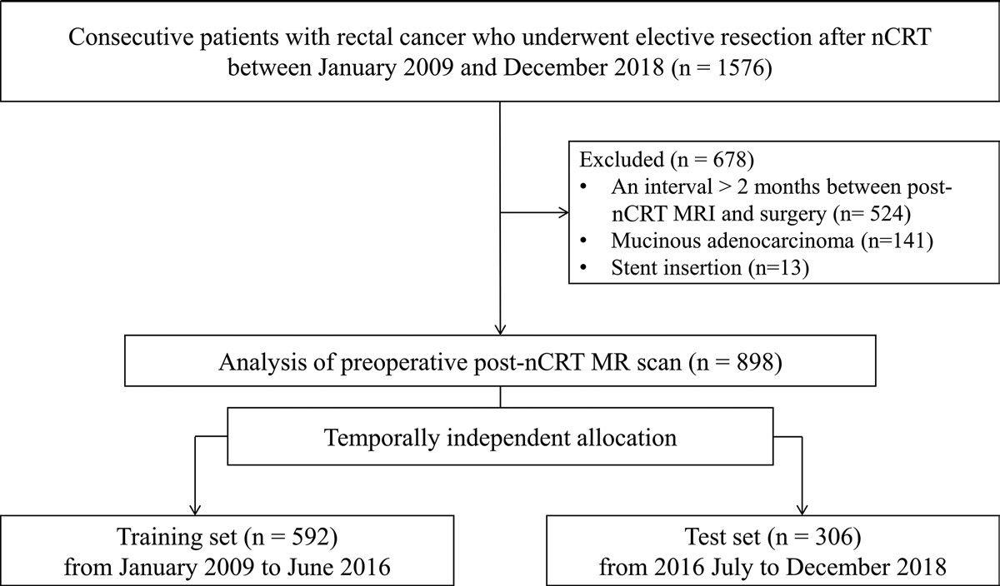
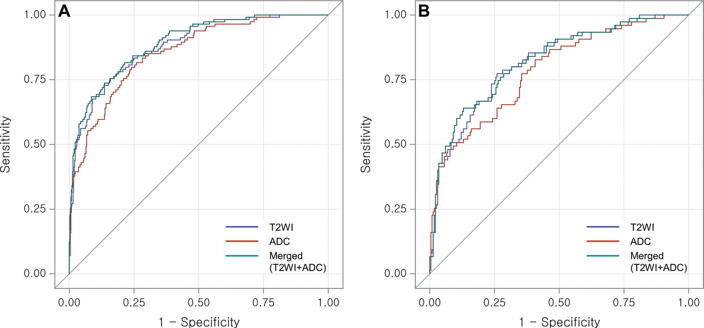
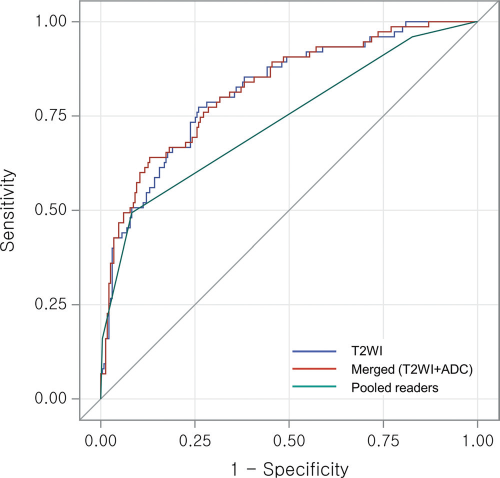

# 深度解析：MRI 放射组学模型如何精准预测直肠癌放化疗后的病理完全缓解

## 一、研究背景：临床需求与技术挑战的双重驱动

### （一）直肠癌治疗策略的关键转折点&#xA;

局部进展期直肠癌（LARC）患者的标准治疗方案为新辅助放化疗（nCRT）联合全直肠系膜切除术，但约 10%-25% 的患者在 nCRT 后会达到病理完全缓解（pCR），即组织学检查无残留肿瘤。对于这类患者，采用 “等待观察” 策略（仅定期随访而不手术）可避免永久性造瘘等手术并发症，同时保留器官功能。然而，术前精准识别 pCR 患者成为临床决策的关键瓶颈。

### （二）传统 MRI 评估的局限性&#xA;

MRI 是直肠癌治疗反应评估的首选影像学方法，但视觉评估 pCR 面临两大挑战：

1.  **缺乏统一标准**：目前尚无公认的 MRI 评估 nCRT 反应的共识，不同放射科医生的判断差异显著。

2.  **微观残留肿瘤的识别困境**：术后纤维化与残留肿瘤在影像上难以区分，导致医生易高估残留肿瘤，错失保器官机会。

### （三）放射组学的技术突破潜力&#xA;

放射组学通过算法从医学影像中提取数千个定量特征，将 “可视图像” 转化为 “可分析数据”，已在多种肿瘤中展现疗效预测潜力。此前研究显示，基于 MRI 的放射组学模型可预测直肠癌 pCR，但存在样本量小、缺乏独立验证、未与医生评估直接对比等局限。

## 二、研究设计：从临床队列到技术实现的全流程解析

### （一）患者队列：大规模单中心回顾性研究&#xA;

*   **时间跨度**：2009 年 1 月至 2018 年 12 月，韩国 Severance 医院。

*   **纳入标准**：

    *   临床诊断为 LARC（T3 期及以上或淋巴结阳性）；

    *   完成 nCRT 后接受手术切除；

    *   术前术后均行 MRI 检查（含 T2 加权和 DWI 序列）。

*   **排除标准**：

    *   MRI 至手术间隔 > 2 个月（n=524）；

    *   黏液腺癌（n=141）；

    *   支架置入导致 MRI 质量不佳（n=13）。

*   **分组策略**：按手术时间动态划分训练集（2009-2016.6，n=592）和测试集（2016.7-2018，n=306），确保时间独立性。

<!-- 
 -->

图一 患者纳入排除流程

### （二）MRI 检查 protocol：多设备兼容性设计&#xA;

*   **扫描设备**：

    *   1.5T（Philips Achieva）或 3.0T（Siemens Magnetom Tim Trio/Philips Ingenia）。

*   **关键序列**：

    *   高空间分辨率 T2 加权成像（轴位，层厚 3-5mm）；

    *   扩散加权成像（DWI，b 值 = 0/1000 s/mm²），生成表观扩散系数（ADC）图。

*   **扫描时机**：nCRT 完成后至手术前，中位间隔 34 天（范围 6-60 天）。

### （三）视觉评估：放射科医生的 “金标准” 对照&#xA;

*   **评估主体**：3 名胃肠放射科医生（7-19 年直肠影像经验）。

*   **评估方法**：

    *   独立回顾术后 MRI，盲法（仅知 nCRT 后状态）；

    *   采用 5 分制 MRI 肿瘤退缩分级（mrTRG）：仅 mrTRG 1 预测 pCR。

*   **一致性检验**：观察者间一致性系数（ICC）为 0.60（95% CI 0.53-0.66），提示中等一致性。

## 三、放射组学分析：从图像到模型的技术链构建

### （一）图像分割：精准勾勒肿瘤 ROI&#xA;

*   **工具**：3D Slicer 开源软件（v4.10）。

*   **操作流程**：

1.  **手动 + 半自动分割**：放射科医生在 T2 加权图像上勾画出治疗后直肠壁内肿瘤区域，排除正常肠壁及黏膜水肿；

2.  **跨模态注册**：将 T2 分割掩码映射至 ADC 图，确保特征提取空间一致性；

3.  **一致性验证**：随机选取 40 例病灶，另一医生独立分割，仅保留观察者间 ICC>0.75 的特征。

### （二）特征提取：高维度影像信息解码&#xA;

*   **工具**：PyRadiomics 开源包（v2.1.2）。

*   **预处理步骤**：

    *   **T2 加权图像**：z-score 标准化（消除设备信号差异）、灰度离散化（bin 宽度 = 3）；

    *   **ADC 图**：灰度离散化（bin 宽度 = 20）、体素重采样至 1×1×1 mm³。

*   **特征类型**：

    *   一阶特征（直方图统计）；

    *   二阶特征（纹理特征，如灰度共生矩阵）；

    *   高阶特征（小波变换、拉普拉斯滤波等）。

*   **特征数量**：每例 T2 加权和 ADC 图各提取 1132 个特征，总计 2264 个特征。

### （三）特征选择与模型构建：从 “大海捞针” 到精准建模&#xA;

1.  **初步筛选**：排除 ICC<0.75 的特征（T2 排除 57 个，ADC 排除 13 个）。

2.  **层次聚类降维**：

*   计算 Spearman 相关系数，合并相关性 > 0.95 的特征簇；

*   保留动态范围最大的特征作为簇代表，最终剩余：

    *   T2 特征：409 个；

    *   ADC 特征：501 个；

    *   合并特征：895 个。

3.  **LASSO 算法特征选择**：

*   10 折交叉验证确定最优正则化参数 λ；

*   最终入选特征数：

    *   T2 模型：19 个；

    *   ADC 模型：14 个；

    *   合并模型：27 个。

4.  **放射组学评分公式**：

$ 
   \text{RadScore} = \sum_{i=1}^{n} (\text{Feature}_i \times \text{Coff}_i)
    $

其中系数由 LASSO 回归确定，n 为入选特征数。

## 四、研究结果：模型性能与临床价值的量化呈现

### （一）患者基线特征：真实世界的疾病谱分布&#xA;

*   **人口学特征**：

    *   总例数 898，男性 578 例（64.4%），中位年龄 59 岁（24-88 岁）；

    *   手术方式：低位前切除术 94.2%，腹会阴联合切除术 3.9%。

*   **pCR 发生率**：21.0%（189/898），均为 Mandard 1 级；非 pCR 患者中，ypT3 期占 48.1%（432/898）。

*   **组间差异**：

    *   训练集与测试集的 MRI - 手术间隔（33 天 vs 36 天，P<0.001）；

    *   Mandard 分级分布（P=0.03），提示时间跨度内治疗反应存在波动。

### （二）放射组学模型预测性能：T2 加权主导优势&#xA;

| 模型&#xA;         | 训练集 AUC（95% CI）&#xA; | 测试集 AUC（95% CI）&#xA; | 测试集敏感性&#xA;       | 测试集特异性&#xA;         |
| --------------- | -------------------- | -------------------- | ----------------- | ------------------- |
| T2 加权&#xA;      | 0.88（0.85-0.92）&#xA; | 0.82（0.76-0.87）&#xA; | 80.0%（60/75）&#xA; | 68.4%（158/231）&#xA; |
| ADC&#xA;        | 0.86（0.82-0.89）&#xA; | 0.79（0.73-0.85）&#xA; | 65.3%（49/75）&#xA; | 70.6%（163/231）&#xA; |
| 合并（T2+ADC）&#xA; | 0.89（0.86-0.92）&#xA; | 0.82（0.77-0.88）&#xA; | 76.0%（57/75）&#xA; | 71.4%（165/231）&#xA; |

<!-- 
 -->

图二 放射组学模型诊断性能

*   **关键发现**：

1.  **T2 加权与合并模型等效**：测试集 AUC 无显著差异（0.82 vs 0.82，P=0.49），提示 T2 加权成像已包含足够预测信息；

2.  **ADC 模型劣势**：AUC 显著低于合并模型（0.79 vs 0.82，P=0.02），可能因 ADC 对纤维化与肿瘤的鉴别力有限。

### （三）与放射科医生评估的头对头对比&#xA;

*   **医生评估表现**：

    *   敏感性 15.6%（95% CI 10.8-20.3）—— 仅能识别 1/6 的真实 pCR 患者；

    *   特异性 98.6%（95% CI 97.7-99.4）—— 误诊风险极低；

    *   AUC 0.74（0.68-0.80）。
    *  

<!-- 
 -->

图三 放射组学模型与放射科医生诊断性能对比

*   **模型优势量化**：

    *   **诊断准确性**：T2 模型 AUC 比医生高 0.08（95% CI 0.02-0.14，P=0.009）；

    *   **敏感性突破**：T2 模型敏感性是医生的 5.1 倍（80.0% vs 15.6%，P<0.001），意味着更多 pCR 患者可被识别；

    *   **特异性权衡**：模型特异性低于医生（68.4% vs 98.6%），提示可能存在假阳性风险。

## 五、深度讨论：从技术优势到临床落地的多维分析

### （一）T2 加权成像的独特价值：为何单模态已足够？&#xA;

*   **组织分辨力优势**：T2 加权成像对肿瘤与纤维化的信号差异更敏感，此前研究显示其可通过信号强度范围定量区分肿瘤活性。

*   **放射组学的 “降维打击”**：算法可捕捉人类视觉无法识别的纹理异质性，例如：

    *   肿瘤退缩后的纤维瘢痕纹理复杂性降低；

    *   残留肿瘤的像素强度分布具有特征性模式。

*   **合并 ADC 未增效的可能原因**：

    *   nCRT 后 ADC 值受多种因素影响（如水肿、血流），特异性低于 T2；

    *   本研究中 ADC 特征的观察者间一致性（ICC）低于 T2，导致模型稳定性下降。

### （二）敏感性与特异性的临床权衡：模型的适用场景&#xA;

*   **保器官筛选场景**：

    *   高敏感性（80%）可避免 “漏诊” pCR 患者，减少不必要手术；

    *   需结合临床决策阈值：若以 “不漏掉 1 例 pCR” 为目标，可接受一定假阳性。

*   **医生评估的价值定位**：

    *   高特异性（98.6%）适用于排除 pCR，避免对非 pCR 患者错误采用 “等待观察” 策略；

    *   模型与医生评估可形成互补：模型初筛 + 医生复核可能优化决策。

### （三）研究局限性：迈向临床转化的待解问题&#xA;

1.  **单中心偏差**：

*   韩国单一医疗中心的患者特征、治疗方案可能与其他地区存在差异；

*   下一步需多中心、多地域验证模型泛化能力。

2.  **分割方法的主观性**：

*   仅分割肿瘤主体，未纳入淋巴结或系膜脂肪浸润区域；

*   未来可探索全直肠系膜分割，整合区域转移信息。

3.  **设备异质性影响**：

*   同时使用 1.5T 和 3.0T 设备，虽模型稳定性尚可，但部分特征仍受场强影响；

*   需开发设备无关的标准化放射组学流程。

4.  **未利用治疗前后对比**：

*   仅分析术后 MRI，未结合术前特征变化；

*   治疗前后特征差可能提供更多疗效预测信息。

## 六、研究结论：放射组学如何改写直肠癌治疗决策流程

*   **核心价值**：MRI 放射组学模型（尤其 T2 加权模型）在 pCR 预测中超越资深放射科医生的视觉评估，为直肠癌保器官治疗提供了客观量化工具。

*   **临床建议**：

1.  模型可作为 nCRT 后 MRI 评估的辅助工具，优先用于筛选潜在 pCR 候选者；

2.  对模型预测为 pCR 的患者，建议结合内镜活检等多模态评估，降低假阳性风险；

3.  未来可探索将放射组学评分纳入临床决策模型（如 nomogram），提升预测精度。

*   **未来方向**：

    *   前瞻性多中心试验验证模型；

    *   整合基因组学数据，探索 “影像 - 基因” 关联；

    *   开发自动化放射组学分析软件，推动临床落地。

## 七、参考文献

Shin J, Seo N, Baek SE, et al. MRI Radiomics Model Predicts Pathologic Complete Response of Rectal Cancer Following Chemoradiotherapy. Radiology. 2022;303(2):351-358. DOI: 10.1148/radiol.211986.

## 感谢关注

### 后处理代码及指导

如果你有相关数据，需要数据后处理服务，后处理代码或者技术指导，请加作者微信。

### 关注点赞

微信：Chushanzhishi2022
微信公众号：NMR凯米小屋
作者B站：楚山之石
CSDN: 楚山之石
知乎: 楚山之石