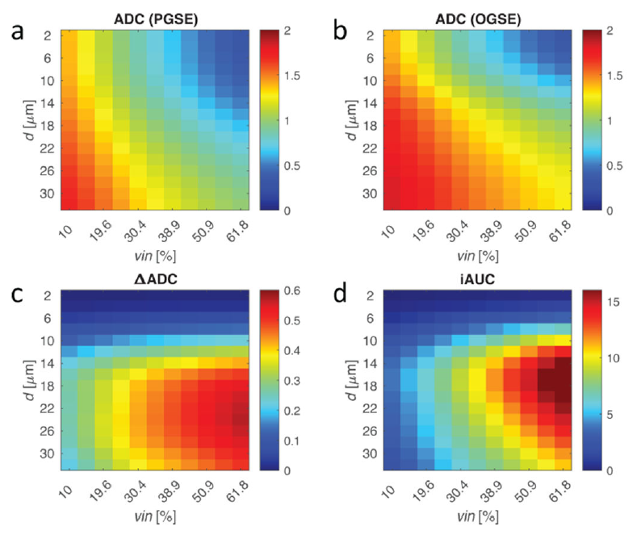
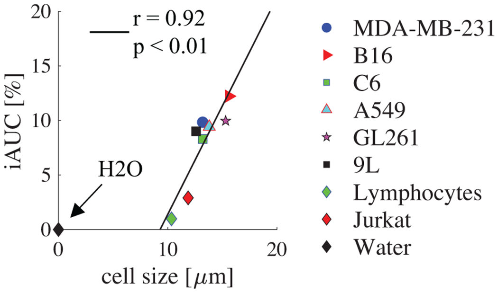
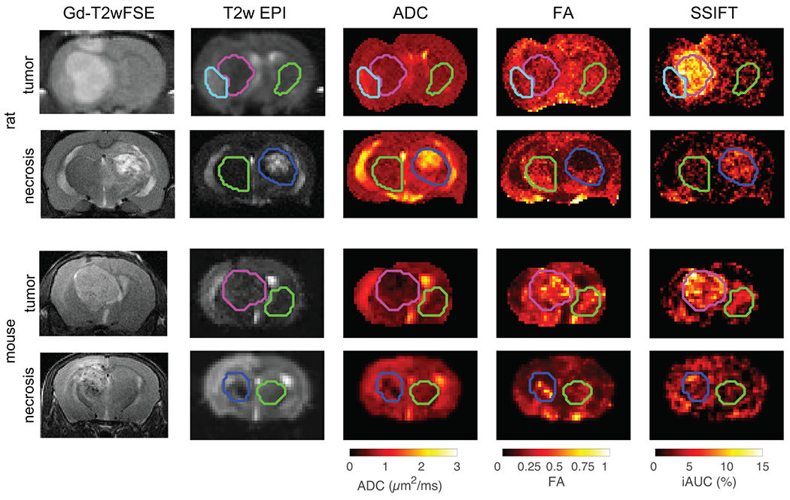
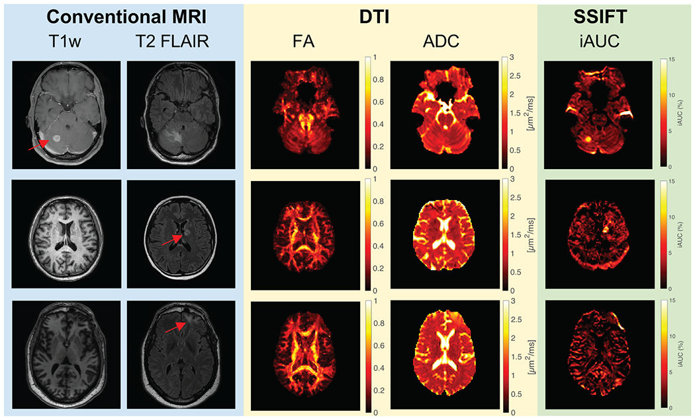

# 细胞尺寸加权成像SSIFT：通过细胞大小精准区分脑肿瘤与放射性坏死

## 研究背景：临床难题与现有技术瓶颈

在肿瘤治疗领域，脑转移瘤是晚期肺癌等恶性肿瘤的常见并发症。立体定向放射外科（SRS）虽能有效控制脑肿瘤生长，但约 10-20% 的患者在治疗后会出现新的脑实质病变，这些病变可能是肿瘤复发，也可能是放射性坏死（radionecrosis）。这两种病变的临床处理方式截然不同：放射性坏死可保守治疗，而肿瘤复发则需积极干预。然而，现有诊断技术面临巨大挑战：

*   **传统 MRI 的局限性**：基于钆（Gd）对比剂的 MRI 依赖血脑屏障（BBB）破坏间接成像，但肿瘤和放射性坏死均会破坏 BBB，导致无法可靠区分。

*   **其他影像学方法的不足**：PET/CT 虽有较高灵敏度（85%）和特异性（88%），但存在分辨率低、成本高、辐射暴露等问题；动态磁敏感对比（DSC）MRI 的研究结果异质性显著；磁共振波谱（MRS）空间分辨率低，易受部分容积效应影响。

*   **有创检查的风险**：计算机辅助立体定向活检是金标准，但属于有创操作，存在出血等风险，可能增加患者死亡率。

## 技术突破：SSIFT—— 基于细胞大小的选择性成像

### 核心原理：利用细胞大小差异构建特异性对比&#xA;

该研究提出了一种全新的 MRI 技术 ——**选择性大小成像通过扩散时间过滤（SSIFT, Selective Size Imaging using Filters via Diffusion Times）**，其核心原理基于肿瘤细胞与正常脑细胞的大小差异：

*   **细胞大小的生物学基础**：脑肿瘤细胞直径多在 10-20μm，而正常脑细胞（如胶质细胞平均 5.26μm，神经元轴突 < 3μm）明显更小。放射性坏死虽涉及血管源性水肿、囊性变等，但细胞大小无显著改变。

*   **扩散 MRI 的创新应用**：扩散 MRI 的检测灵敏度与扩散时间（t\_diff）相关，通过调整 t\_diff 可选择性探测不同尺度的结构。SSIFT 利用这一特性，构建了对 10-20μm 细胞敏感的信号过滤器，同时抑制小细胞和脑脊液信号。

### 技术实现：从理论到临床的关键步骤&#xA;

#### 1. 信号过滤机制与 iAUC 计算&#xA;

SSIFT 的核心指标是**增量曲线下面积（iAUC, Incremental Area Under the Curve）**，其计算公式为：

$$ 
iAUC=\sum_{m=2}^{N_{t d i f f}} \frac{t_{diff , m}-t_{diff , m-1}}{2\left(t_{diff , N_{t d i f f}}-t_{diff , 1}\right)}\left[M\left(t_{diff , m}\right)+M\left(t_{diff , m-1}\right)-2 M\left(t_{diff , 1}\right)\right]
$$

其中，$M(t_{diff , m})$为第 m 个扩散时间的方向平均信号，$N_{tdiff}$为扩散时间点数。iAUC 在细胞大小约 20μm 时达到峰值，对 10-20μm 的肿瘤细胞具有高度选择性。

#### 2. 双扩散时间成像序列&#xA;

为实现 SSIFT，研究采用了两种扩散序列组合：

*   **振荡梯度自旋回波（OGSE）**：用于获取短扩散时间（10ms）数据，突破传统脉冲梯度自旋回波（PGSE）对短 t\_diff 的限制。

*   **脉冲梯度自旋回波（PGSE）**：用于获取长扩散时间（70ms）数据，两者结合覆盖临床可实现的 t\_diff 范围。

#### 3. 方向平均与数据标准化&#xA;

为消除脑内复杂各向异性结构的影响，采用方向平均技术去除扩散梯度方向和纤维结构的影响。数据标准化不采用传统的 b=0 信号归一化，而是使用白质（动物研究中使用对侧灰质）的中位 b=0 信号，避免自由水和小限制结构对对比的干扰。

## 实验验证：从模拟到临床的全面验证

### 计算机模拟：理论可行性验证&#xA;

通过有限差分数值模拟，研究验证了 SSIFT 对细胞大小和密度的敏感性：

*   **模拟设置**：将组织建模为规则排列的球形细胞，细胞大小 2-32μm，细胞内体积分数 10.0%-61.8%，细胞内扩散系数固定为 1.58μm²/ms，细胞外为 2.0μm²/ms。

*   **关键发现**：传统 ADC 值受细胞大小和体积分数双重影响，无法可靠区分肿瘤；而∆ADC（10ms 与 70ms ADC 之差）和 iAUC 对 10-20μm 细胞具有高选择性，其中 iAUC 的峰值更尖锐，对比度更高。

<!-- 
 -->

图一 不同弥散参数与细胞大小和细胞体积分数的关系

### 体外细胞实验：iAUC 与细胞大小的直接关联&#xA;

选用 6 种癌细胞系（包括原发性脑肿瘤和常见脑转移瘤来源）、人淋巴细胞和水样本进行体外实验：

*   **细胞系**：

    *   原发性脑肿瘤模型：C6（大鼠胶质瘤）、9L（大鼠胶质肉瘤）、GL261（小鼠胶质瘤）。

    *   脑转移瘤模型：A549（人肺癌）、B16（小鼠黑色素瘤）、MDA-MB-231（人乳腺癌）。

*   **实验方法**：细胞固定后制成细胞 pellet，进行 MRI 扫描，并通过光镜测量细胞大小。

*   **结果**：iAUC 与光镜测量的平均细胞大小呈强相关性（Spearman 相关系数 r=0.92，p<0.01），癌细胞（12.6-15.6μm）的 iAUC 显著高于小细胞（淋巴细胞 10.3-11.9μm）和水样本。

<!-- 
 -->

图二 SSIFT参数与细胞大小的相关性

### 动物实验：体内特异性与对比度验证&#xA;

在大鼠和小鼠中分别建立脑肿瘤和放射性坏死模型，进行多参数 MRI 成像：

#### 1. 模型构建&#xA;

*   **脑肿瘤模型**：大鼠接种 9L 胶质肉瘤细胞，小鼠接种 DBT 胶质母细胞瘤细胞。

*   **放射性坏死模型**：大鼠通过 Novalis TX™单位接受 140Gy 立体定向放疗，小鼠通过 Leksell 伽马刀接受 50Gy 放疗，8-13 周后形成坏死灶。

#### 2. 成像结果&#xA;

*   **SSIFT 的特异性**：肿瘤区域的 iAUC 显著高于放射性坏死和对侧组织（大鼠：p<0.001，小鼠：p<0.05），而 ADC 和 FA 的区分能力较弱。

*   **与组织学的关联**：H\&E 染色显示，肿瘤细胞密度高（约 6000 个 /mm²），细胞大小适合 SSIFT 探测；放射性坏死区域细胞密度低（约 2600 个 /mm²），细胞大小异质性高，无明显大细胞优势。

<!-- 
 -->

图三 SSIFT与常规MRI技术在动物模型的比较

### 临床初步应用：可行性与临床价值验证&#xA;

对 2 例脑转移瘤患者（1 例 NSCLC，1 例黑色素瘤）和 1 例放射性坏死患者进行 SSIFT 扫描：

*   **扫描参数**：Philips 3T 扫描仪，TR/TE=15s/118ms，FOV=224×224mm，层厚 5mm，各向同性分辨率 2mm，扫描时间约 16.5 分钟。

*   **关键发现**：

    *   NSCLC 肿瘤的 iAUC 为 11.9±3.4%，显著高于对侧（0.5±2.5%）和放射性坏死（1.9±2.0%）。

    *   在无法使用 Gd 对比剂的黑色素瘤患者中，SSIFT 仍能清晰显示肿瘤，对比度与增强 T1w 图像相当。

    *   放射性坏死的 iAUC 仅轻微升高，与肿瘤形成明显差异。
    *   

<!-- 
 -->

图四 SSIFT与常规MRI技术在患者的比较

## 技术优势与临床应用前景

### SSIFT vs 传统技术：多维度对比&#xA;

| **指标**   | **SSIFT**           | **Gd-MRI**         | **PET/CT**           | **DSC-MRI**   |
| -------- | ------------------- | ------------------ | -------------------- | ------------- |
| **成像基础** | 细胞大小（10-20μm）&#xA;  | 血脑屏障破坏&#xA;        | 代谢活性&#xA;            | 脑血流量&#xA;     |
| **特异性**  | 高（针对肿瘤细胞大小）&#xA;    | 低（BBB 破坏非特异性）&#xA; | 中（FDG-PET 脑背景高）&#xA; | 中（异质性显著）&#xA; |
| **无创性**  | 完全无创&#xA;           | 需注射对比剂（肾损伤风险）&#xA; | 需注射放射性示踪剂&#xA;       | 无创&#xA;       |
| **扫描时间** | 优化后可缩短至 6 分钟&#xA;   | 常规 15-20 分钟&#xA;   | 30 分钟以上&#xA;         | 10-15 分钟&#xA; |
| **分辨率**  | 常规 2mm（可提升至更高）&#xA; | 高（1mm³）&#xA;       | 低（4-6mm）&#xA;        | 中（2-3mm）&#xA; |

## 临床应用场景与价值&#xA;

*   **精准诊断**：为脑肿瘤复发与放射性坏死的鉴别诊断提供新工具，避免不必要的有创活检。

*   **肾功能不全患者**：无需 Gd 对比剂，适用于肾功能不全或对比剂过敏患者。

*   **治疗监测**：通过细胞大小变化监测肿瘤对治疗的反应，可能早于形态学改变。

*   **指导放疗计划**：帮助精准界定肿瘤边界，尤其是在低级别胶质瘤等无明显强化的病变中。

## 技术优化与未来方向&#xA;

*   **扫描时间缩短**：采用多频段技术（multi-band）可将 TR 从 15 秒缩短至 5.2 秒，结合减少梯度方向数（如 6 个方向），总扫描时间可降至 1.5-6 分钟。

*   **IVIM 效应校正**：未来可增加低 b 值（如 250s/mm²）扫描，去除灌注相关的伪扩散效应，进一步提升特异性。

*   **超高分辨率整合**：结合超高清 DTI 技术，提升空间分辨率，更好地描绘小病灶和复杂边界。

*   **多中心临床研究**：扩大样本量，验证 SSIFT 在不同类型脑肿瘤和坏死中的表现，推动临床转化。

## 结语：从实验室到临床的创新突破

SSIFT 技术通过聚焦肿瘤细胞与正常细胞的大小差异，为脑肿瘤影像学开辟了新的维度。其基于扩散时间依赖的信号过滤机制，不仅在理论上具有创新性，更在模拟、细胞、动物和初步临床研究中展现了强大的应用潜力。随着技术的进一步优化和临床验证，SSIFT 有望成为脑肿瘤精准诊断的重要工具，为患者提供更安全、更精准的诊疗方案。

## 参考文献

Devan S P, Jiang X, Luo G, et al. Selective cell size MRI differentiates brain tumors from radiation necrosis\[J]. Cancer Research, 2022.

## 感谢关注

### 后处理代码及指导

如果你有相关数据，需要数据后处理服务，后处理代码或者技术指导，请加作者微信。

### 关注点赞

微信：Chushanzhishi2022
微信公众号：NMR凯米小屋
作者B站：楚山之石
CSDN: 楚山之石
知乎: 楚山之石

