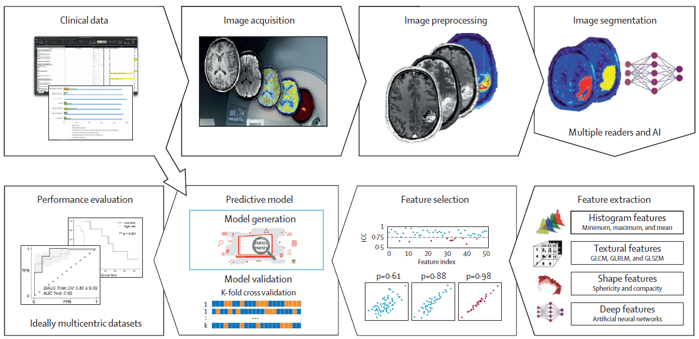
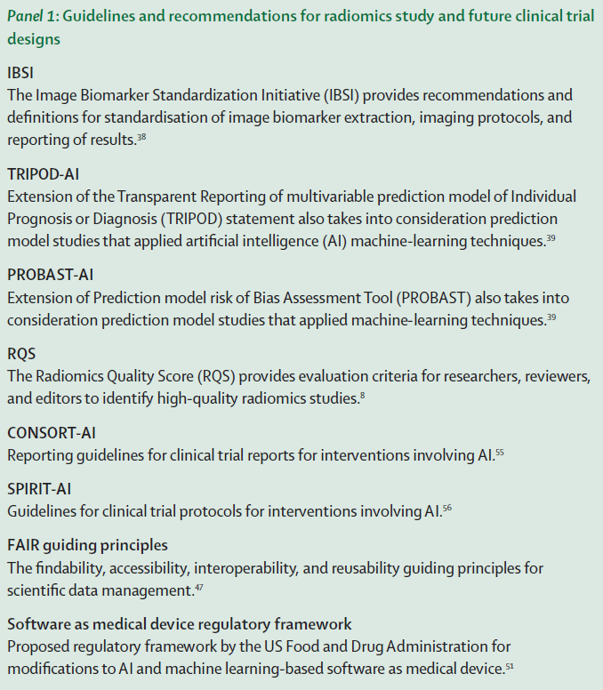
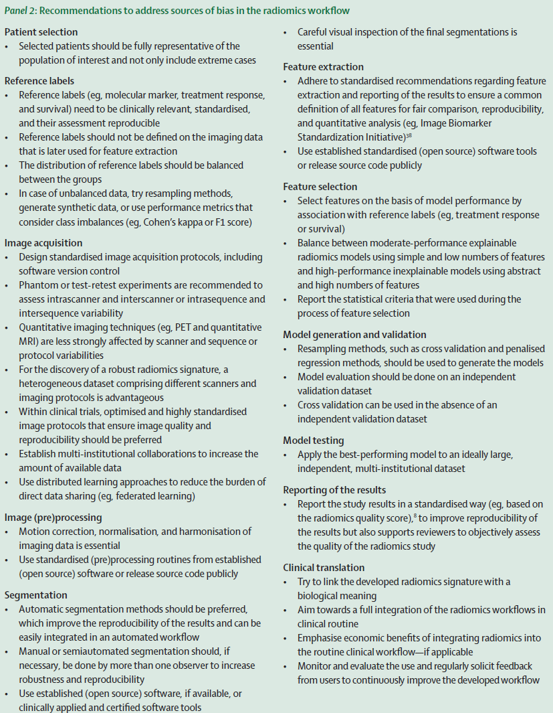

# 放射组学在神经肿瘤临床试验中的应用：现状、挑战与未来展望

神经肿瘤学领域正经历着从传统形态学诊断向多模态影像组学分析的革命性转变。作为一名深耕放射学多年的专业人士，我很高兴能与大家分享这一前沿领域的最新进展。本文将系统梳理放射组学在神经肿瘤临床试验中的应用现状，深入解析技术核心，客观分析面临挑战，并展望未来发展方向。

## 放射组学的核心概念与技术框架

放射组学（Radiomics）的本质是将医学影像转化为可挖掘的高维数据矩阵，通过自动化特征提取与机器学习建模，揭示传统视觉分析无法捕捉的影像表型信息。这一概念最早由 Lambin 及其同事于 2012 年提出，其核心理念可概括为 Gillies 的经典表述："图像不仅是图片，更是数据"。

### 标准工作流程解析&#xA;

放射组学分析遵循严谨的技术流程，主要包括以下关键环节：

<!-- 
 -->

图一 放射组学工作流程

#### 1. 图像采集与预处理&#xA;

*   **多模态影像整合**：结构 MRI 仍是脑肿瘤诊断的金标准，但灌注 MRI、弥散加权成像（DWI）及氨基酸 PET 等功能影像的应用日益广泛

*   **标准化挑战**：不同设备间的磁场强度（1.5T vs 3T）、扫描参数（TR/TE）及造影剂使用差异会引入噪声

*   **预处理步骤**：包括运动校正、强度归一化、图像配准等，推荐使用 ANTs 或 FSL 等开源工具

#### 2. 肿瘤分割技术&#xA;

*   **手动分割**：金标准但耗时费力，观察者间一致性（ICC）需 > 0.75

*   **半自动分割**：阈值法、区域生长等，代表性工具如 ITK-SNAP

*   **全自动分割**：基于深度学习的 U-Net、3D 卷积网络等，Dice 系数可达 0.89-0.93

*   **关键考量**：需明确分割范围（全肿瘤 / 强化区域 / 瘤周水肿），并进行视觉质量控制

#### 3. 特征提取体系&#xA;

*   **传统特征**：

    *   直方图特征：均值、方差、偏度、峰度等一阶统计量

    *   纹理特征：灰度共生矩阵（GLCM）、游程长度矩阵（GLRLM）等二阶特征

    *   形状特征：球形度、紧凑度、表面积体积比等几何参数

*   **深度学习特征**：通过 CNN 自动提取的层次化抽象特征，如 ResNet、DenseNet 等网络的中间层输出

*   **特征标准化**：需进行 Z-score 标准化或最小 - 最大归一化，避免量纲影响

#### 4. 机器学习建模&#xA;

*   **分类算法**：随机森林、支持向量机（SVM）、逻辑回归等

*   **回归算法**：Cox 比例风险模型（生存分析）、岭回归等

*   **模型验证**：k 折交叉验证（推荐 10 折）、独立测试集验证

*   **性能评估**：AUC（分类任务）、C-index（生存分析）、Dice 系数（分割任务）

### 技术优势与创新价值&#xA;

与传统影像分析相比，放射组学具有三大核心优势：

1.  **信息挖掘深度**：从常规 MRI 中提取数千维特征，突破人眼视觉局限

2.  **量化分析精度**：实现肿瘤异质性的定量化描述，如瘤内纹理复杂度

3.  **预测能力拓展**：可无创预测分子标志物（如 IDH 突变状态）、治疗反应及预后

## 神经肿瘤学中的应用实证

放射组学在神经肿瘤领域的应用研究已取得实质性进展，多个方向展现出临床转化潜力。

### 分子标志物无创预测&#xA;

*   **IDH 突变状态预测**：

    *   Lohmann 等利用 FET PET 放射组学特征构建模型，预测 IDH 突变的 AUC 达 0.88

    *   Choi 等结合 MRI 放射组学与深度学习，实现 91.2% 的 IDH 突变预测准确率

*   **MGMT 启动子甲基化评估**：

    *   Vils 等基于复发胶质母细胞瘤 MRI 数据，构建的预测模型 AUC 为 0.67

    *   联合放射组学与临床特征可提升预测效能

### 治疗反应评估新范式&#xA;

*   **抗血管生成治疗监测**：

    *   Kickingereder 等发现，基于 MRI 的自动化体积量化优于传统 RANO 标准，预测总生存的 HR 达 2.59

    *   放射组学特征可提前 3 个月识别贝伐珠单抗治疗无反应者

*   **放疗毒性预测**：

    *   Takami 等计划开展的多中心试验将评估 MRI 放射组学对放射性脑损伤的预测价值

    *   FMISO PET 放射组学可区分高风险与低风险患者（p<0.05）

### 生存预后精准分层&#xA;

*   **胶质母细胞瘤生存预测**：

    *   George 等对 113 例 GBM 患者的分析显示，放射组学模型预测无进展生存的 C-index 为 0.72

    *   整合治疗后首次 MRI 的放射组学特征，可将中位总生存预测误差控制在 ±15 天

*   **复发胶质瘤预后评估**：

    *   Grossmann 等报道，MRI 放射组学特征对贝伐珠单抗治疗患者的生存分层 HR 达 4.5

### 术中诊断技术突破&#xA;

*   **实时病理分级**：

    *   Hollon 等开发的深度学习模型，基于受激拉曼组织学（SRH）图像，实现 94.6% 的脑肿瘤诊断准确率

    *   诊断速度较传统病理快 10 倍（2-3 分钟 vs 20-30 分钟）

*   **荧光影像辅助**：

    *   Shen 等利用近红外荧光成像结合 CNN，实现胶质瘤分级的 AUC 达 0.87，Ki-67 水平预测 AUC 0.63

### 代表性研究成果汇总&#xA;

| 研究团队&#xA;                   | 影像模态&#xA;      | 样本量&#xA;    | 核心发现&#xA;           | 性能指标&#xA;              |
| --------------------------- | -------------- | ----------- | ------------------- | ---------------------- |
| Hollon 等 (2020)&#xA;        | SRH 图像&#xA;    | 693 例&#xA;  | 术中实时肿瘤诊断&#xA;       | 准确率 94.6%&#xA;         |
| Kickingereder 等 (2019)&#xA; | 结构 MRI&#xA;    | 1493 例&#xA; | 自动化疗效评估优于 RANO&#xA; | Dice 系数 0.89-0.93&#xA; |
| George 等 (2022)&#xA;        | 结构 MRI&#xA;    | 113 例&#xA;  | 免疫治疗预后预测&#xA;       | PFS HR 0.68-0.72&#xA;  |
| Franco 等 (2021)&#xA;        | MR 波谱&#xA;     | 120 例&#xA;  | 分子亚型预测&#xA;         | 准确率 91.2%&#xA;         |
| Muzi 等 (2020)&#xA;          | FMISO PET&#xA; | 72 例&#xA;   | 缺氧相关生存预测&#xA;       | OS C-index 0.77&#xA;   |

## 临床转化面临的核心挑战

尽管放射组学展现出巨大潜力，但其在神经肿瘤临床试验中的常规应用仍面临多重障碍。

### 标准化体系缺失&#xA;

*   **影像采集标准化**：

    *   各中心 MRI 设备型号（西门子 / 飞利浦 / GE）、扫描协议差异显著

    *   对比剂注射速率（2-5ml/s）、延迟时间（60-120s）缺乏统一标准

*   **特征提取标准化**：

    *   同一特征（如 GLCM 对比度）在不同软件中可能有不同计算实现

    *   IBSI（影像生物标志物标准化倡议）虽提出规范，但实施率不足 20%

*   **报告规范缺失**：

    *   多数研究未遵循 RQS（放射组学质量评分）标准

    *   TRIPOD-AI 和 PROBAST-AI 等报告指南应用率低

### 生物学可解释性瓶颈&#xA;

*   **特征 - 病理关联薄弱**：

    *   多数研究缺乏组织病理学对照，如肿瘤细胞密度、血管生成情况

    *   放射组学特征与特定信号通路（如 PI3K/AKT/mTOR）的关联研究不足

*   **异质性采样局限**：

    *   活检样本仅代表局部区域，无法反映全肿瘤异质性

    *   立体定向活检存在取样误差，约 15-20% 病例可能漏诊关键病理特征

*   **黑箱模型困境**：

    *   深度学习模型的决策过程难以解释，影响临床信任度

    *   缺乏统一的可解释性评估指标（如 SHAP 值、LIME 等方法的标准化应用）

### 数据共享与隐私挑战&#xA;

*   **多中心数据整合**：

    *   不同机构数据格式（DICOM/ NIfTI）、存储标准不一

    *   患者隐私保护（HIPAA/GDPR）限制数据直接共享

*   **数据质量控制**：

    *   约 30% 临床影像存在运动伪影或对比度不足

    *   元数据缺失（如扫描参数不全）影响特征可重复性

*   **计算资源需求**：

    *   高维特征分析需高性能计算平台（GPU 集群）

    *   中小医院难以承担大规模放射组学分析成本

### 临床试验设计难点&#xA;

*   **终点指标定义**：

    *   放射组学标志物作为替代终点的临床有效性尚未确立

    *   缺乏放射组学特异性的试验设计指南（如样本量计算方法）

*   **验证体系不完善**：

    *   多数研究仅在单中心验证，外部泛化能力不足

    *   前瞻性多中心试验数量稀少（仅占相关研究的 4%）

*   **监管审批空白**：

    *   放射组学模型作为医疗器械（SaMD）的审批路径不明确

    *   FDA 仅批准少数锁定算法的 AI 设备，动态学习模型监管框架待完善

## 破局之路：未来发展方向

针对上述挑战，放射组学要实现临床转化需要多学科协同创新。

### 标准化体系构建&#xA;

1.  **影像采集标准化**：

*   推行统一的 MRI 扫描协议（如 EORTC 神经肿瘤影像工作组标准）

*   强制记录关键扫描参数（如磁场均匀性、梯度强度）

2.  **特征提取标准化**：

*   推广 IBSI 规范，建立特征计算的参考实现

*   开发标准化特征库（如 PyRadiomics 的统一接口）

3.  **报告与验证标准化**：

*   要求研究遵循 RQS 评分和 TRIPOD-AI 报告指南

*   强制进行多中心外部验证（至少 3 个独立中心）

<!-- 
 -->

图二 放射组学研究以及未来临床试验的重要指南

### 生物学基础研究强化&#xA;

*   **放射 - 病理关联研究**：

    *   建立大型放射 - 病理数据库，整合影像与全切片病理数据

    *   开发空间配准技术，实现影像特征与组织病理学的精准对应

*   **分子机制探索**：

    *   结合单细胞测序，解析放射组学特征的细胞分子基础

    *   开展放射基因组学研究，识别特征相关的驱动基因突变

*   **可解释性技术开发**：

    *   发展基于注意力机制的可视化技术（如 Grad-CAM）

    *   建立特征重要性评估的行业标准（如 SHAP 值的统一计算方法）

### 数据共享与技术创新&#xA;

*   **联邦学习应用**：

    *   采用 Sheller 提出的联邦学习框架，实现 "数据不动模型动"

    *   建立跨机构的联邦学习联盟（如欧洲神经肿瘤放射组学联盟）

*   **区块链技术赋能**：

    *   利用区块链记录数据来源与处理过程，保证可追溯性

    *   开发去中心化的模型验证平台，确保结果透明可信

*   **开源生态建设**：

    *   推广 MONAI 等开源框架，降低技术门槛

    *   建立公共数据集（如 BraTS 挑战赛数据）持续推动算法优化

### 临床试验设计创新&#xA;

*   **适应性试验设计**：

    *   将放射组学标志物纳入适应性随机化策略

    *   设计基于放射组学分层的篮子试验（Basket Trial）

*   **新型终点开发**：

    *   探索放射组学特征作为早期疗效指标的可能性

    *   开发综合影像 - 临床 - 分子的复合终点

*   **监管科学研究**：

    *   开展放射组学模型的真实世界性能评估

    *   参与 FDA 的 AI 医疗器械试点项目，探索审批路径

<!-- 
 -->

图三 放射组学工作流关键点

## 临床转化路线图建议

基于当前研究进展与挑战，我提出神经肿瘤放射组学临床转化的分阶段路线图：

### 短期目标（1-3 年）&#xA;

*   建立多中心放射组学数据库（纳入≥5000 例患者）

*   开发 2-3 项经过多中心验证的分子标志物预测模型

*   制定神经肿瘤放射组学临床试验设计专家共识

### 中期目标（3-5 年）&#xA;

*   放射组学特征纳入 1-2 项 III 期临床试验的分层因素

*   获得 1-2 个 CE/FDA 认证的放射组学分析软件

*   建立放射组学指导的个体化治疗决策支持系统

### 长期目标（5-10 年）&#xA;

*   放射组学成为神经肿瘤临床试验的常规组成部分

*   基于放射组学的疗效评估标准替代部分传统指标

*   实现从影像表型到生物学机制的全链条解析

## 结语：放射组学的未来与放射科医生的角色

放射组学正推动神经肿瘤学进入 "影像精准医学" 时代。作为放射科医生，我们需要从传统的影像解读者转变为影像数据科学家，掌握多模态影像分析、机器学习建模等新技能。同时，我们也要保持科学谨慎态度，在追求技术创新的同时，不忽视临床实际需求与患者安全。

正如本文所述，放射组学的临床转化仍面临诸多挑战，但每一次技术突破都让我们离目标更近一步。我相信，通过多学科协作与持续创新，放射组学必将在神经肿瘤的精准诊断、疗效评估和预后预测中发挥核心作用，为患者带来真正的临床获益。

## 参考文献

Philipp Lohmann, Enrico Franceschi, Philipp Vollmuth, et al. Radiomics in neuro-oncological clinical trials. Lancet Digit Health, 2022, 4(11): e841-e849. DOI: 10.1016/S2589-7500(22)00144-3

## 感谢关注

### 后处理代码及指导

如果你有相关数据，需要数据后处理服务，后处理代码或者技术指导，请加作者微信。

### 关注点赞

微信：Chushanzhishi2022
微信公众号：NMR凯米小屋
作者B站：楚山之石
CSDN: 楚山之石