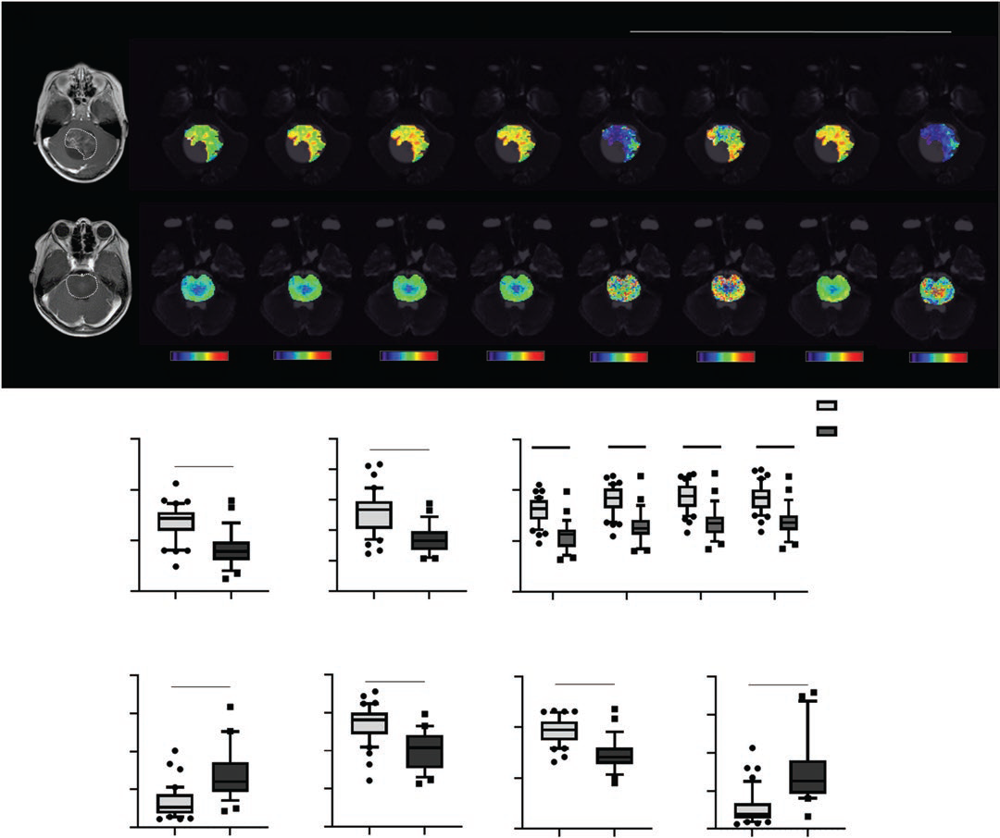
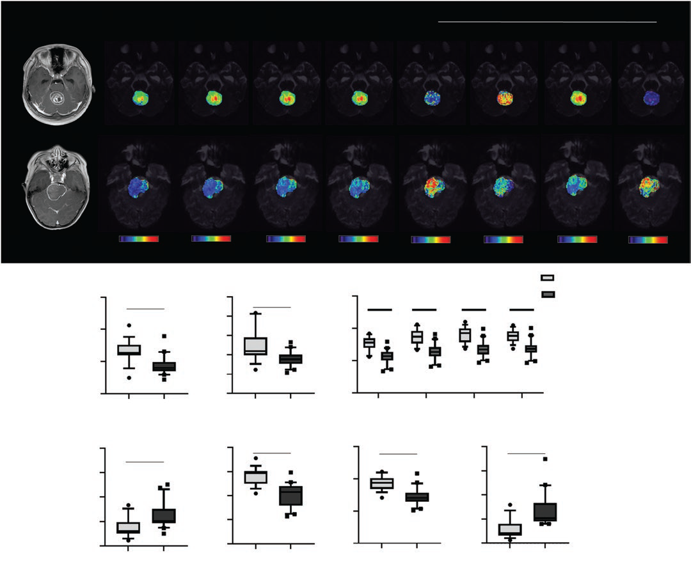
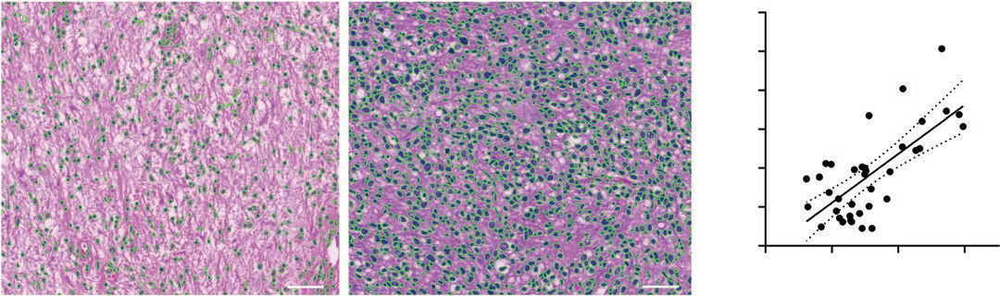

# 时间依赖扩散 MRI 在儿童胶质瘤组织学与分子分型中的突破性应用

## 研究背景与意义

在儿童中枢神经系统肿瘤中，胶质瘤是最为常见的类型，其准确的组织学分级和分子分型对于预后判断和治疗方案制定至关重要。2021 年 WHO 中枢神经系统肿瘤分类指南明确指出，组织学与分子分类的结合是实现精准诊疗的关键。然而，传统 MRI 技术如表观扩散系数（ADC）虽有一定诊断价值，但因无法提供特异性微观结构信息，在分子诊断时代的应用受到限制。

本文开创性地提出了基于时间依赖扩散 MRI（t\_d-dMRI）的微观结构成像技术，通过量化肿瘤细胞特性，为儿童胶质瘤的无创性诊断提供了全新思路。该技术在 69 例儿童胶质瘤患者中的研究显示，其微观结构标志物在组织学分级和 H3K27 分子分型中均表现出优于传统 MRI 指标的诊断效能，为实现 "虚拟病理" 诊断迈出了重要一步。

## 技术原理与研究方法

### t\_d-dMRI 技术原理&#xA;

时间依赖扩散 MRI 的核心在于通过捕捉不同扩散时间（t\_d）下的水分子扩散行为，解析肿瘤微环境的微观结构特征。其原理基于以下生物学基础：水分子在细胞内和细胞外空间的扩散特性随时间变化存在差异，通过多时间点扩散编码序列可定量表征细胞大小、细胞密度等关键参数。

与传统扩散 MRI 仅提供单一 ADC 值不同，t\_d-dMRI 通过**脉冲梯度自旋回波（PGSE）** 和**振荡梯度自旋回波（OGSE）** 两种序列组合，实现了多时间点扩散信号采集。其中，OGSE 序列通过梯形余弦梯度设计，能够在短扩散时间内（5-14.7ms）敏感捕捉细胞尺度的扩散限制，而 PGSE 序列则覆盖较长扩散时间（60ms），两者结合形成了从细胞内到细胞外空间的全尺度微观结构映射能力。

### 研究队列与数据采集&#xA;

*   **患者队列**：前瞻性纳入 2019 年 11 月至 2022 年 3 月间 75 例儿童胶质瘤患者，排除参数错误、扫描不全及图像质量差的病例后，最终纳入 69 例（年龄 6.14±3.25 岁）。其中低级别胶质瘤（LGG）42 例，高级别胶质瘤（HGG）27 例；39 例中线胶质瘤患者进一步分为 H3K27 突变型（20 例）和野生型（19 例）。

*   **扫描方案**：使用 3T MRI 扫描仪（飞利浦 Achieva），采用自制 OGSE 和 PGSE 序列进行 t\_d-dMRI 数据采集。OGSE 序列设置 3 个扩散频率（17Hz、33Hz、50Hz），对应有效扩散时间 14.7ms、7.6ms、5ms，b 值分别为 500/1000/1500s/mm²；PGSE 序列扩散持续时间 / 间隔为 60/82.3ms，b 值同 OGSE。总扫描时间仅 6 分 19 秒，具备临床转化可行性。

### 图像分析与模型构建&#xA;

*   **数据预处理**：使用 FSL 软件对 OGSE 图像进行运动和涡流校正，配准至 PGSE 的 b0 图像。

*   **微观结构建模**：采用 IMPULSED（利用有限谱编辑扩散成像微观结构参数）双室模型拟合 t\_d-dMRI 信号：

$S = f_{in}S_{in} + (1-f_{in})S_{ex}$

其中$S$为测量信号，$f_{in}$为细胞内体积分数，$S_{in}$和$S_{ex}$分别为细胞内和细胞外信号。细胞内信号$S_{in}$基于球体模型，根据细胞直径$d$和细胞内扩散系数建模，细胞外信号$S_{ex}$则假设为指数衰减模型$e^{-bD_{ex}}$，$D_{ex}$为细胞外扩散系数。

*   **参数计算**：通过非线性最小二乘法拟合获得细胞直径$d$、细胞内分数$f_{in}$、细胞外扩散系数$D_{ex}$，并定义细胞密度为$f_{in}/d*100$。同时计算各时间点 ADC 值（$D_{0Hz}$、$D_{17Hz}$、$D_{33Hz}$、$D_{50Hz}$）及常规 MRI 参数（T1、T2 弛豫时间）。

### 病理验证方法&#xA;

*   **组织学分析**：根据 2021 年 WHO 分类标准进行肿瘤分级，采用抗 H3K27M 抗体免疫组化染色（克隆号 EPR18340，Abcam）检测 H3K27 突变状态，阳性定义为 > 80% 肿瘤细胞核染色。

*   **定量病理对照**：对 37 例患者的 H\&E 染色切片（30× 放大）使用条件生成对抗网络（cGAN）进行细胞核分割，计算细胞核直径$d_{nuclei}$及体积分数$f_{nuclei}$，与 t\_d-dMRI 推导的微观结构参数进行相关性分析。

## 核心研究结果

### 组织学分级诊断效能&#xA;

*   **微观结构参数差异**：HGG 组相比 LGG 组表现为更低的 T1/T2 弛豫时间、ADC 值、细胞直径$d$和细胞外扩散系数$D_{ex}$，以及更高的细胞内分数$f_{in}$和细胞密度（均$P<10^{-4}$）。

<!-- 
 -->

图一 组织学分级组间参数差异

*   **诊断效能对比**：细胞密度指数在区分 LGG 与 HGG 时表现最佳，受试者工作特征曲线下面积（AUC）达 0.911，准确性 / 敏感性 / 特异性为 0.884/0.893/0.878，优于传统 MRI 指标。ADC 值（$D_{0Hz}$）AUC 为 0.906，T1/T2 弛豫时间 AUC 分别为 0.847 和 0.861。

| MRI 标志物&#xA; | 准确性&#xA;          | 敏感性&#xA;          | 特异性&#xA;          | AUC&#xA;                | 临界值&#xA;         |
| ------------ | ----------------- | ----------------- | ----------------- | ----------------------- | ---------------- |
| 细胞密度&#xA;    | 0.884（61/69）&#xA; | 0.893（25/28）&#xA; | 0.878（36/41）&#xA; | 0.911（0.839-0.983）&#xA; | 0.412&#xA;       |
| 细胞直径$d$      | 0.783（54/69）&#xA; | 0.786（22/28）&#xA; | 0.781（32/41）&#xA; | 0.849（0.760-0.938）&#xA; | 24.2μm&#xA;      |
| $D_{ex}$     | 0.855（59/69）&#xA; | 0.821（23/28）&#xA; | 0.878（36/41）&#xA; | 0.879（0.783-0.975）&#xA; | 1.643μm²/ms&#xA; |
| $D_{0Hz}$    | 0.870（60/69）&#xA; | 0.821（23/28）&#xA; | 0.902（37/41）&#xA; | 0.906（0.825-0.986）&#xA; | 1.292μm²/ms&#xA; |
| T1&#xA;      | 0.812（56/69）&#xA; | 0.786（22/28）&#xA; | 0.829（34/41）&#xA; | 0.847（0.745-0.948）&#xA; | 1514ms&#xA;      |

### H3K27 分子分型诊断效能&#xA;

*   **参数差异**：H3K27 突变型中线胶质瘤相比野生型表现为更低的 T1/T2、ADC、细胞直径$d$和$D_{ex}$，以及更高的$f_{in}$和细胞密度（$P<0.01$）。

<!-- 
 -->

图二 H3K27 不同分子分型参数差异

*   **最佳诊断标志物**：细胞直径$d$在区分 H3K27 突变型与野生型时 AUC 达 0.918，准确性 / 敏感性 / 特异性为 0.846/0.950/0.737。联合细胞直径与细胞外扩散系数$D_{ex}$可进一步提高 AUC 至 0.929，优于单一标志物。

| MRI 标志物&#xA; | 准确性&#xA;          | 敏感性&#xA;          | 特异性&#xA;          | AUC&#xA;                | 临界值&#xA;         |
| ------------ | ----------------- | ----------------- | ----------------- | ----------------------- | ---------------- |
| 细胞直径$d$      | 0.872（34/39）&#xA; | 0.900（18/20）&#xA; | 0.842（16/19）&#xA; | 0.918（0.833-1.000）&#xA; | 24.89μm&#xA;     |
| 细胞密度&#xA;    | 0.872（34/39）&#xA; | 1.000（20/20）&#xA; | 0.737（14/19）&#xA; | 0.913（0.818-1.000）&#xA; | 0.364&#xA;       |
| $D_{ex}$     | 0.897（35/39）&#xA; | 0.900（18/20）&#xA; | 0.895（17/19）&#xA; | 0.903（0.796-1.000）&#xA; | 1.643μm²/ms&#xA; |
| $D_{17Hz}$   | 0.872（34/39）&#xA; | 0.900（18/20）&#xA; | 0.842（16/19）&#xA; | 0.911（0.822-0.999）&#xA; | 1.486μm²/ms&#xA; |
| T1&#xA;      | 0.846（33/39）&#xA; | 0.850（17/20）&#xA; | 0.842（16/19）&#xA; | 0.821（0.678-0.964）&#xA; | 1562ms&#xA;      |

### 病理验证与相关性分析&#xA;

*   **细胞内分数一致性**：t\_d-dMRI 推导的$f_{in}$与病理定量的$f_{nuclei}$具有显著相关性（$r=0.6996$，$P<0.0001$），验证了微观结构模型的准确性。
  

<!-- 
 -->

图三 细胞内分数测量一致性分析

*   **细胞直径差异原因**：病理细胞核直径与 t\_d-dMRI 细胞直径无显著相关性，可能由于胶质瘤细胞高度多形性，细胞核直径无法直接反映细胞整体大小，但 t\_d-dMRI 测得的细胞直径（24.27±5.90μm）与文献报道的胶质瘤细胞大小（约 20μm）一致。

## 技术优势与临床转化价值

### 相比传统 MRI 的核心优势&#xA;

1.  **微观结构特异性**：传统 ADC 仅反映整体扩散限制，而 t\_d-dMRI 通过双室模型分离细胞内 / 外空间，直接量化细胞密度、直径等病理特征，如 HGG 的高细胞密度与 H3K27 突变型的小细胞直径均为特异性标志物。

2.  **分子分型突破**：首次证实 MRI 可无创识别 H3K27 突变状态，细胞直径作为单一标志物 AUC 达 0.918，解决了传统 MRI 在分子诊断中的局限性，为中线胶质瘤精准治疗提供影像学依据。

3.  **诊断效能提升**：组织学分级中细胞密度 AUC（0.911）优于 ADC（0.906），且 T1/T2 等传统指标诊断效能较低，凸显微观结构参数的独特价值。

### 临床应用场景展望&#xA;

*   **术前无创诊断**：6 分钟扫描协议可整合至常规 MRI 流程，为手术决策提供组织学与分子分型信息，避免活检风险（尤其适用于中线不可切除肿瘤）。

*   **疗效监测与预后评估**：细胞密度与直径的动态变化可反映肿瘤增殖活性与治疗反应，优于传统形态学评估。

*   **指导精准治疗**：H3K27 突变型患者对放疗敏感，t\_d-dMRI 可辅助筛选潜在受益人群，实现 "影像 - 分子 - 治疗" 的精准匹配。

### 技术推广可行性&#xA;

*   **设备兼容性**：研究使用临床常规 3T MRI 设备，序列参数可在多数机型实现，具备多中心推广基础。

*   **数据处理标准化**：研究团队已将 IMPULSED 模型拟合代码开源（[https://github.com/KuiyuanLiu/app\_IMPULSED\_Fitting](https://github.com/KuiyuanLiu/app_IMPULSED_Fitting)），便于学术交流与临床转化。

## 研究局限性与未来方向

*   **样本量限制**：组织学分级队列 69 例，分子分型仅 39 例，需更大样本量及多中心研究验证结果稳定性。

*   **空间匹配挑战**：MRI ROI 与活检样本的空间一致性问题，未来可结合术中 MRI 与立体定向活检技术改善。

*   **多模态融合潜力**：t\_d-dMRI 与 PET、灌注 MRI 或 AI 放射组学的结合可能进一步提升诊断效能，尤其在复杂分子亚型分析中。

*   **机制研究拓展**：H3K27 突变导致细胞直径减小的具体生物学机制尚不明确，需结合分子病理学进一步探索。

## 结论与行业影响

本研究首次系统验证了 t\_d-dMRI 微观结构映射技术在儿童胶质瘤诊断中的双重价值：细胞密度作为组织学分级的最佳标志物，细胞直径则成为 H3K27 分子分型的特异性指标，两者均显著优于传统 MRI 参数。该技术为实现 "无创病理诊断" 提供了坚实的临床证据，其 6 分钟扫描协议的临床可行性更使其具备转化为常规诊断工具的潜力。

随着 2021 年 WHO 指南对分子病理的强调，t\_d-dMRI 在整合组织学与分子信息方面的优势将推动儿童胶质瘤诊疗模式的革新。未来研究需进一步扩大样本量，探索与其他分子标志物（如 ACVR1 突变、p53 通路异常）的关联，并开发基于微观结构参数的预后模型，最终实现从影像诊断到精准治疗的全链条升级。

## 参考文献

Zhang H, Liu K, Ba R, et al. Histological and molecular classifications of pediatric glioma with time-dependent diffusion MRI-based microstructural mapping. Neuro-Oncology. 2023;XX(XX):1-11. DOI: 10.1093/neuonc/noad003.

## 感谢关注

### 后处理代码及指导

如果你有相关数据，需要数据后处理服务，后处理代码或者技术指导，请加作者微信。

### 关注点赞
微信：Chushanzhishi2022
微信公众号：NMR凯米小屋
作者B站：楚山之石
CSDN: 楚山之石