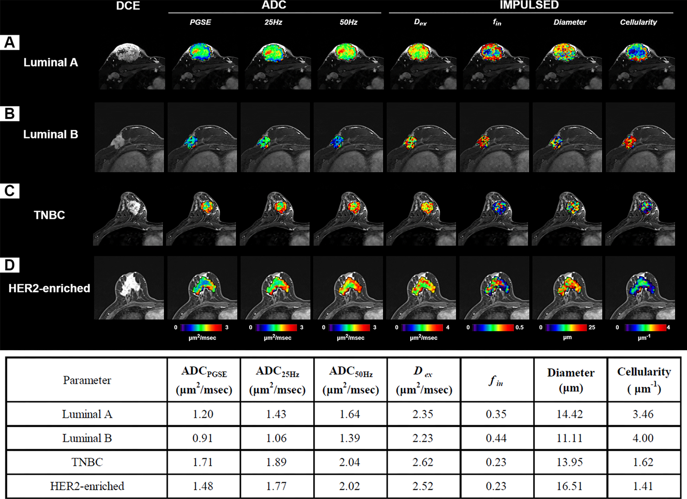
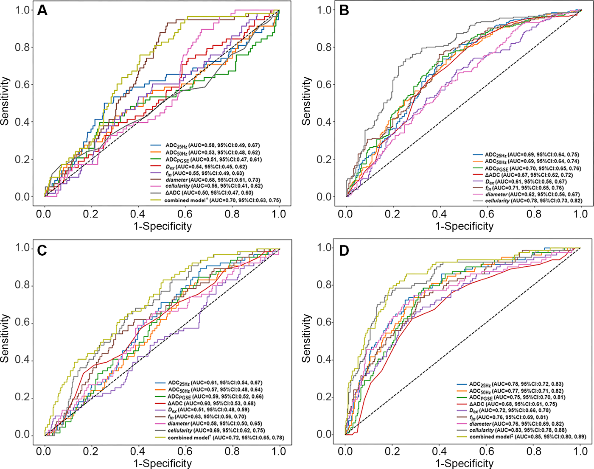
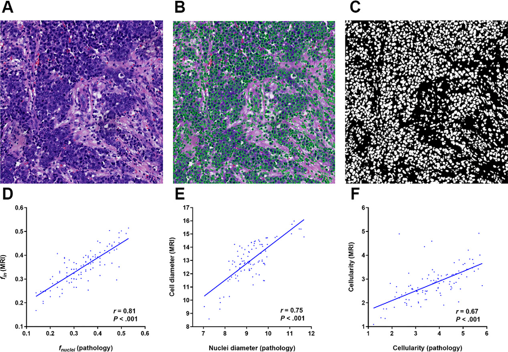

# 时间依赖性扩散 MRI：乳腺癌分子亚型预测与新辅助化疗反应评估的新利器

## 一、研究背景与目的

乳腺癌作为一种高度异质性疾病，其分子亚型与治疗反应及预后密切相关。传统的分子亚型检测依赖于侵入性活检，存在肿瘤内异质性和组织采样有限等问题，难以全面反映肿瘤特征。新辅助化疗的病理完全缓解（pCR）是长期生存的替代指标，但目前缺乏准确的无创预测方法。

扩散加权成像（DWI）虽已广泛应用于乳腺癌评估，但其提供的表观扩散系数（ADC）仅描述整体水扩散速率，无法揭示肿瘤微结构信息。而时间依赖性扩散 MRI 通过改变扩散时间（t-space），能够表征细胞直径、细胞内分数和细胞密度等微结构参数，为无创评估肿瘤生物学特征提供了新可能。

本研究旨在探讨基于时间依赖性扩散 MRI 的微结构成像在无创预测乳腺癌分子亚型及新辅助化疗 pCR 中的临床价值。

## 二、研究方法

### （一）研究样本&#xA;

*   **纳入标准**：2021 年 2 月至 2023 年 5 月期间，经乳腺 X 线摄影和 / 或超声检查发现 BI-RADS 4 类及以上病变，且术前接受时间依赖性扩散 MRI 检查的单侧原发性浸润性乳腺癌患者。

*   **排除标准**：MRI 图像质量因运动伪影受损，或在外院手术无法获取 pCR 状态。

*   **最终样本**：408 例乳腺癌患者，平均年龄 51.9 岁 ±9.1 岁，其中 221 例接受新辅助化疗并评估 pCR 状态。

### （二）MRI 数据采集&#xA;

*   **设备**：3T MRI（Magnetom Prisma，西门子医疗），专用 16 通道乳腺线圈。

*   **序列**：

    *   **振荡梯度自旋回波序列**：25 Hz（有效扩散时间 10 ms）和 50 Hz（有效扩散时间 5 ms），b 值分别为 0、250、500、750、1000 s/mm²。

    *   **脉冲梯度自旋回波序列**：扩散持续时间 10 ms，间隔 30 ms，b 值 0、250、500、750、1000 s/mm²。

### （三）图像分析&#xA;

*   **信号归一化**：将时间依赖性扩散 MRI 信号除以 b=0 s/mm² 信号进行归一化。

*   **参数计算**：

    *   **传统 ADC 参数**：脉冲梯度自旋回波 ADC（ADC\_PGSE）、25 Hz ADC（ADC\_25Hz）、50 Hz ADC（ADC\_50Hz）及相对 ADC 变化（ΔADC）。

    *   **微结构参数**：采用 IMPULSED 方法（有限频谱编辑扩散）估算，包括细胞直径（Diameter）、细胞内分数（f\_in）、细胞外扩散率（D\_ex）和细胞密度（Cellularity）。

*   **感兴趣区（ROI）勾画**：由经验丰富的放射科医生在扩散加权图像上手动勾画肿瘤组织，排除周围正常组织，计算各参数的体素平均值。

### （四）病理评估与相关性分析&#xA;

*   **分子亚型分类**：基于雌激素受体（ER）、孕激素受体（PR）、人表皮生长因子受体 2（HER2）和 Ki-67 的免疫组化或荧光原位杂交结果，分为腔面 A、腔面 B、HER2 富集和三阴性乳腺癌（TNBC）。

*   **pCR 定义**：术后病理检查无残留浸润性癌（可存在残留导管原位癌）且无腋窝淋巴结转移（ypT0/isN0）。

*   **病理微结构测量**：

    *   **细胞核直径**：通过条件生成对抗网络自动分割 HE 染色全切片图像中的细胞核，计算体积加权直径（d\_nuclei），并按比例缩放为细胞直径（缩放因子 1.8）。

    *   **细胞内分数**：计算为（细胞核总面积 / 组织总面积）^(3/2)。

    *   **病理细胞密度**：（病理细胞内分数 / 病理细胞直径）×100。

### （五）统计分析&#xA;

*   **样本量计算**：任务 1（分子亚型预测）需至少 173 例，任务 2（pCR 预测）需至少 116 例。

*   **组间比较**：连续变量采用独立 t 检验或 Mann-Whitney U 检验，分类变量采用 χ² 检验或 Fisher 精确检验。

*   **多变量逻辑回归**：筛选与分子亚型和 pCR 相关的独立预测因子。

*   **预测模型评估**：采用受试者工作特征曲线下面积（AUC）、准确性、特异性、敏感性等指标，DeLong 检验比较模型性能。

*   **相关性分析**：Pearson 相关系数评估 MRI 参数与病理测量的相关性。

## 三、研究结果

### （一）参与者特征&#xA;

*   **分子亚型分布**：腔面 A（58 例）、腔面 B（205 例）、TNBC（66 例）、HER2 富集（79 例）。

*   **新辅助化疗结果**：221 例中 54 例（24.4%）达到 pCR，pCR 率与 ER、PR、HER2 状态及分子亚型显著相关。

### （二）时间依赖性扩散 MRI 微结构参数特征&#xA;

*   **分子亚型间差异**：所有微结构参数在四种分子亚型间均存在显著差异（P<.001）。

    *   **腔面 B**：ADC 最低，细胞密度最高。

    *   **HER2 富集**：ADC 最高，细胞密度最低，细胞直径最大。

    *   **TNBC**：微结构参数表现出中等有效性，可能与肿瘤异质性有关。

*   **pCR 组与非 pCR 组差异**：pCR 组术前 MRI 显示更高的 ADC、细胞外扩散率和细胞直径，以及更低的相对 ADC 变化、细胞内分数和细胞密度（P<.001）。
   

<!-- 
 -->

图一 时间依赖弥散定量参数组间差异

### （三）单变量与多变量分析&#xA;

*   **分子亚型独立预测因子**：

    *   **腔面 A**：相对 ADC 变化（OR=0.79，P=.03）和细胞密度（OR=0.58，P<.001）。

    *   **腔面 B**：细胞直径（OR=4.85，P<.001）。

    *   **TNBC**：ADC\_25Hz（OR=0.58，P=.03）和细胞直径（OR=0.42，P=.002）。

    *   **HER2 富集**：细胞外扩散率（OR=1.71，P=.04）、细胞密度（OR=1.87，P=.007）和细胞直径（OR=0.24，P<.001）。

*   **pCR 独立预测因子**：PR 状态（OR=0.08，P=.02）、HER2 状态（OR=3.36，P=.009）和细胞密度（OR=0.01，P=.02）。

### （四）预测模型性能&#xA;

*   **分子亚型预测**：

    *   **腔面 A**：联合相对 ADC 变化和细胞密度的模型 AUC 为 0.70，优于 ADC\_PGSE（AUC=0.51，P=.003）。

    *   **腔面 B**：细胞密度的 AUC 为 0.78，优于 ADC\_PGSE（AUC=0.70，P<.001）。

    *   **TNBC**：联合 ADC\_25Hz 和细胞直径的模型 AUC 为 0.72，优于 ADC\_PGSE（AUC=0.59，P<.001）。

    *   **HER2 富集**：联合细胞外扩散率、细胞密度和细胞直径的模型 AUC 为 0.85，显著优于 ADC\_PGSE（P<.001）。

*   **pCR 预测**：

    *   **临床病理模型**（PR+HER2）AUC=0.79。

    *   **细胞密度**AUC=0.84，优于传统 ADC 参数。

    *   **联合模型**（PR+HER2 + 细胞密度）AUC=0.88，显著优于传统 ADC 模型（AUC=0.73，P<.001）和临床病理模型（P<.001）。

<!-- 
 -->

图二 时间依赖弥散定量参数的诊断性能

### （五）与病理结果的相关性&#xA;

*   在 100 例代表性样本中，时间依赖性扩散 MRI 衍生的微结构参数与病理测量显著相关：

    *   细胞内分数（r=0.81，P<.001）

    *   细胞直径（r=0.75，P<.001）

    *   细胞密度（r=0.67，P<.001）

*   脉冲梯度自旋回波 ADC 与细胞密度及病理细胞密度呈负相关（r=0.60 和 0.67，P<.001）。

<!-- 
 -->

图三 时间依赖弥散定量参数与病理结果的相关性

## 四、讨论

### （一）时间依赖性扩散 MRI 在分子亚型预测中的优势&#xA;

本研究表明，时间依赖性扩散 MRI 微结构参数在区分乳腺癌分子亚型方面表现优异，AUC 范围为 0.70-0.85，优于传统 ADC 参数。这得益于其能够直接表征肿瘤微结构特征，如细胞密度和细胞直径，而这些特征与分子亚型的病理基础密切相关。

*   **腔面 B 亚型**：高细胞密度与该亚型的高增殖率和不良预后一致。

*   **HER2 富集亚型**：大细胞直径与组织学上的高分级和顶浆分泌特征相符。

*   **TNBC 亚型**：微结构参数的中等区分能力可能与其高度异质性有关，包括实性推挤边界、坏死区域和淋巴细胞浸润等。

### （二）pCR 预测模型的临床价值&#xA;

联合临床病理特征（PR、HER2）和影像学细胞密度的模型在预测 pCR 方面表现出卓越性能（AUC=0.88），优于单独使用临床病理或传统 MRI 参数。细胞密度作为关键影像学标志物，反映了肿瘤的增殖和侵袭能力，高细胞密度与新辅助化疗反应不佳相关。

### （三）与其他成像技术的比较&#xA;

与体素内不相干运动（IVIM）和扩散峰度成像（DKI）等技术相比，时间依赖性扩散 MRI 在分子亚型区分上表现相当或更优，且具有明确的生物物理基础，解释性强，临床可行性高。

### （四）研究局限性&#xA;

*   **单中心研究**：需多中心研究进一步验证。

*   **手动 ROI 勾画**：可能引入操作者间差异，自动化分割方法有待开发。

*   **肿瘤内异质性**：仅分析单一 ROI，未考虑肿瘤内空间异质性。

*   **体素内不相干运动效应**：未明确建模，可能影响低 b 值下的信号解释。

*   **病理采样局限性**：组织活检范围有限，与 MRI 全肿瘤评估不完全匹配。

## 五、结论

时间依赖性扩散 MRI 基于微结构成像的方法是一种有效的无创手段，能够准确预测乳腺癌分子亚型和新辅助化疗 pCR。该技术提供的细胞密度、细胞直径等微结构参数与病理特征密切相关，为乳腺癌的个性化治疗策略制定提供了有价值的影像学信息。未来需进一步开展多中心研究，结合自动化肿瘤分割和肿瘤内异质性分析，以充分发挥该技术的临床应用潜力。

## 参考文献

Wang X, Ba R, Huang Y, et al. Time-Dependent Diffusion MRI Helps Predict Molecular Subtypes and Treatment Response to Neoadjuvant Chemotherapy in Breast Cancer. Radiology. 2024;313(1):e240288. DOI:10.1148/radiol.240288.

## 感谢关注

### 后处理代码及指导

如果你有相关数据，需要数据后处理服务，后处理代码或者技术指导，请加作者微信。

### 关注点赞
微信：Chushanzhishi2022
微信公众号：NMR凯米小屋
作者B站：楚山之石
CSDN: 楚山之石