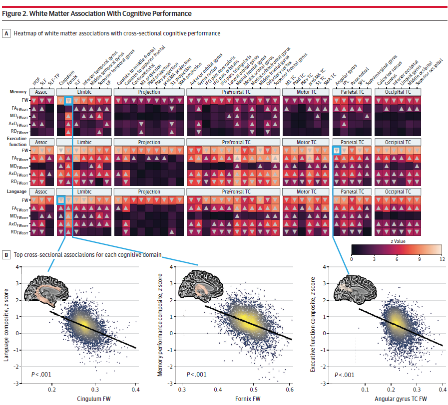
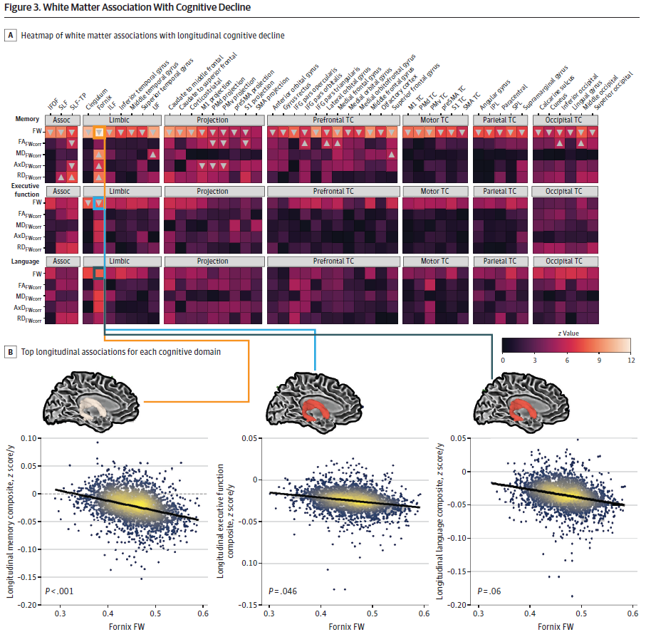
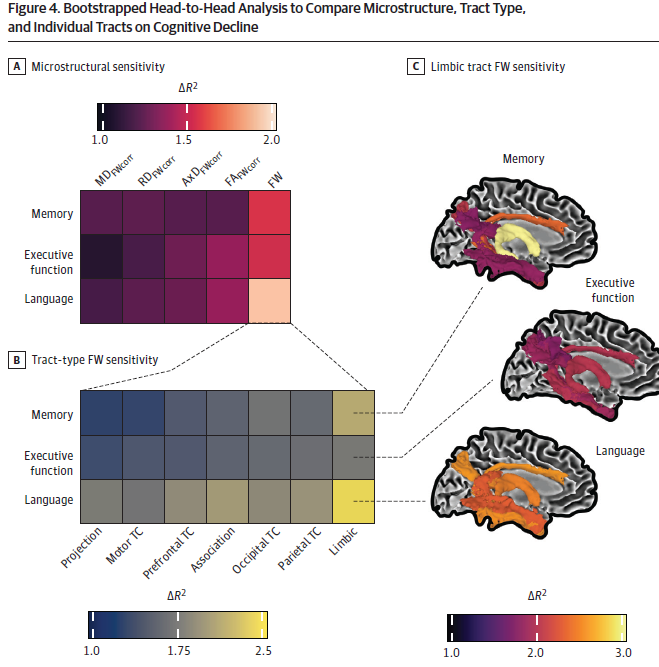

# 白质微观结构异常与衰老及阿尔茨海默病认知功能的关联研究

## 研究背景与目的

阿尔茨海默病（AD）作为最常见的神经退行性疾病，其病理特征为神经炎性斑块和神经原纤维缠结。目前，AD 的影像学研究主要集中于灰质萎缩及淀粉样蛋白和 tau 蛋白的关联，然而白质微观结构改变在认知衰退中的作用尚未被大规模量化研究。扩散加权磁共振成像（dMRI）虽已被用于表征 AD 临床连续体中认知特征的神经解剖学基础，但传统扩散张量成像指标（如分数各向异性 FA、平均扩散率 MD 等）受部分容积效应限制，难以准确反映白质微观结构变化。

本研究旨在探究特定白质束微观结构与衰老及 AD 相关认知障碍中认知表现和衰退的关联，首次通过大规模多队列数据量化白质自由水（FW）及 FW 校正指标与认知功能的关系，并分析其与其他 AD 生物标志物的交互作用，为理解神经退行性变机制提供新视角。

## 研究方法与技术细节

### 研究设计与队列特征&#xA;

*   **多中心队列整合**：研究整合了 9 个队列（2002 年 9 月至 2022 年 11 月）的纵向数据，包括 AD 神经影像倡议（ADNI）、巴尔的摩老龄化纵向研究（BLSA）等，最终纳入 4467 名参与者（60.4% 为女性，平均年龄 74.3±9.2 岁），涵盖认知正常（3213 人）、轻度认知障碍（MCI，972 人）和 AD 痴呆（282 人）群体，累计 9208 次认知评估。

*   **数据纳入标准**：参与者需具备 dMRI 数据、特定认知领域的复合 z 评分、人口统计学及临床数据（年龄≥50 岁），并通过神经影像质量控制。临床协变量包括年龄、性别、教育程度、种族、APOE 基因型及临床状态。

### 认知功能评估与标准化&#xA;

*   **认知复合指标构建**：采用既定流程对各队列神经心理学数据进行 harmonization，将测试项目分配至记忆、执行功能、语言或视觉空间领域。通过确认性双因子模型校准锚定项目，生成标准化 z 评分认知复合指标，聚焦于横断面和纵向的记忆、执行功能及语言表现。

### dMRI 预处理与微观结构指标计算&#xA;

*   **预处理流程**：使用 PreQual 自动化管道校正 dMRI 数据的磁化率诱导运动、几何畸变和涡流效应伪影，进行层间配准以减轻头部运动影响，采用切片方式去噪和插补信号缺失。

*   **FW 与 FW 校正指标计算**：通过自定义 MATLAB 代码实现 bi-tensor 模型，分离脑组织扩散特性与周围自由水，计算 FW、FW 校正 FA（FA\_FWcorr）、轴向扩散率（AxD\_FWcorr）、径向扩散率（RD\_FWcorr）和平均扩散率（MD\_FWcorr）。将常规 FA 图非线性配准至 FMRIB58\_FA atlas，创建标准空间表示，排除 FW 或 FW 校正指标的年龄回归异常值（±5 SD）。

### 白质束感兴趣区与微观结构 Harmonization&#xA;

*   **白质束模板**：采用 48 个公开可用的束造影模板，涵盖胼胝体投射束（前额叶、运动、顶叶、枕叶）、联合束、投射束和边缘束，量化每个成像 session 中所有感兴趣束的平均 FW 和 FW 校正微观结构，共 240 个束特异性指标（5 种微观结构指标 ×48 束）。

*   **纵向 ComBat Harmonization**：将数据输入纵向 ComBat 模型，控制成像批次效应，同时保留年龄、性别、基线诊断等队列特异性差异，使用随机效应变量控制参与者特异性白质轨迹。

### 统计分析方法&#xA;

*   **横断面分析**：对 4467 名参与者进行线性回归，评估各白质束与认知表现的关联，协变量包括年龄、教育、性别、种族、基线临床状态及 APOE 基因型。

*   **纵向分析**：采用线性混合效应模型分析基线白质微观结构与认知衰退的关系，纳入 2300 余名有多次认知评估的参与者，模型包含间隔时间、基线年龄 × 间隔、白质基线 × 间隔项及参与者随机效应。

*   **引导头对头比较**：通过 1000 次 bootstrap 分析确定对认知衰退最敏感的微观结构指标，比较各指标在协变量模型基础上的边际方差贡献，按束类型（边缘束、投射束等）分组分析。

*   **交互作用分析**：整合灰质指标（海马体积、SPARE-AD 指数）及淀粉样蛋白、tau PET 数据，分析白质指标与 AD 内表型的交互作用，探究其对认知表现和衰退的协同影响。

## 研究结果

### 人口统计学与临床特征&#xA;

*   **队列分布**：各队列在基线临床状态、随访时长和年龄上存在显著差异。例如，BLSA 队列中 98.9% 为认知正常，而 ADNI 队列中 47.4% 为认知正常，13.5% 为 AD 痴呆。APOE ε4 携带者占比 30.1%，女性占 60.4%，平均教育年限 15.94±3.22 年。

*   **认知复合评分**：基线记忆复合 z 评分为 0.47±0.72，执行功能为 0.40±0.64，语言为 0.51±0.62，不同队列间存在显著差异。

### 白质微观结构与横断面认知表现的关联&#xA;

*   **全局 FW 关联**：较高的全局 FW 与所有认知领域的较低表现显著相关。记忆领域中，穹窿 FW（β=-1.069，P<0.001）和扣带回 FW（β=-0.718，P<0.001）关联最强；执行功能领域中，胼胝体角回 FW（β=-0.512，P<0.001）最显著；语言领域中，扣带回 FW（β=-0.776，P<0.001）关联最强。

*   **细胞内指标关联**：FW 校正指标（如 FA\_FWcorr）与执行功能和语言领域的关联更显著，而与记忆领域关联有限，提示细胞内变化可能在特定认知领域中起更关键作用。

<!-- 
 -->

图一 白质微观结构参数与认知表现的相关性

### 基线白质微观结构与认知衰退的纵向关联&#xA;

*   **记忆衰退**：基线全局 FW 与记忆衰退强相关，尤其是穹窿（β=-0.153，P<0.001）和扣带回（β=-0.115，P<0.001）FW。

*   **执行功能衰退**：仅扣带回（β=-0.073，P=0.046）和穹窿（β=-0.085，P=0.046）FW 显示显著关联，语言领域未发现显著关联。
*   

<!-- 
 -->

图二 白质微观结构参数与认知纵向衰退的相关性

*   **微观结构指标敏感性**：引导分析显示，FW 在记忆（ΔR²=1.55%）、执行功能（ΔR²=1.52%）和语言（ΔR²=1.90%）衰退中解释的额外方差最大，边缘束 FW 对各领域衰退的预测能力最强（记忆 ΔR²=2.07%，执行功能 ΔR²=1.71%，语言 ΔR²=2.37%）。

<!-- 
 -->

图三 微观结构指标解释认知衰退的敏感性

### 白质微观结构与 AD 内表型的交互作用&#xA;

*   **记忆表现交互作用**：穹窿 FW 与海马体积（β=10.598，P<0.001）、扣带回 FW 与 SPARE-AD 指数（β=-0.532，P<0.001）、下颞叶胼胝体束 FW 与基线诊断（β=-0.537，P<0.001）的交互作用均显著预测更差的记忆表现。

*   **纵向衰退交互作用**：白质异常与 SPARE-AD 指数交互作用预测更快速的认知衰退，APOE ε4 阳性、淀粉样蛋白阳性等加剧了白质异常对认知衰退的影响。

## 讨论与结论

### 关键发现与机制解读&#xA;

*   **FW 作为认知衰退的敏感标志物**：本研究首次在大规模队列中证实 FW 是衰老和 AD 中认知衰退的最敏感微观结构指标，其与记忆衰退的强关联可能反映边缘系统（如扣带回、穹窿）在 AD 病理中的易损性。FW 被认为与神经炎症和萎缩相关，而 FW 校正指标（细胞内指标）与执行功能、语言的关联提示其可能反映脱髓鞘和轴突退化等组织损伤。

*   **边缘系统的核心作用**：边缘束（尤其是扣带回和穹窿）在横断面和纵向分析中均显示与认知功能的最强关联，支持边缘系统在记忆编码和提取中的关键作用，其微观结构改变可能是 AD 早期认知衰退的重要神经基础。

*   **多模态生物标志物的协同效应**：白质 FW 与海马体积、SPARE-AD 指数等的交互作用表明，整合多模态指标可增强对认知衰退的预测能力，为 AD 的病理生理机制提供更全面的理解。

### 临床与研究意义&#xA;

*   **影像学方法优化**：单壳 dMRI 结合 bi-tensor 模型计算 FW 的方法在大规模研究中具有可行性，虽不及多壳技术精确，但兼顾了数据可及性和统计效力，为临床转化提供了实用工具。

*   **AD 早期诊断与预后**：边缘束 FW 可作为 AD 早期认知衰退的潜在影像学标志物，尤其是与其他生物标志物联合使用时，可能改善对高风险个体的识别和预后评估。

*   **研究局限性**：研究未评估白质变化的不对称性，样本中高教育程度非西班牙裔白人占比高，可能影响普适性；未控制血管因素，单壳 FW 校正方法的精度有限；认知指标的校准限制了对领域内项目水平关联的分析。

### 未来研究方向&#xA;

*   **整合多模态数据**：结合基因组学、代谢组学等数据，深入解析 FW 变化的生物学机制，区分神经炎症、萎缩与脱髓鞘等病理过程的贡献。

*   **纵向动态追踪**：利用更长随访数据探究白质微观结构变化与认知衰退的时间顺序，明确其作为前驱标志物的潜力。

*   **临床干预研究**：以边缘束 FW 为靶点，评估潜在干预措施对延缓 AD 认知衰退的效果，为精准治疗提供影像学依据。

## 研究结论

本研究通过大规模多队列分析，证实白质微观结构变化（尤其是 FW）在衰老和 AD 相关认知衰退中起关键作用，边缘系统（扣带回、穹窿）是与认知功能关联最强的区域。白质 FW 与其他 AD 生物标志物的交互作用支持多模态方法在预测认知衰退中的价值，为理解 AD 神经退行性变机制和开发新型诊断工具提供了重要依据。

## 参考文献

Peter C, Sathe A, Shashikumar N, et al. White Matter Abnormalities and Cognition in Aging and Alzheimer Disease. JAMA Neurol. 2025;doi:10.1001/jamaneurol.2025.1601.

## 感谢关注

### 后处理代码及指导

如果你有相关数据，需要数据后处理服务，后处理代码或者技术指导，请加作者微信。

### 关注点赞
微信：Chushanzhishi2022
微信公众号：NMR凯米小屋
作者B站：楚山之石
CSDN: 楚山之石