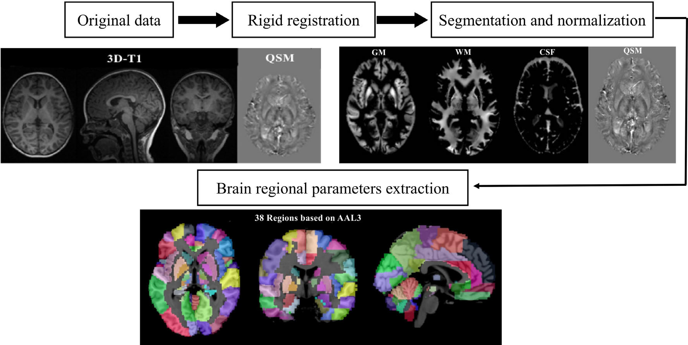
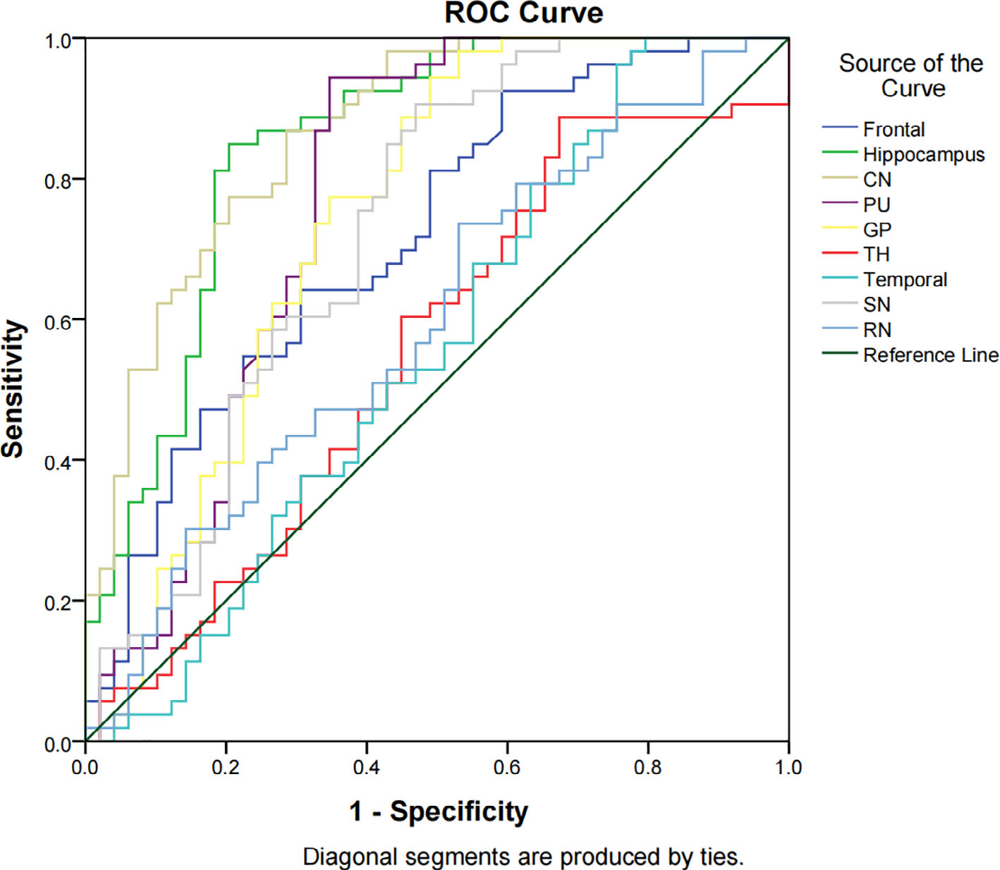

# 多动症儿童大脑铁含量的新发现：基于定量磁敏感成像研究

在儿童精神行为疾病领域，注意缺陷多动障碍（ADHD）十分常见，它以注意力不集中和多动为主要特征，严重影响孩子的学习、情绪发展，还会波及家庭和社会关系。目前，ADHD 被认为是多因素疾病，和神经发育、微量元素的积累或缺乏有关，其中铁元素备受关注。此前研究发现，ADHD 儿童体内微量元素铁含量低于健康儿童，但大脑区域铁含量是否也降低并不清楚。而大脑区域缺铁会引发孩子精神涣散、烦躁、记忆力减退等症状。所以，如何借助新技术早期精准检测 ADHD 儿童大脑区域缺铁情况，成为医学研究热点。

定量磁敏感成像（QSM）技术应运而生，它是在磁敏感加权成像基础上发展起来的新技术，能利用磁共振成像相位信息检测生物组织中的磁敏感物质，并定量计算其磁化率值，对检测大脑铁含量微小变化有高灵敏度和可靠性。本研究借助 QSM 技术，对比分析 ADHD 儿童和健康儿童各脑区铁含量值，期望能精准识别 ADHD 儿童脑区铁含量特征，为疾病诊疗提供依据。

## 一、研究方法

**伦理审批与知情同意**：本研究获得重庆医科大学附属儿童医院伦理委员会批准（编号 2019 - 221），参与研究儿童的家属在检查前签署了知情同意书。

**研究对象选取**

**研究组**：2020 年 1 月至 2021 年 5 月前瞻性选取 68 例 ADHD 儿童，最终 53 例纳入研究。入选标准为符合美国《精神疾病诊断与统计手册（第五版）》（DSM - V）ADHD 诊断标准，且首次诊断由儿童发育行为与儿童健康科、心理科副高及以上职称医生在门诊完成，其他标准与对照组一致。

**对照组**：2020 年 2 月至 2021 年 6 月前瞻性选取 61 例 5 - 16 岁健康儿童，49 例纳入研究。入选标准包括体重指数在 15 - 18kg/m²、右利手、无神经系统疾病、无影响脑功能和结构的疾病、血清铁微量元素检测在正常范围（6.5 - 9.85μmol/L）、常规头部磁共振检查无异常。

**不配合检查儿童处理**：不配合检查的儿童被送至医院镇静中心，采用滴鼻给予地塞米松 3μg/kg + 口服水合氯醛 40mg/kg 进行镇静，若 20 分钟后镇静深度不够，可再滴鼻给予地塞米松 1μg/kg，必要时口服水合氯醛 20mg/kg ，之后进行检查。

**设备与扫描方法**：使用 GE 公司的 3.0T 磁共振及 8 通道头颈联合线圈。对镇静入睡后的儿童进行常规颅脑 MR 序列（T1 FLAIR、T2 FLAIR、T2 WI）、3D - T1 和增强 T2 \* 加权磁共振血管造影（ESWAN）序列扫描。其中，3D - T1 序列参数为：重复时间（TR）450ms，视野（FOV）25cm，回波时间（TE）3.1ms，激励次数（NEX）1 次，层厚 1mm，共 152 层，扫描时间 3 分 43 秒；ESWAN 序列参数为：FOV 24cm，层厚 3mm，TR 81.8，翻转角 20°，TE 4ms，每层定位点 50 个，层数 1 层，扫描时间 7 分 47 秒。

**数据分析**：在 MATLAB 2018a 平台上，运用 STI Suite 3.0 软件处理 ESWAN 原始数据，获取 QSM 定量图。采用基于体素的形态学分析（VBM）方法计算不同脑区体积和 QSM 值。利用 SPM12 软件将 3D - T1 序列结构像与 QSM 定量图进行配准，再借助 SPM12 软件中的 CAT12 工具包对配准后的 QSM 结构定量图进行分割，最终提取各脑区参数值和铁含量值。

    
    
<b>图 2：</b>数据处理流程

**统计分析**：运用 SPSS 25.0 统计软件，计量资料以均数 ± 标准差（`x±s`）表示。采用卡方检验比较研究组和对照组儿童性别；用两独立样本 t 检验对比年龄、体重、体重指数（BMI）值、微量元素铁检测值；以年龄为协变量进行协方差分析，比较两组儿童脑铁含量；通过受试者工作特征曲线（ROC）分析评估脑铁含量对 ADHD 儿童的诊断价值，当曲线下面积（AUC）大于 0.5 且有统计学意义时，认为具有诊断价值，AUC 越接近 1，诊断价值越高。

## 二、研究结果

**患者信息比较**：研究组和对照组在年龄、性别、体重、BMI 值、微量元素铁检测值方面无显著差异（`p > 0.05`） ，这确保了两组在基本特征上的均衡性，减少了混杂因素对研究结果的干扰。

**脑铁含量值比较**：ADHD 儿童额叶、苍白球、尾状核、黑质、壳核、海马等脑区的铁含量（左右脑区总铁含量）低于健康儿童（`p < 0.05`）；ADHD 儿童左右脑区铁含量差异无统计学意义（`p > 0.05`）；且 ADHD 儿童脑总铁含量低于健康儿童（`p < 0.05`）。这表明 ADHD 儿童多个关键脑区存在铁含量降低的情况，且这种降低在左右脑区具有对称性。

**脑体积比较结果**：ADHD 儿童额叶和海马的脑区体积低于健康儿童（`p < 0.05`） ，全脑体积也低于健康儿童（`p < 0.05`）。这进一步揭示了 ADHD 儿童脑部结构的异常，与铁含量降低之间可能存在某种关联。

**ROC 分析结果**：苍白球、尾状核、海马、壳核等脑区的铁含量能够区分 ADHD 儿童（`AUC > 0.5`，`p < 0.05`），其中海马的 AUC 值（0.881）最高。这说明这些脑区的铁含量在 ADHD 诊断中具有重要价值，尤其是海马，可作为关键诊断指标。

    
    
<b>图 2：</b>ROC 曲线

## 三、研究讨论

**脑区铁含量降低与 ADHD 的关系**

**基底神经节**：基底神经节与感觉、运动、视觉和行为功能密切相关，ADHD 儿童基底神经节（苍白球、尾状核、黑质、壳核）铁含量降低，可能影响神经细胞发育，导致神经发育异常，进而引发 ADHD 等行为问题。

**额叶**：额叶负责运动、记忆、判断等多种功能，ADHD 儿童额叶铁含量降低，可能致使额叶神经发育异常，最终引发行为异常。

**海马**：海马与学习、记忆、情绪等功能紧密相连，铁缺乏会影响海马神经代谢，ADHD 儿童海马铁含量降低，可能导致海马发育异常，引起精神活动异常。

**脑区体积与铁含量关系**：研究发现，ADHD 儿童脑区铁含量异常的区域多于脑体积异常的区域。额叶和海马体积低于健康儿童，可能是由于铁含量降低导致神经细胞发育异常，进而脑区发育迟缓、体积减小。而基底神经节体积正常，可能因为其体积小、发育早，虽然铁含量降低会影响发育，但与健康儿童相比差异不显著。

**左右脑差异及诊断意义**：ADHD 儿童左右脑体积和铁含量无显著差异，表明其脑区异常为对称变化。同时，研究还发现 ADHD 儿童某些脑区铁含量降低，但微量元素铁检测结果正常，说明脑区铁含量变化可能更为敏感。此外，苍白球、尾状核、海马、壳核等脑区铁含量可用于区分 ADHD 儿童，可作为成像诊断的关键脑区。

**研究局限性**：本研究为单中心研究，结果可能存在地域局限性；纳入的 ADHD 儿童数量较少，且多数为首次就诊未服药儿童，仅 5 例服用精神药物 1 - 3 个月，这些不足有待后续研究改进。

## 四、研究总结

本研究利用 QSM 技术发现 ADHD 儿童部分脑区铁含量降低，且这些脑区铁含量变化可用于区分 ADHD 儿童，为 ADHD 的诊断提供了新的依据。不过，研究存在一定局限性，未来需要多中心、大样本研究进一步深入探索。

## 参考文献

1. Human Brain Mapping 2022 Vol. 43 Issue 8 Pages 2495-2502 (DOI: 10.1038/s41575-020-00372-7）

希望今天的分享能让大家对 ADHD 儿童大脑铁含量的研究有新的认识，如果你有任何想法或疑问，欢迎在留言区交流！

## 技术指导

### 序列开发

如果你有关于序列以及扫描方案的疑问，请留言或者加作者微信，可提供技术指导。

### 后处理代码及指导

如果你有相关数据，需要后处理代码或者技术指导，请加作者微信。可参考视频https://www.bilibili.com/video/BV1r84y1C7ua/

### 关注点赞

请关注公众号“NMR凯米小屋”，如果有合作意向，请加作者微信(Chushanzhishi2022)。