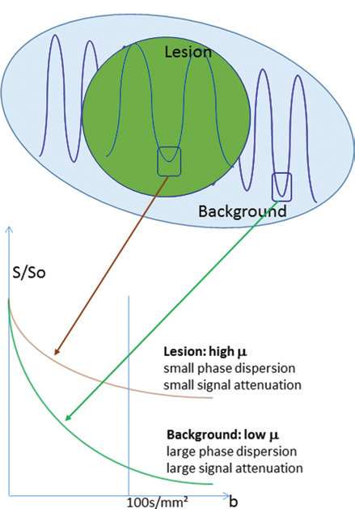
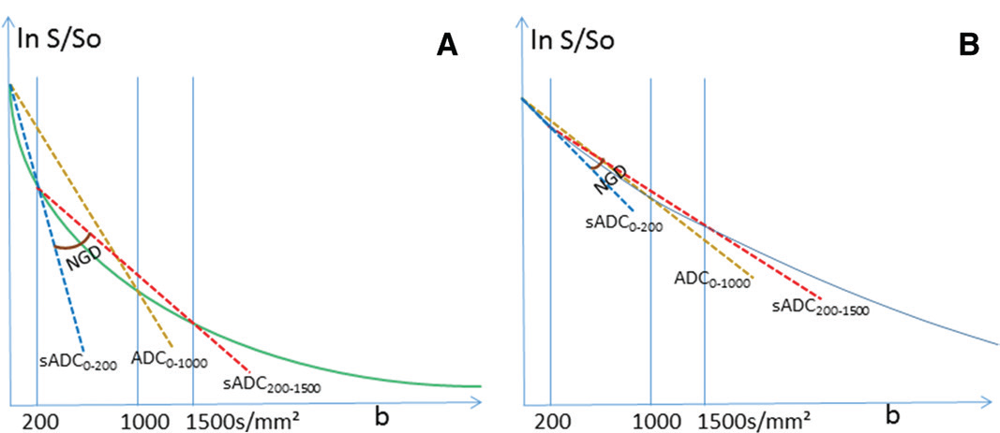
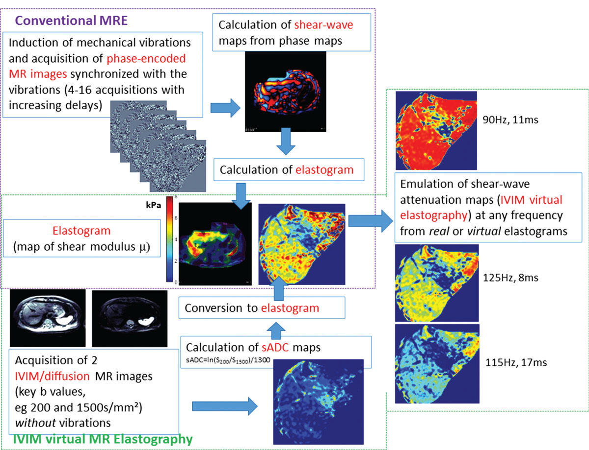
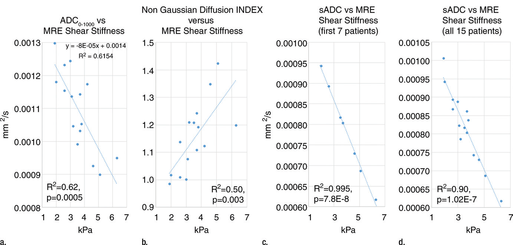

# 基于扩散与体素内不相干运动 MR 成像的虚拟弹性成像：肝脏研究新突破

在肝脏疾病的诊断领域，磁共振弹性成像（MR elastography）和扩散磁共振成像（Diffusion MR imaging）是两种重要的技术手段。今天，我们就来深入了解一篇发表于《Radiology》的研究，看看它如何利用这两种技术，为肝脏疾病诊断带来新的突破。

## 研究背景

MR 弹性成像可基于组织机械特性来表征软组织，在肝纤维化分期中应用广泛，有望替代肝活检这一有创检查。然而，它存在成本高、检查时间长、对深部组织检测困难以及数据处理复杂等局限。

扩散 MR 成像对组织微观结构敏感，在多种生理和病理状况评估中发挥作用。此前研究表明，这两种技术在肝纤维化分期都有临床价值，但 MR 弹性成像略胜一筹。本研究提出假设：组织水扩散率与组织弹性特性之间或许存在紧密联系，扩散 MR 成像有可能在不使用机械振动的情况下定量评估组织硬度，并产生新的弹性驱动体素内不相干运动（IVIM）对比。

## 研究方法

**患者群体**：2016 年 1 月至 4 月进行回顾性研究，23 例慢性肝病患者最初纳入，8 例因 MR 弹性成像或扩散 MR 图像存在伪影（主要源于呼吸或心脏运动）被排除，最终 15 例患者参与研究，包括 13 名男性和 2 名女性，平均年龄 73 岁。根据 MR 弹性成像结果和既往描述的临界值评估纤维化分期，同时获取血清丙氨酸氨基转移酶（ALT）水平 。

**MR 成像数据采集与处理**

**MR 弹性成像**：使用 3T MR 成像仪和 32 通道相控阵线圈，通过与振动器相连的被动驱动器在患者仰卧位时向肝脏施加 60Hz 的外部振动。采用二维梯度回波序列在轴向平面成像，获取图像时患者呼气后屏气。通过成像仪中的二维反演算法计算刚度图，进而估计肝脏剪切模量，感兴趣区域避开大血管和肿瘤。

    
    
<b>图 1：</b>弹性成像原理

**扩散 MR 成像**：采用脂肪抑制自旋回波平面回波序列，沿 x、y、z 轴进行扩散编码，使用 14 个 b 值（0 - 1500s/mm²），本研究重点关注 0、200、400、600、1000、1200 和 1500s/mm²。计算两个关键 b 值（低关键 b 值 LKb 和高关键 b 值 HKb，经优化反映高斯和非高斯扩散，如 200 和 1500s/mm² 为最佳组合 ）的移位表观扩散系数（sADC），公式为：

$$
sADC = \frac{\ln(S_{LKb}/S_{HKb})}{HKb - LKb}
$$

同时计算非高斯扩散指数（NGD），公式为：

$$
NGD = \frac{6\left\{\frac{\ln(S_{0}/S_{LKb})}{LKb}-\frac{\ln(S_{LKb}/S_{HKb})}{HKb - LKb}\right\}}{HKb\left[\frac{\ln(S_{0}/S_{LKb})}{LKb}\right]^{2}}
$$

数据处理采用逐体素分析，感兴趣区域由经验丰富且不知 MR 弹性成像结果的阅片者放置在肝脏，避开肿瘤。

    
    
<b>图 2：</b>非高斯弥散

**从扩散 MR 成像估计组织剪切模量**：确定与 MR 弹性成像剪切模量相关性最高的关键 b 值组合（200 - 1500s/mm²）后，利用前 7 例患者数据寻找 sADC 与 MR 弹性成像剪切模量之间的经验函数关系，通过线性回归分析得到参数，再用后 8 例患者数据验证该关系。经反演得到基于扩散的组织剪切模量计算公式：

$$
\mu_{diff} = \alpha \ln \left(S_{200} / S_{1500}\right) + \beta
$$

其中：

$$
\alpha = -9.8 \pm 0.8, \quad \beta = 14.0 \pm 0.9
$$

**数据统计分析**：使用 Matlab 软件计算皮尔逊相关系数的平方来量化扩散 MR 成像和 MR 弹性成像数据之间的相关性。对具有线性关系的 \(sADC_{200 - 1500}\) 与 MR 弹性成像剪切模量进行线性回归分析，P 值小于 0.05 认为差异显著。

**弹性驱动的 IVIM 对比**：利用估计的剪切模量图模拟虚拟剪切波传播通过组织时产生的微观运动对比。通过模拟不同振幅和频率的虚拟传播波引起的体素内相位色散来仿真 IVIM 图像，在肝肿瘤患者中使用 50 - 150Hz 的伪振动频率测试该对比概念。

    
    
<b>图 3：</b>研究思路

## 研究结果

**相关性分析**：标准 ADC（b = 0，1000s/mm²）与 MR 弹性成像剪切刚度显著相关（$r^{2}=0.62$，$P=5.3 \cdot 10^{-3}$ ）；NGD 与 MR 弹性成像剪切刚度中度显著相关（$r^{2}=0.50$，$P=3 \cdot 10^{-3}$ ）；$sADC_{200 - 1500}$与 MR 弹性成像剪切模量相关性最高，且在前 7 例患者中呈显著线性关系（$r^{2}=0.995$，$P=8 \cdot 10^{-8}$ ），所有患者纳入后相关性依然显著（$r^{2}=0.90$，$P=1 \cdot 10^{-7}$ ）。

**肝纤维化分期**：根据之前建立的 MR 弹性成像肝纤维化分期临界值，基于扩散的剪切模量$\mu_{diff }$得到的纤维化分期与标准 MR 弹性成像完全一致（F1：2 例；F2：3 例；F3：6 例；F4：4 例） 。

**弹性图对比**：基于 sADC 生成的彩色编码剪切刚度图具有扩散 MR 成像的多层面和高分辨率特点，能清晰显示肝脏特征；而标准 MR 弹性成像图像常无明显特征。在肿瘤患者中，不同伪振动频率下的三维虚拟弹性图可显示病变内不同细节，基于弹性特性增强或隐藏病变特征。

    
    
<b>图 4：</b>研究结果

## 研究讨论

**相关性意义**：研究发现肝脏组织弹性特性与微观结构之间存在强相关性，$sADC_{200 - 1500}$与 MR 弹性成像剪切模量的显著线性关系表明，组织弹性特性或许可直接从仅使用两个关键 b 值的扩散图像中定量推导，这对克服标准 MR 弹性成像的局限性意义重大。

**技术对比优势与局限**：虚拟剪切模量图得益于扩散 MR 成像的特点，如多层面或全三维覆盖，仅需两个 b 值，采集快速，计算简单且对背景相位效应不敏感。但扩散 MR 成像存在信噪比低（尤其是高 b 值时）和对运动伪影敏感的问题。标准 MR 弹性成像虽能提供组织弹性信息，但存在诸多局限，如机械设置复杂、成本高、图像空间分辨率受限、数据处理复杂等。

**IVIM 虚拟弹性成像的特点**：IVIM 虚拟弹性成像通过从 sADC 导出的组织弹性图反向模拟弹性驱动的虚拟 IVIM 对比，可生成现有硬件技术无法实现的伪振动频率、振幅和梯度脉冲强度的图像，增强病变特征的可检测性。不过，其剪切模量值可能因校准频率与实际频率差异而略有不同，且 IVIM 虚拟弹性图不包含 sADC 图之外的更多信息。

**研究局限性与展望**：本研究仅为假设生成阶段，需更大规模、更多病因导致肝纤维化的患者队列进一步验证 sADC 与 MR 弹性成像剪切模量之间的关系。炎症、血色素沉着症或脂肪变性等因素可能影响研究结果的相关性。对于其他器官和疾病，也需研究和校准组织弹性特性与微观结构之间的关系。此外，扩散 MR 成像应用的标准化也是重要问题，且该研究方法可能无法全面反映组织的所有弹性特性。

本研究通过对扩散 MR 成像与 MR 弹性成像的创新性探索，为肝脏疾病的诊断提供了新的思路和方法。虽然目前还处于初步阶段，但未来可期。希望今天的分享能让大家对这一前沿研究有所了解，期待更多精彩的科研成果为医疗领域带来变革。

## 参考文献

1. Muthupillai R, Lomas DJ, Rossman PJ, Greenleaf JF, Manduca A, Ehman RL. Magnetic resonance elastography by direct visualization of propagating acoustic strain waves. Science 1995;269(5232):1854–1857.

2. Le Bihan D. Apparent diffusion coefficient and beyond: what diffusion MR imaging can tell us about tissue structure. Radiology 2013;268(2):318–322.

3. Iima M, Le Bihan D. Clinical intravoxel incoherent motion and diffusion MR imaging: past, present, and future. Radiology 2016;278(1):13–32.

4. Leitão HS, Doblas S, Garteiser P, et al. Hepatic fibrosis, inflammation, and steatosis: influence on the MR viscoelastic and diffusion parameters in patients with chronic liver disease. Radiology 2017;283(1):98–107.

5. Ishak K, Baptista A, Bianchi L, et al. Histological grading and staging of chronic hepatitis. J Hepatol 1995;22(6):696–699.

6. Rouvière O, Yin M, Dresner MA, et al. MR elastography of the liver: preliminary results. Radiology 2006;240(2):440–448.

7. Wang QB, Zhu H, Liu HL, Zhang B. Performance of magnetic resonance elastography and diffusion-weighted imaging for the staging of hepatic fibrosis: A meta-analysis. Hepatology 2012;56(1):239–247.

## 技术指导

### 序列开发

如果你有关于IVIM-MRE序列的疑问，请留言或者加作者微信，可提供技术指导。

### 后处理代码及指导

如果你有相关数据，需要数据后处理服务，后处理代码或者技术指导，请加作者微信。

### 关注点赞

请关注公众号“NMR凯米小屋”，如果有合作意向，请加作者微信(Chushanzhishi2022)。