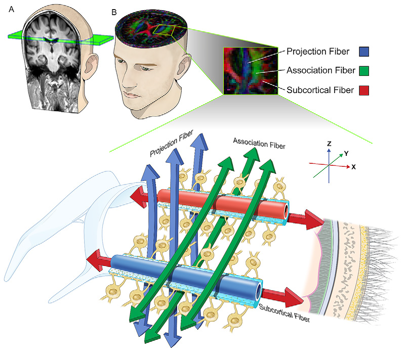
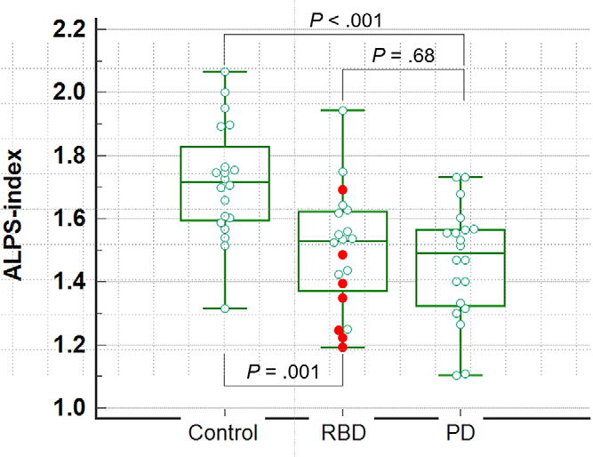

# 扩散张量成像揭示快速眼动睡眠行为障碍患者脑淋巴系统异常

在神经科学领域，脑淋巴系统对维持大脑内环境稳定起着关键作用，其功能障碍与多种神经退行性疾病相关。快速眼动睡眠行为障碍（RBD）作为一种常见的睡眠障碍，被认为是未来 α - 突触核蛋白病的重要前驱疾病。近期一项发表于*Radiology*的研究，利用扩散张量成像（DTI）技术，深入探究了 RBD 患者脑淋巴系统功能及其与疾病进展的关系，为早期干预和治疗提供了新的思路。

## 研究背景

脑淋巴系统负责清除大脑中的可溶性蛋白质，其功能受损与阿尔茨海默病、帕金森病（PD）等神经退行性疾病密切相关。RBD 患者在快速眼动睡眠期会出现肌肉失弛缓及梦境演绎行为，多数患者未来有较高风险发展为 α - 突触核蛋白病。此前虽有研究关注 RBD 患者脑淋巴系统完整性，但利用 MRI 评估其功能障碍与疾病转化风险关系的研究较少。传统评估脑淋巴系统的方法，如动态对比增强 MRI，存在有创性或对比剂沉积等问题，因此，开发无创评估方法十分必要。

## 研究方法

**研究对象**：该前瞻性研究纳入 2017 年 5 月至 2020 年 4 月期间连续确诊的 RBD 患者、年龄和性别匹配的健康对照者以及 PD 患者。RBD 患者依据国际睡眠障碍分类第三版标准临床确诊，且需完成适合 DTI - ALPS 分析的 3.0T 脑 MRI 及相关检查，排除影响多导睡眠图结果、存在认知障碍或其他神经退行性疾病、MRI 检查不合格的患者。健康对照者需无帕金森病和 RBD 诊断、无其他神经系统疾病史且未服用影响中枢神经系统药物，同时排除 MRI 显示异常者。PD 患者依据 UK 帕金森病协会脑库标准临床确诊，排除不同意 MRI 检查或 MRI 显示异常者。研究开始时，所有参与者的疾病转化状态未知，RBD 患者每 3 - 6 个月随访一次，监测神经退行性疾病迹象，健康对照者每年随访，PD 患者每 3 - 6 个月随访。

**成像检查**：MRI 扫描包括 DTI、磁敏感加权成像（SWI）及磁敏感图加权成像（SMWI），DTI 扫描约 5 分 50 秒，SWI 用于生成 SMWI 以更好检测黑质高信号。由两名神经放射科医生评估黑质高信号，意见不一致时讨论解决。采用$^{123}$I - 2β - 甲氧基羰基 - 3β -（4 - 碘苯基） - N -（3 - 氟丙基） - 去甲托烷（$^{123}$I - FP - CIT）SPECT 评估黑质纹状体多巴胺能变性，由核医学科医生阅片判断是否存在变性。

**水分子扩散方向与血管及神经纤维的关系**：在侧脑室体水平，血管周围水流方向沿着髓质小动脉和静脉，在 DTI 图像上大致平行于 x 轴，且垂直于脑室壁。同时，该水流方向垂直于主要平行于 z 轴的投射神经纤维和主要平行于 y 轴的联合神经纤维。因此，在投射和联合神经纤维区域中，沿 x 轴的扩散率（Dxproj 和 Dxassoc）可以代表血管周围的水扩散率，而不受神经纤维扩散率的干扰，从而反映淋巴系统的活性。相比之下，在皮质下神经纤维区域测量的 Dx（Dxsubc），由于皮质下神经纤维与 x 轴平行，其扩散率会掩盖血管周围水扩散率，不能代表纯粹的淋巴系统扩散率。此外，沿 y 轴（Dy）和 z 轴（Dz）的扩散率，因为其方向与血管周围水流方向垂直，在选定的轴向层面上不能反映血管周围淋巴系统的流动 。

    
    
<b>图 1：</b>ALPS原理示意图

**DTI - ALPS 分析**：DTI - ALPS 通过测量多方向扩散率图来量化血管周围淋巴系统活性。在侧脑室体水平，识别神经纤维，计算沿 x 轴（平行于血管周围水流方向）与垂直方向的扩散率比值得到 ALPS 指数。ALPS 指数接近 1 表示血管周围水扩散影响小或淋巴系统功能严重受损，指数越大，淋巴系统功能越好。由两名神经放射科医生独立测量并计算 ALPS 指数，取平均值用于后续分析。为了减轻脑室周围白质病变的影响，并标准化个体之间的测量结果，研究采用特定公式计算 ALPS 指数：

$$
ALPS\ index = \frac{\text{mean}(Dx_{proj}, Dx_{assoc})}{\text{mean}(Dy_{proj}, Dz_{assoc})}
$$

在这个公式中，分子选取 $Dx_{\text{proj}}$  和 $Dx_{assoc}$，排除 $Dx_{subc}$，以排除与 x 轴平行的皮质下神经纤维束的扩散率成分。分母选取 $Dy_{proj}$ 和 $Dz_{assoc}$，是因为 $Dy_{proj}$ 在与 $Dx_{proj}$ 相同的感兴趣区域（ROI）测量，能反映除 x 轴方向外其他方向的潜在白质扩散率；$Dz_{assoc}$ 在测量 $Dx_{assoc}$ 的位置测量，也包含了该位置的潜在白质扩散率。通过将分子除以分母，可消除潜在的白质扩散率的影响，使 ALPS 指数能够更准确地反映血管周围扩散率对扩散信号的贡献。

**统计分析**：使用非参数检验和 $\chi^{2}$ 检验比较对照组、RBD 组和 PD 组的临床数据。采用组内相关系数评估两名阅片者 DTI - ALPS 测量的一致性。用 Kruskal - Wallis 检验和 Dunnett T3 检验比较三组 DTI - ALPS 测量值差异。在 RBD 组中，根据 SMWI 黑质高信号状态和 $^{123}$I - FP - CIT SPECT 结果，用 Mann - Whitney U 检验比较 DTI - ALPS 测量值。计算 SMWI 和 $^{123}$I - FP - CIT SPECT 对疾病转化的诊断准确性，用受试者工作特征曲线分析 DTI - ALPS 值的诊断性能。利用单变量和多变量 Cox 比例风险模型评估根据 DTI - ALPS 测量值、SMWI 和 $^{123}$I - FP - CIT SPECT 结果的疾病转化风险，用 Harrell C 统计量和 Akaike 信息准则评估变量预测能力。$P < 0.05$ 为差异有统计学意义，采用 Bonferroni 法校正多重比较，使用 SPSS、MedCalc 和 SAS 软件进行统计分析。检验比较对照组、RBD 组和 PD 组的临床数据。采用组内相关系数评估两名阅片者 DTI - ALPS 测量的一致性。用 Kruskal - Wallis 检验和 Dunnett T3 检验比较三组 DTI - ALPS 测量值差异。在 RBD 组中，根据 SMWI 黑质高信号状态和 $^{123}$I - FP - CIT SPECT 结果，用 Mann - Whitney U 检验比较 DTI - ALPS 测量值。计算 SMWI 和 $^{123}$I - FP - CIT SPECT 对疾病转化的诊断准确性，用受试者工作特征曲线分析 DTI - ALPS 值的诊断性能。利用单变量和多变量 Cox 比例风险模型评估根据 DTI - ALPS 测量值、SMWI 和 $^{123}$I - FP - CIT SPECT 结果的疾病转化风险，用 Harrell C 统计量和 Akaike 信息准则评估变量预测能力。$P < 0.05$为差异有统计学意义，采用 Bonferroni 法校正多重比较，使用 SPSS、MedCalc 和 SAS 软件进行统计分析。

## 研究结果

**参与者特征**：共纳入 60 名参与者，包括 20 名 RBD 患者（12 名男性，8 名女性，中位年龄 73 岁）、20 名健康对照者和 20 名 PD 患者。三组在年龄（发病年龄和成像年龄）、性别、Hoehn 和 Yahr 分期、统一帕金森病评定量表 III 部分（UPDRS - III）评分、简易精神状态检查表（MMSE）评分、蒙特利尔认知评估（MoCA）评分等方面存在差异。

**DTI - ALPS 测量结果**：组内相关系数显示两名阅片者对 ALPS 指数测量一致性良好（0.85 \[95% CI: 0.75, 0.91]）。RBD 组和 PD 组的 ALPS 指数中位数（1.53 和 1.49）均低于对照组（1.72）（$P = 0.001$和$P < 0.001$），但 RBD 组和 PD 组之间无显著差异（$P = 0.68$）。在 RBD 组中，黑质高信号单侧或双侧缺失者的 ALPS 指数（中位数 1.39）低于双侧完整者（1.56）（$P = 0.02$）；$^{123}$I - FP - CIT SPECT 结果异常与否对 ALPS 指数无显著影响（$P = 0.27$）。

    
    
<b>图 2：</b>研究结果

**临床随访结果**：随访至 2022 年 1 月，中位随访时间 37 个月。随访期间，7 名 RBD 患者发生 α - 突触核蛋白病，其中 6 名发展为 PD，1 名发展为路易体痴呆。SMWI 和 $^{123}$I  - FP - CIT SPECT 对疾病转化的诊断准确性分别为 70% 和 60%。虽然 DTI - ALPS 值诊断疾病转化的受试者工作特征曲线下面积较高，但经 Bonferroni 校正后，发生转化和未发生转化的 RBD 患者成像时的 ALPS 指数无显著差异。RBD 患者疾病转化风险随 ALPS 指数增加而降低（风险比为 0.57，每增加 0.1 的 ALPS 指数，95% CI: 0.35, 0.93；\(P = 0.03\)），而 SMWI 和$^{123}$I - FP - CIT SPECT 对疾病转化风险无显著影响。

## 研究结论

该研究表明，在帕金森症状出现前，RBD 患者脑淋巴系统活性已降低，ALPS 指数与疾病转化风险相关，淋巴系统功能障碍可能在疾病临床前期就已开始，并促进 RBD 向 α - 突触核蛋白病转化。DTI - ALPS 作为一种无创量化淋巴系统功能的方法，有望成为 RBD 的影像学生物标志物，辅助筛选神经保护治疗候选者，监测治疗效果。但研究存在样本量小、随访时间短等局限性，未来需更大样本量、更长随访时间及更先进的 MRI 技术进一步研究。

## 参考文献
1. Radiology 2023 Vol. 307 Issue 5 Pages e221848 (DOI: 10.1148/radiol.221848)

## 技术指导

### 序列开发

如果你有关于ALPS序列的疑问，请留言或者加作者微信，可提供技术指导。

### 后处理代码及指导

如果你有相关数据，需要数据后处理服务，后处理代码或者技术指导，请加作者微信。

### 关注点赞

请关注公众号“NMR凯米小屋”，如果有合作意向，请加作者微信(Chushanzhishi2022)。
