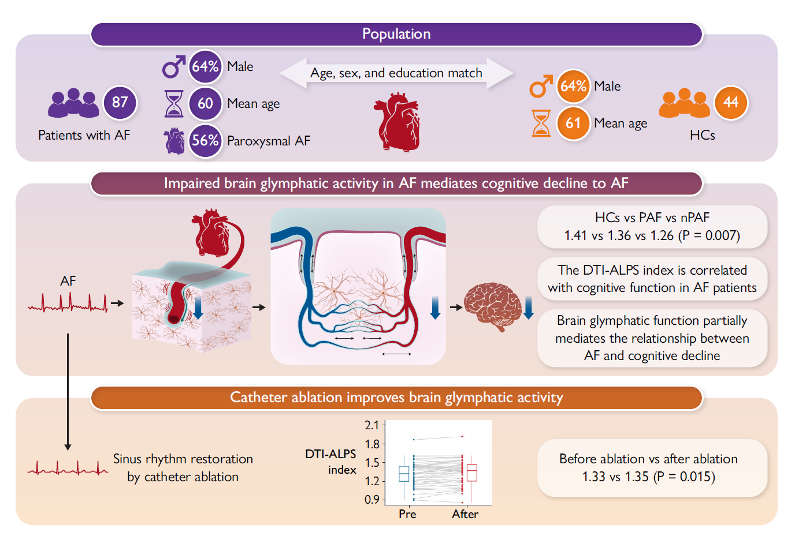
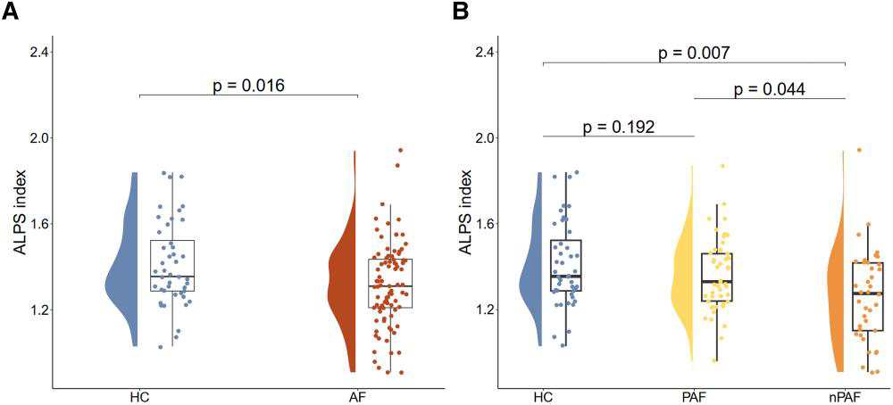
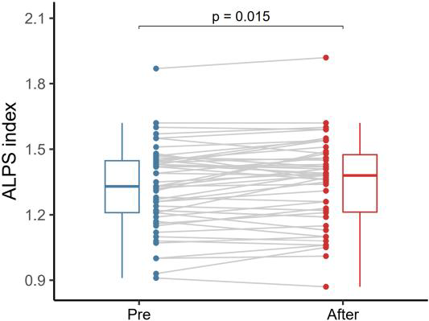

# 房颤导管消融、脑淋巴系统功能与认知表现的关联研究

最近，一项发表于《European Heart Journal》的研究深入探讨了房颤（Atrial Fibrillation，AF）、脑淋巴系统功能与认知表现之间的关系。这一研究不仅为理解房颤对认知功能的影响机制提供了新视角，还为相关治疗策略的优化指明了方向。下面，我们就一起来看看这项研究的关键发现。

## 研究背景

房颤作为最常见的心律失常类型，一直以来都备受关注。近年来，越来越多的证据表明，房颤与认知障碍和痴呆之间存在密切联系，即便没有中风发生，这种关联依然显著，而且它独立于常见的血管危险因素。但是，其中的潜在机制却尚未完全明确。

脑淋巴系统是大脑中负责清除代谢废物的重要系统，它依赖动脉搏动来驱动脑脊液流动。而房颤患者的不规则心跳，很可能会干扰动脉搏动，进而影响脑淋巴系统的正常功能。这就引发了一系列关键问题：房颤患者的脑淋巴系统功能是否真的受损？这种受损是否在房颤与认知障碍之间起到了中介作用？通过导管消融恢复窦性心律，能否改善脑淋巴系统的活性？此前，这些问题在人体研究中都尚未得到深入探究。

## 研究方法

**研究设计与对象**：在 2023 年 7 月至 2024 年 9 月期间，研究人员前瞻性地连续筛选房颤患者。这些患者年龄在 18 - 80 岁之间，且均确诊为房颤。同时，研究人员还招募了 44 名年龄、性别和教育年限相匹配的健康对照者。研究严格排除了患有多种疾病（如脑部疾病、严重心脏病、精神疾病等）、正在使用影响认知功能药物以及存在 MRI 检查禁忌症的人群。部分房颤患者根据临床医生建议和自身意愿接受了导管消融治疗。

**神经认知评估**：由经过专业培训的神经科医生使用一套全面的标准化测试组合，对参与者的神经认知表现进行评估。这套测试涵盖了认知功能的多个领域，包括通过蒙特利尔认知评估（MoCA）评估整体认知功能；借助 Rey 听觉言语学习测试（RAVLT）的即时回忆和延迟回忆评估言语记忆；利用 Rey - Osterrieth 复杂图形测试（ROCF）的即时回忆和延迟回忆评估视觉空间能力和记忆；通过 Trail Making Test Part A（TMT - A）、Trail Making Test Part B（TMT - B）、数字符号替换测试（DSST）、数字广度测试（DST，包括正向和反向）以及 Stroop 颜色和单词测试（SCWT）评估注意力和执行功能；使用动物流畅性测试（AFT）和波士顿命名测试（BNT）评估语言能力。整个认知评估和信息收集过程大约持续 90 分钟。

**磁共振成像（MRI）检查**：所有参与者都接受了 3.0T MRI 扫描，扫描使用 64 通道头颈线圈。在扫描前，会先进行标准心电图检查，以确定患者是否处于房颤状态。对于接受导管消融治疗的患者，会在手术前 3 天内和手术后 7 天内分别进行 MRI 检查。扫描的成像协议包括 3D T1 加权磁化准备快速梯度回波（MPRAGE）序列、磁敏感加权成像（SWI）序列和多壳扩散加权成像（DWI）序列。

**评估指标计算**：通过沿血管周围空间的扩散张量图像分析（DTI - ALPS）指数来评估脑淋巴系统的活性，该指数反映了大脑将液体从皮质下区域驱动到侧脑室的能力。具体计算时，在 DWI 数据集上使用 FMRIB 软件库（FSL）进行扩散张量图像预处理，选取直径为 5mm 的球形感兴趣区域（ROIs），同时还进行了直径为 10mm ROIs 的敏感性分析。T1 加权图像则使用统计参数映射 12（SPM12）中的计算解剖工具箱（CAT）进行分析，计算灰质体积（GMV）与颅内体积的比值。

    
    
<b>图 1：</b>研究概念

**统计分析**：使用$\chi^{2}$检验或 Fisher 精确检验比较房颤组和对照组的分类变量；对于连续变量，采用 Student's t 检验和 Mann - Whitney u 检验进行组间比较。使用一般线性模型评估 DTI - ALPS 指数的组间差异，并将年龄、教育年限和 GMV 比值作为协变量。通过偏相关分析评估 DTI - ALPS 指数与房颤患者神经心理测试分数之间的关联，同样调整年龄、性别、教育年限和 GMV 比值。利用 PROCESS for SPSS 软件进行中介分析，评估 ALPS 指数在房颤与认知功能之间的中介作用，计算总效应、直接效应和间接效应以及中介百分比（Pm）。使用配对 t 检验比较消融治疗前后 DTI - ALPS 指数的变化。所有统计分析均为双侧检验，P < 0.05 被认为具有统计学意义。

## 研究结果

**基线特征**：研究共纳入 87 例房颤患者和 44 例健康对照者。在分析消融治疗前后 DTI - ALPS 指数变化时，纳入了 50 例房颤患者。两组在年龄、性别、教育年限、夜间平均总睡眠时间、吸烟状况、高血压、糖尿病、血脂异常和冠心病病史、使用降压药、降糖药和降脂药以及基线心率等方面均无显著差异。不过，房颤患者使用抗凝剂、抗心律失常药和 β 受体阻滞剂的比例更高。而且，房颤患者在多个认知功能测试中的得分明显低于健康对照者，这表明房颤患者在无中风的情况下，多个认知领域的功能已经受损。

**DTI - ALPS 指数差异**：调整年龄、教育年限和 GMV 比值后，房颤患者的平均 ALPS 指数显著低于健康对照者。进一步将房颤患者分为阵发性房颤和非阵发性房颤组后发现，非阵发性房颤患者的 ALPS 指数最低，健康对照者最高。阵发性房颤患者与健康对照者的 ALPS 指数差异不显著。敏感性分析结果与主要结果相似。

    
    
<b>图 2：</b>ALPS组间差异

**ALPS 指数与认知功能的关系**：在房颤患者中，较低的 ALPS 指数与处理速度、注意力和执行功能等认知领域的功能较差相关。具体表现为，较低的 ALPS 指数与较低的 DSST、DST - forward、DST - backward 得分以及较高的 TMT - A、TMT - B、SCWT - A、SCWT - B、SCWT - C 得分相关。而 ALPS 指数与 MoCA、RAVLT、ROCF、AFT 和 BNT 得分的相关性不显著。敏感性分析结果与主要结果一致。

**中介分析结果**：中介分析显示，在调整相关协变量后，ALPS 指数在房颤与多个认知测试（如 TMT - A、TMT - B、DSST 等）得分之间存在显著的中介作用，表明脑淋巴系统活性在房颤与认知功能下降之间起到了重要的中介作用。

**消融治疗后的变化**：接受导管消融治疗的房颤患者在恢复窦性心律后，DTI - ALPS 指数显著改善。进一步分析发现，房颤诊断时间较短的患者在消融治疗后，脑淋巴系统活性更有可能得到改善。

    
    
<b>图 3：</b>ALPS导管消融治疗前后对比

## 研究讨论

**房颤与认知功能关系的新机制**：本研究首次证实房颤患者的脑淋巴系统功能受损，尤其是非阵发性房颤患者。较低的脑淋巴系统活性与认知功能下降相关，并且在房颤与认知功能障碍之间起到了重要的中介作用。这为解释房颤导致认知功能下降的机制提供了新的视角，表明除了血栓栓塞和脑血管事件外，脑淋巴系统功能受损可能是另一个重要因素。

**房颤影响脑淋巴系统功能的机制**：房颤影响脑淋巴系统功能的机制可能涉及多个方面。一方面，正常的心脏搏动是脑淋巴系统中液体交换的重要驱动力，房颤患者的不规则心跳会干扰动脉搏动，导致血管周围液体流动减少，进而影响脑淋巴系统的功能。另一方面，房颤可能直接影响局部血流动力学，引起远端脑循环的极端血流动力学事件和剪切应力变化，激活动脉粥样硬化过程，使动脉壁僵硬，进一步削弱动脉壁的运动。此外，房颤还可能通过改变水通道蛋白 4（AQP4）的极化，影响脑脊液向脑间质的转移，从而损害脑淋巴系统功能。不过，本研究中房颤组和健康对照组在高血压患病率上没有显著差异，说明高血压并不能完全解释房颤与脑淋巴系统功能障碍之间的关系。

**导管消融治疗的意义**：研究结果表明，通过导管消融恢复窦性心律可以改善脑淋巴系统的活性。这提示恢复窦性心律可能是保护房颤患者认知功能的一种潜在有效方法。而且，研究还发现房颤诊断时间较短的患者在消融治疗后，脑淋巴系统功能改善更明显，这为早期进行房颤消融治疗提供了临床依据。

**研究局限性**：本研究也存在一些局限性。首先，目前评估脑淋巴系统功能的金标准是钆增强淋巴系统 MRI，但这种方法具有侵入性，不适合房颤患者，尤其是短期内要接受导管消融治疗的患者。本研究使用的 DTI - ALPS 方法虽然应用广泛，但结果仍需谨慎解释。其次，研究可能存在未测量或残留的混杂因素，心率变异性对脑淋巴系统活性的影响尚未完全明确，需要进一步研究。再者，MRI 扫描过程中未进行连续实时心脏监测，无法直接观察心律变化时脑淋巴系统的反应，且 DTI - ALPS 测量的时间分辨率较低。此外，本研究不是随机临床试验，接受导管消融治疗的患者数量相对较少，无法确定明确的因果关系。最后，本研究仅评估了消融治疗后短期内脑淋巴系统活性的变化，长期影响还需要进一步研究。

## 研究结论

本研究通过非侵入性 MRI 测量发现，房颤患者的脑淋巴系统功能受损，尤其是非阵发性房颤患者。较低的脑淋巴系统活性与认知功能下降相关，并在房颤与认知功能障碍之间起到重要的中介作用。导管消融恢复窦性心律后，脑淋巴系统活性得到改善。这些发现为理解房颤相关认知功能下降的发病机制提供了新的视角，也为预防认知功能下降和痴呆提供了新的潜在靶点，强调了维持正常心律对保护神经毒性废物清除和认知功能的重要性。不过，未来还需要更多大规模、多中心的研究来进一步验证这些结果。

在日常生活中，房颤患者可以通过定期体检、积极控制基础疾病、保持健康的生活方式等，降低认知功能下降的风险。希望今天的分享能让大家对房颤、脑淋巴系统功能和认知表现之间的关系有更深入的了解。如果你有任何问题，欢迎在留言区留言讨论！

## 参考文献
1. Eur Heart J. 2025 Feb 21:ehaf036. （doi: 10.1093/eurheartj/ehaf036）
## 技术指导

### 序列开发

如果你有关于ALPS序列的疑问，请留言或者加作者微信，可提供技术指导。

### 后处理代码及指导

如果你有相关数据，需要数据后处理服务，后处理代码或者技术指导，请加作者微信。

### 关注点赞

请关注公众号“NMR凯米小屋”，如果有合作意向，请加作者微信(Chushanzhishi2022)。