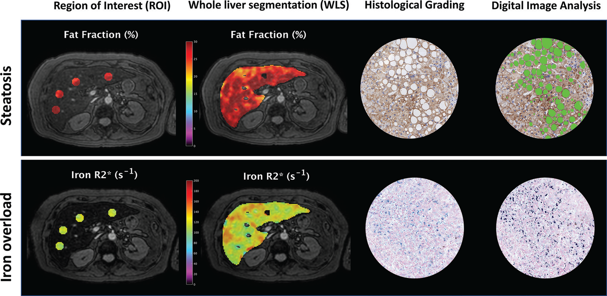

# 自动全肝 MRI 分割技术评估慢性肝病中的脂肪变性和铁含量

在当今医疗领域，慢性弥漫性肝病严重威胁人类健康，其发病率不断攀升，引发了全球范围内的广泛关注。在诊断和监测慢性肝病的过程中，对肝脏脂肪变性（steatosis）和铁含量的精准评估极为关键，这直接影响着疾病的诊断、治疗方案的制定以及患者的预后。传统的肝脏活检虽然被视为评估疾病严重程度的金标准，但因其具有侵入性，存在取样误差、观察者间差异大以及患者接受度低等诸多弊端，在临床应用中受到一定限制。因此，非侵入性的成像技术逐渐崭露头角，其中 MRI 凭借其独特优势，成为评估肝脏病理特征的重要手段。

## 研究背景

慢性肝病发病率持续上升，肝活检作为评估金标准存在诸多缺点，MRI 在慢性肝病诊断和监测中愈发重要。目前测量肝脏脂肪分数和铁浓度的手动 ROI 方法耗时久、结果易变，自动化卷积神经网络（CNN）技术有望改善这一现状，但自动全肝分割（WLS）标记物的性能尚未与组织学评估标准进行对比。本研究旨在验证自动 WLS 在量化肝脏脂肪变性和铁过载方面与手动 ROI 准确性相同的假设，并比较两者诊断性能。

    
    
<b>图 1：研究策略</b>

## 材料和方法

**研究设计与参与者**：在 2017 年 1 月至 2021 年 1 月期间，于西班牙巴伦西亚的三个医疗中心开展了一项多中心、前瞻性、横断面观察性研究。招募患有慢性肝病且临床有肝活检指征的患者，要求年龄在 18 岁及以上并签署知情同意书。排除有 MRI 禁忌证、成像伪影、活检样本不合格（长度＜15mm 且门静脉分支少于 6 个）或样本存在恶性肿瘤的患者。

**MRI 检查**：使用 3.0T TX Achieva 扫描仪和 16 通道相控阵线圈，患者需禁食至少 4 小时。先进行标准非增强 MRI 扫描排除肝脏局灶性病变，再采用二维多回波化学位移编码梯度回波序列进行扫描，获取 12 个回波。图像后处理通过特定算法校正 T2 \* 效应和脂肪信号的光谱复杂性，以计算脂肪和铁含量。

**MRI 分析**：手动分割选取四个面积≥4cm² 的 ROI，避免大血管、胆管、肝脏边缘和伪影，由两名经验丰富的观察者在第一回波图像上操作，分割结果自动应用于其他回波图像。自动分割借助训练好的 CNN 对全肝实质进行分割（排除大血管），该算法此前已在不同队列中验证，与手动 WLS 一致性良好。分析记录 ROI 和 WLS 的 PDFF、R2 \* 值的集中趋势（R2 \* 取均值，PDFF 取中位数）和变异性（标准差 SD）指标，图像分析人员对临床和组织学数据不知情。

    
    
<b>图 2：研究结果</b>

**临床评估**：收集患者的年龄、性别、体重指数、肥胖情况、代谢综合征诊断、饮酒史、慢性肝病病因和生化指标等信息。

**组织学评估**：经皮肝穿刺活检获取样本，用 10% 缓冲福尔马林固定、石蜡包埋，切片厚度 4μm，分别进行脂肪变性（用 adipophilin 免疫组化染色）和铁含量（Perls 染色）评估。由经验丰富的肝脏病理学家在不知临床和影像数据的情况下进行组织学评分，采用 NASH 临床研究网络系统评估脂肪变性（S0 - S3 级），Scheuer 评分系统评估铁储存（Fe0 - Fe4 级）。同时，对染色活检样本数字化处理，用软件进行数字图像分析，获取脂肪和铁的比例面积。

**统计分析**：使用 MedCalc Statistical Software 19.4 和 SPSS 25 软件进行数据分析。分类数据以频率和百分比表示，定量数据根据分布情况表示为均值 ± 标准差或中位数（四分位数间距）。计算 PDFF 和 R2 \* 的误差边际（MOE），通过 Wilcoxon 配对检验、组内相关系数（ICC）、Bland - Altman 分析、线性回归模型等评估手动 ROI 和自动 WLS 分析的差异、一致性、偏差和相关性。根据 Kruskal - Wallis 事后 Tukey 范围检验比较不同组织学组的 MRI 定量数据，计算受试者工作特征曲线下面积（AUC）评估诊断性能，通过线性回归分析确定 MRI 参数与组织学脂肪和铁比例面积的相关性。根据前期研究计算样本量为 172 例。

## 研究结果

**参与者特征**：最初招募 183 例患者，排除后最终纳入 165 例（平均年龄 55±12 岁，女性 96 例）。主要慢性肝病病因是 NAFLD（61%），多数患者肝功能保存良好。组织学检查显示不同程度的脂肪变性和铁沉积，活检与 MRI 检查间隔中位数为 18 天，无相关不良事件报告。

**定量成像标记物分布**：WLS 评估的 PDFF 和 R2 \* 均值（10.8%±4.9、59.6 sec⁻¹±27.3）高于 ROI 评估（10.3%±5.3、57.6 sec⁻¹±31.5），且 WLS 的 MOE 更低（PDFF 为 0.38%，R2 \* 为 2.12 sec⁻¹）。两种方法测量的集中趋势指标一致性极佳（PDFF 和 R2 \* 的 ICC 均为 0.98），但变异性指标一致性较差（PDFF 的 ICC 为 0.46，R2 \* 的 ICC 为 0.36）。

**线性回归和偏差评估**：两种分割策略与 PDFF 值、R2 \* 值均有良好相关性（R² 分别为 0.94、0.96），但存在轻微差异。PDFF 的中位偏差为 0.5%，R2 \* 的中位偏差为 2.7 sec⁻¹，偏差在较低值时影响更大。

**MRI 与组织学分级的性能分析**：ROI 和 WLS 衍生的 PDFF 值随脂肪变性程度增加而升高，能区分不同脂肪变性等级；R2 \* 值随铁过载增加而升高，但仅能区分 Fe0 和 Fe4 等级。检测脂肪变性时，ROI 的 AUC 为 0.96，WLS 为 0.97；检测铁沉积时，ROI 的 AUC 为 0.85，WLS 为 0.83，两种方法 AUC 无显著差异。

**MRI 与数字图像分析的相关性**：PDFF 值与数字病理脂肪百分比相关性强（ROI 的 r = 0.89，WLS 的 r = 0.90），R2 \* 值与数字病理铁百分比相关性较弱（ROI 的 r = 0.65，WLS 的 r = 0.64），两组相关性系数无显著差异。

## 研究结论

本研究表明，基于 MRI 自动全肝分割（WLS）测量的质子密度脂肪分数（PDFF）和横向弛豫率（R2\*）在评估慢性肝病的脂肪变性和铁分级方面准确可靠，与数字病理结果相关性良好。WLS 评估与手动 ROI 评估诊断准确性相似，但具有更高的代表性、更低的变异性误差和不确定性，可有效应用于临床实践，有助于优化肝脏脂肪和铁含量的量化评估流程。未来研究可进一步扩大样本量，涵盖更多疾病类型，并将自动分割算法拓展至其他器官，以实现更精准的疾病管理。

## 参考文献
1. Radiology 2022 Vol. 302 Issue 2 Pages 345-354 （DOI: 10.1148/radiol.2021211027）

## 技术指导

### 序列开发

如果你有关于脂肪定量序列及自动分析的疑问，请留言或者加作者微信，可提供技术指导。

### 后处理代码及指导

如果你有相关数据，需要数据后处理服务，后处理代码或者技术指导，请加作者微信。

### 关注点赞

请关注公众号“NMR凯米小屋”，如果有合作意向，请加作者微信(Chushanzhishi2022)。